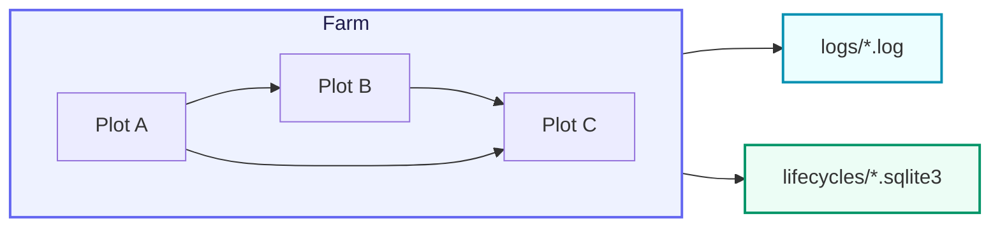

# CelestialGrow

> 📅 Last Updated: 2026/09/24

<p align="center">
  
  
  
</p>

**CelestialGrow** is a lightweight, composable Go concurrent task orchestration framework built on the `Plot` / `Farm` model.

It splits task processing into two layers:

- **Plot**: a generic concurrent processing node that consumes seeds, runs a cultivator, and produces fruits (with three semantics: `Plot`, `SplitPlot`, `RoutePlot`)
- **Farm**: a static directed graph composed of multiple Plots, responsible for registration, connection, startup, and global scheduling

Beyond execution orchestration itself, CelestialGrow also ships with:

- Task lifecycle tracking based on event IDs
- State snapshot persistence based on SQLite
- Structured runtime logs based on files
- A terminal progress bar observer
- A unified public entry package `pkg/api`

If you want to express task flows in Go in a more structured way than "scattered goroutines + channels", yet without pulling in an overly heavy workflow system, CelestialGrow is made for exactly this scenario.

## Project Structure



CelestialGrow's core data flow can be summarized as:

1. External input seed
2. Plot runs the cultivator concurrently
3. On success, produce a fruit and forward it to downstream Plots
4. On failure, emit a weed event and advance the lifecycle state to wither
5. The whole flow is written to logs and the lifecycle SQLite

## Quick Start

Install:

```bash
go get github.com/Mr-xiaotian/CelestialGrow@latest
```

It is recommended to start with the unified entry `pkg/api`.

A minimal `Farm` example (identical to `demo/demo_farm.go`):

```go
package main

import grow "github.com/Mr-xiaotian/CelestialGrow/pkg/api"

// double 将种子翻倍。
func double(num int) (int, error) {
	return num * 2, nil
}

// addOne 为种子加一。
func addOne(num int) (int, error) {
	return num + 1, nil
}

// main 演示一条 Farm 流水线：root 将种子翻倍后传给 head 加一。
func main() {
	root := grow.NewPlot("root", double, grow.WithTenders(2))
	head := grow.NewPlot("head", addOne, grow.WithTenders(2))

	farm := grow.NewFarm("demo_farm", "INFO")
	if err := farm.AddPlot(root, head); err != nil {
		panic(err)
	}
	if err := farm.Connect([]grow.PlotNode{root}, []grow.PlotNode{head}); err != nil {
		panic(err)
	}
	if err := farm.Run(map[string][]any{
		"root": {1, 2, 3},
	}); err != nil {
		panic(err)
	}
}
```

After running, two kinds of artifacts are produced:

- `logs/grow_log(YYYY-MM-DD).log`: the run log
- `lifecycles/YYYY-MM-DD/grow_lifecycle(...).sqlite3`: lifecycle events and state snapshots

If you only want to run a single `Plot`, you can also use standalone mode directly:

```go
package main

import (
	"fmt"

	grow "github.com/Mr-xiaotian/CelestialGrow/pkg/api"
)

func main() {
	plot := grow.NewPlot("double", func(seed int) (int, error) {
		return seed * 2, nil
	}, grow.WithTenders(4))

	plot.AddObserver(grow.NewProgressBar("double"))
	plot.Run([]int{1, 2, 3, 4, 5})

	records, err := plot.Harvest()
	if err != nil {
		panic(err)
	}

	for _, record := range records {
		fmt.Println(record.SeedJSON, record.Status, record.FruitJSON)
	}
}
```

## Core Features

- **Generic Plot nodes**: `Plot[S, F]`, `SplitPlot[S, F]`, `RoutePlot[S, Y]` explicitly express the input seed type and the output fruit type
- **Type-safe connections**: when upstream `F` and downstream `S` do not match, `Connect` reports an error directly
- **Concurrent cultivation model**: control the number of concurrent tending goroutines (tenders) via `WithTenders`
- **Failure retry mechanism**: supports `WithMaxRetries`, `WithRetryDelay`, `WithRetryIf`
- **Graph-level scheduling**: `Farm` centrally manages node registration, edge connection, source node sealing, and overall execution
- **Lifecycle persistence**: writes the event graph and state snapshots to SQLite by default
- **Observability**: supports file logs and progress bar observers

## Packages

- `pkg/api`: the unified public entry, wrapping `Farm`, `Plot`, `SplitPlot`, `RoutePlot`, `PlotNode`, and the common configuration options
- `pkg/farm`: graph structure, node registration, edge connection, structure rendering, and overall scheduling
- `pkg/plot`: generic task nodes (`Plot`/`SplitPlot`/`RoutePlot`), concurrent execution, retries, and upstream/downstream data propagation
- `pkg/observer`: the observer interface and a terminal progress bar implementation
- `pkg/persist`: log and lifecycle SQLite persistence
- `pkg/funnel`: generic asynchronous record production/consumption infrastructure
- `pkg/runtime`: runtime base types such as Payload, event IDs, and control signals

## Typical Usage

The recommended order of calls is:

1. Use `api.NewPlot(...)` to define several processing nodes
2. Use `api.NewFarm(...)` to create the scheduling graph
3. Call `farm.AddPlot(...)` to register the nodes
4. Call `farm.Connect(...)` to establish upstream/downstream relationships
5. Call `farm.Run(...)` to inject the initial input and execute

Here `Farm.Connect` uses "group-to-group full connection" semantics, that is, it establishes Cartesian-product connections between the source group and the target group. If you need one seed to derive multiple downstream tasks, use `api.NewSplitPlot(...)` (one-to-many) or `api.NewRoutePlot(...)` (name-based targeted forwarding) instead.

## File Structure

```text
pkg/
  api/       # 对外统一入口
  farm/      # 图结构与调度
  funnel/    # 通用异步消费基础设施
  observer/  # 进度观察器
  persist/   # 日志与生命周期持久化
  plot/      # 泛型并发节点
  runtime/   # 事件、信号与运行时载体

demo/        # 示例程序
```

## Requirements

The current module declares:

- `go 1.25.5`
- `toolchain go1.26.2`

Core dependencies are as follows:

| Dependency | Description |
| --- | --- |
| `modernc.org/sqlite` | Pure Go SQLite driver, used for lifecycle persistence |
| `github.com/schollz/progressbar/v3` | Terminal progress bar observer |

## Development

```bash
go mod tidy
go test ./pkg/...
```

If you modify `pkg/**/*.go`, it is recommended to run the relevant tests of the corresponding package, prioritizing verification of the behavior affected by your change.

## Documentation Index

The detailed Chinese documentation in this repository is organized in a mirrored way following `pkg/<name>/<file>.go` → `docs/zh-CN/pkg/<name>/<file>.md`. The currently generated Chinese sub-documents are as follows:

### pkg/api

- [`docs/zh-CN/pkg/api/api.md`](./pkg/api/api.md) — unified public entry package

### pkg/farm

- [`docs/zh-CN/pkg/farm/farm.md`](./pkg/farm/farm.md) — Farm scheduler
- [`docs/zh-CN/pkg/farm/graph.md`](./pkg/farm/graph.md) — topology graph (OrderGraph)
- [`docs/zh-CN/pkg/farm/render.md`](./pkg/farm/render.md) — graph structure text rendering (RenderStructureList)
- [`docs/zh-CN/pkg/farm/farm_structure_test.md`](./pkg/farm/farm_structure_test.md) — Farm structure test highlights
- [`docs/zh-CN/pkg/farm/farm_connect_test.md`](./pkg/farm/farm_connect_test.md) — Farm Connect test highlights
- [`docs/zh-CN/pkg/farm/farm_start_test.md`](./pkg/farm/farm_start_test.md) — Farm Start test highlights
- [`docs/zh-CN/pkg/farm/farm_split_test.md`](./pkg/farm/farm_split_test.md) — Farm SplitPlot end-to-end test highlights
- [`docs/zh-CN/pkg/farm/farm_route_test.md`](./pkg/farm/farm_route_test.md) — Farm RoutePlot end-to-end test highlights
- [`docs/zh-CN/pkg/farm/graph_test.md`](./pkg/farm/graph_test.md) — OrderGraph test highlights
- [`docs/zh-CN/pkg/farm/render_test.md`](./pkg/farm/render_test.md) — graph structure rendering test highlights

### pkg/plot

- [`docs/zh-CN/pkg/plot/plot.md`](./pkg/plot/plot.md) — generic Plot node
- [`docs/zh-CN/pkg/plot/plot_base.md`](./pkg/plot/plot_base.md) — shared run skeleton (PlotNode / basePlot)
- [`docs/zh-CN/pkg/plot/plot_split.md`](./pkg/plot/plot_split.md) — one-to-many node (SplitPlot)
- [`docs/zh-CN/pkg/plot/plot_route.md`](./pkg/plot/plot_route.md) — targeted forwarding node (RoutePlot)
- [`docs/zh-CN/pkg/plot/option.md`](./pkg/plot/option.md) — Plot optional configuration (Option)
- [`docs/zh-CN/pkg/plot/constant.md`](./pkg/plot/constant.md) — Plot constants and signal definitions
- [`docs/zh-CN/pkg/plot/counter.md`](./pkg/plot/counter.md) — Plot counters and synchronization primitives
- [`docs/zh-CN/pkg/plot/helper.md`](./pkg/plot/helper.md) — Plot internal helper functions
- [`docs/zh-CN/pkg/plot/plot_harvest_test.md`](./pkg/plot/plot_harvest_test.md) — Plot Harvest test highlights
- [`docs/zh-CN/pkg/plot/plot_retry_test.md`](./pkg/plot/plot_retry_test.md) — Plot retry test highlights
- [`docs/zh-CN/pkg/plot/plot_split_test.md`](./pkg/plot/plot_split_test.md) — SplitPlot test highlights
- [`docs/zh-CN/pkg/plot/plot_route_test.md`](./pkg/plot/plot_route_test.md) — RoutePlot test highlights

### pkg/observer

- [`docs/zh-CN/pkg/observer/observer.md`](./pkg/observer/observer.md) — observer interface
- [`docs/zh-CN/pkg/observer/progress.md`](./pkg/observer/progress.md) — terminal progress bar implementation

### pkg/persist

- [`docs/zh-CN/pkg/persist/lifecycle.md`](./pkg/persist/lifecycle.md) — lifecycle event records
- [`docs/zh-CN/pkg/persist/log.md`](./pkg/persist/log.md) — structured run logs
- [`docs/zh-CN/pkg/persist/sqlite.md`](./pkg/persist/sqlite.md) — SQLite state snapshots
- [`docs/zh-CN/pkg/persist/sqlite_test.md`](./pkg/persist/sqlite_test.md) — SQLite persistence test highlights

### pkg/funnel

- [`docs/zh-CN/pkg/funnel/inlet.md`](./pkg/funnel/inlet.md) — generic Inlet consumption interface
- [`docs/zh-CN/pkg/funnel/spout.md`](./pkg/funnel/spout.md) — generic Spout production interface

### pkg/runtime

- [`docs/zh-CN/pkg/runtime/event.md`](./pkg/runtime/event.md) — event ID allocation and propagation
- [`docs/zh-CN/pkg/runtime/type.md`](./pkg/runtime/type.md) — runtime base types

### demo

- [`docs/zh-CN/demo/demo_farm.md`](./demo/demo_farm.md) — minimal Farm example walkthrough
