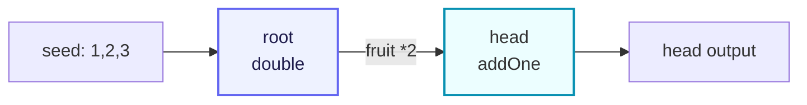

# demo/demo_farm.go

> 📅 Last Updated: 2026/09/24

## Purpose

`demo/demo_farm.go` is the simplest `Farm` example shipped with the CelestialGrow project. It demonstrates how to use the unified public entry `pkg/api` to build and run a small pipeline made of two `Plot`s:

- Use `NewPlot` to create two concurrent processing nodes (`root` and `head`);
- Use `NewFarm` to create the scheduling graph and register the nodes into it;
- Use `Connect` to establish the upstream/downstream relationship between the two nodes;
- Use `Run` to inject the initial seeds and execute the whole graph.

The semantics of the whole pipeline is "root doubles the seed and passes it to head, which adds one", a minimal closed loop that is very suitable as a getting-started demo.

## Code Structure

The file consists of three parts:

1. **Package and imports**: provides an executable entry point as `package main`, importing only `pkg/api` under the alias `grow`.
2. **Two cultivator functions**: `double` and `addOne`, serving as the processing logic of `root` and `head` respectively.
3. **The `main` function**: sequentially completes building Plot 1 and Plot 2, then Farm registration, connection, and execution.

The corresponding data flow (two nodes + one edge) can be simplified as:



## Key Calls

Key APIs appearing in `demo_farm.go` (all from `pkg/api`):

| Call | Source | Purpose |
|------|------|------|
| `grow.NewPlot[S, F](name, cultivator, opts...)` | `pkg/api` → `plot.NewPlot` | Constructs a generic concurrent node, where `S` is the seed type and `F` is the fruit type. |
| `grow.NewFarm(name, logLevel)` | `pkg/api` → `farm.NewFarm` | Constructs a Farm; internally creates a log spout and a lifecycle spout, and sets the global log level according to `logLevel`. |
| `farm.AddPlot(plots ...plot.PlotNode)` | `pkg/farm` | Registers several `PlotNode`s into the Farm and adds them to the topology graph. |
| `farm.Connect(from, to)` | `pkg/farm` | Establishes full connections (Cartesian product) between the source group and the target group, and validates the seed/fruit types of each connection. |
| `farm.Run(inputs map[string][]any)` | `pkg/farm` | Executes the whole graph synchronously, blocking until all Plots complete. |
| `grow.WithTenders(n int)` | `pkg/api` → `plot.WithTenders` | Sets the number of concurrent tenders (tending goroutines) of the Plot; the default is `runtime.NumCPU()`. |
| `grow.PlotNode` | `pkg/api` → `plot.PlotNode` | The unified interface used as the parameter of `Farm.Connect`, which erases the generics of `Plot` / `SplitPlot` / `RoutePlot`. |

## Key Flow

Inside the `main` function, execution proceeds in the following order:

1. Build the `root` node, with `double` as its cultivator and 2 concurrent tenders.
2. Build the `head` node, with `addOne` as its cultivator and 2 concurrent tenders.
3. Create `demo_farm` with the global log level `INFO`.
4. `AddPlot(root, head)`: registers both nodes into the Farm; names must be unique.
5. `Connect({root}, {head})`: establishes one edge from `root` → `head`.
6. `Run({"root": {1, 2, 3}})`: injects 3 initial seeds into `root` and starts executing the whole graph; `Run` blocks synchronously until all Plots complete before returning.

## Run Artifacts

After `Run` returns, two kinds of artifacts are generated (or appended) in the current working directory (consistent with the built-in log/lifecycle spouts of `pkg/farm`):

- `logs/grow_log(YYYY-MM-DD).log`: the structured log produced by this Farm run, appended per day; the log level is controlled by `NewFarm(name, "INFO")`.
- `lifecycles/YYYY-MM-DD/grow_lifecycle(HH-MM-SS.mmm).sqlite3`: the lifecycle database of this Farm, stored in a subdirectory named after the current date, with the file name carrying the startup time.

The sqlite database contains three tables: `events` (seed/fruit/weed/seal events), `event_parents` (parent-child edges between events), and `status` (the state snapshot of each seed, with states `seed` / `ripen` / `wither`).

> The paths and file naming above are determined by `pkg/persist`, and this example does not customize them. To clean up, you can simply delete the `logs/` and `lifecycles/` directories.

## Usage Example

The following code is identical to the source of `demo/demo_farm.go` and can be copied and run directly:

```go
package main

import grow "github.com/Mr-xiaotian/CelestialGrow/pkg/api"

// double 将种子翻倍。
func double(num int) (int, error) {
	return num * 2, nil
}

// addOne 为种子加一。
func addOne(num int) (int, error) {
	return num + 1, nil
}

// main 演示一条 Farm 流水线：root 将种子翻倍后传给 head 加一。
func main() {
	root := grow.NewPlot("root", double, grow.WithTenders(2))
	head := grow.NewPlot("head", addOne, grow.WithTenders(2))

	farm := grow.NewFarm("demo_farm", "INFO")
	if err := farm.AddPlot(root, head); err != nil {
		panic(err)
	}
	if err := farm.Connect([]grow.PlotNode{root}, []grow.PlotNode{head}); err != nil {
		panic(err)
	}
	if err := farm.Run(map[string][]any{
		"root": {1, 2, 3},
	}); err != nil {
		panic(err)
	}
}
```

### Section-by-Section Notes

- **Imports**: only `pkg/api` is imported, referenced under the alias `grow`, to avoid conflicting with the local variable name `farm`.
- **`double` / `addOne`**: the two simplest cultivators of the form `func(S) (F, error)`; their returned error is never non-nil, so every seed in the example produces a fruit normally and is consumed downstream.
- **`NewPlot`**: the seed and fruit types of both nodes are `int`, and the generic parameters `S = F = int` are inferred automatically by the Go compiler; `WithTenders(2)` limits the concurrent tender count of a single Plot to 2.
- **`NewFarm`**: the log spout and lifecycle spout have already been created internally, so callers no longer need to call `BindInlet` manually.
- **`AddPlot`**: adds the `Plot` to the Farm's `plots` map and topology graph, and shares the Farm's event client; an empty name or a duplicate registration returns an error.
- **`Connect`**: uses the "group-to-group full connection" semantics; in this example each group has only one node, so it produces only one directed edge `root → head`.
- **`Run`**: after injecting 3 seeds into `root`, internally it starts the spouts, binds the inlets, starts all Plots, injects the seeds, sends seal to the source node (here `root`), calls `WaitAsync` to wait for all Plots to complete, and finally stops the spouts and returns.

### How to Run

Run in the project root directory:

```bash
go run ./demo/demo_farm.go
```

After a successful run:

- The terminal has no output at all: `double` / `addOne` have no side effects, all logs are written to files rather than standard output, and the error from `Farm` stopping the spouts is not printed either.
- Two kinds of artifacts are generated in the current directory: `logs/grow_log(YYYY-MM-DD).log` and `lifecycles/YYYY-MM-DD/grow_lifecycle(HH-MM-SS.mmm).sqlite3`.

At the `INFO` level, the log file only contains `INFO` messages (graph structure, start/stop of each Plot, Farm start/end); the `DEBUG` messages of `SeedInput` and the `SUCCESS` messages of `SeedRipen` are filtered out. If you want to observe seed-level details, you can change the `logLevel` of `NewFarm` to `"DEBUG"`:

```go
farm := grow.NewFarm("demo_farm", "DEBUG")
```

## Notes

1. **Dependency requirements**: this example belongs to the same `github.com/Mr-xiaotian/CelestialGrow` module as the project, so no extra import paths are needed; `pkg/persist` writes the lifecycle database via `modernc.org/sqlite`, so before the first run you can execute `go mod download` to make sure the dependencies are ready.
2. **`Run` only sends seal to source nodes**: `inputs` can inject initial seeds into any registered Plot, but `Run` only sends the termination signal to source nodes (here `root`); when the input of a non-source node (here `head`) is closed depends on the seal forwarded by its upstream. Therefore, by design, you should only inject seeds into source nodes.
3. **Error handling**: the example uses `panic(err)` purely for demonstration; production code should return the errors from `AddPlot` / `Connect` / `Run` to the upper layer and handle them centrally.
4. **Execution is synchronously blocking**: `farm.Run` blocks until all Plots complete; if you need to run multiple Farms in parallel, use multiple goroutines to call it separately.
5. **No observer registered**: this example does not call `AddObserver`, so no progress bar appears in the terminal; if you want visual progress, refer to the `format.AddObserver(grow.NewProgressBar("format"))` usage in Farm mode in `docs/zh-CN/pkg/api/api.md`.
6. **Type safety**: `Connect` validates whether the "upstream fruit type" matches the "downstream seed type" and returns an error on mismatch; in this example both Plots have `S`/`F` as `int`, so no error occurs.
7. **Other node types**: this example only demonstrates `Plot`. `pkg/api` also exports `NewSplitPlot` (one-in-many-out) and `NewRoutePlot` (name-based targeted routing); both also implement `PlotNode` and can be mixed with `Plot` in the same graph.
