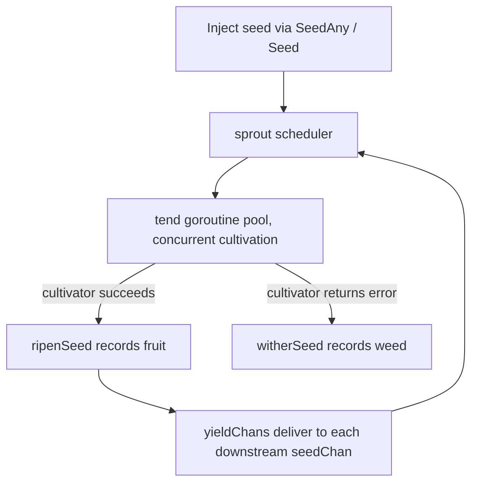

# pkg/api/api.go

> 📅 Last Updated: 2026/09/24

## Purpose

`pkg/api` is the **unified public entry package** of the CelestialGrow project. This package introduces no new implementation; instead, it re-exposes the core types and common configuration options from `pkg/farm`, `pkg/plot`, and `pkg/observer` in three forms:

1. **Type aliases**: `type X = pkg.Y`, such as `Farm`, `Plot`, `SplitPlot`, `RoutePlot`, `PlotNode`, `Option`;
2. **Thin wrappers around constructors**: `NewFarm`, `NewPlot`, `NewSplitPlot`, `NewRoutePlot`, `NewProgressBar`;
3. **Package-level function variables**: `WithTenders`, `WithChanSize`, `WithMaxRetries`, `WithRetryDelay`, `WithRetryIf`, `WithLogLevel`.

Downstream users only need to import the single package `github.com/Mr-xiaotian/CelestialGrow/pkg/api` to use the entire framework.

Since all exported items are aliases, function variables, or one-layer pass-through wrappers, the behavioral contract of this package is entirely determined by the underlying packages; this document focuses on "the list of exported symbols + type parameter semantics + default values + error scenarios".

## Core Objects

| Symbol | Category | Points to | Description |
|------|------|------|------|
| `Farm` | Type alias | `farm.Farm` | A static directed graph composed of multiple nodes, responsible for node registration, hyperedge-style connection, spout management, and overall scheduling. |
| `Plot[S, F]` | Generic type alias | `plot.Plot[S, F]` | The basic concurrent node. `S` is the input seed type and `F` is the output fruit type; for every seed processed successfully, it forwards **1** `F` downstream. |
| `SplitPlot[S, F]` | Generic type alias | `plot.SplitPlot[S, F]` | The split node. `S` is the input seed type; the processing function returns `[]F`, where **each element is forwarded to each downstream as an independent yield**. |
| `RoutePlot[S, Y]` | Generic type alias | `plot.RoutePlot[S, Y]` | The routing node. `S` is the input seed type; the processing function returns `map[string]Y`, where `key` is the target downstream name and `value` is sent only to that downstream. |
| `PlotNode` | Type alias | `plot.PlotNode` | The unified node interface with generic parameters erased; `Farm` uses it to hold nodes with differing seed/fruit types. |
| `Option` | Type alias | `plot.Option` | Optional node configuration, whose underlying type is `func(*plotOptions)`. Because `plotOptions` is unexported, `Option` **cannot be customized** outside the package; only the built-in `With*` family can be used. |

> A type alias (`type X = Y`) means that using these types in `pkg/api` is completely equivalent to using the underlying package directly, and the interface does not change at all; changes to the method set of the underlying package are immediately reflected in this package.

### The `PlotNode` Interface Contract

`PlotNode` is the unified interface used by `Farm` when managing nodes, covering the minimal capabilities required by "graph connection + run assembly + execution control" (the implementation lives in `pkg/plot/plot_base.go`):

| Method | Purpose |
|------|------|
| `GetName() string` | Returns the node name; `Farm` uses it for uniqueness validation and connection addressing. |
| `GetState() int32` | Returns the state: `0` = idle, `1` = running, `2` = done. |
| `GetSeedChanAny() any` | Returns the seed channel as `any`, for `ConnectTo` to perform a type assertion. |
| `ConnectTo(next PlotNode) error` | Connects this node's output to the downstream input; returns an error when the upstream/downstream types are incompatible. |
| `SetUpstreamYieldCounter(name string, yieldCounter *atomic.Int64)` | Registers an upstream yield counter, used for seal aggregation and seed statistics. |
| `BindInlet(logChan chan<- persist.LogRecord, lifecycleChan chan<- persist.LifecycleRecord)` | Binds the log and lifecycle write channels; called by `Farm.Run` or by the standalone `Plot.Run`. |
| `SetEventClient(eventClient runtime.EventClient)` | Injects the event client; `Farm.AddPlot` makes all nodes share the Farm's client. |
| `StartAsync()` | Starts the scheduler asynchronously (the inlet must be bound before calling). |
| `WaitAsync()` | Waits for the background goroutines to exit. |
| `SeedAny(seed any) error` | Sows one seed as `any`, performing a type assertion internally. |
| `Seal()` | Sends the "external input terminated" signal to this node. |

The typical implementations are the three nodes that embed `basePlot`: `*plot.Plot[S, F]`, `*plot.SplitPlot[S, F]`, and `*plot.RoutePlot[S, Y]`.

## Key Functions

### `NewFarm(name string, logLevel string) *Farm`

Creates and returns a `Farm`; internally it also creates the log spout, the lifecycle spout, and their inlets.

- `name`: the Farm name, used as the log identifier (`FarmStart` / `FarmEnd` records).
- `logLevel`: the minimum level of the Farm's **own** log inlet (`"DEBUG"` / `"INFO"` / `"WARN"` / `"ERROR"`); the log level of each node is determined by the node's own `WithLogLevel` and defaults to `"INFO"`.
- Does not return an error; after creation you can immediately call `AddPlot` / `Connect` / `Run`, and callers do not need to call `BindInlet` themselves.

### `NewPlot[S any, F any](name string, cultivator func(S) (F, error), opts ...Option) *Plot[S, F]`

Creates a basic concurrent node.

- `name`: the node name, which must be unique within the same `Farm`.
- `cultivator`: the processing function; when it returns an `error`, a retry is performed according to the `WithMaxRetries` / `WithRetryDelay` / `WithRetryIf` strategy, and once retries are exhausted it is recorded as a weed (failure).
- `opts`: optional configuration, see "Configuration Functions".

### `NewSplitPlot[S any, F any](name string, splitter func(S) ([]F, error), opts ...Option) *SplitPlot[S, F]`

Creates a split node. `splitter` maps one seed to `[]F`; on success the whole seed is recorded as **1 fruit**, but it sends `len(fruits)` yields to **each** connected downstream.

### `NewRoutePlot[S any, Y any](name string, cultivator func(S) (map[string]Y, error), opts ...Option) *RoutePlot[S, Y]`

Creates a routing node. In the routing table returned by `cultivator`, `key` is the target downstream name and `value` is the yield sent to that downstream: **different downstreams can receive different yields, and downstreams that are not routed to receive nothing**; downstreams that appear in the routing table but are not connected are skipped, without affecting the remaining routing entries.

### `NewProgressBar(description string) *observer.ProgressBar`

Creates a terminal progress bar observer; `description` is displayed as the prefix of the progress bar. The return value can be registered on any node directly via `Plot.AddObserver(...)`.

The progress bar listens to the `OnStart(total)` / `OnProgress(completed, total)` / `OnFinish(completed, total)` callbacks of the `observer.Observer` interface and requires no manual driving.

> The underlying `ProgressBar` is **lazily initialized**: the internal `progressbar` instance is created only when an event with `total > 0` is received for the first time. If the node's total seed count is `0`, no progress bar is created.

## Configuration Functions

In this package, `With*` is forwarded as **package-level variables** (function values), for example `WithTenders = plot.WithTenders`; only `WithRetryDelay` explicitly annotates the return type `Option` through a closure layer, and its external behavior is identical to the underlying one.

```go
package main

import (
    "context"
    "errors"
    "time"

    grow "github.com/Mr-xiaotian/CelestialGrow/pkg/api"
)

func main() {
    p := grow.NewPlot("worker", func(seed int) (int, error) {
        return seed * 2, nil
    },
        grow.WithTenders(4),
        grow.WithChanSize(16),
        grow.WithMaxRetries(3),
        grow.WithRetryDelay(func(attempt int) time.Duration {
            return time.Duration(attempt) * 100 * time.Millisecond
        }),
        grow.WithRetryIf(func(err error) bool { return !errors.Is(err, context.Canceled) }),
        grow.WithLogLevel("DEBUG"),
    )

    p.Run([]int{1, 2, 3})
}
```

| Function | Purpose | Default | Note |
|------|------|--------|------|
| `WithTenders(n int)` | Sets the number of concurrent tenders (tending goroutines), i.e. the capacity of the `sprout` semaphore. | `runtime.NumCPU()` | Determines the parallelism of a single node. |
| `WithChanSize(n int)` | Sets the buffer size of the seed channel `seedChan`. | `runtime.NumCPU()` | The downstream yield channel directly reuses the downstream `seedChan`; when the buffer is full, upstream and downstream block, forming natural backpressure. |
| `WithMaxRetries(n int)` | Maximum number of retries (**excluding** the first execution). | `1` | `WithMaxRetries(2)` means at most 3 executions. |
| `WithRetryDelay(fn func(attempt int) time.Duration)` | Sets the retry interval strategy; `attempt` starts at `1` and increments. | `func(int) time.Duration { return 0 }` (retry immediately) | Wrapped a second time via a closure in `pkg/api`, with parameter types identical to the underlying ones. |
| `WithRetryIf(fn func(error) bool)` | Error filter; only errors for which it returns `true` trigger a retry. | `func(error) bool { return true }` (retry all) | Can be used to mask non-retryable errors (such as `context.Canceled`). |
| `WithLogLevel(level string)` | Sets the minimum log level of the current node. | `"INFO"` | Applies only to that node; the Farm's own level is set in `NewFarm`. |

> The defaults all come from `defaultOptions()` in `pkg/plot/option.go`; modifying the underlying defaults takes effect globally.
>
> Retry semantics (`basePlot.tend`): executes at most `maxRetries + 1` times; when `retryIf(err)` returns `false`, retrying stops immediately; if `cultivator` panics, the panic is caught by `recover` and recorded as a failure, with the error text `cultivator panic: ...`.

## Usage Examples

### Farm Mode (Linear Pipeline)

```go
package main

import (
    "fmt"

    grow "github.com/Mr-xiaotian/CelestialGrow/pkg/api"
)

func main() {
    double := grow.NewPlot("double", func(seed int) (int, error) {
        return seed * 2, nil
    }, grow.WithTenders(2))

    format := grow.NewPlot("format", func(seed int) (string, error) {
        return fmt.Sprintf("result=%d", seed), nil
    })

    format.AddObserver(grow.NewProgressBar("format"))

    farm := grow.NewFarm("demo_farm", "INFO")
    if err := farm.AddPlot(double, format); err != nil {
        panic(err)
    }
    if err := farm.Connect([]grow.PlotNode{double}, []grow.PlotNode{format}); err != nil {
        panic(err)
    }

    if err := farm.Run(map[string][]any{
        "double": {1, 2, 3, 4},
    }); err != nil {
        panic(err)
    }
}
```

After `farm.Run` is called, the framework processes each node in the following order:



### Splitting and Routing

```go
package main

import (
    "fmt"

    grow "github.com/Mr-xiaotian/CelestialGrow/pkg/api"
)

func main() {
    // 一颗种子拆成多个 yield（F = string）
    split := grow.NewSplitPlot("split", func(seed int) ([]string, error) {
        return []string{fmt.Sprintf("v%d", seed), fmt.Sprintf("x%d", seed)}, nil
    }, grow.WithTenders(2))

    // 按 yield 长度把它们路由到不同下游（Y = string）
    route := grow.NewRoutePlot("route", func(seed string) (map[string]string, error) {
        if len(seed)%2 == 0 {
            return map[string]string{"left": "L-" + seed}, nil
        }
        return map[string]string{"right": "R-" + seed}, nil
    })

    left := grow.NewPlot("left", func(seed string) (string, error) { return seed, nil })
    right := grow.NewPlot("right", func(seed string) (string, error) { return seed, nil })

    farm := grow.NewFarm("dispatch_farm", "INFO")
    if err := farm.AddPlot(split, route, left, right); err != nil {
        panic(err)
    }
    if err := farm.Connect([]grow.PlotNode{split}, []grow.PlotNode{route}); err != nil {
        panic(err)
    }
    if err := farm.Connect([]grow.PlotNode{route}, []grow.PlotNode{left, right}); err != nil {
        panic(err)
    }

    if err := farm.Run(map[string][]any{
        "split": {1, 2, 3},
    }); err != nil {
        panic(err)
    }
}
```

### Standalone Mode

If there is only one node and you do not need to build a `Farm`, you can use standalone mode directly:

```go
package main

import (
    "fmt"

    grow "github.com/Mr-xiaotian/CelestialGrow/pkg/api"
)

func main() {
    p := grow.NewPlot("double", func(seed int) (int, error) {
        return seed * 2, nil
    }, grow.WithTenders(4))

    p.AddObserver(grow.NewProgressBar("double"))
    p.Run([]int{1, 2, 3, 4, 5})

    records, err := p.Harvest()
    if err != nil {
        panic(err)
    }

    for _, record := range records {
        fmt.Println(record.SeedJSON, record.Status, record.FruitJSON)
    }
}
```

`Plot.Run` internally creates local log/lifecycle spouts, binds the inlets, and stops the spouts at the end; `Harvest` returns `[]persist.LifecycleStatusRecord`, used to read all persisted seed state snapshots of the current node.

## Error Scenarios

| Entry | Possible error |
|------|--------------|
| `Farm.AddPlot` | A `nil` node is passed, the name is empty, or the name is duplicated. |
| `Farm.Connect` | The `from` / `to` lists are empty; a node is not registered in this Farm; the upstream/downstream types are incompatible (the `ConnectTo` assertion fails). |
| `Farm.Run` | An unregistered node name appears in `inputs`; the seed type passed to `SeedAny` does not match the node's `S`. |
| `PlotNode.SeedAny` | The passed value cannot be asserted to the node's `S`. |
| `Plot.Harvest` | The lifecycle spout is `nil` (not started via the standalone `Run`); or its handler does not support status queries. |
| `NewFarm` / `NewPlot` / `NewSplitPlot` / `NewRoutePlot` / `NewProgressBar` | Does not return an error. |

## Notes

1. **Type alias is not a new type**: `Farm`, `Plot[S, F]`, `SplitPlot[S, F]`, `RoutePlot[S, Y]`, `PlotNode`, and `Option` are all `type X = pkg.Y` and can be used interchangeably with the underlying types.
2. **Option pattern**: all optional configuration is injected through functional `Option`s; the `NewPlot` family applies them in the order passed, so a later `With*` for the same field overrides the earlier one. Because `plotOptions` is unexported, `Option` cannot be customized outside the package.
3. **Configuration defaults are maintained by the underlying package**: the defaults come from `defaultOptions()` in `pkg/plot/option.go`.
4. **Type-safe connections**: `Farm.Connect` performs a full connection (Cartesian product) between the source group and the target group; each connection calls the upstream's `ConnectTo`, where a type assertion validates whether "upstream `F`/`Y` and downstream `S`" match. Incompatible combinations that cannot be checked at compile time are intercepted at runtime and an error is returned directly.
5. **Generic parameters must align with the "downstream seed type"**: `Plot`'s `F`, `SplitPlot`'s `F`, and `RoutePlot`'s `Y` all denote **the element type of the downstream `seedChan`**, validated at connection time by a runtime assertion.
6. **Progress bar observer**: `NewProgressBar` returns `*observer.ProgressBar`, which is based on `github.com/schollz/progressbar/v3` and outputs to `os.Stderr`; if you need to redirect the output or customize rendering, use the underlying package directly.
7. **Import path**: it is recommended to import it under the alias `grow "github.com/Mr-xiaotian/CelestialGrow/pkg/api"` to avoid conflicts with local variable names (such as `farm`, `plot`, `runtime`).
