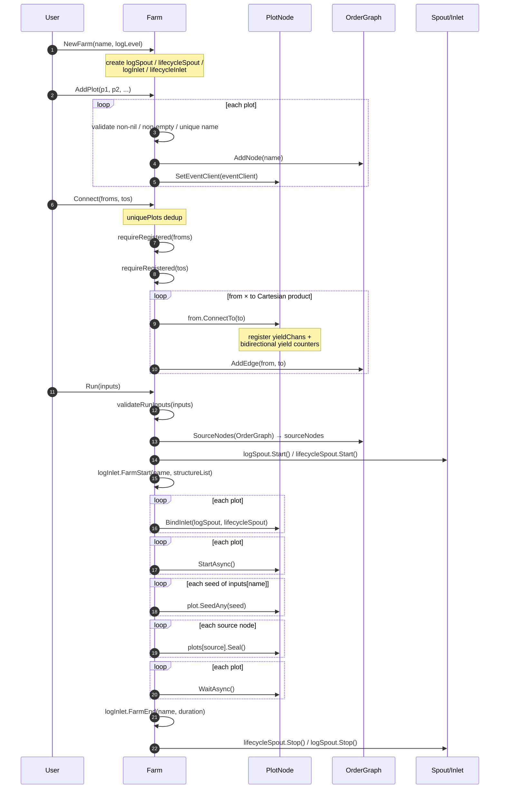

# pkg/farm/farm.go

> 📅 Last Updated: 2026/09/24

## Purpose

The `farm` package is CelestialGrow's "graph-level" scheduler, and `farm.go` provides the `Farm` type, responsible for organizing multiple `plot.PlotNode` nodes into a static directed graph and handling:

- node registration and name uniqueness validation
- group-to-group (hyper-edge) fully connected edge creation
- global log / lifecycle spout startup and inlet binding
- rendering the graph structure before running (`getStructureList` → `RenderStructureList`) into the farm startup log
- unified source node detection, initial seed injection and sealing
- waiting for all plots to finish and cleaning up spouts

`Farm` only manages the orchestration layer and does not care about the generic seed / fruit types of `Plot` — this is erased through the `plot.PlotNode` interface. Internally, `Farm` uses the `OrderGraph` in the same directory to maintain topology information; see [`graph.md`](./graph.md) for details.

## Core Objects

### The `Farm` struct

```go
type Farm struct {
    name        string
    plots       map[string]plot.PlotNode
    sourceNodes []string
    *OrderGraph

    eventClient runtime.EventClient

    logSpout       *funnel.Spout[persist.LogRecord]
    lifecycleSpout *funnel.Spout[persist.LifecycleRecord]
    logInlet       *persist.LogInlet
    lifecycleInlet *persist.LifecycleInlet
}
```

| Field | Purpose |
| --- | --- |
| `name` | The Farm name, used as the farm identifier in logs |
| `plots` | The node table indexed by plot name, used for registration validation and lookup |
| `sourceNodes` | The "source node representatives" computed once during `Run`, one per Source SCC |
| `*OrderGraph` | The embedded directed graph recording the edges between plots, used for topology and SCC analysis |
| `eventClient` | The shared runtime event client, injected into each plot through `AddPlot` |
| `logSpout` / `lifecycleSpout` | The global log / lifecycle message spouts, started uniformly during `Run` |
| `logInlet` / `lifecycleInlet` | The farm-side inlet handles, used only for the `FarmStart` (including graph structure) / `FarmEnd` package-level logs |

### The `PlotNode` interface contract

`Farm` is decoupled from the concrete `Plot[S, F]` through the `plot.PlotNode` interface. That interface is defined in `pkg/plot/plot_base.go`; `Farm` calls the following methods:

| Method | Purpose |
| --- | --- |
| `GetName() string` | Unique identifier and edge matching |
| `GetState() int32` | Reads the node state (`0=idle` / `1=running` / `2=done`) |
| `GetSeedChanAny() any` | Exposes `seedChan` as `any`, for upstream `ConnectTo` to type-assert |
| `ConnectTo(next PlotNode) error` | Validates type compatibility, registers the downstream yield channel, and wires the yield counters in both directions; returns an error on type mismatch |
| `SetUpstreamYieldCounter(name string, yieldCounter *atomic.Int64)` | Registers the upstream name + yield counter, used for `GetSeedNum` aggregation and seal waiting |
| `BindInlet(logChan, lifecycleChan)` | Binds the global spout channels during `Run` |
| `SetEventClient(runtime.EventClient)` | Injects the same event client uniformly during `AddPlot` |
| `StartAsync()` / `WaitAsync()` | Asynchronous lifecycle control |
| `SeedAny(seed any) error` | Injects initial seeds per `inputs` during `Run` |
| `Seal()` | Sends `SignalSeal` to each source during `Run` |

> The bidirectional wiring of yield counters is already encapsulated in `ConnectTo` (the upstream writes `downstreamYields`, the downstream writes `upstreamYields`), so `Farm.Connect` no longer registers them separately. For details of the interface and implementation, see the `pkg/plot` documentation.

## Public Symbols

| Symbol | Signature | Purpose |
| --- | --- | --- |
| `NewFarm` | `func NewFarm(name, logLevel string) *Farm` | Constructs a Farm and creates the two global spouts and inlets |
| `PlotCount` | `func (f *Farm) PlotCount() int` | Returns the number of registered plots |
| `HasPlot` | `func (f *Farm) HasPlot(name string) bool` | Reports whether the named plot is registered |
| `GetPlot` | `func (f *Farm) GetPlot(name string) (plot.PlotNode, bool)` | Gets a plot by name; ok indicates whether it exists |
| `AddPlot` | `func (f *Farm) AddPlot(plots ...plot.PlotNode) error` | Registers one or more plots, requiring non-nil, non-empty and unique names |
| `Connect` | `func (f *Farm) Connect(fromPlots, toPlots []plot.PlotNode) error` | Creates Cartesian-product connections between the source group and the target group |
| `Run` | `func (f *Farm) Run(inputs map[string][]any) error` | Runs the whole graph synchronously, waiting for all plots to finish |

> `Farm` has no method such as `SetLogLevel`: the log level is injected into the global `LogInlet` through the `logLevel` parameter at `NewFarm` time and cannot be changed at runtime.

## Key Flows

### The full `AddPlot → Connect → Run` chain



### `AddPlot` error return points

- Any plot is `nil` → `plot is nil`
- The name is empty → `plot name cannot be empty`
- The name is duplicated → `plot %q already exists`

Note: `AddPlot` returns as soon as it encounters the first error while iterating, and nodes already successfully added to `f.plots` and the graph are **not** rolled back.

### `Connect` error return points

- `fromPlots` / `toPlots` is empty after overall deduplication → `from plots cannot be empty` / `to plots cannot be empty`
- Any plot is not registered in the farm → `plot %q is not registered in farm`
- A `from → to` pair fails the type assertion in `from.ConnectTo(to)` → the error from `plot.ConnectTo` is passed through

> ⚠️ **Partial failure is not undone**: `Connect` returns immediately once the inner loop fails. Already established connections (`ConnectTo` has already written the upstream `yieldChans` and registered the yield counters bidirectionally, and the graph has `AddEdge`) are kept; a later `Connect` will have duplicate edges ignored at the graph level, but the `yieldChans` inside `PlotNode` will keep the old mappings. To start over, create a new `Farm`.

### `Run` error return points

- `inputs` contains an unregistered plot → `plot %q is not registered in farm`
- A `SeedAny` type assertion fails → the error is passed through (at this point some plots have already `StartAsync`ed, and the caller must ensure the graph state is suitable for a retry)

## Important Details

### Group-to-group Cartesian product

`Connect(froms, tos)` first performs `uniquePlots` deduplication + `nil` filtering on both sides, then creates `len(froms) × len(tos)` edges. For example:

```go
farm.Connect([]plot.PlotNode{root}, []plot.PlotNode{midA, midB})
// 等价于 root → midA 与 root → midB 两条独立边
```

Note: only nodes appearing in the "source group" are connected to every node in the "target group". `midA` and `midB` are not connected to each other.

### Source node sealing

`Run` computes the representative node of each Source SCC via `SourceNodes(OrderGraph)` and calls `Seal()` on it. `Seal()` sends `SignalSeal` with `Source == sourceInput` (i.e. `__input__`), which triggers "forced termination" semantics for plots that have upstream connections — it no longer waits for upstream seals that have not yet arrived.

### Concurrency control

- `Run` is a **synchronous** call: it calls `StartAsync` in turn and then waits for all plots to exit through `WaitAsync`.
- `StartAsync` uses `sync.WaitGroup.Go` (the new Go 1.25 style) to start each plot's `sprout` scheduler.
- The global `logSpout` / `lifecycleSpout` both have capacity 100 and a flush interval of `1s`, stopped in `defer` order at the end of `Run`.

### Graph structure rendering

Before writing the startup log, `Run` calls `getStructureList()`: it passes `Nodes()`, `OutEdges()` and the `sourceNodes` computed for this run to `RenderStructureList`, which renders them into a list of framed tree text lines, then hands them to `logInlet.FarmStart` for line-by-line output. For rendering rules and algorithms, see [`render.md`](./render.md).

> `sourceNodes` is computed in `Run` before `logInlet.FarmStart`, so the rendered structure matches the set of nodes actually sealed.

### Collaboration with `pkg/persist`

During `Run`, `Farm` writes "farm-level" run summaries through `logInlet.FarmStart(name, structureList)` / `FarmEnd(name, duration)`, where `structureList` is the rendering result from the previous section; each plot still writes its own `PlotStart` / `PlotEnd` / `SeedInput` / `SeedRipen` / `SeedWither` / `SeedReplant` records through the inlet it received from `BindInlet`.

### Collaboration with `pkg/runtime`

`eventClient` is injected during `AddPlot`, and all plots share the same event ID namespace, guaranteeing that the cross-plot seed → fruit → seal event ID chain is traceable. `Farm` itself does not emit events directly.

## Usage Example

The example below corresponds to the farm mode in the README, showing only the version that uses `pkg/farm` directly (real projects are advised to go through `pkg/api`):

```go
package main

import (
    "fmt"

    "github.com/Mr-xiaotian/CelestialGrow/pkg/farm"
    "github.com/Mr-xiaotian/CelestialGrow/pkg/plot"
)

func main() {
    double := plot.NewPlot("double", func(seed int) (int, error) {
        return seed * 2, nil
    }, plot.WithTenders(2))

    format := plot.NewPlot("format", func(seed int) (string, error) {
        return fmt.Sprintf("result=%d", seed), nil
    })

    f := farm.NewFarm("demo_farm", "INFO")
    if err := f.AddPlot(double, format); err != nil {
        panic(err)
    }
    if err := f.Connect([]plot.PlotNode{double}, []plot.PlotNode{format}); err != nil {
        panic(err)
    }

    if err := f.Run(map[string][]any{
        "double": {1, 2, 3, 4},
    }); err != nil {
        panic(err)
    }
}
```

## Notes

- **Test coverage**: `farm_connect_test.go`, `farm_start_test.go`, `farm_structure_test.go`, `farm_route_test.go`, `farm_split_test.go`, `graph_test.go`, and `render_test.go` under `pkg/farm` together cover registration, connection (including type mismatch / hyper-edge / duplicate name), linear `Run` flow, `121` / `21-fanin` / multiple connected components, `RoutePlot` directed routing, `SplitPlot` splitting, graph algorithms, and structure rendering. See the individual test documentation for details.
- **Synchronization between the graph and nodes**: the `OrderGraph` node set and `f.plots` are not strictly equivalent — `AddNode` is also auto-completed by `AddEdge` during `Connect`. `SourceNodes` in `Run` uses the `OrderGraph` view, so isolated plots (added via `AddPlot` but with no edges) are also treated as sources and receive `Seal()`.
- **Not re-entrant**: `Run` has no concurrency protection; the same `Farm` instance does not support running `Run` multiple times concurrently, nor calling `AddPlot` / `Connect` while `Run` is in progress.
- **Error recovery**: after a failed `Run`, some plots may already be started; to rerun, create a new `Farm` instance.
