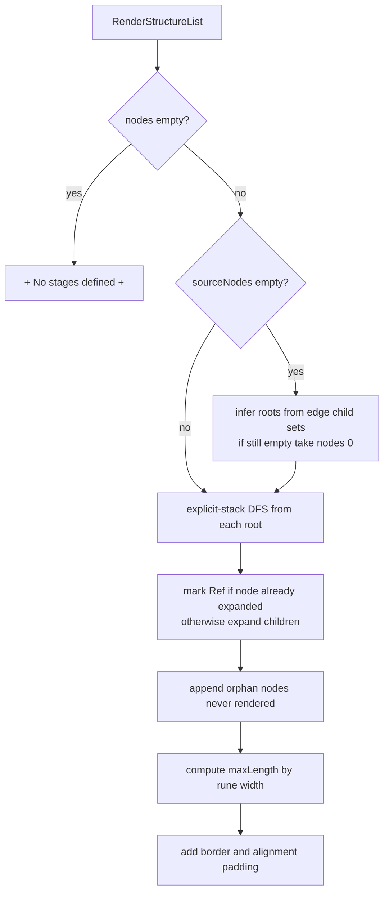

# pkg/farm/render.go

> 📅 Last Updated: 2026/09/24

## Purpose

`render.go` renders `OrderGraph`'s graph structure (node set + out-edge adjacency list + source nodes) into a **list of framed tree text lines** for `Farm.Run` to write into the startup log. It is a purely functional rendering utility that holds no state.

The only call site in `Farm` is `Farm.getStructureList()`:

```go
func (f *Farm) getStructureList() []string {
    return RenderStructureList(f.Nodes(), f.OutEdges(), f.sourceNodes)
}
```

## Core Objects

### `RenderStructureList`

```go
func RenderStructureList(nodes []string, edges map[string][]string, sourceNodes []string) []string
```

| Parameter | Meaning |
| --- | --- |
| `nodes` | All node names. The order affects the append order of "orphan nodes" and "inferred source nodes" |
| `edges` | The out-edge adjacency list (`node → successor list`), usually from `OrderGraph.OutEdges()` |
| `sourceNodes` | The rendering root nodes. When empty, they are inferred automatically by rule |

The return value is a string slice that can be printed line by line directly, already including the top and bottom borders.

### `renderFrame` (internal)

```go
type renderFrame struct {
    name   string
    prefix string
    isLast bool
    isRoot bool
}
```

The stack frame of the explicit-stack iterative DFS: `prefix` is the indentation prefix of the current line, `isLast` decides the connector (`╞-->` or `╘-->`), and `isRoot` indicates a root node (no connector is drawn, and the child prefix is empty). It is a private implementation detail of rendering and is not exposed through the public API.

## Rendering Rules

1. **Root nodes draw no connector**, outputting the node name directly; non-root nodes use the `╞-->` (non-last child) or `╘-->` (last child) connector.
2. **Cycle / shared subgraph nodes are expanded only once**: when they appear again, ` [Ref]` is appended to the current line, and their children are not recursed into.
3. **Source node inference**: when `sourceNodes` is empty, nodes from `nodes` that "do not appear in any `edges` child set" are chosen as roots; if that is still empty, it degrades to `nodes[0]`.
4. **Orphan node supplementation**: nodes not rendered by any root (never expanded by `RenderStructureList`) are appended at the end.
5. **Multiple root separation**: a blank line is inserted between different roots.
6. **Border alignment**: the maximum line width is computed and aligned by **rune count** (`utf8.RuneCountInString`), so the multi-byte connectors `╞` / `╘` / `│` do not break the border.
7. **Empty graph placeholder**: when `nodes` is empty, `["+ No stages defined +"]` is returned directly.

> The function uses **explicit-stack iterative** DFS pre-order traversal (rather than recursion) to avoid deep-chain graphs triggering Go's recursion depth limit; `render_test.go` specifically regresses this with a 5000-node deep chain.

## Key Flows



## Usage Example

```go
package main

import (
    "fmt"

    "github.com/Mr-xiaotian/CelestialGrow/pkg/farm"
)

func main() {
    nodes := []string{"a", "b"}
    edges := map[string][]string{"a": {"b"}}

    for _, line := range farm.RenderStructureList(nodes, edges, []string{"a"}) {
        fmt.Println(line)
    }
    // +-------+
    // | a     |
    // | ╘-->b |
    // +-------+
}
```

Shared subgraphs / cycles are marked with `[Ref]`:

```go
nodes := []string{"c1", "c2", "c3"}
edges := map[string][]string{
    "c1": {"c2"},
    "c2": {"c3"},
    "c3": {"c1"},
}
// c1 首次展开输出连接符，回到 c1 时输出 "c1 [Ref]"
farm.RenderStructureList(nodes, edges, []string{"c1"})
```

## Notes

- **Stateless, pure function**: the same inputs produce the same result; the function does not modify `nodes` / `edges`, nor does it access any global state.
- **Impact of the unordered node set**: `nodes` usually comes from `OrderGraph.Nodes()` and its order is not guaranteed; therefore within the same build the order among multiple roots and the append order of orphan nodes may be unstable (see [`graph.md`](./graph.md) for details).
- **Test coverage**: `pkg/farm/render_test.go` covers basic shapes, exact output, empty graph, cycle `[Ref]`, a 5000-node deep chain, and orphan / source node inference. See `render_test.md` for details.
