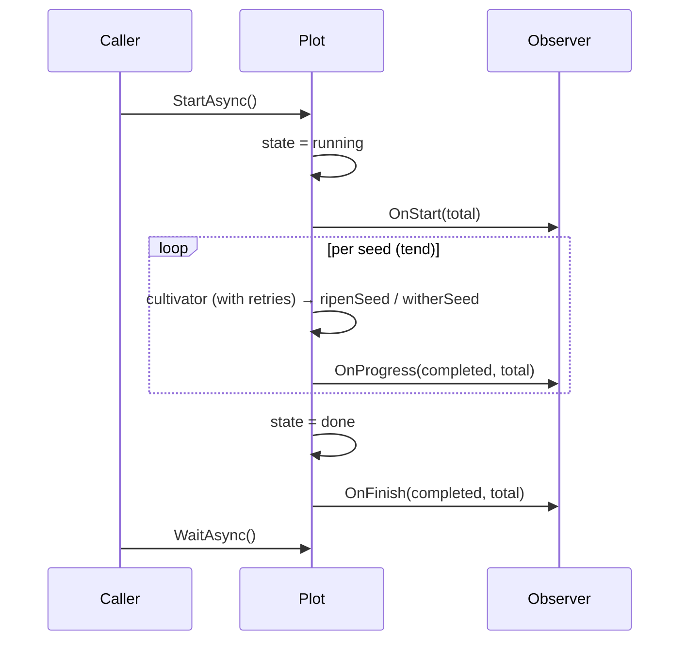

# pkg/observer/observer.go

> 📅 Last Updated: 2026/09/24

## Purpose

`pkg/observer/observer.go` defines the interface contract `Observer` for the **seed cultivation progress observer**, which is the decoupling point between `pkg/plot` and external progress display components (see [`progress.md`](./progress.md) for the typical implementation). Through `Observer`, Plot calls back into business code at three moments — start, progress update, and completion — making the running state of the cultivation pipeline observable without coupling to a specific UI / output medium.

## Core Objects

### The `Observer` interface

```go
type Observer interface {
    OnStart(total int)
    OnProgress(completed, total int)
    OnFinish(completed, total int)
}
```

| Method | When it fires | Parameter meaning |
|------|----------|----------|
| `OnStart(total int)` | Inside `notifyStart`: first sets `state` to 1 (running), then iterates the observers. Located in the `StartAsync` async goroutine, before the `sprout` scheduler starts | `total` = `GetSeedNum()` (locally sown count + cumulative upstream output); sowing has not started yet at this point, so the actual value is usually `0` |
| `OnProgress(completed, total int)` | Called once after each seed obtains its final result: both the success path `ripenSeed` and the failure path `witherSeed` update the counter first and then call `reportProgress` (both run inside the `tend` goroutine). The retry process itself does not trigger it | `completed` = `GetCompleted()` (fruits + weeds), `total` = `GetSeedNum()` |
| `OnFinish(completed, total int)` | Called once by `notifyFinish` after `sprout` returns: first sets `state` to 2 (done), then snapshots the counters | Same meaning as `OnProgress`; just a final snapshot |

> The interface is an implicit contract: any type implementing the three methods above automatically satisfies `Observer`, with no explicit declaration needed.

## Registration

The observer list is carried by the `basePlot[S, F, Y].observers []observer.Observer` field in `pkg/plot/plot_base.go`, and can only be appended to via `AddObserver`; `Plot[S, F]` embeds `*basePlot[S, F, F]`, so this method is available on all three node kinds `Plot` / `SplitPlot` / `RoutePlot`:

```go
// pkg/plot/plot_base.go
func (p *basePlot[S, F, Y]) AddObserver(observer observer.Observer) {
    p.observers = append(p.observers, observer)
}
```

> ⚠️ **Note**: the source comment in this file says "injected through the observers parameter of `NewPlot`", but the signature of `plot.NewPlot` / `api.NewPlot` is `(name string, cultivator func(S) (F, error), opts ...Option)` and does not accept observers; in the current implementation `observers` can only be appended via `AddObserver`.

A typical usage of registering a `ProgressBar` (in standalone mode `Run` takes care of `BindInlet` / `StartAsync` / `Seed` / `Seal` / `WaitAsync`):

```go
p := plot.NewPlot[Seed, Fruit]("harvester", cultivate, opts...)
p.AddObserver(observer.NewProgressBar("harvesting"))

p.Run(seeds)
```

To control the input manually, you must call `BindInlet` first and then `StartAsync` yourself, otherwise `logInlet` is nil:

```go
p.BindInlet(logChan, lifecycleChan) // Farm 模式下由 Farm.Run 代劳
p.StartAsync()
p.Seed(seed)
p.Seal()
p.WaitAsync()
```

`AddObserver` does not deduplicate; adding the same instance multiple times triggers multiple callbacks.

## Integration Points with the Plot Lifecycle

Plot iterates `p.observers` in registration order in three internal hooks, calling the corresponding method each time:

```go
// pkg/plot/plot_base.go
func (p *basePlot[S, F, Y]) notifyStart() {
    p.state.Store(1) // running
    seedNum := p.GetSeedNum()
    for _, observer := range p.observers {
        observer.OnStart(seedNum)
    }
}

func (p *basePlot[S, F, Y]) reportProgress() {
    completed := p.GetCompleted()
    seedNum := p.GetSeedNum()
    for _, observer := range p.observers {
        observer.OnProgress(completed, seedNum)
    }
}

func (p *basePlot[S, F, Y]) notifyFinish() {
    p.state.Store(2) // done
    completed := p.GetCompleted()
    seedNum := p.GetSeedNum()
    for _, observer := range p.observers {
        observer.OnFinish(completed, seedNum)
    }
}
```

The call order is orchestrated by `StartAsync` (defined on `*basePlot[S, F, Y]` in `pkg/plot/plot_base.go`, promoted to `Plot` via embedding):



Notes:

- `OnStart` and `OnFinish` each fire exactly once; `OnProgress` fires a number of times equal to `fruit count + weed count` (seed-level retries do not add extra triggers).
- The state is stored in `basePlot.state atomic.Int32`, with values `0=idle, 1=running, 2=done` (see `GetState` in `pkg/plot/plot_base.go`). Observers do not perceive `idle`; they are notified only at the start of `running` and the wrap-up of `done`.
- There is no recover when iterating observers: a panic from an Observer in `notifyStart` / `notifyFinish` propagates up through the async goroutine of `StartAsync` and directly panics the whole process; a panic in `reportProgress` is first swallowed by `tend`'s `recover` and is mistakenly recorded as a "cultivator panic" weed. Custom Observer implementations should handle their own internal errors.
- Since `AddObserver` only appends and there is no removal or clearing interface, the observer list grows monotonically throughout the Plot lifecycle, and adding the same instance repeatedly triggers repeated callbacks.

## Notes

- `Observer` callbacks occur inside Plot's internal goroutines: `notifyStart` / `notifyFinish` in the `StartAsync` goroutine, `reportProgress` in the corresponding `tend` goroutine; custom implementations must guarantee concurrency safety themselves.
- The `total` of `OnStart` is usually `0`: both standalone `Run` and `Farm.Run` call `StartAsync()` first and only then `Seed` / `SeedAny` one by one, so there is a race between `notifyStart` and sowing. Implementations cannot assume that `OnStart` receives the final total (this is exactly why `ProgressBar` lazily initializes).
- The `total` of `OnProgress` comes from `GetSeedNum()`, equal to "locally sown count + cumulative upstream output", and grows as upstream keeps producing; therefore `completed / total` may stall or even go backwards (though `completed` never exceeds `total`), and progress bar implementations must tolerate a non-monotonic ratio.
- `Observer` is the only "observer" abstraction in the project; Farm never appends any global callback to a Plot's observer list.
