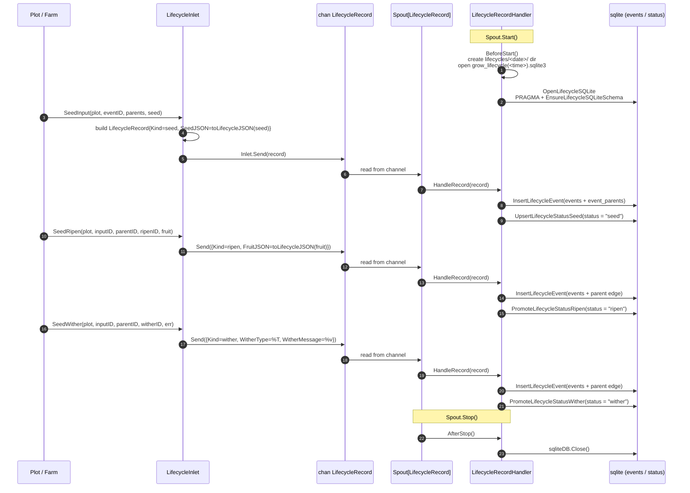

# pkg/persist/lifecycle.go

> 📅 Last Updated: 2026/09/24

## Purpose

`pkg/persist/lifecycle.go` splits the **cultivation trajectory** of every seed into two kinds of records — "events" and "status snapshots" — subscribes to the asynchronous channel of `pkg/funnel` through `LifecycleRecordHandler`, and writes them into the SQLite file maintained by [`sqlite.md`](./sqlite.md); at the same time it exposes a business-facing producer API (`SeedInput` / `SeedRipen` / `SeedWither`) through `LifecycleInlet`. This file itself does not execute SQL directly — all persistence details live in `sqlite.go`, and this file only does the **orchestration and adaptation** of event → record → database.

> Event IDs are assigned by `runtime.EventClient` (e.g. `runtime.LocalEventClient.Emit`), see [`pkg/runtime/event.go`](../../../../pkg/runtime/event.go). This file consumes the `int` form of `EventID` directly and does not depend on the `runtime` package.

## Core Objects

### `LifecycleRecord` — channel payload

```go
type LifecycleRecord struct {
    Kind           string
    InputEventID   int
    CurrentEventID int
    ParentIDs      []int
    PlotName       string
    SeedJSON       string
    FruitJSON      string
    WitherType     string
    WitherMessage  string
    TS             float64
}
```

| Field | Meaning |
|------|------|
| `Kind` | Operation type; one of `seed` / `ripen` / `wither` (represented by the package-private constants `lifecycleSeed` / `lifecycleRipen` / `lifecycleWither`) |
| `InputEventID` | Event ID of this seed (the input), corresponding to `status.input_event_id` |
| `CurrentEventID` | Event ID produced this time, corresponding to `status.current_event_id`; for `seed` it equals `InputEventID` |
| `ParentIDs` | List of parent event IDs; when written to `events`, the `event_parents` edges are written along with it |
| `PlotName` | Name of the plot the event belongs to, written to `status.plot` |
| `SeedJSON` | Seed payload JSON (provided by the producer only for `seed`) |
| `FruitJSON` | Fruit JSON (provided by the producer only for `ripen`) |
| `WitherType` | Wither error type string (generated by `fmt.Sprintf("%T", err)` only for `wither`) |
| `WitherMessage` | Wither error text (generated by `fmt.Sprintf("%v", err)` only for `wither`) |
| `TS` | Event timestamp (seconds, floating point), generated by `time.Now().UnixMilli() / 1000` |

> `LifecycleRecord` is a **flat** structure: the event body (event ID / plot / timestamp / parent edges) is inlined directly as fields, and no longer nests `sqlite.LifecycleEventRecord`.

### `LifecycleRecordHandler` — consumer side (Spout handler)

```go
type LifecycleRecordHandler struct {
    SQLitePath string
    sqliteDB   *sql.DB
}
```

It implements `funnel.RecordHandler[LifecycleRecord]`, with the following method signatures:

| Method | Trigger | Behavior |
|------|----------|------|
| `BeforeStart() error` | Before Spout starts | Creates the `lifecycles/<YYYY-MM-DD>/` directory and opens `grow_lifecycle(<HH-MM-SS.mmm>).sqlite3`; saves the path to `SQLitePath` and the connection handle to `sqliteDB` |
| `HandleRecord(record LifecycleRecord) error` | When each record arrives | First checks `sqliteDB != nil`; then routes by `record.Kind` to `InsertLifecycleEvent` + `UpsertLifecycleStatusSeed` / `PromoteLifecycleStatusRipen` / `PromoteLifecycleStatusWither` |
| `AfterStop() error` | After Spout stops | Closes `sqliteDB` and sets it to nil |
| `LoadStatuses(plotName string) ([]LifecycleStatusRecord, error)` | Called by the business side on demand | Reuses `sqliteDB` when possible; if not yet initialized, reopens it by `SQLitePath` |

> `SQLitePath` is exposed as a public field so that callers can still reopen the persisted SQLite file through `LoadStatuses` after `AfterStop` for offline queries.
>
> When `sqliteDB == nil`, `AfterStop` returns `nil` directly, so calling it on an instance that never ran `BeforeStart` is safe.

### `LifecycleInlet` — producer side

```go
type LifecycleInlet struct {
    funnel.Inlet[LifecycleRecord]
}
```

It embeds `funnel.Inlet[LifecycleRecord]` and only adds 3 business-facing send methods on top of it:

| Method | `Kind` | Behavior |
|------|--------|------|
| `SeedInput(plot string, eventID int, parentIDs []int, seed any)` | `seed` | Sends a seed record: `CurrentEventID = InputEventID = eventID`, `SeedJSON = toLifecycleJSON(seed)`; on persistence it first writes `events` (`status = "seed"`), then `UpsertLifecycleStatusSeed` |
| `SeedRipen(plot string, inputEventID int, parentEventID int, ripenEventID int, fruit any)` | `ripen` | Sends a ripen record: `CurrentEventID = ripenEventID`, `ParentIDs = []int{parentEventID}`, `FruitJSON = toLifecycleJSON(fruit)`; on persistence it first writes `events`, then `PromoteLifecycleStatusRipen` |
| `SeedWither(plot string, inputEventID int, parentEventID int, witherEventID int, err error)` | `wither` | Sends a wither record: `CurrentEventID = witherEventID`, `ParentIDs = []int{parentEventID}`, `WitherType = %T`, `WitherMessage = %v`; on persistence it first writes `events`, then `PromoteLifecycleStatusWither` |

All three methods internally generate `TS` with `time.Now().UnixMilli()` and then call `Send` of the embedded `Inlet`; therefore they **do not return an error**, and send timeouts are handled inside `funnel.Inlet`.

### `NewLifecycleInlet` — construction

```go
func NewLifecycleInlet(ch chan<- LifecycleRecord, timeout time.Duration) *LifecycleInlet
```

- `ch` must be exposed by the corresponding `funnel.Spout[LifecycleRecord].GetQueue()`.
- `timeout` is passed through to `funnel.NewInlet`; when the channel buffer is full, `l.Send` inside `SeedInput` / `SeedRipen` / `SeedWither` returns `inlet send timeout after <d>` after the timeout.

## Key Flows

### The complete chain from event to record to database



### `Kind` routing

`HandleRecord` first validates the database handle, then performs three-way routing on the internal `switch record.Kind`; any other value returns `unsupported lifecycle operation: <kind>` directly:

```go
func (l *LifecycleRecordHandler) HandleRecord(record LifecycleRecord) error {
    if l.sqliteDB == nil {
        return fmt.Errorf("生命周期 sqlite 未初始化")
    }

    switch record.Kind {
    case lifecycleSeed:
        InsertLifecycleEvent(l.sqliteDB, record.CurrentEventID, record.Kind, record.PlotName, record.TS, record.ParentIDs)
        UpsertLifecycleStatusSeed(l.sqliteDB, record.InputEventID, record.SeedJSON, record.PlotName, record.TS)
    case lifecycleRipen:
        InsertLifecycleEvent(l.sqliteDB, record.CurrentEventID, record.Kind, record.PlotName, record.TS, record.ParentIDs)
        PromoteLifecycleStatusRipen(l.sqliteDB, record.InputEventID, record.CurrentEventID, record.FruitJSON, record.TS)
    case lifecycleWither:
        InsertLifecycleEvent(l.sqliteDB, record.CurrentEventID, record.Kind, record.PlotName, record.TS, record.ParentIDs)
        PromoteLifecycleStatusWither(l.sqliteDB, record.InputEventID, record.CurrentEventID, record.WitherType, record.WitherMessage, record.TS)
    default:
        return fmt.Errorf("unsupported lifecycle operation: %s", record.Kind)
    }
}
```

Key points:

- All three Kinds first write `events` (`event_type` is taken directly from `record.Kind`, i.e. `seed` / `ripen` / `wither`), and then update `status`.
- Both `events.plot` and `status.plot` come from `record.PlotName`, and `status.ts` comes from `record.TS`, so a single call lets the `status` table record "current event type + plot + timestamp" at once.
- If `InsertLifecycleEvent` fails, the status update is not executed — the event and its status snapshot stay consistent.

### Directory and file naming

`BeforeStart` builds the SQLite path from two time strings:

```text
SQLitePath = lifecycles/<YYYY-MM-DD>/grow_lifecycle(<HH-MM-SS.mmm>).sqlite3
```

- The date format `2006-01-02` covers all events of the day (consistent with the date granularity of the log file `logs/grow_log(YYYY-MM-DD).log`).
- The time format `15-04-05.000` guarantees a unique file name for each start; a directory may contain multiple `.sqlite3` files.
- The directory permission is `0755`, and the file is created by SQLite itself (`sql.Open("sqlite", "file:...")`); `BeforeStart` does not create the file explicitly.
- When `os.MkdirAll` / `OpenLifecycleSQLite` fails, it returns `创建生命周期目录失败: ...` / `打开生命周期 sqlite 失败: ...` respectively.

### The dual mode of `LoadStatuses`

```go
func (l *LifecycleRecordHandler) LoadStatuses(plotName string) ([]LifecycleStatusRecord, error) {
    if l.sqliteDB != nil {
        return LoadLifecycleStatuses(l.sqliteDB, plotName)
    }
    if l.SQLitePath == "" {
        return nil, fmt.Errorf("生命周期 sqlite 未初始化")
    }
    db, err := OpenLifecycleSQLite(l.SQLitePath)
    if err != nil { return nil, ... }
    defer db.Close()
    return LoadLifecycleStatuses(db, plotName)
}
```

- In-process: the Spout is still alive → reuse `sqliteDB` without reopening.
- Out-of-process: the Spout has stopped (`AfterStop` has set `sqliteDB` to nil) → reopen with `OpenLifecycleSQLite(l.SQLitePath)` (running PRAGMA + the schema script once more), and `Close` immediately after the query.
- If neither branch is initialized, it returns `生命周期 sqlite 未初始化` (if reopening itself fails, the error is additionally wrapped as `重新打开生命周期 sqlite 失败: ...`).

### The `toLifecycleJSON` fallback

```go
func toLifecycleJSON(value any) string {
    data, err := json.Marshal(value)
    if err == nil { return string(data) }
    lifecycle, lifecycleErr := json.Marshal(fmt.Sprintf("%+v", value))
    if lifecycleErr == nil { return string(lifecycle) }
    return `"marshal_error"`
}
```

- It prefers `json.Marshal`;
- On failure it falls back to the string form of `fmt.Sprintf("%+v", value)` (only prints fields for structs/pointers);
- On a second failure it hardcodes `"marshal_error"` (a valid JSON string), guaranteeing that the `status.seed_json` column never holds a SQLite `NULL`, so downstream readers only need to parse it.

## Public Symbol List

| Symbol | Kind | Purpose |
|------|------|------|
| `LifecycleRecord` | Type | Channel payload (contains `Kind` / event fields / status fields) |
| `LifecycleRecordHandler` | Type | Consumer-side `funnel.RecordHandler[LifecycleRecord]` implementation |
| `LifecycleInlet` | Type | Producer side (embeds `funnel.Inlet[LifecycleRecord]`) |
| `NewLifecycleInlet` | Function | Constructs `LifecycleInlet` |
| `(*LifecycleInlet).SeedInput` | Method | Sends a `seed` record |
| `(*LifecycleInlet).SeedRipen` | Method | Sends a `ripen` record |
| `(*LifecycleInlet).SeedWither` | Method | Sends a `wither` record |
| `(*LifecycleRecordHandler).BeforeStart` | Method | Creates the directory and opens the database |
| `(*LifecycleRecordHandler).HandleRecord` | Method | Routes and persists by `Kind` |
| `(*LifecycleRecordHandler).AfterStop` | Method | Closes the database and nils the handle |
| `(*LifecycleRecordHandler).LoadStatuses` | Method | Reads all status snapshots by plot |

> `lifecycleSeed` / `lifecycleRipen` / `lifecycleWither` are package-private constants. `toLifecycleJSON` is a package-private helper function.

## Usage Example

A minimal skeleton working together with `pkg/funnel` (error-handling details omitted):

```go
package main

import (
    "context"
    "time"

    "github.com/Mr-xiaotian/CelestialGrow/pkg/funnel"
    "github.com/Mr-xiaotian/CelestialGrow/pkg/persist"
)

func main() {
    handler := &persist.LifecycleRecordHandler{}
    spout := funnel.NewSpout[persist.LifecycleRecord](handler, 100, time.Second)

    if err := spout.Start(); err != nil {
        panic(err)
    }
    inlet := persist.NewLifecycleInlet(spout.GetQueue(), time.Second)

    // 事件 1 输入种子 -> 事件 2 结果实
    inlet.SeedInput("stage_a", 1, nil, map[string]int{"v": 42})
    inlet.SeedRipen("stage_a", 1, 1, 2, map[string]int{"v": 84})

    // 事件 3 输入种子 -> 事件 4 枯萎
    inlet.SeedInput("stage_a", 3, nil, map[string]int{"v": 7})
    inlet.SeedWither("stage_a", 3, 3, 4, context.DeadlineExceeded)

    if err := spout.Stop(); err != nil {
        panic(err)
    }

    // 离线查询：spout 停止后 sqliteDB 已置空，LoadStatuses 会按 SQLitePath 重新打开
    statuses, err := handler.LoadStatuses("stage_a")
    if err != nil {
        panic(err)
    }
    for _, s := range statuses {
        println(s.Status, s.SeedJSON, s.FruitJSON, s.WitherType, s.WitherMessage)
    }
}
```

After running, `lifecycles/<date>/grow_lifecycle(<time>).sqlite3` contains two `status` rows: one with `status = "ripen"` (`fruit_json = {"v":84}`), and one with `status = "wither"` (`wither_type` is the result of `fmt.Sprintf("%T", context.DeadlineExceeded)` and `wither_message` is `context deadline exceeded`).

## Notes

- **Kind routing is a single point**: the `default` branch of `HandleRecord` returns `unsupported lifecycle operation: <kind>`; `lifecycle.go` internally accepts only the three Kinds `seed` / `ripen` / `wither`, and pushing any other value into the channel breaks the pipeline, so the producer side must guarantee this.
- **`sqliteDB == nil` is a hard failure**: `HandleRecord` returns `生命周期 sqlite 未初始化` directly when the handle is nil, so records must be sent only after `Spout.Start()` (which triggers `BeforeStart`).
- **Timestamp monotonicity**: every `TS` is generated by `LifecycleInlet` at packing time via `time.Now().UnixMilli() / 1000`; a burst of events within the same millisecond produces identical TS values, and `status.ts` together with `input_event_id` determines the ordering of `LoadLifecycleStatuses`.
- **Error information is in `fmt.Sprintf` form**: `WitherType` / `WitherMessage` are generated by `fmt.Sprintf("%T", err)` / `fmt.Sprintf("%v", err)`, so wrapped errors may lose the error chain; when an exact error chain is needed, it can only be recorded separately on the business side.
- **The directory permission is fixed**: `lifecycles/<date>/` is always `0755`, with no permission tightening; if deployed on a multi-user host, ACLs must be set outside `BeforeStart`.
- **`sqliteDB == nil` after the Spout is closed**: `AfterStop` sets `l.sqliteDB` to nil, so `LoadStatuses` always takes the "reopen `SQLitePath`" branch once the Spout has stopped, ensuring historical data stays readable.
- **Decoupled from `pkg/runtime`**: `lifecycle.go` only uses the `int` form of `EventID` and does not call `runtime.LocalEventClient` directly; event IDs still need to be assigned by the business side (e.g. `Plot`) before being passed in.
