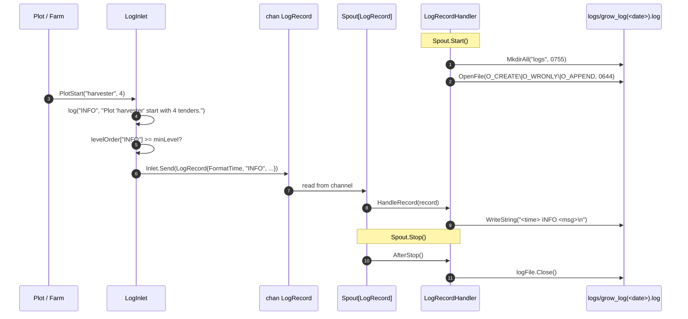

# pkg/persist/log.go

> 📅 Last Updated: 2026/09/24

## Purpose

`pkg/persist/log.go` implements asynchronous persistence for **runtime logs**: the business side sends leveled log records through `LogInlet`, and `LogRecordHandler`, scheduled by `funnel.Spout[LogRecord]`, appends them to the `logs/grow_log(YYYY-MM-DD).log` file. `LogInlet` has a built-in **minimum level threshold**, and records below the threshold are silently dropped, so that upper layers such as Plot / Farm do not have to care about filtering during high-frequency calls.

> The **lifecycle persistence** running in parallel with logging lives in [`lifecycle.md`](./lifecycle.md) / [`sqlite.md`](./sqlite.md); the two share the Inlet/Spout abstraction of `pkg/funnel` but **do not** share channels or files.

## Core Objects

### `LogRecord` — channel payload

```go
type LogRecord struct {
    FormatTime string
    Level      string
    Message    string
}
```

| Field | Description |
|------|------|
| `FormatTime` | Generated by `LogInlet` at send time with `time.Now().Format("2006-01-02 15:04:05")`; when written to the file it is joined with `Level` / `Message` by single spaces into one line |
| `Level` | Log level string (`TRACE` / `DEBUG` / `SUCCESS` / `INFO` / `WARNING` / `ERROR` / `CRITICAL`) |
| `Message` | Human-readable text provided by the business side |

### `LogRecordHandler` — consumer side (Spout handler)

```go
type LogRecordHandler struct {
    LogPath string
    logFile *os.File
}
```

It implements `funnel.RecordHandler[LogRecord]`, with the following method signatures:

| Method | Trigger | Behavior |
|------|----------|------|
| `BeforeStart() error` | Before Spout starts | Creates the `logs/` directory (permission `0755`) and opens `logs/grow_log(<YYYY-MM-DD>).log` with `O_CREATE \| O_WRONLY \| O_APPEND` (permission `0644`) |
| `HandleRecord(record LogRecord) error` | When each record arrives | `WriteString`s `record.FormatTime + " " + record.Level + " " + record.Message + "\n"` to the file as a whole |
| `AfterStop() error` | After Spout stops | Closes the `logFile` handle (without nil-ing it) |

> `LogPath` is a public field exposing the actually opened file path, which makes it easy to locate during tests or troubleshooting.

### `LogInlet` — producer side

```go
type LogInlet struct {
    funnel.Inlet[LogRecord]
    minLevel int
}
```

- It embeds `funnel.Inlet[LogRecord]` and also holds `minLevel` (that is, the numeric value of `levelOrder[level]`).
- At construction, `NewLogInlet` maps the string level to `minLevel`; an **unknown level string** is replaced with `INFO` (`minLevel = levelOrder["INFO"]`) instead of returning an error.

```go
func NewLogInlet(ch chan<- LogRecord, timeout time.Duration, level string) *LogInlet
```

### The level table `levelOrder`

```go
var levelOrder = map[string]int{
    "TRACE":    0,
    "DEBUG":    1,
    "SUCCESS":  2,
    "INFO":     3,
    "WARNING":  4,
    "ERROR":    5,
    "CRITICAL": 6,
}
```

The smaller the number, the lower the priority; the threshold `minLevel` means that only records **equal to or above** this value pass. For example, `NewLogInlet(ch, 1*time.Second, "WARNING")` is equivalent to `minLevel = 4`, and only the three kinds `WARNING` / `ERROR` / `CRITICAL` reach the file.

## Key Flows

### Directory and file layout

```text
logs/
└── grow_log(2026-09-24).log
```

- `BeforeStart` obtains the date with `time.Now().Format("2006-01-02")` and builds `logs/grow_log(YYYY-MM-DD).log`.
- `O_APPEND` makes multiple starts on the same day / writes from multiple processes on the same host append to the same file; concurrent writes are atomic at the OS level (under POSIX, `write(2)` guarantees atomicity for sizes ≤ `PIPE_BUF`, and a single log line is far below that limit).
- There is no explicit "rotation" step — once the date changes, a new file name is naturally produced, and the old file stays in place for manual archiving or external cleanup.

### Collaboration with asynchronous consumption in `pkg/funnel`



Key points:

- `Inlet.Send` reuses the `select { case ch <- : case ctx.Done(): case time.After(timeout): }` of `funnel.Inlet`, so a **full channel** returns `inlet send timeout after <d>` after `timeout`, and the caller may choose to ignore it or propagate it.
- `LogInlet.log` first evaluates `levelOrder[level] < l.minLevel`, and **returns immediately if the threshold is not met**, without triggering `Send` or producing an error.
- `LogRecordHandler` is the `funnel.RecordHandler[LogRecord]` implementation, and `HandleRecord` is invoked serially by the `spout()` goroutine inside `Spout[LogRecord]`, so lines cannot interleave within one process.

### Filtering and construction

```go
func (l *LogInlet) log(level string, message string) {
    if levelOrder[level] < l.minLevel {
        return
    }
    l.Send(LogRecord{
        FormatTime: time.Now().Format("2006-01-02 15:04:05"),
        Level:      level,
        Message:    message,
    })
}
```

`FormatTime` is generated **before sending**, ensuring that even if the channel briefly backs up, the persisted time still reflects "when it was decided to log" rather than "when it was processed".

## Business-Level Send Methods

`LogInlet` exposes 8 business methods on top of `log`, hard-coding the commonly used message formats in `pkg/persist`:

| Method | Level | Actual format | Trigger |
|------|------|----------|----------|
| `FarmStart(farmName string, structureList []string)` | `INFO` | First line `Farm '<name>' start. Graph structure:`, then each element of `structureList` **line by line** | Farm starts |
| `FarmEnd(farmName string, useTime float64)` | `INFO` | `Farm '<name>' end. Use <s>s.` | Farm ends |
| `PlotStart(plotName string, numTenders int)` | `INFO` | `Plot '<name>' start with <n> tenders.` | Plot starts |
| `PlotEnd(plotName string, useTime float64, fruitNum, weedNum int)` | `INFO` | `Plot '<name>' end. Use <s>s. <fruit> ripened, <weed> withered.` | Plot ends |
| `SeedInput(plotName, seedRepr string, seedID int)` | `DEBUG` | `In '<plot>', Seed <seedRepr> input. [<seedID>*]` | A seed enters the Plot |
| `SeedRipen(plotName, seedRepr, fruitRepr string, useTime float64, seedID, fruitID int)` | `SUCCESS` | `In '<plot>', Seed <seedRepr> ripened. Fruit is <fruitRepr>. Use <s>s. [<seedID>-><fruitID>*]` | A seed succeeds |
| `SeedWither(plotName, seedRepr string, err error, useTime float64, seedID, weedID int)` | `ERROR` | `In '<plot>', Seed <seedRepr> withered: <err>. Use <s>s. [<seedID>-><weedID>*]` | A seed finally fails |
| `SeedReplant(plotName, seedRepr string, attempt int, err error, seedID int)` | `WARNING` | `In '<plot>', Seed <seedRepr> attempt <n> withered: <err>. Replanting. [<seedID>*]` | Intermediate retry state |

> All the methods above go through `log(level, ...)` and are therefore filtered by `minLevel` as well. `FarmStart` is the only method that produces multiple lines at once.
>
> `useTime` is passed in by the caller (the business side generally uses `time.Since(start).Seconds()`), and this file does not do any timing. `seedID` / `fruitID` / `weedID` are event IDs assigned by `runtime.EventClient`.

## Public Symbol List

| Symbol | Kind | Purpose |
|------|------|------|
| `LogRecord` | Type | Channel payload |
| `LogRecordHandler` | Type | Consumer-side `funnel.RecordHandler[LogRecord]` implementation |
| `LogInlet` | Type | Producer side (embeds `funnel.Inlet[LogRecord]`, with `minLevel` filtering) |
| `NewLogInlet` | Function | Constructs `LogInlet`, mapping the string level to `minLevel`; unknown levels fall back to `INFO` |
| `(*LogInlet).FarmStart` | Method | `INFO` Farm start + graph structure line by line |
| `(*LogInlet).FarmEnd` | Method | `INFO` Farm end |
| `(*LogInlet).PlotStart` | Method | `INFO` Plot start |
| `(*LogInlet).PlotEnd` | Method | `INFO` Plot end |
| `(*LogInlet).SeedInput` | Method | `DEBUG` seed input |
| `(*LogInlet).SeedRipen` | Method | `SUCCESS` seed ripened |
| `(*LogInlet).SeedWither` | Method | `ERROR` seed withered |
| `(*LogInlet).SeedReplant` | Method | `WARNING` intermediate retry state |

> `levelOrder` and the private method `log` are package-internal implementation details and are not exposed.

## Usage Example

A minimal skeleton working together with `pkg/funnel`:

```go
package main

import (
    "context"
    "time"

    "github.com/Mr-xiaotian/CelestialGrow/pkg/funnel"
    "github.com/Mr-xiaotian/CelestialGrow/pkg/persist"
)

func main() {
    handler := &persist.LogRecordHandler{}
    spout := funnel.NewSpout[persist.LogRecord](handler, 100, time.Second)
    if err := spout.Start(); err != nil {
        panic(err)
    }

    inlet := persist.NewLogInlet(spout.GetQueue(), time.Second, "INFO")

    inlet.FarmStart("demo_farm", []string{"harvester -> packager"})
    inlet.PlotStart("harvester", 4)

    inlet.SeedInput("harvester", "{v:1}", 1)
    inlet.SeedRipen("harvester", "{v:1}", "{v:2}", 0.12, 1, 2)

    inlet.SeedInput("harvester", "{v:3}", 3)
    inlet.SeedReplant("harvester", "{v:3}", 1, context.DeadlineExceeded, 3)
    inlet.SeedWither("harvester", "{v:3}", context.DeadlineExceeded, 0.40, 3, 4)

    inlet.PlotEnd("harvester", 1.23, 1, 1)
    inlet.FarmEnd("demo_farm", 1.40)

    if err := spout.Stop(); err != nil {
        panic(err)
    }
}
```

The content of `logs/grow_log(2026-09-24).log` after running (excerpt; with `minLevel = INFO` the DEBUG line of `SeedInput` is filtered out):

```text
2026-09-24 10:00:00 INFO Farm 'demo_farm' start. Graph structure:
2026-09-24 10:00:00 INFO harvester -> packager
2026-09-24 10:00:00 INFO Plot 'harvester' start with 4 tenders.
2026-09-24 10:00:00 SUCCESS In 'harvester', Seed {v:1} ripened. Fruit is {v:2}. Use 0.12s. [1->2*]
2026-09-24 10:00:00 WARNING In 'harvester', Seed {v:3} attempt 1 withered: context deadline exceeded. Replanting. [3*]
2026-09-24 10:00:00 ERROR In 'harvester', Seed {v:3} withered: context deadline exceeded. Use 0.40s. [3->4*]
2026-09-24 10:00:00 INFO Plot 'harvester' end. Use 1.23s. 1 ripened, 1 withered.
2026-09-24 10:00:00 INFO Farm 'demo_farm' end. Use 1.40s.
```

## Notes

- **Level filtering happens on the producer side**: the `minLevel` threshold is evaluated in `LogInlet.log`, and logs below the threshold never enter the channel; adjusting the log level also shuts down the upstream `Send` calls, which saves more memory than relying on Spout-side filtering. The default construction (`"INFO"`) drops `DEBUG` logs such as `SeedInput`.
- **Unknown levels fall back to `INFO`**: `NewLogInlet(ch, d, "VERBOSE")` does not error out but sets `minLevel` to `levelOrder["INFO"]`. Note that `log` reads `levelOrder[level]` directly, so an unregistered level takes the map zero value `0` and is thus treated as the lowest priority (dropped when `minLevel > 0`) — business code should only use the 7 level names in the table above.
- **No explicit rotation**: crossing a date naturally switches files; if size-based rotation is needed, it must be implemented outside `LogRecordHandler` (not provided at present).
- **No concurrent-write protection**: `LogRecordHandler` assumes `HandleRecord` is called serially by the single goroutine of `Spout`; if you bypass `Spout` and write to the same `LogRecordHandler` from multiple goroutines, `os.File.WriteString` is still atomic at the OS level (≤ `PIPE_BUF`), but there is no explicit lock between lines, so lines can interleave in extreme cases.
- **Log directory permission `0755`**: consistent with the style of `lifecycles/<date>/`; if permissions must be tightened on a multi-user host, wrap `BeforeStart` on the outside.
- **Error propagation only comes from `HandleRecord` / `BeforeStart` / `AfterStop`**: `LogInlet` itself does **not** return errors; when `Send` fails after a timeout the error is recorded by `funnel.Inlet`, and the current business-level methods (`FarmStart` etc.) all discard the return value of `l.Send` directly.
