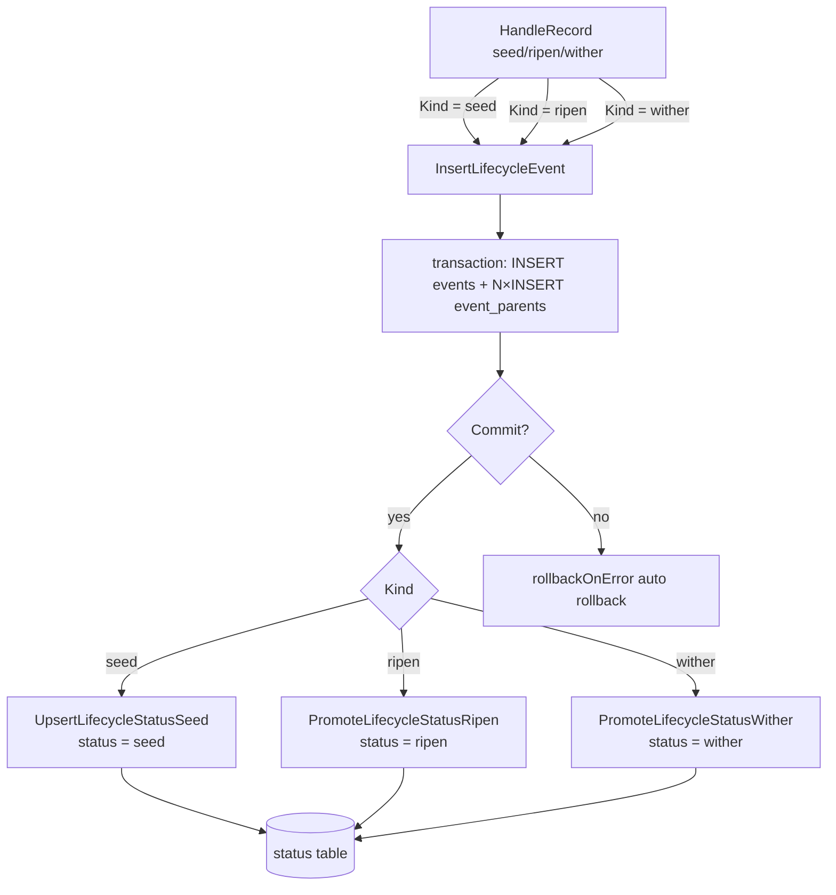
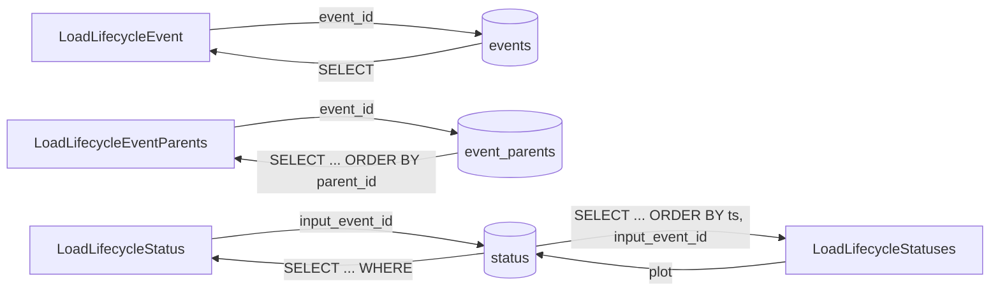

# pkg/persist/sqlite.go

> 📅 Last Updated: 2026/09/24

## Purpose

`pkg/persist/sqlite.go` centralizes the SQLite storage layer for **lifecycle persistence**, including table schema definitions, connection management, event/parent-edge insertion and read-back, status snapshot insertion and promotion, and batch queries by plot. The file itself only wraps the SQL layer and is unaware of the concurrency model of `pkg/funnel` and `pkg/runtime` — that layer reuses it in [`lifecycle.md`](./lifecycle.md) as a dependency of `LifecycleRecordHandler`.

The underlying driver is [`modernc.org/sqlite`](https://pkg.go.dev/modernc.org/sqlite) (a pure Go implementation requiring no CGo), registered with `database/sql` through the anonymous import `_ "modernc.org/sqlite"` at the top of the file.

## Core Objects

### `LifecycleEventRecord` — event table record

```go
type LifecycleEventRecord struct {
    EventID   int
    EventType string
    Plot      string
    TS        float64
}
```

| Field | Description |
|------|------|
| `EventID` | Unique event ID (primary key), usually assigned by `runtime.LocalEventClient.Emit` |
| `EventType` | Event type; `pkg/persist` itself writes `seed` / `ripen` / `wither`, but the table schema does not enforce an enumeration |
| `Plot` | Name of the plot the event belongs to; used for filtering by plot and for creating directories by plot |
| `TS` | Timestamp (seconds, floating point). Computed by `LifecycleInlet` at write time as `time.Now().UnixMilli() / 1000` |

### `LifecycleStatusRecord` — status snapshot record

```go
type LifecycleStatusRecord struct {
    InputEventID   int
    CurrentEventID int
    Plot           string
    Status         string
    SeedJSON       string
    FruitJSON      string
    WitherType     string
    WitherMessage  string
    TS             float64
}
```

| Field | Description |
|------|------|
| `InputEventID` | Seed (input) event ID (primary key), in one-to-one correspondence with `events.event_id` |
| `CurrentEventID` | The event ID currently pointed at (the most recent `seed` / `ripen` / `wither` event) |
| `Plot` | The plot it belongs to, which makes queries by plot dimension easy |
| `Status` | Status enumeration: `seed` / `ripen` / `wither` |
| `SeedJSON` | JSON-serialized text of the input seed (generated by `toLifecycleJSON`) |
| `FruitJSON` | Fruit JSON on success; initially the table default string `"null"`, overwritten by `PromoteLifecycleStatusRipen` |
| `WitherType` | Go error type string on failure (`fmt.Sprintf("%T", err)`), an empty string otherwise |
| `WitherMessage` | Error text on failure (`fmt.Sprintf("%v", err)`), an empty string otherwise |
| `TS` | Status change timestamp (seconds, floating point) |

## Table Schema

The database is created in one shot by `EnsureLifecycleSQLiteSchema` when it is first opened, and the schema string is given as the `lifecycleSQLiteSchema` constant (package-private):

```sql
CREATE TABLE IF NOT EXISTS events (
    event_id INTEGER PRIMARY KEY,
    event_type TEXT NOT NULL,
    plot TEXT NOT NULL DEFAULT '',
    ts REAL NOT NULL
);

CREATE TABLE IF NOT EXISTS event_parents (
    event_id INTEGER NOT NULL,
    parent_id INTEGER NOT NULL,
    PRIMARY KEY (event_id, parent_id),
    FOREIGN KEY (event_id) REFERENCES events(event_id) ON DELETE CASCADE,
    FOREIGN KEY (parent_id) REFERENCES events(event_id) ON DELETE CASCADE
);

CREATE TABLE IF NOT EXISTS status (
    input_event_id INTEGER PRIMARY KEY,
    current_event_id INTEGER NOT NULL,
    plot TEXT NOT NULL,
    status TEXT NOT NULL,
    seed_json TEXT NOT NULL,
    fruit_json TEXT NOT NULL DEFAULT 'null',
    wither_type TEXT NOT NULL DEFAULT '',
    wither_message TEXT NOT NULL DEFAULT '',
    ts REAL NOT NULL,
    FOREIGN KEY (input_event_id) REFERENCES events(event_id) ON DELETE CASCADE,
    FOREIGN KEY (current_event_id) REFERENCES events(event_id)
);

CREATE INDEX IF NOT EXISTS idx_events_type_ts ON events(event_type, ts);
CREATE INDEX IF NOT EXISTS idx_status_plot_status_ts ON status(plot, status, ts);
CREATE INDEX IF NOT EXISTS idx_status_current_event ON status(current_event_id);
```

| Table | Primary key | Key foreign keys / indexes | Purpose |
|----|------|-----------------|------|
| `events` | `event_id` | `(event_type, ts)` index | Stores the seed / ripen / wither events themselves |
| `event_parents` | `(event_id, parent_id)` | both `FOREIGN KEY`s cascade | Many-to-many parent-edge table describing the topology of the event DAG |
| `status` | `input_event_id` | `idx_status_plot_status_ts`, `idx_status_current_event` | The latest status snapshot of each seed: inserted as `seed`, promoted to `ripen` on ripen, promoted to `wither` on wither |

> The default value of `fruit_json` is the string `"null"` and `wither_type` / `wither_message` default to empty strings, avoiding extra branch checks caused by `NULL` text during the `seed` stage; `seed_json` and `plot` have no default value and must be provided explicitly on write.

## Connection Management

### `OpenLifecycleSQLite`

```go
func OpenLifecycleSQLite(dbPath string) (*sql.DB, error)
```

- When `dbPath == ":memory:"`, the literal is used directly as the DSN, avoiding a `file:` prefix being prepended.
- Otherwise the DSN is built as `file:<forward-slash path>` (`filepath.ToSlash`), and `sql.Open("sqlite", dsn)` is called.
- After a successful open it runs, in order:
  1. `configureLifecycleSQLite(db)`: enables WAL, downgrades synchronization to NORMAL, and enables foreign keys.
  2. `EnsureLifecycleSQLiteSchema(db)`: executes the `lifecycleSQLiteSchema` constant.
- Failure at any step rolls back: it first does `_ = db.Close()`, then returns the error to the caller (error text is wrapped internally as `set sqlite ...` / `ensure lifecycle sqlite schema: ...`).

### PRAGMA Configuration

`configureLifecycleSQLite` executes three PRAGMAs on every new connection:

| PRAGMA | Effect |
|--------|------|
| `journal_mode = WAL` | Enables Write-Ahead Logging, allowing multiple readers with a single writer concurrently, so that batch event writes do not block queries |
| `synchronous = NORMAL` | Works with WAL to reduce fsync frequency; the last transaction may be lost on a crash, but lifecycle data can be rebuilt |
| `foreign_keys = ON` | Foreign keys are off by default in SQLite; once enabled, the cascading deletes of `event_parents` / `status` take effect |

### `EnsureLifecycleSQLiteSchema`

```go
func EnsureLifecycleSQLiteSchema(db *sql.DB) error
```

Idempotently executes the `lifecycleSQLiteSchema` script; the caller may invoke it explicitly when a schema upgrade is needed, though it is usually triggered on its behalf by `OpenLifecycleSQLite`.

## Transactions and Status Writes

### Batch write of an event + parent edges

`InsertLifecycleEvent` completes the write of the event body and multiple parent edges in a single transaction, and is the only explicit transaction in this file:

```go
func InsertLifecycleEvent(db *sql.DB, eventID int, eventType string, plot string, ts float64, parentIDs []int) error
```

```go
tx, err := db.Begin()
if err != nil { ... }
defer rollbackOnError(tx)

if _, err := tx.Exec(`INSERT INTO events ...`, ...); err != nil { ... }
for _, parentID := range parentIDs {
    if _, err := tx.Exec(`INSERT INTO event_parents ...`); err != nil { ... }
}
if err := tx.Commit(); err != nil { ... }
```

- The parameters are **positional** (not a struct): the `events` row is written first, then the `event_parents` edges are written one by one in the order of `parentIDs`; when `parentIDs` is `nil`, only the event body is written.
- `rollbackOnError` is triggered by `defer` before an explicit `return`, which is equivalent to "Rollback if not Committed".
- A single `events` row plus any number of `event_parents` edges are bound to the same transaction, so the parent edges either all roll back or all commit.
- The error texts are `insert event <id>: ...`, `insert parent edge <parent>-><event>: ...`, and `commit insert lifecycle event: ...` respectively.

### Writing and promoting status snapshots

Status writing is split into two steps: "insert the initial snapshot" and "UPDATE promotion":

| Function | SQL form | Behavior |
|------|----------|------|
| `UpsertLifecycleStatusSeed(db, InputEventID, SeedJSON, Plot, TS)` | pure `INSERT` | Inserts a snapshot with `status = "seed"` and `current_event_id = input_event_id`; `fruit_json` / `wither_*` take the table defaults |
| `PromoteLifecycleStatusRipen(db, inputEventID, currentEventID, fruitJSON, ts)` | `UPDATE` | `SET current_event_id = ?, status = 'ripen', fruit_json = ?, ts = ?`, **without** changing `seed_json` or `plot` |
| `PromoteLifecycleStatusWither(db, inputEventID, currentEventID, witherType, witherMessage, ts)` | `UPDATE` | `SET current_event_id = ?, status = 'wither', wither_type = ?, wither_message = ?, ts = ?`, **without** changing `seed_json` or `plot` |

> ⚠️ **Note**: despite its name, `UpsertLifecycleStatusSeed` is actually implemented as a **pure `INSERT`** (there is no `ON CONFLICT ... DO UPDATE`). Calling it twice with the same `input_event_id` fails with a primary key conflict (error text `insert lifecycle status seed for input event <id>: ...`); retry scenarios must not rely on it to overwrite an old status.
>
> Neither `Promote*` function checks `RowsAffected`: when the target row does not exist, the `UPDATE` affects 0 rows and **does not error**, so the caller must confirm that `input_event_id` already exists.

## Public Symbol List

| Symbol | Kind | Purpose |
|------|------|------|
| `LifecycleEventRecord` | Type | Event table record struct |
| `LifecycleStatusRecord` | Type | Status snapshot struct |
| `OpenLifecycleSQLite` | Function | Opens and initializes the database (including PRAGMA + schema creation) |
| `EnsureLifecycleSQLiteSchema` | Function | Idempotently executes the schema creation script |
| `InsertLifecycleEvent` | Function | Transactionally writes an event + parent edges |
| `LoadLifecycleEvent` | Function | Reads a single event by `event_id` |
| `LoadLifecycleEventParents` | Function | Reads all parent IDs of one event (ascending by `parent_id`) |
| `UpsertLifecycleStatusSeed` | Function | Inserts the seed's initial status snapshot (`status = "seed"`) |
| `PromoteLifecycleStatusRipen` | Function | Promotes the status to `ripen` and writes `fruit_json` |
| `PromoteLifecycleStatusWither` | Function | Promotes the status to `wither` and writes `wither_type` / `wither_message` |
| `LoadLifecycleStatus` | Function | Reads one snapshot by `input_event_id` |
| `LoadLifecycleStatuses` | Function | Reads all snapshots by `plot` (ordered by `ts, input_event_id`) |

> `configureLifecycleSQLite` and `rollbackOnError` are package-private helper functions; `lifecycleSQLiteSchema` is the package-private schema creation script constant.

## Key Flows

### Write path



### Query path



## Usage Example

A typical way to use this layer directly (without going through `LifecycleRecordHandler`):

```go
package main

import (
    "fmt"

    "github.com/Mr-xiaotian/CelestialGrow/pkg/persist"
)

func main() {
    db, err := persist.OpenLifecycleSQLite("./lifecycles/demo.sqlite3")
    if err != nil {
        panic(err)
    }
    defer db.Close()

    // 1. 写入 seed 事件（无父边）
    if err := persist.InsertLifecycleEvent(db, 1, "seed", "stage_a", 1.0, nil); err != nil {
        panic(err)
    }

    // 2. 写入 ripen 事件 + 父边 [1]
    if err := persist.InsertLifecycleEvent(db, 2, "ripen", "stage_a", 2.0, []int{1}); err != nil {
        panic(err)
    }

    // 3. 插入种子初始快照
    if err := persist.UpsertLifecycleStatusSeed(db, 1, `{"v":42}`, "stage_a", 1.0); err != nil {
        panic(err)
    }

    // 4. 晋升为 ripen
    if err := persist.PromoteLifecycleStatusRipen(db, 1, 2, `{"v":84}`, 2.0); err != nil {
        panic(err)
    }

    // 5. 回读事件与父边
    event, err := persist.LoadLifecycleEvent(db, 2)
    if err != nil {
        panic(err)
    }
    parents, err := persist.LoadLifecycleEventParents(db, 2)
    if err != nil {
        panic(err)
    }
    fmt.Printf("event=%d type=%s parents=%v\n", event.EventID, event.EventType, parents)

    // 6. 查询整个 plot 的快照
    statuses, err := persist.LoadLifecycleStatuses(db, "stage_a")
    if err != nil {
        panic(err)
    }
    for _, s := range statuses {
        fmt.Printf("seed=%s status=%s fruit=%s wither=%s/%s\n",
            s.SeedJSON, s.Status, s.FruitJSON, s.WitherType, s.WitherMessage)
    }
}
```

## Notes

- **`UpsertLifecycleStatusSeed` is not a real upsert**: see "Writing and promoting status snapshots" above. Before retrying the same seed, the primary key conflict must be handled manually, or the existing row must be updated through the `Promote*` family instead.
- **`Promote*` silently succeeds on a missing row**: the `UPDATE` returns no error when it matches nothing, so a status may "look like it was written successfully while nothing changed in the database".
- **Relies on foreign keys being enabled**: the cascading deletes of `status` and `event_parents` depend on `foreign_keys = ON`, which `OpenLifecycleSQLite` guarantees to enable; if a caller bypasses `OpenLifecycleSQLite` and calls `sql.Open` itself, it must execute the PRAGMA on its own.
- **WAL side effects**: after WAL is enabled, two auxiliary files `*.sqlite3-wal` / `*.sqlite3-shm` appear in the same directory; to back up or transfer a `.sqlite3` file, call `db.Close()` first so the WAL content is flushed, or use the SQLite backup API.
- **The timestamp is a floating point in seconds**: `TS` comes from `float64(now) / 1000` and is expressed in seconds; the precision is sufficient for batch comparison and sorting, but floating-point comparison needs care for events densely packed across milliseconds.
- **The status table has no independent foreign key cascade**: the `FOREIGN KEY` on `status.current_event_id` has no `ON DELETE CASCADE`, and only `status.input_event_id` cascades — this prevents an accidentally deleted `current_event_id` from taking the whole status record with it.
- **`EventType` is not enforced**: `events.event_type` has no CHECK constraint, so adding a new type (such as an intermediate state of a custom plot) only requires agreeing on a new string at the producer; `pkg/persist` itself only writes `seed` / `ripen` / `wither`.
- **Paths and DSN**: the file path is converted by `filepath.ToSlash` and then joined into `file:...`, avoiding DSN parsing problems caused by backslashes on Windows; `:memory:` goes through the literal branch and is not rewritten.
