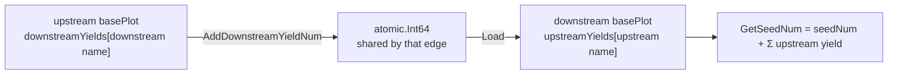

# pkg/plot/counter.go

> 📅 Last Updated: 2026/09/24

`counter.go` defines `Counter`: a concurrency-safe triple counter for "seeds / fruits / weeds", which additionally maintains **per-edge tracked** upstream and downstream yield counters.

Through the embedded `*Counter`, `basePlot` directly obtains methods such as `AddSeedNum` / `GetCompleted`, which avoids locking in the scenario where several tend goroutines write while observers read at the same time.

## Purpose

- Track the current plot's "total number of seeds", "successful output (fruits)", and "failed output (weeds)";
- Record **per edge** both "the number of yields this plot sent to a given downstream" (`downstreamYields`) and "the number of yields a given upstream sent to this plot" (`upstreamYields`);
- In `GetSeedNum`, merge the seeds sown locally with the yields transferred in from all upstreams into the "true total input count", for use by observers and `IsFinish`.

## Core Objects

### The `Counter` struct

```go
type Counter struct {
	seedNum  atomic.Int64
	fruitNum atomic.Int64
	weedNum  atomic.Int64

	upstreamYields   map[string]*atomic.Int64
	downstreamYields map[string]*atomic.Int64
}
```

| Field | Type | Meaning |
|------|------|------|
| `seedNum` | `atomic.Int64` | Number of seeds sown **locally** (incremented only by `AddSeedNum`) |
| `fruitNum` | `atomic.Int64` | Number of successfully produced fruits |
| `weedNum` | `atomic.Int64` | Number of weeds produced by failures |
| `upstreamYields` | `map[string]*atomic.Int64` | Upstream plot name → the yield counter pointer **shared by that edge**; `GetSeedNum` adds these values up |
| `downstreamYields` | `map[string]*atomic.Int64` | Downstream plot name → the yield counter pointer **shared by that edge**; incremented by this plot's `ripenSeed` through `AddDownstreamYieldNum` |

> The pointers in `upstreamYields` and `downstreamYields` are **the two ends of the same set of objects**: `ConnectTo` creates a new `*atomic.Int64` for each edge, the upstream puts it into its own `downstreamYields`, and the downstream puts it into its own `upstreamYields`. Therefore what the upstream increments is exactly the real-time output of that edge as read by the downstream, and different edges do not interfere with each other.

## Public Methods

### Construction

#### `NewCounter() *Counter`

Creates a counter: the three atomic values are all zero and both maps are initialized to empty (**not nil**), so calling `GetSeedNum` immediately after creation will not panic.

### Counter registration

| Method | Signature | Behavior |
|------|------|------|
| `SetUpstreamYieldCounter` | `func (c *Counter) SetUpstreamYieldCounter(name string, yieldCounter *atomic.Int64)` | Writes `name` (the upstream plot name) and the edge counter into `upstreamYields`, for `GetSeedNum` to aggregate |
| `SetDownstreamYieldCounter` | `func (c *Counter) SetDownstreamYieldCounter(name string, yieldCounter *atomic.Int64)` | Writes `name` (the downstream plot name) and the edge counter into `downstreamYields`, for `AddDownstreamYieldNum` to increment |

> The two are usually called in pairs by `basePlot.ConnectTo`, and business code generally does not need to use them directly. Registering the same edge name again **overwrites** the old pointer (the old counter is discarded).

### Adders (increment)

| Method | Signature | Behavior |
|------|------|------|
| `AddSeedNum` | `func (c *Counter) AddSeedNum(addNum int)` | Atomically adds `addNum` to `seedNum` |
| `AddFruitNum` | `func (c *Counter) AddFruitNum(addNum int)` | Atomically adds `addNum` to `fruitNum` |
| `AddWeedNum` | `func (c *Counter) AddWeedNum(addNum int)` | Atomically adds `addNum` to `weedNum` |
| `AddDownstreamYieldNum` | `func (c *Counter) AddDownstreamYieldNum(name string, addNum int)` | Atomically adds `addNum` to `downstreamYields[name]` |

### Getters (read-only)

| Method | Signature | Return value |
|------|------|--------|
| `GetSeedNum` | `func (c *Counter) GetSeedNum() int` | `seedNum` + `Σ upstreamYields[*].Load()`, i.e. "the total number of seeds this plot will process / has processed" |
| `GetFruitNum` | `func (c *Counter) GetFruitNum() int` | Number of successful fruits |
| `GetWeedNum` | `func (c *Counter) GetWeedNum() int` | Number of failed weeds |
| `GetCompleted` | `func (c *Counter) GetCompleted() int` | `GetFruitNum() + GetWeedNum()` |

### Predicates

| Method | Signature | Meaning |
|------|------|------|
| `IsFinish` | `func (c *Counter) IsFinish() bool` | `GetCompleted() == GetSeedNum()`; there is no call site in the current repository, so it is provided as a reserved check |

## Collaboration with nodes

`Counter` is embedded by `basePlot`, and the nodes use it to accomplish task statistics and upstream/downstream synchronization:

| Call site | Action |
|--------|------|
| `basePlot.Seed` | `AddSeedNum(1)` (1 sown locally) |
| `basePlot.ConnectTo` | Creates the `*atomic.Int64` for the edge, `p.SetDownstreamYieldCounter(nextName, c)` + `next.SetUpstreamYieldCounter(p.GetName(), c)` |
| `basePlot.witherSeed` | `AddWeedNum(1)` + triggers `reportProgress` |
| `Plot.ripenSeed` | `AddFruitNum(1)` + `AddDownstreamYieldNum(nextPlot, 1)` for **every** downstream |
| `SplitPlot.ripenSeed` | `AddFruitNum(1)` + `AddDownstreamYieldNum(nextPlot, len(fruits))` for every downstream |
| `RoutePlot.ripenSeed` | `AddFruitNum(1)` + `AddDownstreamYieldNum(nextPlot, 1)` for **every routed-to** downstream |
| `basePlot.reportProgress` / `notifyStart` / `notifyFinish` | Reads `GetCompleted()` / `GetSeedNum()` and calls back into `observer.Observer` |

Data flow illustration:



## Notes

- `AddDownstreamYieldNum` performs no existence check: when `name` has not been registered it obtains a `nil` `*atomic.Int64` and calls `Add` on it directly, thereby **panicking**. Therefore the incrementing side must always be paired with the registration performed by `ConnectTo` (`Plot` / `SplitPlot` / `RoutePlot` all increment only on already-connected targets).
- `seedNum`, `fruitNum`, `weedNum`, and the various yield counters are **not an atomic snapshot at the same instant**, so `IsFinish` and observer progress may deviate transiently under concurrency and will eventually stabilize.
- `upstreamYields` is only read by `GetSeedNum`; `Counter` itself never writes data coming from upstream — the upstream increments its own yield count, and this Counter merely holds the same pointer.
- `AddSeedNum` / `AddFruitNum` / `AddWeedNum` / `AddDownstreamYieldNum` accept `int` and convert it to `int64` internally; passing a negative number makes the count go backwards, which the business layer should avoid.
