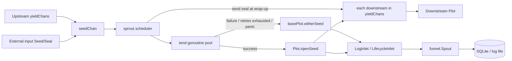

# pkg/plot/plot.go

> 📅 Last Updated: 2026/09/24

`plot.go` defines `Plot[S, F]`, the most commonly used node type in `pkg/plot`: it packages "receive seed → run cultivator concurrently → produce fruit → forward downstream" into a connectable, observable, retryable generic node.

`Plot` itself is very thin—it only handles the most basic success semantics (**one seed grows into one fruit, and that fruit is forwarded as-is to every connected downstream**), while all the other common capabilities (state machine, concurrent scheduling, retry, seal propagation, log/lifecycle wiring, standalone batch runs) are provided by the embedded `basePlot`; see `plot_base.md` for details.

## Role

- Exposes the generic concurrent node `Plot[S, F]` (`S` is the seed type and `F` is the fruit type).
- Reuses the shared skeleton through the embedded `*basePlot[S, F, F]`, so that `Plot` satisfies the `PlotNode` interface and can be registered, connected, and scheduled by `pkg/farm`.
- Injects the success hook `ripenSeed`: it updates counters, writes logs and lifecycle records, and forwards one yield to each downstream.

## Core objects

### The `Plot[S, F]` struct

```go
type Plot[S any, F any] struct {
	*basePlot[S, F, F]
}
```

`Plot` has no fields of its own; all state and capabilities come from `*basePlot[S, F, F]`.

| Generic parameter | Meaning |
|---------|------|
| `S` | Seed input type, i.e. the parameter type of `cultivator` |
| `F` | Fruit output type, i.e. the return type of `cultivator` |

The third generic parameter of `basePlot` (the downstream yield type `Y`) is instantiated as `F` in this type, i.e. **the fruit type of this node is the same as the type it outputs downstream**. The three node kinds compare as follows:

| Node | Underlying `basePlot` | Result type (fruit) | Downstream yield type `Y` |
|------|----------------|------------------|--------------------|
| `Plot[S, F]` | `basePlot[S, F, F]` | `F` | `F` |
| `SplitPlot[S, F]` | `basePlot[S, []F, F]` | `[]F` | `F` |
| `RoutePlot[S, Y]` | `basePlot[S, map[string]Y, Y]` | `map[string]Y` | `Y` |

> `ConnectTo` uses a type assertion to check whether "the upstream's `Y`" and "the downstream's `S`" match. Therefore `Plot[S, F]` can only connect to a downstream node with `S == F`; otherwise the connection immediately returns a type-incompatibility error.

## Public functions

### `NewPlot[S, F](name string, cultivator func(S) (F, error), opts ...Option) *Plot[S, F]`

Creates a `Plot` instance.

| Parameter | Meaning |
|------|------|
| `name` | plot name, must be unique within a `Farm` |
| `cultivator` | cultivation function for a single seed, returns a fruit or an error |
| `opts` | optional configuration (see `option.md`), applied in order after `defaultOptions()` |

Implementation notes:

1. First declare `var p *Plot[S, F]`, then build the shared skeleton with `newBasePlot[S, F, F]`, and finally assign `base` to `p`;
2. The `ripenSeed` hook passed to `newBasePlot` is a closure that calls `p.ripenSeed(...)` internally. It captures `p` before it has been assigned, but the closure is only invoked on the `sprout` / `tend` path after `StartAsync`, by which time `p` is definitely assigned;
3. Channel allocation, the default `EventClient`, `context`, and `Counter` initialization are all done inside `newBasePlot` (see `plot_base.md`).

### `ripenSeed(seedPayload runtime.Payload[S], fruit F, startTime time.Time)` (unexported)

The success path implementation of `Plot`, written as a hook into the `basePlot.ripenSeed` field and called by `basePlot.tend` when `cultivator` returns a `nil` error. Steps:

1. `AddFruitNum(1)` and call `reportProgress()`, triggering all `Observer.OnProgress`;
2. Take `seedPayload.EventID` as `seedID` and allocate a `fruitID` via `eventClient.Emit("fruit", []int{seedID})`;
3. Write the log `logInlet.SeedRipen(...)` and the lifecycle record `lifecycleInlet.SeedRipen(...)` (the parent event is `seedID`, the fruit is `fruit`; in the log, seed is truncated to 50 runes and fruit to 25 runes);
4. Iterate over `p.yieldChans` (`downstream plot name → that downstream's seed channel`), and for **every** connected downstream:
   - `AddDownstreamYieldNum(nextPlot, 1)`: this node contributes 1 yield to that downstream;
   - `eventClient.Emit("seed", []int{fruitID})` allocates the downstream seed event ID (the parent event is `fruitID`);
   - write `logInlet.SeedInput` and `lifecycleInlet.SeedInput` (the parent event is `fruitID`);
   - send `runtime.Payload[F]{Value: fruit, EventID: downstreamSeedID}` to that downstream channel.

> Semantics: the success path of `Plot` is "**one fruit is forwarded as one downstream yield**", and it forwards **once to every connected downstream** (broadcast). If you need "targeted forwarding by destination", use `RoutePlot` (see `plot_route.md`); if you need "one seed split into multiple downstream yields", use `SplitPlot` (see `plot_split.md`).

## Key flows

### Data flow



### From seed to downstream yield

After `basePlot.tend` calls `cultivator(seed)`, it branches on the result:

- **Success** (`err == nil`): calls the injected `ripenSeed`, i.e. the implementation in this file;
- **Failure** (retries exhausted, `retryIf` rejected, or `panic` caught by `recover`): goes through `basePlot.witherSeed` and **forwards to no downstream**.

For the retry loop, seal propagation, concurrency model, and other common logic, see `plot_base.md`.

## Usage examples

### Standalone mode

```go
package main

import (
	"fmt"

	"github.com/Mr-xiaotian/CelestialGrow/pkg/plot"
)

func main() {
	p := plot.NewPlot("double",
		func(seed int) (int, error) { return seed * 2, nil },
		plot.WithTenders(4),
	)

	p.Run([]int{1, 2, 3, 4, 5})

	records, err := p.Harvest()
	if err != nil {
		panic(err)
	}
	for _, r := range records {
		fmt.Println(r.SeedJSON, r.Status, r.FruitJSON)
	}
}
```

### With retry and log level

```go
package main

import (
	"errors"
	"time"

	"github.com/Mr-xiaotian/CelestialGrow/pkg/plot"
)

var errPermanent = errors.New("permanent")

func main() {
	p := plot.NewPlot("flaky",
		func(seed int) (int, error) {
			if seed == 0 {
				return 0, errPermanent
			}
			return seed * 2, nil
		},
		plot.WithTenders(2),
		plot.WithMaxRetries(3),
		plot.WithRetryDelay(func(attempt int) time.Duration {
			return time.Duration(attempt) * 100 * time.Millisecond
		}),
		plot.WithRetryIf(func(err error) bool {
			return !errors.Is(err, errPermanent)
		}),
		plot.WithLogLevel("DEBUG"),
	)

	p.Run([]int{0, 1, 2})
}
```

> Progress observers are registered via `p.AddObserver(myObserver{})` (`myObserver` must implement `observer.Observer`'s `OnStart` / `OnProgress` / `OnFinish`); see "Observer hooks" in `plot_base.md`.

### Farm mode

Farm mode does not call `Run` / `Seed` / `Seal` directly; instead it hands the `Plot` to `pkg/farm` as a `plot.PlotNode`:

```go
package main

import (
	"fmt"

	"github.com/Mr-xiaotian/CelestialGrow/pkg/farm"
	"github.com/Mr-xiaotian/CelestialGrow/pkg/plot"
)

func main() {
	double := plot.NewPlot("double", func(seed int) (int, error) {
		return seed * 2, nil
	}, plot.WithTenders(2))

	addOne := plot.NewPlot("addOne", func(seed int) (int, error) {
		return seed + 1, nil
	}, plot.WithTenders(2))

	f := farm.NewFarm("demo", "INFO")
	if err := f.AddPlot(double, addOne); err != nil {
		panic(err)
	}
	if err := f.Connect([]plot.PlotNode{double}, []plot.PlotNode{addOne}); err != nil {
		panic(err)
	}
	if err := f.Run(map[string][]any{"double": {1, 2, 3}}); err != nil {
		panic(err)
	}

	fmt.Println("done")
}
```

At this point `BindInlet` is called uniformly by `Farm.Run`, and `StartSpouts` / `StopSpouts` are not executed (the Farm holds the global spout itself).

## Test focus

The behavior of `plot.go` is covered by `plot_harvest_test.go` (result snapshots) and `plot_retry_test.go` (retry semantics); for case-by-case explanations see `plot_harvest_test.md` and `plot_retry_test.md`.

## Notes

- `NewPlot` uses `runtime.NumCPU()` as the concurrency level and channel buffer by default; I/O-intensive workloads can tune this with `WithTenders` / `WithChanSize`.
- `Run` is a **blocking** call; it returns only after all seeds have been processed.
- When the upstream `F` and the downstream `S` types do not match, `ConnectTo` returns an error immediately rather than panicking; it is recommended to check the error after `Farm.AddPlot` / `Farm.Connect`.
- `Plot` provides no routing or splitting capability; its forwarding is "broadcast to all downstreams", so do not use it for targeted delivery.
