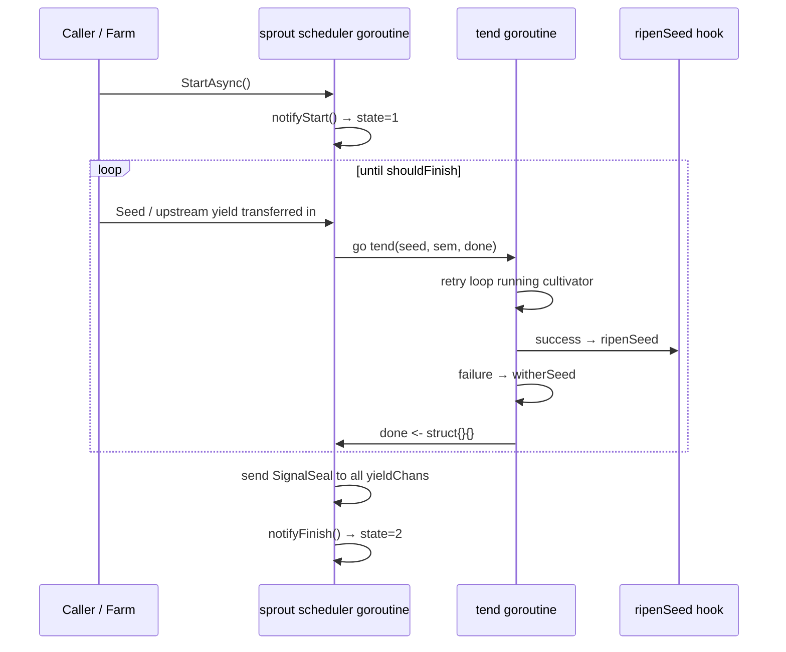

# pkg/plot/plot_base.go

> 📅 Last Updated: 2026/09/24

`plot_base.go` is the **shared runtime skeleton** of `pkg/plot`. It defines two things:

1. The `PlotNode` interface—after erasing generics, it lets `pkg/farm` uniformly hold nodes with different seed/fruit types;
2. The `basePlot[S, F, Y]` generic struct—the base type embedded by all concrete nodes (`Plot`, `SplitPlot`, `RoutePlot`).

`basePlot` carries almost all the common responsibilities: the state machine, concurrent scheduling (`sprout` + `tend`), retries, seal propagation, upstream/downstream connections, log and lifecycle wiring, standalone batch runs, and result export. The only difference between nodes is expressed by the `ripenSeed` hook injected at construction time, so each of the three node kinds only needs to implement a single `ripenSeed` method.

## Role

- Defines the `PlotNode` interface as the contract between `Farm` and a plot.
- Provides the shared `basePlot` skeleton so that `Plot` / `SplitPlot` / `RoutePlot` do not each reimplement scheduling, retries, and persistence wiring.
- Decouples "seed type", "result type", and "downstream yield type" through three generic parameters, so the same skeleton can support the three success semantics: broadcast (`Plot`), split (`SplitPlot`), and routing (`RoutePlot`).

## Core objects

### The `PlotNode` interface

```go
type PlotNode interface {
	GetName() string
	GetState() int32
	GetSeedChanAny() any

	ConnectTo(next PlotNode) error
	SetUpstreamYieldCounter(name string, yieldCounter *atomic.Int64)
	BindInlet(logChan chan<- persist.LogRecord, lifecycleChan chan<- persist.LifecycleRecord)
	SetEventClient(eventClient runtime.EventClient)

	StartAsync()
	WaitAsync()
	SeedAny(seed any) error
	Seal()
}
```

| Method | Purpose |
|------|------|
| `GetName()` | Returns the plot name (must be unique within a `Farm`) |
| `GetState()` | Returns the state: `0=idle`, `1=running`, `2=done` |
| `GetSeedChanAny()` | Exposes `seedChan` as `any` so that `ConnectTo` can perform a type assertion |
| `ConnectTo(next)` | Establishes the "this node's yield → downstream seed" connection and validates the types |
| `SetUpstreamYieldCounter(name, counter)` | Called by the **upstream** when wiring, registering the yield counter shared by that edge on this node |
| `BindInlet(logChan, lifecycleChan)` | Binds the log and lifecycle record channels |
| `SetEventClient(eventClient)` | Injects the event ID allocator (`Farm` injects the same client uniformly) |
| `StartAsync()` / `WaitAsync()` | Starts the scheduler asynchronously / blocks until the background goroutine exits |
| `SeedAny(seed)` | Sows a single seed as `any`; used by `Farm` to inject initial tasks |
| `Seal()` | Sends the external termination signal |

> The yield counter is not exposed on the interface: `ConnectTo` internally calls both `SetDownstreamYieldCounter` (upstream side) and `SetUpstreamYieldCounter` (downstream side), and allocates an independent counter for **each edge**.

### The `basePlot[S, F, Y]` struct

```go
type basePlot[S any, F any, Y any] struct {
	name       string
	cultivator func(S) (F, error)
	ripenSeed  func(seedPayload runtime.Payload[S], fruit F, startTime time.Time)
	plotOptions

	seedChan   chan runtime.Payload[S]
	yieldChans map[string]chan runtime.Payload[Y]

	eventClient runtime.EventClient
	observers   []observer.Observer

	logSpout       *funnel.Spout[persist.LogRecord]
	lifecycleSpout *funnel.Spout[persist.LifecycleRecord]
	logInlet       *persist.LogInlet
	lifecycleInlet *persist.LifecycleInlet

	ctx    context.Context
	cancel context.CancelFunc
	wg     sync.WaitGroup
	state  atomic.Int32 // 0=idle, 1=running, 2=done
	*Counter
}
```

| Generic parameter | Meaning |
|---------|------|
| `S` | Seed input type, i.e. the parameter type of `cultivator` |
| `F` | The **result** type of this node, i.e. the return type of `cultivator` (different for `Plot`/`SplitPlot`/`RoutePlot`) |
| `Y` | The yield type output downstream; must match the `S` of the downstream node |

| Field | Meaning |
|------|------|
| `name` | plot name |
| `cultivator` | cultivation function, returns this node's result type `F` |
| `ripenSeed` | success hook, injected by the concrete node; its signature is fixed as `(seedPayload, fruit F, startTime)` |
| `plotOptions` | embedded optional configuration (concurrency, buffer, retry policy, log level), see `option.md` |
| `seedChan` | seed input channel, capacity = `WithChanSize`; shared by data and control signals (`SignalSeal`) |
| `yieldChans` | `downstream plot name → that downstream's seed channel`, populated by `ConnectTo` |
| `eventClient` | in-process event ID allocator, defaults to `runtime.NewLocalEventClient()` |
| `observers` | progress observer list, appended by `AddObserver` |
| `logSpout` / `lifecycleSpout` | local log/lifecycle consumers in standalone mode, created only by `Run` |
| `logInlet` / `lifecycleInlet` | senders that asynchronously write log and lifecycle events, created by `BindInlet` |
| `ctx` / `cancel` | derived from `context.WithCancel(context.Background())`, used for internal forced termination |
| `wg` | joins the background goroutines started by `StartAsync` |
| `state` | state atomic variable (0/1/2) |
| `*Counter` | seed/fruit/weed counts and upstream/downstream yield counts (see `counter.md`) |

## Public methods

### Construction (unexported)

#### `newBasePlot[S, F, Y](name, cultivator, ripenSeed, opts...) *basePlot[S, F, Y]`

Called only by `NewPlot` / `NewSplitPlot` / `NewRoutePlot` in the same package. Steps:

1. Take `defaultOptions()` and apply `opts` in order;
2. Derive `ctx` / `cancel` from `context.WithCancel(context.Background())`;
3. Allocate `seedChan` (capacity `chanSize`) and an empty `yieldChans`;
4. Initialize `eventClient = runtime.NewLocalEventClient()`;
5. Initialize `Counter = NewCounter()`.

### Observers

#### `AddObserver(observer observer.Observer)`

Appends a progress observer. `OnStart` / `OnProgress` / `OnFinish` are invoked at `notifyStart` / `reportProgress` / `notifyFinish` respectively (see `pkg/observer` for the interface contract).

### Initialization (shared by standalone / Farm)

| Method | Purpose | When to call |
|------|------|----------|
| `BindInlet(logChan, lifecycleChan)` | Creates two inlets with `persist.NewLogInlet(logChan, time.Second, logLevel)` and `persist.NewLifecycleInlet(lifecycleChan, time.Second)` | Before `StartAsync`; called by `Run` in standalone mode and uniformly by `Farm.Run` in Farm mode |
| `StartSpouts()` | Starts the local `logSpout` / `lifecycleSpout` | standalone mode only |
| `StopSpouts()` | Stops the local spouts and flushes to disk | standalone mode only |
| `SetEventClient(eventClient)` | Replaces the event ID allocator | optional (local client by default) |

> `StartSpouts` / `StopSpouts` dereference `p.logSpout` / `p.lifecycleSpout` directly, so **they must first go through `Run` to create the spouts**; otherwise they panic.

### Graph connection

#### `ConnectTo(next PlotNode) error`

Connects this node's yield channel to a downstream seed channel:

1. Assert `next.GetSeedChanAny().(chan runtime.Payload[Y])`; on failure, return `plot %q yield type is incompatible with plot %q seed type`;
2. `p.yieldChans[next.GetName()] = seedChan`;
3. Create a new `*atomic.Int64` as the yield counter **dedicated to this edge**:
   - `p.SetDownstreamYieldCounter(next.GetName(), downstreamYield)` (upstream side, used by `AddDownstreamYieldNum`);
   - `next.SetUpstreamYieldCounter(p.GetName(), downstreamYield)` (downstream side, used by `GetSeedNum` aggregation).

> The meaning of **per-edge tracking**: the same upstream/downstream pair shares one counter, and counters of different edges do not interfere. Each time the upstream forwards one yield it increments via `AddDownstreamYieldNum`, and the downstream's `GetSeedNum` accumulates the counters of all upstreams, yielding the real total of "locally sown seeds + seeds actually transferred in from each upstream".
>
> If the downstream did not register the edge through `ConnectTo` (for example, when `RoutePlot` routes to a target that is not connected), the upstream does not write to any counter—`ConnectTo` guarantees that registration and increment always come in pairs, so there is no nil-pointer write.

### State queries

| Method | Purpose |
|------|------|
| `GetName() string` | Returns the plot name |
| `GetState() int32` | Returns the state code (0=idle / 1=running / 2=done) |
| `GetSeedChanAny() any` | Exposes `seedChan` so that `ConnectTo` can perform a type assertion |

### Input and asynchronous execution

| Method | Purpose |
|------|------|
| `SeedAny(seed any) error` | Type-asserts to `S`; on failure returns `plot %q seed type mismatch: got %T`, on success forwards to `Seed` |
| `Seed(seed S)` | Sows a single external seed: allocates the seed event ID (no parent event), writes the `SeedInput` log and lifecycle record, posts `Payload[S]{Value: seed, EventID: seedID}` to `seedChan`, and finally calls `AddSeedNum(1)` |
| `Seal()` | Allocates the seal event ID and posts `Payload[S]{Signal: SignalSeal, Source: sourceInput, EventID: sealID}` to `seedChan`, triggering the **forced termination** semantics |
| `StartAsync()` | Starts one background goroutine through `p.wg.Go`: first `logInlet.PlotStart`, then `notifyStart` (state=1), the `sprout` main loop, `notifyFinish` (state=2), and finally `logInlet.PlotEnd` |
| `WaitAsync()` | `p.wg.Wait()`, blocking until the background goroutine exits |

> Both `Seed` / `Seal` **write to the channel synchronously**: if the `seedChan` buffer is full and no tender is consuming, the caller blocks.
> `Seed` records `parentIDs` as `nil` (the log side does not distinguish the source, and the lifecycle side has no parent event either), so seeds injected externally and seeds transferred in from upstream can be told apart in the lifecycle table by whether a parent event exists.

### Standalone execution

#### `Run(seeds []S)`

The one-stop entry point for standalone mode (blocking):

1. Creates the local `logSpout` (`&persist.LogRecordHandler{}`, batch 100, flush every 1s) and `lifecycleSpout` (`&persist.LifecycleRecordHandler{}`, likewise batch 100, flush every 1s);
2. `BindInlet(logSpout.GetQueue(), lifecycleSpout.GetQueue())`;
3. `StartSpouts()`, and `defer StopSpouts()` to guarantee a flush on exit;
4. `StartAsync()`;
5. Injects `seeds` one by one via `Seed(seed)`;
6. `Seal()` declares that there is no more external input;
7. `WaitAsync()` blocks until everything finishes.

### Result export

#### `Harvest() ([]persist.LifecycleStatusRecord, error)`

Reads the task status snapshot that the current plot has persisted:

- `lifecycleSpout == nil` → returns `plot %q lifecycle spout is nil` (i.e. `Run` was not called, or in Farm mode the query should be made from the Farm side);
- asserts that `lifecycleSpout.Handler()` implements `LoadStatuses(plotName string) ([]persist.LifecycleStatusRecord, error)`; if not, returns `plot %q lifecycle handler does not support status queries`;
- otherwise calls `LoadStatuses(p.name)` and passes through the result and the error.

> Key fields of the returned `LifecycleStatusRecord`: `Status` (`ripen` / `wither`), `SeedJSON`, `FruitJSON`, `WitherType`, `WitherMessage`.

## Key flows

### Internal pipeline and concurrency model



- `StartAsync` starts exactly one goroutine (`sprout`), and its exit is joined by `wg`;
- `sprout` limits concurrency with a `sem` semaphore of capacity `numTenders`: when full, `sem <- struct{}{}` blocks, creating backpressure on the scheduling side;
- Each seed spawns one `tend` goroutine, and the `inFlight` count is incremented and decremented through the `done` channel;
- Before returning, `tend` always does `<-sem` (releasing the token) and `done <- struct{}{}`.

### The `sprout` main loop

```go
sem := make(chan struct{}, p.numTenders)
done := make(chan struct{}, p.numTenders)
sealedFrom := make(map[string]int, len(p.upstreamYields))

ctxCancel := false
inputClosed := false
inFlight := 0
shouldFinish := func() bool {
	return ctxCancel || (inputClosed && inFlight == 0)
}
```

The three `select` branches:

| Branch | Behavior |
|------|------|
| `seed := <-p.seedChan` | If `Signal == SignalSeal` → `inputClosed = p.markSealed(seed.Source, seed.EventID, sealedFrom)`; otherwise acquire the semaphore, `inFlight++`, `go p.tend(...)` |
| `<-done` | `inFlight--` |
| `<-p.ctx.Done()` | `ctxCancel = true` (internal cancellation, forced wrap-up) |

When `shouldFinish()` becomes true it wraps up: it collects the seal event IDs of the upstreams recorded in `sealedFrom` into `patents`, allocates `sealID` via `eventClient.Emit("seal", patents)`, then sends `Payload[Y]{Signal: SignalSeal, Source: p.name, EventID: sealID}` to **all** `yieldChans`, and finally returns.

### Input closing and seal propagation

The decision order in `markSealed(source string, sealID int, sealedFrom map[string]int) bool`:

| Condition | Result |
|------|------|
| `source == sourceInput` (external `Seal()`) | Records it in `sealedFrom` and **returns `true` immediately**—forced termination, no longer waiting for other upstreams |
| `source == ""` | Returns `false`, ignored |
| `source` is not in `p.upstreamYields` (unregistered upstream) | Returns `false`, ignored |
| Other registered upstreams | Records it in `sealedFrom` and returns `len(sealedFrom) == len(p.upstreamYields)` |

That is: the input is considered closed only once seals from **all** registered upstreams have arrived, whereas a single external `Seal()` closes it on its own.

### Failure path `witherSeed`

```go
func (p *basePlot[S, F, Y]) witherSeed(seedPayload runtime.Payload[S], err error, startTime time.Time)
```

1. `AddWeedNum(1)` and `reportProgress()`;
2. `eventClient.Emit("weed", []int{seedID})` allocates `weedID`;
3. Writes `logInlet.SeedWither(...)` and `lifecycleInlet.SeedWither(...)` (the parent event is `seedID`);
4. Does **not** forward to any downstream.

### Retry loop `tend`

```go
for attempt := 1; attempt <= p.maxRetries+1; attempt++ {
	fruit, err = p.cultivator(seed)
	if err == nil {
		break
	}
	if !p.retryIf(err) {
		break
	}
	if attempt <= p.maxRetries {
		p.logInlet.SeedReplant(p.name, seedRepr, attempt, err, seedID)
	}
	time.Sleep(p.retryDelay(attempt))
}
```

| Scenario | Behavior |
|------|------|
| `cultivator` returns `nil` | Breaks immediately and enters `ripenSeed` |
| Returns an err and `retryIf(err) == false` | Breaks immediately and enters `witherSeed` (no further retries) |
| `attempt <= maxRetries` | Writes the `SeedReplant` log (including the attempt index), then `Sleep(retryDelay(attempt))` |
| Still failing when `attempt == maxRetries+1` | Does not write `SeedReplant` (the last attempt has no "retry" semantics) and enters `witherSeed` |
| `cultivator` panics | Caught by `defer recover` and turned into a `cultivator panic: %v` error that goes through `witherSeed` (when the panic happens inside the loop there are no further retries, since the `recover` in the `defer` sits outside the loop) |

### The success path is injected by the `ripenSeed` hook

`basePlot` itself does not care how a successful result is transformed and forwarded; it only calls the injected hook:

```go
ripenSeed func(seedPayload runtime.Payload[S], fruit F, startTime time.Time)
```

| Node | Injected `ripenSeed` behavior |
|------|------------------------|
| `Plot[S, F]` | One fruit → one yield to every downstream (broadcast) |
| `SplitPlot[S, F]` | Each element of `[]F` → one yield to every downstream |
| `RoutePlot[S, Y]` | `map[string]Y` → targeted delivery by key, skipping unconnected targets |

### Observer hooks

| Method | Timing | Callback |
|------|------|------|
| `notifyStart` | Before `sprout` starts | `state=1`, `OnStart(GetSeedNum())` |
| `reportProgress` | Inside every `ripenSeed` / `witherSeed` | `OnProgress(GetCompleted(), GetSeedNum())` |
| `notifyFinish` | After `sprout` returns | `state=2`, `OnFinish(GetCompleted(), GetSeedNum())` |

## Usage examples

`basePlot` is not exposed directly; it is normally used through concrete nodes:

```go
package main

import (
	"errors"

	"github.com/Mr-xiaotian/CelestialGrow/pkg/plot"
)

func main() {
	// Plot / SplitPlot / RoutePlot 都内嵌 basePlot，因此共享 Run / Harvest / AddObserver 等方法。
	upstream := plot.NewPlot("double", func(seed int) (int, error) {
		return seed * 2, nil
	}, plot.WithTenders(2))

	downstream := plot.NewPlot("addOne", func(seed int) (int, error) {
		if seed < 0 {
			return 0, errors.New("negative seed")
		}
		return seed + 1, nil
	}, plot.WithTenders(2))

	if err := upstream.ConnectTo(downstream); err != nil { // 上游 int → 下游 int，类型匹配
		panic(err)
	}

	upstream.Run([]int{1, 2, 3})
	downstream.Run(nil) // 仅收上游 seal，处理上游转入的 yield
}
```

## Notes

- The `Y` of a `basePlot` must be exactly the same as the `S` of the downstream node, otherwise `ConnectTo` reports an error; there is no implicit compatibility between `any` and a concrete type.
- `Run` creates local spouts, so calling `Run` repeatedly on the same plot overwrites the `logSpout` / `lifecycleSpout` references (the old spouts are not stopped; this is misuse).
- `GetSeedNum()` is an instantaneous sum of "the local `AddSeedNum` total + the current value of each upstream yield counter", and `IsFinish()` relies on its stability; cross-edge counts are not the same snapshot under concurrency (see `counter.md`).
- An external `Seal()` has **forced termination** semantics: once it arrives, the node wraps up immediately even if some upstreams have not sent their seal.
- `ctx` / `cancel` are currently created only in `newBasePlot` and watched by `sprout`; `cancel` has no exposed call site and is a reserved internal termination channel.
- Sending to `yieldChans` during the seal wrap-up is **blocking**: if a downstream has stopped consuming, the upstream gets stuck at the `sprout` wrap-up.
