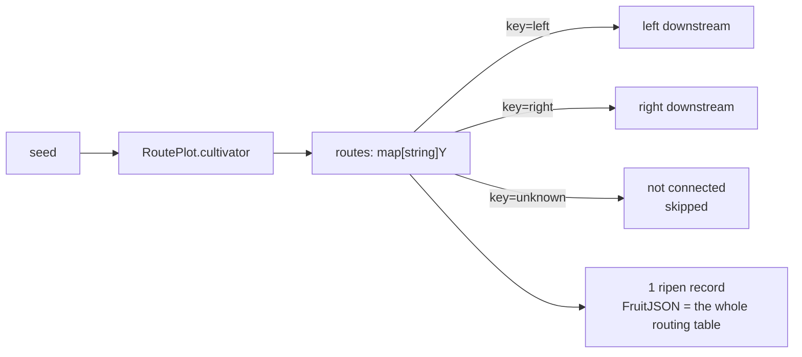

# pkg/plot/plot_route.go

> 📅 Last Updated: 2026/09/24

`plot_route.go` defines `RoutePlot[S, Y]`: a node that performs **targeted forwarding**. Its `cultivator` returns not a single fruit but a routing table `map[string]Y`, where the key is the target downstream name and the value is the yield to send to that downstream.

Therefore, unlike the "broadcast to all downstreams" behavior of `Plot`, `RoutePlot` can achieve "different downstreams receive different data", and **downstreams that are not routed to receive nothing at all**.

## Role

- Provides the generic node `RoutePlot[S, Y]`: one seed → targeted delivery to a number of downstreams by name.
- Reuses the shared `basePlot[S, map[string]Y, Y]` skeleton (see `plot_base.md`) and implements only the `ripenSeed` success hook.
- Lets the dispatch policy be decided by a business function rather than by the topology of the graph.

## Core objects

### The `RoutePlot[S, Y]` struct

```go
type RoutePlot[S any, Y any] struct {
	*basePlot[S, map[string]Y, Y]
}
```

| Generic parameter | Meaning |
|---------|------|
| `S` | Seed input type, i.e. the parameter type of `cultivator` |
| `Y` | **A single** downstream yield type; the value type of the routing table is `Y`, and the yield type of the underlying `basePlot` is also `Y` |

Note that the "result type" of this node is `map[string]Y` (the whole routing table is persisted as one `ripen` record), while the type output downstream is `Y`.

## Public functions

### `NewRoutePlot[S, Y](name string, cultivator func(S) (map[string]Y, error), opts ...Option) *RoutePlot[S, Y]`

| Parameter | Meaning |
|------|------|
| `name` | plot name, must be unique within a `Farm` |
| `cultivator` | routing function, returns `map[downstream name]yield` or an error |
| `opts` | optional configuration (see `option.md`) |

The implementation notes are the same as for `NewPlot`: first declare `var p *RoutePlot[S, Y]`, then build `newBasePlot[S, map[string]Y, Y]` and inject a closure that calls `p.ripenSeed(...)`, and finally assign base to `p`. The `p` captured by the closure is only called after `StartAsync`, so the assignment order is safe.

### `ripenSeed(seedPayload runtime.Payload[S], routes map[string]Y, startTime time.Time)` (unexported)

The success path, called by `basePlot.tend` when the routing function returns a `nil` error:

1. `AddFruitNum(1)`, `reportProgress()`—**no matter how many downstreams are routed to, one seed counts as only 1 fruit**;
2. `eventClient.Emit("fruit", []int{seedID})` allocates `fruitID`;
3. Writes `logInlet.SeedRipen` (the routing table truncated to 25 runes) and `lifecycleInlet.SeedRipen` (`FruitJSON` is the JSON of the whole routing table);
4. Iterates over the routing table `routes`:
   - `ch, ok := p.yieldChans[nextPlot]`; `!ok` (that target is not connected) → `continue` and skip, without affecting the other routing entries;
   - `AddDownstreamYieldNum(nextPlot, 1)`—each routed-to downstream gets exactly +1;
   - `eventClient.Emit("seed", []int{fruitID})` allocates the downstream seed event ID (the parent event is `fruitID`);
   - Writes `logInlet.SeedInput` (the yield truncated to 50 runes) and `lifecycleInlet.SeedInput`;
   - Sends `runtime.Payload[Y]{Value: yield, EventID: downstreamSeedID}`.

## Key flows

### Differences from `Plot`



| Aspect | `Plot` | `RoutePlot` |
|--------|--------|-------------|
| Result type | `F` | `map[string]Y` |
| Delivery scope | 1 each to all connected downstreams | Only targets in the routing table that are **connected** |
| Data each downstream receives | Exactly the same | Can be completely different (each takes its own value from the routing table) |
| Unconnected targets | Not applicable | Silently skipped |
| `fruit` count | +1 | +1 |
| Downstream yield count increment | Every downstream +1 | Every routed-to downstream +1 |

### Empty routing table / `nil`

When `cultivator` returns a `nil` map or an empty map: one `ripen` record is still written (`FruitJSON` is `null` or `{}`), but **no downstream yield is produced**.

## Usage examples

### Standalone routing

```go
package main

import (
	"fmt"

	"github.com/Mr-xiaotian/CelestialGrow/pkg/plot"
)

func main() {
	route := plot.NewRoutePlot("route", func(seed int) (map[string]string, error) {
		routes := map[string]string{}
		if seed%2 == 0 {
			routes["even"] = fmt.Sprintf("even-%d", seed)
		} else {
			routes["odd"] = fmt.Sprintf("odd-%d", seed)
		}
		return routes, nil
	}, plot.WithTenders(2))

	route.Run([]int{1, 2, 3})

	records, err := route.Harvest()
	if err != nil {
		panic(err)
	}
	for _, r := range records {
		fmt.Println(r.SeedJSON, r.Status, r.FruitJSON)
	}
}
```

### Per-target dispatch within a Farm

```go
f := farm.NewFarm("route_demo", "INFO")

left := plot.NewPlot("left", func(seed string) (string, error) { return "L:" + seed, nil })
right := plot.NewPlot("right", func(seed string) (string, error) { return "R:" + seed, nil })
route := plot.NewRoutePlot("route", func(seed int) (map[string]string, error) {
	return map[string]string{"left": fmt.Sprintf("%d", seed)}, nil
})

_ = f.AddPlot(route, left, right)
// 只连 route → left、route → right；路由表中未出现的目标不会收到数据
_ = f.Connect([]plot.PlotNode{route}, []plot.PlotNode{left, right})
_ = f.Run(map[string][]any{"route": {1, 2, 3}})
```

> Since the `S` of the downstreams `left` / `right` is `string`, the `Y` of `RoutePlot` must also be `string`; otherwise the `Connect` stage reports a type-mismatch error.

## Notes

- The keys of the routing table must match the `name` of the downstream plots exactly; when a name does not match (or the target was not `Connect`ed), it is **silently skipped**—no error, no log.
- The routing table is serialized as a whole into the `FruitJSON` of one `ripen` lifecycle record; if the map content is large, it is recommended to trim it on the business side first.
- Because `map` iteration order is random, the **order** of delivery to multiple downstreams is nondeterministic; however, each target only ever receives its own single yield.
- `AddDownstreamYieldNum` is called only for connected targets, so a downstream's `GetSeedNum` matches exactly the number of yields it actually receives.
- Do not let `cultivator` mutate and reuse the same map (that races under concurrent `tend` calls); returning a new map each time is the safest.
