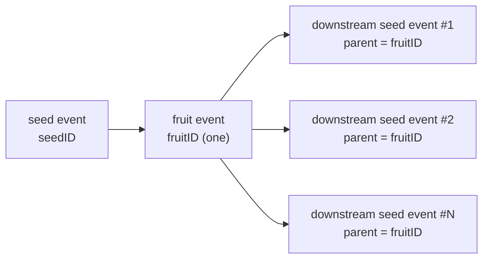

# pkg/plot/plot_split.go

> 📅 Last Updated: 2026/09/24

`plot_split.go` defines `SplitPlot[S, F]`: a node that does **one-to-many splitting**. Its `cultivator` (whose constructor parameter is named `splitter`) returns `[]F`, and the node then forwards each element of the slice as a separate downstream yield.

It fits scenarios where "one task derives N subtasks" (for example, splitting one directory into several files, or one order into several line items).

## Role

- Provides the generic node `SplitPlot[S, F]`: one seed → multiple downstream yields.
- Reuses the shared `basePlot[S, []F, F]` skeleton (see `plot_base.md`) and implements only the `ripenSeed` success hook.
- Keeps the accounting rule that **one seed records exactly one `ripen` entry**: however many elements are split out, it still counts as one successful cultivation.

## Core objects

### The `SplitPlot[S, F]` struct

```go
type SplitPlot[S any, F any] struct {
	*basePlot[S, []F, F]
}
```

| Generic parameter | Meaning |
|---------|------|
| `S` | Seed input type, i.e. the parameter type of `splitter` |
| `F` | The type of **a single element** after splitting; the result type is `[]F` and the type output downstream is `F` |

## Public functions

### `NewSplitPlot[S, F](name string, splitter func(S) ([]F, error), opts ...Option) *SplitPlot[S, F]`

| Parameter | Meaning |
|------|------|
| `name` | plot name, must be unique within a `Farm` |
| `splitter` | split function, returns `[]F` or an error |
| `opts` | optional configuration (see `option.md`) |

The implementation notes are the same as for `NewPlot`: first declare `var p *SplitPlot[S, F]`, then build `newBasePlot[S, []F, F]` and inject a closure that calls `p.ripenSeed(...)`, and finally assign `p`.

> Note: a `splitter` returning `(nil, nil)` is also a legal success—in that case no downstream yield is produced, but one `ripen` entry is still recorded (`FruitJSON` is `null`).

### `ripenSeed(seedPayload runtime.Payload[S], fruits []F, startTime time.Time)` (unexported)

The success path, called by `basePlot.tend` when `splitter` returns a `nil` error:

1. `AddFruitNum(1)`, `reportProgress()`—**only +1**, independent of `len(fruits)`;
2. `eventClient.Emit("fruit", []int{seedID})` allocates a **single unique** `fruitID` (the whole split shares one fruit event);
3. Writes `logInlet.SeedRipen` (the string representation of `[]F` truncated to 25 runes) and `lifecycleInlet.SeedRipen` (`FruitJSON` is the JSON of the entire slice);
4. Iterates over `p.yieldChans` (that is, **all** connected downstreams), and for each downstream:
   - `AddDownstreamYieldNum(nextPlot, len(fruits))`—adds `len(fruits)` to the number of yields that downstream receives, in one go;
   - Then iterates over `fruits` in an inner loop, and for **each element**:
     - `eventClient.Emit("seed", []int{fruitID})` allocates an independent downstream seed event ID (the parent event is the same `fruitID` in every case);
     - Writes `logInlet.SeedInput` (the element truncated to 50 runes) and `lifecycleInlet.SeedInput`;
     - Sends `runtime.Payload[F]{Value: fruit, EventID: downstreamSeedID}`.

## Key flows

### Event IDs and parent-child relationships



- One split allocates only one `fruitID`, and all `N` downstream seed events use it as their parent event;
- On the log side, one `SeedInput` entry is written per element, and likewise on the lifecycle side (each `InputEventID` is different).

### Differences from `Plot` / `RoutePlot`

| Aspect | `Plot` | `SplitPlot` | `RoutePlot` |
|--------|--------|-------------|-------------|
| Result type | `F` | `[]F` | `map[string]Y` |
| Delivery scope | 1 each to all connected downstreams | `len(fruits)` each to all connected downstreams | Only targets matched by the routing table |
| Downstream yield count increment | Every downstream +1 | Every downstream +`len(fruits)` | Every matched target +1 |
| `fruit` count | +1 | +1 (independent of the element count) | +1 |
| Data received by destination downstreams | Same | Same (the same slice) | May differ |

### Empty slice and broadcast to all downstreams

- `fruits` is empty (`nil` or `[]F{}`): `AddDownstreamYieldNum(nextPlot, 0)` runs and the inner loop does not execute, so **downstreams receive no data** (but they still receive the seal from the upstream's wrap-up as usual);
- `fruits` has `N` elements: **every connected downstream receives all `N` elements**—`SplitPlot` is "split + broadcast", not "dispatch by target" (use `RoutePlot` for dispatch by target).

## Usage examples

### Standalone splitting

```go
package main

import (
	"fmt"
	"strings"

	"github.com/Mr-xiaotian/CelestialGrow/pkg/plot"
)

func main() {
	split := plot.NewSplitPlot("split", func(seed string) ([]string, error) {
		if seed == "" {
			return nil, nil
		}
		return strings.Split(seed, ","), nil
	}, plot.WithTenders(2))

	split.Run([]string{"a,b,c", ""})

	records, err := split.Harvest()
	if err != nil {
		panic(err)
	}
	for _, r := range records {
		fmt.Println(r.SeedJSON, r.Status, r.FruitJSON)
	}
}
```

### Splitting and then processing within a Farm

```go
f := farm.NewFarm("split_demo", "INFO")

// split：把 "1,2,3" 拆成 int 列表
split := plot.NewSplitPlot("split", func(seed string) ([]int, error) {
	parts := strings.Split(seed, ",")
	values := make([]int, 0, len(parts))
	for _, part := range parts {
		v, err := strconv.Atoi(strings.TrimSpace(part))
		if err != nil {
			return nil, err
		}
		values = append(values, v)
	}
	return values, nil
})

// head：对每个拆出来的 int 再处理
head := plot.NewPlot("head", func(seed int) (int, error) {
	return seed * 10, nil
}, plot.WithTenders(2))

_ = f.AddPlot(split, head)
_ = f.Connect([]plot.PlotNode{split}, []plot.PlotNode{head}) // 上游 yield int → 下游 seed int
_ = f.Run(map[string][]any{"split": {"1,2,3"}})
```

## Notes

- The `F` of `SplitPlot` is the **element type**, so when connecting, the downstream's `S` must equal `F` (not `[]F`); this is the type-mismatch pitfall you are most likely to hit.
- The progress seen by observers advances at **seed granularity** (`GetCompleted` increases by only 1 per `ripenSeed`); it does not increase by 5 just because 5 elements were split out.
- A downstream's `GetSeedNum()` grows accordingly because of `AddDownstreamYieldNum(len(fruits))`, so "the total seed counts before and after splitting do not match" is expected behavior—the downstream sees the seed volume after splitting.
- The slice returned by `splitter` is broadcast to all downstreams; do not modify the slice elements in a downstream (this can cause a data race), or have `splitter` return a freshly created slice each time.
- If the number of `fruits` elements is very large, keep an eye on the `seedChan` buffer and the downstream concurrency; when the buffer is full the upstream's `ripenSeed` blocks at the send.
