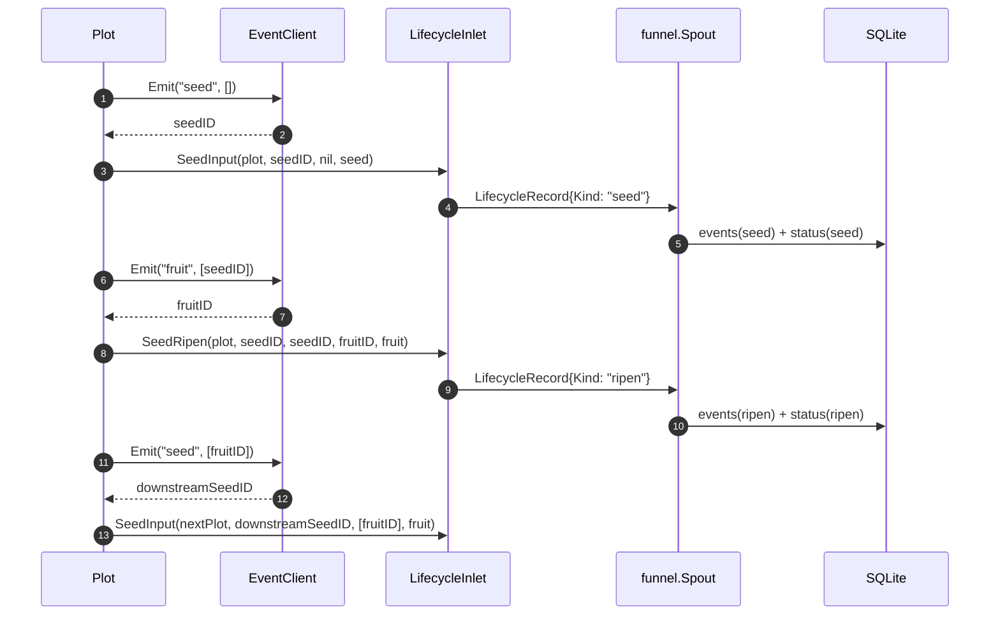

# pkg/runtime/event.go

> 📅 Last Updated: 2026/09/24

`event.go` defines the runtime abstraction for event ID allocation. It encapsulates "assigning a unique numeric ID to every seed / fruit / weed / seal event" into the minimal interface `EventClient`, and provides the in-process default implementation `LocalEventClient`. Through this abstraction, the plot nodes in `pkg/plot` decouple "how event IDs are generated" from the scheduling logic.

## Purpose

- Defines the minimal contract of the **event ID allocator**, `EventClient`.
- Provides the in-process, concurrency-safe default implementation `LocalEventClient`.
- Lets a plot obtain a monotonically increasing integer ID for every business event (seed entering, fruit produced, weed failure, seal propagation) without depending on any global state, so that a complete causal chain can be assembled in `pkg/persist`'s SQLite.

> This package has **only** four exported symbols: `EventClient`, `LocalEventClient`, `NewLocalEventClient`, and `(*LocalEventClient).Emit`; there is no `EventKind` enum and no `Event` struct. Event kinds (`"seed"` / `"fruit"` / `"weed"` / `"seal"`) are passed as string literals by `pkg/plot` to the `type_` parameter of `Emit`.

## Core Objects

### The `EventClient` Interface

The minimal emit capability of an event client. The whole runtime package only requires it to do one thing - **allocate an event ID**.

```go
type EventClient interface {
    Emit(type_ string, parents []int) int
}
```

| Method | Purpose |
|------|------|
| `Emit(type_ string, parents []int) int` | Declares an event of type `type_` with the parent event ID list `parents`, and returns the allocated event ID |

> In the `LocalEventClient` implementation, `type_` and `parents` **participate only in the signature contract** - the default implementation neither persists `type_` nor stores `parents`; it only returns an incrementing local ID. Their actual meaning is interpreted by the caller (`pkg/plot`) and persisted to SQLite along with `persist.LifecycleRecord`. This design allows the default implementation to be replaced in the future by a distributed ID generator without changing plot code.

### The `LocalEventClient` Struct

The in-process event ID allocator. `newBasePlot` creates and uses it by default when constructing each plot.

```go
type LocalEventClient struct {
    mu     sync.Mutex
    nextID int
}
```

| Field | Type | Meaning |
|------|------|------|
| `mu` | `sync.Mutex` | The mutex protecting `nextID`, making `Emit` atomic even under multiple goroutines |
| `nextID` | `int` | The next event ID to allocate (starts at `0`; the first `Emit` returns `1`) |

### Construction and Emission

```go
func NewLocalEventClient() EventClient

func (e *LocalEventClient) Emit(type_ string, parents []int) int
```

| Function | Behavior |
|------|------|
| `NewLocalEventClient()` | Returns an `EventClient` interface value internally holding a zero-value `LocalEventClient` (`nextID = 0`) |
| `Emit(type_, parents)` | Locks, performs `nextID++`, returns the new `nextID`, and unlocks. Concurrency-safe, monotonically increasing within the process |

```go
c := runtime.NewLocalEventClient()
id1 := c.Emit("seed", []int{})      // 1
id2 := c.Emit("fruit", []int{id1})  // 2
```

> `LocalEventClient` does not store history - it is only responsible for "allocating IDs". If you need to trace the event chain after the process exits, write to SQLite via the plot's `lifecycleInlet` together with `persist.LifecycleRecordHandler`.

## Exported Symbols Overview

| Symbol | Type | Description |
|------|------|------|
| `EventClient` | `interface` | The minimal contract for event ID allocation |
| `LocalEventClient` | `struct` (exported) | The in-process, concurrency-safe default implementation |
| `NewLocalEventClient` | `func() EventClient` | Constructor; returns an interface value |
| `(*LocalEventClient).Emit` | `func(string, []int) int` | Allocates and returns a new ID |

## Event Emission Points (Inside the Plot)

`Seed` / `Seal` / `witherSeed` / `sprout` are defined in `basePlot` (`plot_base.go`); `ripenSeed` is injected by the success path, and `Plot`, `SplitPlot`, and `RoutePlot` each have their own implementation. All call sites are as follows:

| Triggering Method | Declaring Type | `type_` | `parents` | Description |
|---------|---------|---------|-----------|------|
| `Seed` | `basePlot` | `"seed"` | `[]int{}` (empty) | A single seed is injected externally; allocates the starting event ID of that seed; the `Source` field is left empty |
| `Seal` | `basePlot` | `"seal"` | `[]int{}` (empty) | External termination signal; `Payload.Source` is recorded as `sourceInput` |
| `witherSeed` | `basePlot` | `"weed"` | `[]int{seedID}` | Cultivation ultimately fails (the cultivator returns an error, `retryIf` rejects the retry, or a panic occurs) |
| `ripenSeed` | `Plot` | `"fruit"` | `[]int{seedID}` | Cultivation succeeds; allocates a fruitID; one fruit is forwarded as one downstream yield |
| `ripenSeed` | `Plot` | `"seed"` | `[]int{fruitID}` | Allocates a new seedID for each downstream registered as upstream |
| `ripenSeed` | `SplitPlot` | `"fruit"` + one `"seed"` per fruit | Same as above | One success produces multiple fruits, forwarded one by one |
| `ripenSeed` | `RoutePlot` | `"fruit"` + one `"seed"` per route | Same as above | Distributes yields to the matched downstreams according to the routing table |
| `sprout` finalization | `basePlot` | `"seal"` | `[]int{...all received upstream sealIDs...}` | After the input is closed and there are no in-flight seeds, broadcasts a seal to all downstreams |

> The complete causal chain is carried by `parents`: seed → fruit → seed (downstream) → fruit (downstream) → …, where the seed / fruit / weed events are persisted by SQLite's `events` + `event_parents` tables. **seal events are not persisted**: their IDs are used only in the in-memory `sealedFrom` map as the `parents` of subsequent seal events.

> The same `EventClient` instance is shared by all plots in the farm: `Farm.AddPlot` injects it by calling `PlotNode.SetEventClient(f.eventClient)` at registration time, so event IDs within the whole Farm are **monotonically continuous** with no ID reuse. In single-machine standalone mode, each plot uses the `LocalEventClient` created by default in `newBasePlot`.

## Integration with `pkg/persist`

The event ID itself carries no business information. `pkg/plot` assembles the event ID, the business data, and the source into a `persist.LifecycleRecord`, which is persisted to SQLite via `persist.LifecycleInlet` → `funnel.Spout` → `persist.LifecycleRecordHandler`.

`"seed"` / `"fruit"` / `"weed"` are dispatched by the `switch record.Kind` in `LifecycleRecordHandler.HandleRecord`; `"seal"` does not produce a `LifecycleRecord`:

| `Emit`'s `type_` | `LifecycleRecord.Kind` (constant / literal) | `events.event_type` | `status.status` | Description |
|-------------------|----------------------------------------|---------------------|-----------------|------|
| `"seed"` | `lifecycleSeed` / `"seed"` | `"seed"` | `"seed"` | The seed enters the system; writes `seed_json` |
| `"fruit"` | `lifecycleRipen` / `"ripen"` | `"ripen"` | `"ripen"` | Cultivation succeeds; writes `fruit_json` |
| `"weed"` | `lifecycleWither` / `"wither"` | `"wither"` | `"wither"` | Cultivation fails; writes `wither_type` / `wither_message` |
| `"seal"` | (does not produce a `LifecycleRecord`) | — | — | Exists only as a node in the in-memory causal chain, and is not persisted |

> Note the naming layers: `Emit`'s `type_` uses `"fruit"` / `"weed"` (botanical metaphors), while `LifecycleRecord.Kind` and the persisted values use `"ripen"` / `"wither"` (state semantics). `events.event_type` stores the `Kind`, so the actual values are `"seed"` / `"ripen"` / `"wither"`.

Every persisted `LifecycleRecord` establishes parent-child edges via `event_id` and the `event_parents` table, so the entire causal graph can be reconstructed in SQLite.

## Key Flow



## Usage Examples

### Replacing the Default Implementation

If you want to replace the local auto-incrementing ID with a snowflake ID, a UUID hash, or an external service allocator, you only need to implement the `EventClient` interface and inject it via `SetEventClient`:

```go
type snowflakeClient struct {
    // 内部状态略
}

func (s *snowflakeClient) Emit(type_ string, parents []int) int {
    // 分配全局唯一 ID（具体策略略）
    return nextSnowflake()
}

f := farm.NewFarm("demo", "INFO")
client := &snowflakeClient{}

// 在注册时注入；也可注册后对单个 plot 覆盖
if err := f.AddPlot(plotA, plotB); err != nil {
    panic(err)
}
plotA.SetEventClient(client)
plotB.SetEventClient(client) // 同一实例可被多个 plot 共享
```

> The `type_` / `parents` parameters of `Emit` must appear in the signature. Even if a custom implementation does not read them, they must be kept, otherwise `runtime.EventClient` cannot be implemented.

### Only Viewing the Current ID Allocation State

`LocalEventClient` does not provide query methods such as `Len()` / `Current()`; if you need to observe the number currently allocated, you can wrap it in an outer layer:

```go
type countedClient struct {
    inner runtime.EventClient
    n     atomic.Int64
}

func (c *countedClient) Emit(type_ string, parents []int) int {
    id := c.inner.Emit(type_, parents)
    c.n.Add(1)
    return id
}
```

## Important Details

- **Concurrency safety**: `LocalEventClient.Emit` serializes `nextID++` with a `sync.Mutex`, so IDs returned under concurrent calls from multiple goroutines remain unique and monotonically increasing.
- **No persistence**: `LocalEventClient` is an "**allocator**" rather than a "**storage**"; its entire state is a single `int`, `nextID`. After the process exits, the semantics of event IDs can only be traced via the `events` table in SQLite.
- **Interface design motivation**: `type_ string, parents []int` is reserved for "possibly integrating a distributed tracing system in the future" - when replaced with an OpenTelemetry / Jaeger implementation the signature is already sufficient, and the plot does not need to change.
- **Sharing across plots**: `Farm.AddPlot` injects the same `EventClient` instance into all instances, guaranteeing that event IDs are monotonically non-repeating within the whole Farm; therefore in SQLite you can filter locally by `plot` or trace globally by `event_id`.
- **Type tags are only passed through**: `LocalEventClient` itself does **not distinguish** `"seed"` / `"fruit"` / `"weed"` / `"seal"`; it only passes them through as caller-side semantic tags, and the type persistence is done on the `persist` side.

## Notes

- Do not construct `&runtime.LocalEventClient{}` directly from outside; use `NewLocalEventClient()` to obtain an `EventClient` interface value (making it painless to replace the implementation later).
- `parents` is a list of "**parent event IDs**", **not** all ancestor IDs on the causal path; when writing to SQLite, `InsertLifecycleEvent` inserts `(event_id, parent_id)` edges into the `event_parents` table.
- Do not mix two `LocalEventClient` instances on the same causal chain - otherwise the same logical task would be assigned different IDs, breaking the edge relationships in SQLite.
- If you extend with a new event type, update the `switch record.Kind` branches of `persist.LifecycleRecordHandler.HandleRecord` accordingly, otherwise consumption returns `unsupported lifecycle operation: <new type>`.
