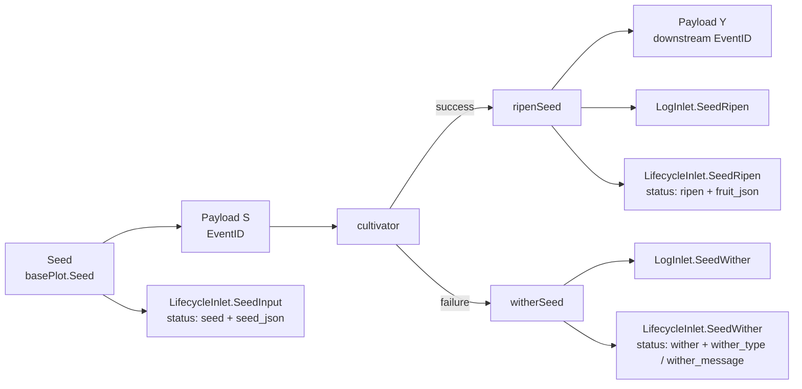

# pkg/runtime/type.go

> 📅 Last Updated: 2026/09/24

`type.go` defines the runtime base types shared across packages: the unified data carrier of a pipeline stage, `Payload[V]`; the control signal constants `SignalNone` / `SignalSeal`; and the "seed-fruit" pairing type `Karma[S, F]`. `Payload` is the element type of all channels (`seedChan` / `yieldChans`) in `pkg/plot`; `Karma` is currently only a reserved extension point and is not used in the main runtime flow.

## Purpose

- Encapsulates both **data** (seed, yield) and **control signals** (seal) into the same generic channel type, so that connections between plots need only a single `chan Payload[X]`.
- Through the two constants `SignalNone` / `SignalSeal`, lets the data flow and the control flow coexist on the same channel and be dispatched by the receiver according to `Signal`.
- Provides the `Karma` "seed-fruit" pairing type, leaving room for a possible "look back" interface needed by higher layers.

> The `pkg/runtime` package does **not** contain `Task` / `TaskResult` / `TaskStatus` structs; those concepts exist in `pkg/persist` in the form of `LifecycleStatusRecord` (`SeedJSON` / `FruitJSON` fields + a string `Status` field). This document does not invent such types; it only explains in the "Integration with `pkg/persist`" section how they are derived from `Payload` / the plot.

## Core Objects

### Control Signal Constants

```go
const (
    SignalNone = iota // 正常数据
    SignalSeal        // 终止信号，通知下游不再有新数据
)
```

| Constant | Value | Semantics |
|------|----|------|
| `SignalNone` | `0` | The `Payload` on the channel carries normal data (seed or yield) |
| `SignalSeal` | `1` | The `Payload` on the channel is a termination signal, notifying downstream that "this plot will no longer produce new data" |

Design highlights:

- Uses the **same `chan Payload[V]`** to carry both data and control flow, avoiding an extra channel for control signals.
- When `Signal == SignalSeal`, `Value` is **not** carried, and the decision relies solely on `Signal`.
- When the downstream `sprout` reads `SignalSeal` in its `select`, it calls `markSealed`: if the source equals the sentinel `sourceInput` (the literal `"__input__"`), the termination is forced; otherwise it must wait for all registered upstreams to have sent a seal - see `plot_base.go` for details.

### The `Payload[V]` Struct

```go
type Payload[V any] struct {
    // Signal与Seed通用
    Signal  int
    EventID int

    // Signal使用
    Source string

    // Seed使用
    Value V
}
```

| Field | Type | Purpose | Semantics under `SignalSeal` |
|------|------|------|--------------------------|
| `Signal` | `int` | `SignalNone` (normal data) or `SignalSeal` (termination signal) | Always `SignalSeal` |
| `EventID` | `int` | The event ID allocated by `EventClient.Emit` (see `event.md`) | The ID of the seal event (used in memory only, not persisted) |
| `Source` | `string` | The source of the data/signal: `""` for external injection, `sourceInput` for external termination, and the upstream plot name for internal propagation | Which plot the seal comes from (or `sourceInput`) |
| `Value` | `V` | The actual data (seed or yield) | **Not used**; it is the zero value |

> The meaning of the fields is determined by `Signal`:
> - `Signal == SignalNone` (normal data): `Value` is valid data; `Source` is determined by the constructing side (`Seed` leaves it empty, `ripenSeed` also leaves it empty when forwarding downstream, and only the seal of `sprout` uses the plot name).
> - `Signal == SignalSeal` (control signal): `Value` is meaningless; `Source` is used by the downstream `markSealed` to determine the source.

### The `Karma[S, F]` Struct

```go
type Karma[S any, F any] struct {
    Seed  S
    Fruit F
}
```

| Field | Type | Meaning |
|------|------|------|
| `Seed` | `S` | The original input of a seed |
| `Fruit` | `F` | The fruit produced by this seed after cultivation |

> `Karma` is currently **not used by `pkg/plot` or any other package**; `pkg/runtime` exposes it as a reserved extension point (for example: also storing `Seed` on failure for a replayable cache; or returning `[]Karma` from `Harvest`). Please avoid depending on it in production paths.

## Exported Symbols Overview

| Symbol | Type | Purpose |
|------|------|------|
| `SignalNone` | `const int` | A `Payload.Signal` value: normal data |
| `SignalSeal` | `const int` | A `Payload.Signal` value: termination signal |
| `Payload[V any]` | `struct` | The unified data carrier of a pipeline stage, carrying both data and control signals |
| `Karma[S any, F any]` | `struct` | Seed-fruit pairing (reserved extension point) |

Generic parameter semantics:

| Parameter | Appears in | Meaning |
|------|---------|------|
| `V` | `Payload[V]` | The data type carried by this pipeline stage; upstream it is `S` (seed), downstream it is `Y` (yield), and in a standard `Plot` `Y = F` |
| `S` | `Karma[S, F]` | Seed type |
| `F` | `Karma[S, F]` | Fruit type |

## Cross-Package Usage Conventions

`Payload[V]` is the element type of all `chan`s in `pkg/plot`:

| Channel | Element Type | Source | Destination |
|------|----------|------|--------|
| `basePlot.seedChan` | `chan runtime.Payload[S]` | External `Seed` / upstream yield / seal | The current plot's `sprout` |
| `basePlot.yieldChans[name]` | `chan runtime.Payload[Y]` | The current plot's `ripenSeed` / `sprout` finalization | The downstream plot's `seedChan` (`Y = F` in a standard `Plot`) |

Four construction sites (all in `pkg/plot`):

- `basePlot.Seed`: `Payload[S]{Value: seed, EventID: seedID}` (`Signal` defaults to `SignalNone`, `Source` is left empty).
- `basePlot.Seal`: `Payload[S]{Signal: SignalSeal, Source: sourceInput, EventID: sealID}`.
- `ripenSeed` forwarding downstream: `Payload[Y]{Value: fruit, EventID: downstreamSeedID}`.
- `sprout` finalization broadcasting seal: `Payload[Y]{Signal: SignalSeal, Source: p.name, EventID: sealID}`.

> `ConnectTo` performs the type assertion `next.GetSeedChanAny().(chan runtime.Payload[Y])`, so the `Payload` element types of upstream and downstream must be identical; this is also the source of the hard constraint "do not split data/signal into two types".

## State Values (`seed` / `ripen` / `wither`)

`pkg/runtime` has **no** state type; the task state is maintained by `LifecycleStatusRecord.Status` in `pkg/persist` as **string literals**. The correspondence between its values and the runtime trigger points is as follows:

| Runtime Trigger Point | Written `status.status` | Description |
|--------------|------------------------|------|
| `LifecycleInlet.SeedInput` (`basePlot.Seed`, when `ripenSeed` forwards downstream) | `"seed"` | The seed enters the system; writes `seed_json` |
| `LifecycleInlet.SeedRipen` (`ripenSeed`) | `"ripen"` | Promotion succeeds; writes `fruit_json` |
| `LifecycleInlet.SeedWither` (`witherSeed`) | `"wither"` | Promotion fails; writes `wither_type` / `wither_message` |
| `basePlot.tend` entering the next retry | (**produces no new state**) | The row remains `"seed"`; only `LogInlet.SeedReplant` writes a `WARNING`-level log entry |

> "**Retrying**" is not a separate state in the `status` table - retries only happen inside the `for attempt := 1; attempt <= p.maxRetries+1; attempt++` loop of `tend` (it exits early when `retryIf` returns `false`). To observe the retry history, read the `Seed ... attempt N withered: ... Replanting.` lines in `logs/grow_log(*).log`.
> See `pkg/plot/option.md` for the detailed Option / retry behavior.

## Integration with `pkg/persist`

`Payload` itself does **not** carry "task context" fields - the business data is taken from `Payload.Value` by the plot, passed to the `cultivator`, and then handed to `persist` as `any`. `pkg/persist` translates the business data and event IDs into queryable persisted structures through the following two kinds of Record (`pkg/persist` does not import `pkg/runtime` and only consumes `EventID` in `int` form):

- `persist.LogRecord` - text logs. When `basePlot.Seed` / `ripenSeed` forwards, it writes `SeedInput` (`DEBUG`); `ripenSeed` writes `SeedRipen` (`SUCCESS`); `witherSeed` writes `SeedWither` (`ERROR`); and `tend` writes `SeedReplant` (`WARNING`) on retry.
- `persist.LifecycleRecord` - lifecycle records. `Kind` is `lifecycleSeed` (`"seed"`) / `lifecycleRipen` (`"ripen"`) / `lifecycleWither` (`"wither"`): produced by `SeedInput` / `SeedRipen` / `SeedWither` respectively, written to `events` + `event_parents` via `InsertLifecycleEvent`, and then used to update the `status` table via `UpsertLifecycleStatusSeed` / `PromoteLifecycleStatusRipen` / `PromoteLifecycleStatusWither`.

The persistence flow of the task context (task JSON, result JSON, error message):



> `SeedJSON` comes from the `seed any` parameter of `SeedInput(plot, eventID, parentIDs, seed)`, serialized to a string by `toLifecycleJSON`; `FruitJSON` likewise comes from the `fruit any` of `SeedRipen`; `WitherType` / `WitherMessage` come from the `err error` parameter of `SeedWither` (`%T` / `%v`). If the business side needs strong typing, it can `json.Unmarshal` back into its own `Task` / `TaskResult` structs.

## Usage Examples

### Distinguishing Data / Signals on `seedChan`

```go
for {
    select {
    case p := <-seedChan:
        switch p.Signal {
        case runtime.SignalNone:
            // 正常数据
            handle(p.Value, p.EventID)
        case runtime.SignalSeal:
            // 终止信号：记录来源、判断是否关闭输入
            handleSeal(p.Source, p.EventID)
        }
    case <-ctx.Done():
        return
    }
}
```

### Constructing a Yield Payload Sent Downstream

```go
yieldPayload := runtime.Payload[Y]{
    Value:   fruit,
    EventID: p.eventClient.Emit("seed", []int{fruitID}),
}
ch <- yieldPayload
```

### Constructing a Seal Payload

```go
sealPayload := runtime.Payload[Y]{
    Signal:  runtime.SignalSeal,
    Source:  p.name,          // 外部终止时用 sourceInput
    EventID: sealID,
}
ch <- sealPayload
```

### Caching "Seed-Fruit" Pairs with `Karma` (Placeholder Usage)

```go
k := runtime.Karma[S, F]{Seed: seed, Fruit: fruit}
// 业务侧可以把它放进自己管理的回放缓存里
_ = k
```

## Important Details

- **The zero value means "normal data"**: the zero value of `Payload.Signal` is `SignalNone` (the `iota` start), so a `Payload{}` that does not set the `Signal` field automatically represents normal data. Both `Seed` / `ripenSeed` set only `Value` / `EventID` and do not explicitly set `Signal`.
- **`Payload` fields have "union semantics"**: the three fields `Signal` / `Source` / `Value` are actually used differently depending on the value of `Signal`; do not assume all fields are meaningful.
- **Retry is an internal loop and produces no new events**: the retry loop of `tend` does not `Emit` again and does not write new `status` rows; it only goes through `ripenSeed` / `witherSeed` on final success or failure.
- **`Status` is a string, not an enum**: `pkg/persist` writes the state as the literals `"seed"` / `"ripen"` / `"wither"`, without defining enum constants at the Go type level; the business side should map them itself if it needs type safety.

## Notes

- Do not split `Payload` into multiple types that can "only hold data / only hold signals" - the design of this framework is "the same pipeline carries both data and control flow", and splitting the types would break the type assertion in `ConnectTo`.
- Do not use `Payload.Value` when `Signal == SignalSeal`; its content is undefined and is usually the zero value of `V`.
- After a custom business struct is wrapped by `Payload[V]`, it is printed and truncated in the logs via `fmt.Sprintf("%+v", ...)` (the seed / fruit repr of `SeedRipen` / `SeedWither`); make sure its printed output is readable, otherwise the logs will show meaningless content such as `{}`.
- If you need the semantics of "a retry also counts immediately as a failure", set the retry limit to `0` (`WithMaxRetries(0)`), so that the first failure goes directly through `witherSeed`.
- `Karma` is currently **not used in the main plot flow**; it is introduced as a reserved extension point, so please avoid depending on it in production paths.
