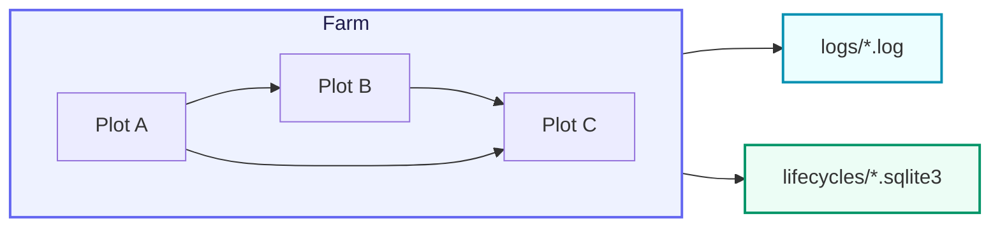

# CelestialGrow

> 📅 最終更新日: 2026/09/24

<p align="center">
  
  
  
</p>

**CelestialGrow** は、`Plot` / `Farm` モデルに基づく軽量で組み合わせ可能な Go の並行タスクオーケストレーションフレームワークです。

タスク処理を次の 2 つの層に分けています。

- **Plot**: ジェネリックな並行処理ノード。seed を消費し、cultivator を実行し、fruit を生成します（`Plot`、`SplitPlot`、`RoutePlot` の 3 つのセマンティクスを含みます）
- **Farm**: 複数の Plot からなる静的な有向グラフ。登録、接続、起動、および全体のスケジューリングを担当します

実行のオーケストレーションそのものに加えて、CelestialGrow には以下が組み込まれています。

- イベント ID に基づくタスクライフサイクルの追跡
- SQLite に基づく状態スナップショットの永続化
- ファイルに基づく構造化実行ログ
- ターミナル向けプログレスバーオブザーバー
- 統一された公開エントリパッケージ `pkg/api`

Go で「散在する goroutine + channel」よりも構造化された方法でタスクフローを表現したいが、重厚なワークフローシステムを持ち込みたくない場合、CelestialGrow はまさにそのような場面のために用意されています。

## プロジェクト構造（Project Structure）



CelestialGrow の中核となるデータフローは次のように要約できます。

1. 外部から seed を入力する
2. Plot が cultivator を並行実行する
3. 成功時は fruit を生成して下流の Plot に転送する
4. 失敗時は weed イベントを発行し、ライフサイクル状態を wither に進める
5. 一連の流れをログとライフサイクル SQLite に書き込む

## クイックスタート（Quick Start）

インストール:

```bash
go get github.com/Mr-xiaotian/CelestialGrow@latest
```

統一エントリの `pkg/api` から使い始めることを推奨します。

最小限の `Farm` の例（`demo/demo_farm.go` と完全に一致）:

```go
package main

import grow "github.com/Mr-xiaotian/CelestialGrow/pkg/api"

// double 将种子翻倍。
func double(num int) (int, error) {
	return num * 2, nil
}

// addOne 为种子加一。
func addOne(num int) (int, error) {
	return num + 1, nil
}

// main 演示一条 Farm 流水线：root 将种子翻倍后传给 head 加一。
func main() {
	root := grow.NewPlot("root", double, grow.WithTenders(2))
	head := grow.NewPlot("head", addOne, grow.WithTenders(2))

	farm := grow.NewFarm("demo_farm", "INFO")
	if err := farm.AddPlot(root, head); err != nil {
		panic(err)
	}
	if err := farm.Connect([]grow.PlotNode{root}, []grow.PlotNode{head}); err != nil {
		panic(err)
	}
	if err := farm.Run(map[string][]any{
		"root": {1, 2, 3},
	}); err != nil {
		panic(err)
	}
}
```

実行すると 2 種類の生成物が得られます。

- `logs/grow_log(YYYY-MM-DD).log`: 実行ログ
- `lifecycles/YYYY-MM-DD/grow_lifecycle(...).sqlite3`: ライフサイクルイベントと状態スナップショット

単一の `Plot` だけを実行したい場合は、standalone モードを直接利用することもできます。

```go
package main

import (
	"fmt"

	grow "github.com/Mr-xiaotian/CelestialGrow/pkg/api"
)

func main() {
	plot := grow.NewPlot("double", func(seed int) (int, error) {
		return seed * 2, nil
	}, grow.WithTenders(4))

	plot.AddObserver(grow.NewProgressBar("double"))
	plot.Run([]int{1, 2, 3, 4, 5})

	records, err := plot.Harvest()
	if err != nil {
		panic(err)
	}

	for _, record := range records {
		fmt.Println(record.SeedJSON, record.Status, record.FruitJSON)
	}
}
```

## 主な機能（Core Features）

- **ジェネリックな Plot ノード**: `Plot[S, F]`、`SplitPlot[S, F]`、`RoutePlot[S, Y]` が入力 seed 型と出力 fruit 型を明確に表現します
- **型安全な接続**: 上流の `F` と下流の `S` が一致しない場合、`Connect` は直ちにエラーを返します
- **並行育成モデル**: `WithTenders` で並行して世話をするコルーチン（tender）の数を制御します
- **失敗時のリトライ機構**: `WithMaxRetries`、`WithRetryDelay`、`WithRetryIf` をサポートします
- **グラフレベルのスケジューリング**: `Farm` がノード登録、エッジ接続、ソースノードの seal、全体の実行を一元的に管理します
- **ライフサイクルの永続化**: 既定でイベントグラフと状態スナップショットを SQLite に書き込みます
- **可観測性**: ファイルログとプログレスバーオブザーバーをサポートします

## パッケージ一覧（Packages）

- `pkg/api`: 公開統一エントリ。`Farm`、`Plot`、`SplitPlot`、`RoutePlot`、`PlotNode` およびよく使う設定項目をラップします
- `pkg/farm`: グラフ構造、ノード登録、エッジ接続、構造レンダリング、全体のスケジューリング
- `pkg/plot`: ジェネリックなタスクノード（`Plot`/`SplitPlot`/`RoutePlot`）、並行実行、リトライ、上流下流へのデータ伝播
- `pkg/observer`: オブザーバーインターフェースとターミナルプログレスバーの実装
- `pkg/persist`: ログとライフサイクル SQLite の永続化
- `pkg/funnel`: 汎用的な非同期レコードの生産/消費基盤
- `pkg/runtime`: Payload、イベント ID、制御信号などのランタイム基本型

## 典型的な使用方法（Typical Usage）

推奨される呼び出し順序は次のとおりです。

1. `api.NewPlot(...)` でいくつかの処理ノードを定義する
2. `api.NewFarm(...)` でスケジューリンググラフを作成する
3. `farm.AddPlot(...)` を呼び出してノードを登録する
4. `farm.Connect(...)` を呼び出して上流下流の関係を構築する
5. `farm.Run(...)` を呼び出して初期入力を注入し実行する

`Farm.Connect` が使用するのは「グループ間の完全接続」というセマンティクスで、つまりソースグループとターゲットグループの間に直積的な接続を確立します。1 つの seed から複数の下流タスクを派生させたい場合は、`api.NewSplitPlot(...)`（1 対多）または `api.NewRoutePlot(...)`（名前による宛先指定転送）を使用できます。

## ファイル構成（File Structure）

```text
pkg/
  api/       # 对外统一入口
  farm/      # 图结构与调度
  funnel/    # 通用异步消费基础设施
  observer/  # 进度观察器
  persist/   # 日志与生命周期持久化
  plot/      # 泛型并发节点
  runtime/   # 事件、信号与运行时载体

demo/        # 示例程序
```

## 動作環境（Requirements）

現在のモジュール宣言:

- `go 1.25.5`
- `toolchain go1.26.2`

主要な依存関係は次のとおりです。

| 依存関係 | 説明 |
| --- | --- |
| `modernc.org/sqlite` | 純 Go の SQLite ドライバ。ライフサイクルの永続化に使用します |
| `github.com/schollz/progressbar/v3` | ターミナルプログレスバーオブザーバー |

## 開発（Development）

```bash
go mod tidy
go test ./pkg/...
```

`pkg/**/*.go` を変更した場合は、対応するパッケージの関連テストを実行し、今回の変更が影響する範囲の振る舞いを優先的に検証することを推奨します。

## ドキュメント索引（Documentation Index）

本リポジトリの詳細な中国語ドキュメントは、`pkg/<name>/<file>.go` → `docs/zh-CN/pkg/<name>/<file>.md` というミラー方式で構成されています。現在生成済みの中国語サブドキュメントは次のとおりです。

### pkg/api

- [`docs/zh-CN/pkg/api/api.md`](./pkg/api/api.md) — 公開統一エントリパッケージ

### pkg/farm

- [`docs/zh-CN/pkg/farm/farm.md`](./pkg/farm/farm.md) — Farm スケジューラ
- [`docs/zh-CN/pkg/farm/graph.md`](./pkg/farm/graph.md) — トポロジグラフ（OrderGraph）
- [`docs/zh-CN/pkg/farm/render.md`](./pkg/farm/render.md) — グラフ構造のテキストレンダリング（RenderStructureList）
- [`docs/zh-CN/pkg/farm/farm_structure_test.md`](./pkg/farm/farm_structure_test.md) — Farm 構造テストのポイント
- [`docs/zh-CN/pkg/farm/farm_connect_test.md`](./pkg/farm/farm_connect_test.md) — Farm Connect テストのポイント
- [`docs/zh-CN/pkg/farm/farm_start_test.md`](./pkg/farm/farm_start_test.md) — Farm Start テストのポイント
- [`docs/zh-CN/pkg/farm/farm_split_test.md`](./pkg/farm/farm_split_test.md) — Farm SplitPlot エンドツーエンドテストのポイント
- [`docs/zh-CN/pkg/farm/farm_route_test.md`](./pkg/farm/farm_route_test.md) — Farm RoutePlot エンドツーエンドテストのポイント
- [`docs/zh-CN/pkg/farm/graph_test.md`](./pkg/farm/graph_test.md) — OrderGraph テストのポイント
- [`docs/zh-CN/pkg/farm/render_test.md`](./pkg/farm/render_test.md) — グラフ構造レンダリングテストのポイント

### pkg/plot

- [`docs/zh-CN/pkg/plot/plot.md`](./pkg/plot/plot.md) — ジェネリックな Plot ノード
- [`docs/zh-CN/pkg/plot/plot_base.md`](./pkg/plot/plot_base.md) — 共有実行基盤（PlotNode / basePlot）
- [`docs/zh-CN/pkg/plot/plot_split.md`](./pkg/plot/plot_split.md) — 1 対多ノード（SplitPlot）
- [`docs/zh-CN/pkg/plot/plot_route.md`](./pkg/plot/plot_route.md) — 宛先指定転送ノード（RoutePlot）
- [`docs/zh-CN/pkg/plot/option.md`](./pkg/plot/option.md) — Plot のオプション設定（Option）
- [`docs/zh-CN/pkg/plot/constant.md`](./pkg/plot/constant.md) — Plot の定数と信号の定義
- [`docs/zh-CN/pkg/plot/counter.md`](./pkg/plot/counter.md) — Plot のカウンタと同期プリミティブ
- [`docs/zh-CN/pkg/plot/helper.md`](./pkg/plot/helper.md) — Plot の内部ヘルパー関数
- [`docs/zh-CN/pkg/plot/plot_harvest_test.md`](./pkg/plot/plot_harvest_test.md) — Plot Harvest テストのポイント
- [`docs/zh-CN/pkg/plot/plot_retry_test.md`](./pkg/plot/plot_retry_test.md) — Plot リトライテストのポイント
- [`docs/zh-CN/pkg/plot/plot_split_test.md`](./pkg/plot/plot_split_test.md) — SplitPlot テストのポイント
- [`docs/zh-CN/pkg/plot/plot_route_test.md`](./pkg/plot/plot_route_test.md) — RoutePlot テストのポイント

### pkg/observer

- [`docs/zh-CN/pkg/observer/observer.md`](./pkg/observer/observer.md) — オブザーバーインターフェース
- [`docs/zh-CN/pkg/observer/progress.md`](./pkg/observer/progress.md) — ターミナルプログレスバーの実装

### pkg/persist

- [`docs/zh-CN/pkg/persist/lifecycle.md`](./pkg/persist/lifecycle.md) — ライフサイクルイベント記録
- [`docs/zh-CN/pkg/persist/log.md`](./pkg/persist/log.md) — 構造化実行ログ
- [`docs/zh-CN/pkg/persist/sqlite.md`](./pkg/persist/sqlite.md) — SQLite 状態スナップショット
- [`docs/zh-CN/pkg/persist/sqlite_test.md`](./pkg/persist/sqlite_test.md) — SQLite 永続化テストのポイント

### pkg/funnel

- [`docs/zh-CN/pkg/funnel/inlet.md`](./pkg/funnel/inlet.md) — 汎用 Inlet 消費インターフェース
- [`docs/zh-CN/pkg/funnel/spout.md`](./pkg/funnel/spout.md) — 汎用 Spout 生産インターフェース

### pkg/runtime

- [`docs/zh-CN/pkg/runtime/event.md`](./pkg/runtime/event.md) — イベント ID の割り当てと流れ
- [`docs/zh-CN/pkg/runtime/type.md`](./pkg/runtime/type.md) — ランタイム基本型

### demo

- [`docs/zh-CN/demo/demo_farm.md`](./demo/demo_farm.md) — 最小 Farm サンプルの解説
