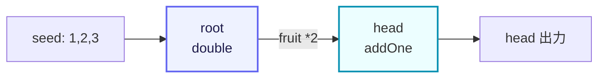

# demo/demo_farm.go

> 📅 最終更新日: 2026/09/24

## 役割

`demo/demo_farm.go` は CelestialGrow プロジェクトに同梱されている最も単純な `Farm` サンプルで、公開統一エントリ `pkg/api` を使って 2 つの `Plot` からなる小さなパイプラインを構築し実行する方法を示します。

- `NewPlot` で 2 つの並行処理ノード（`root` と `head`）を作成する
- `NewFarm` でスケジューリンググラフを作成し、ノードを登録する
- `Connect` で 2 つのノード間に上流下流の関係を構築する
- `Run` で初期 seed を注入し、グラフ全体を実行する

このパイプライン全体のセマンティクスは「root が seed を 2 倍にして head に渡し、head が 1 を加える」であり、入門デモとして最適な最小の閉ループです。

## コード構造

ファイルは 3 つの部分から構成されています。

1. **パッケージとインポート**: `package main` 形式で実行可能なエントリを提供し、`pkg/api` のみを別名 `grow` でインポートします。
2. **2 つの cultivator 関数**: `double` と `addOne` で、それぞれ `root` と `head` の処理ロジックになります。
3. **`main` 関数**: Plot 1、Plot 2 の構築、Farm の登録、接続、実行を順に完了します。

対応するデータフロー（2 ノード + 1 エッジ）は次のように簡略化できます。



## 主な呼び出し

`demo_farm.go` に登場する主要な API（いずれも `pkg/api` 由来）:

| 呼び出し | 由来 | 役割 |
|------|------|------|
| `grow.NewPlot[S, F](name, cultivator, opts...)` | `pkg/api` → `plot.NewPlot` | ジェネリックな並行ノードを構築します。`S` は seed 型、`F` は fruit 型です。 |
| `grow.NewFarm(name, logLevel)` | `pkg/api` → `farm.NewFarm` | Farm を構築します。内部でログ spout とライフサイクル spout を作成し、`logLevel` に応じてグローバルなログレベルを設定します。 |
| `farm.AddPlot(plots ...plot.PlotNode)` | `pkg/farm` | 複数の `PlotNode` を Farm に登録し、トポロジグラフに追加します。 |
| `farm.Connect(from, to)` | `pkg/farm` | ソースグループとターゲットグループの間に完全接続（直積）を確立し、各接続について seed/fruit 型の検証を行います。 |
| `farm.Run(inputs map[string][]any)` | `pkg/farm` | グラフ全体を同期的に実行し、すべての Plot が完了するまでブロックします。 |
| `grow.WithTenders(n int)` | `pkg/api` → `plot.WithTenders` | Plot の並行 tender（世話をするコルーチン）数を設定します。既定は `runtime.NumCPU()` です。 |
| `grow.PlotNode` | `pkg/api` → `plot.PlotNode` | `Farm.Connect` の引数で使用される統一インターフェースで、`Plot` / `SplitPlot` / `RoutePlot` のジェネリクスを消去しています。 |

## 主要なフロー

`main` 関数の内部は次の順序で実行されます。

1. `root` ノードを構築します。cultivator は `double`、並行 tender 数は 2 です。
2. `head` ノードを構築します。cultivator は `addOne`、並行 tender 数は 2 です。
3. `demo_farm` を作成します。グローバルなログレベルは `INFO` です。
4. `AddPlot(root, head)`: 2 つのノードを Farm に登録します。名前は一意でなければなりません。
5. `Connect({root}, {head})`: `root` → `head` の間に 1 本のエッジを確立します。
6. `Run({"root": {1, 2, 3}})`: 3 つの初期 seed を `root` に注入し、グラフ全体の実行を開始します。`Run` はすべての Plot が完了するまで同期的に待機してから戻ります。

## 実行時の生成物

`Run` が戻った後、カレントワーキングディレクトリに 2 種類の生成物が生成（または追記）されます（`pkg/farm` に組み込みのログ/ライフサイクル spout と一致します）。

- `logs/grow_log(YYYY-MM-DD).log`: 今回の Farm 実行で生成された構造化ログで、日ごとに追記されます。ログレベルは `NewFarm(name, "INFO")` で制御します。
- `lifecycles/YYYY-MM-DD/grow_lifecycle(HH-MM-SS.mmm).sqlite3`: 今回の Farm のライフサイクルデータベースで、当日の日付を名前にしたサブディレクトリに置かれ、ファイル名には起動時刻が含まれます。

このうち sqlite データベースには 3 つのテーブルが含まれます。`events`（seed/fruit/weed/seal イベント）、`event_parents`（イベントの親子エッジ）、`status`（各 seed の状態スナップショット。状態は `seed` / `ripen` / `wither`）です。

> 上記のパスとファイル命名は `pkg/persist` が決定しており、本サンプルではカスタム設定を行っていません。クリーンアップが必要な場合は、`logs/` と `lifecycles/` ディレクトリを直接削除できます。

## 使用例

以下のコードは `demo/demo_farm.go` のソースと完全に一致しており、そのままコピーして実行できます。

```go
package main

import grow "github.com/Mr-xiaotian/CelestialGrow/pkg/api"

// double 将种子翻倍。
func double(num int) (int, error) {
	return num * 2, nil
}

// addOne 为种子加一。
func addOne(num int) (int, error) {
	return num + 1, nil
}

// main 演示一条 Farm 流水线：root 将种子翻倍后传给 head 加一。
func main() {
	root := grow.NewPlot("root", double, grow.WithTenders(2))
	head := grow.NewPlot("head", addOne, grow.WithTenders(2))

	farm := grow.NewFarm("demo_farm", "INFO")
	if err := farm.AddPlot(root, head); err != nil {
		panic(err)
	}
	if err := farm.Connect([]grow.PlotNode{root}, []grow.PlotNode{head}); err != nil {
		panic(err)
	}
	if err := farm.Run(map[string][]any{
		"root": {1, 2, 3},
	}); err != nil {
		panic(err)
	}
}
```

### セクションごとの解説

- **インポート**: `pkg/api` のみをインポートし、別名 `grow` で参照することでローカル変数名 `farm` との衝突を避けます。
- **`double` / `addOne`**: 最も単純な `func(S) (F, error)` 形式の cultivator 2 つで、戻り値の error は常に nil のため、サンプル内のすべての seed は正常に fruit を生成し、下流で消費されます。
- **`NewPlot`**: 2 つのノードの seed と fruit 型はいずれも `int` で、ジェネリックパラメータ `S = F = int` は Go コンパイラが自動的に推論します。`WithTenders(2)` は単一 Plot の並行 tender 数を 2 に制限します。
- **`NewFarm`**: 内部でログ spout とライフサイクル spout が作成済みのため、呼び出し側で改めて手動で `BindInlet` する必要はありません。
- **`AddPlot`**: `Plot` を Farm の `plots` マップとトポロジグラフに追加し、Farm のイベントクライアントを共有します。名前が空の場合や重複登録の場合はエラーを返します。
- **`Connect`**: 「グループ間完全接続」のセマンティクスを使用します。本例では両グループともノードが 1 つだけなので、`root → head` の有向エッジが 1 本だけ生成されます。
- **`Run`**: `root` に 3 つの seed を注入した後、内部で順に spout を起動し、inlet をバインドし、すべての Plot を起動し、seed を注入し、source ノード（ここでは `root`）に seal を送信し、`WaitAsync` ですべての Plot の完了を待ち、最終的に spout を停止して戻ります。

### 実行方法

プロジェクトのルートディレクトリで実行します。

```bash
go run ./demo/demo_farm.go
```

実行に成功すると次のようになります。

- ターミナルには何も出力されません: `double` / `addOne` に副作用はなく、ログは標準出力ではなくすべてファイルに書き込まれ、`Farm` が spout を停止する際のエラーも出力されません。
- カレントディレクトリに `logs/grow_log(YYYY-MM-DD).log` と `lifecycles/YYYY-MM-DD/grow_lifecycle(HH-MM-SS.mmm).sqlite3` の 2 種類の生成物が作成されます。

`INFO` レベルでは、ログファイルには `INFO` メッセージ（グラフ構造、各 Plot の起動と停止、Farm の開始と終了）だけが含まれ、`SeedInput` の `DEBUG` と `SeedRipen` の `SUCCESS` メッセージはフィルタリングされます。seed レベルの詳細を観察したい場合は、`NewFarm` の `logLevel` を `"DEBUG"` に変更します。

```go
farm := grow.NewFarm("demo_farm", "DEBUG")
```

## 注意事項

1. **依存関係の要件**: 本サンプルはプロジェクトと同じ `github.com/Mr-xiaotian/CelestialGrow` モジュールに属するため、追加のインポートパスは不要です。`pkg/persist` は `modernc.org/sqlite` を介してライフサイクルデータベースに書き込みます。初回実行前に `go mod download` を実行して依存関係を準備しておくと確実です。
2. **`Run` は source ノードにのみ seal を送信する**: `inputs` は任意の登録済み Plot に初期 seed を注入できますが、`Run` が終了信号を送るのは source ノード（ここでは `root`）だけです。非 source ノード（ここでは `head`）の入力がいつ閉じられるかは、上流から転送される seal に依存します。したがって、設計上は source ノードにのみ seed を注入すべきです。
3. **エラー処理**: サンプルでは `panic(err)` 形式を使用していますが、これはデモ専用です。本番コードでは `AddPlot` / `Connect` / `Run` のエラーを上位に返して集中的に処理することを推奨します。
4. **実行は同期的にブロックする**: `farm.Run` はすべての Plot が完了するまでブロックし続けます。複数の Farm を並行して実行したい場合は、複数の goroutine からそれぞれ呼び出してください。
5. **オブザーバーは未登録**: 本サンプルでは `AddObserver` を呼び出していないため、ターミナルにプログレスバーは表示されません。進捗を可視化したい場合は、`docs/zh-CN/pkg/api/api.md` の Farm モードにおける `format.AddObserver(grow.NewProgressBar("format"))` の用法を参照してください。
6. **型安全**: `Connect` は「上流の fruit 型」と「下流の seed 型」が一致するかどうかを検証し、一致しない場合はエラーを返します。本例では 2 つの Plot の S/F はいずれも `int` なのでエラーにはなりません。
7. **その他のノード型**: 本サンプルでは `Plot` のみを示しています。`pkg/api` は他に `NewSplitPlot`（1 入力多出力）と `NewRoutePlot`（名前による宛先指定ルーティング）もエクスポートしており、これらも `PlotNode` を実装しているため、同じグラフ内で `Plot` と混在させて使用できます。
