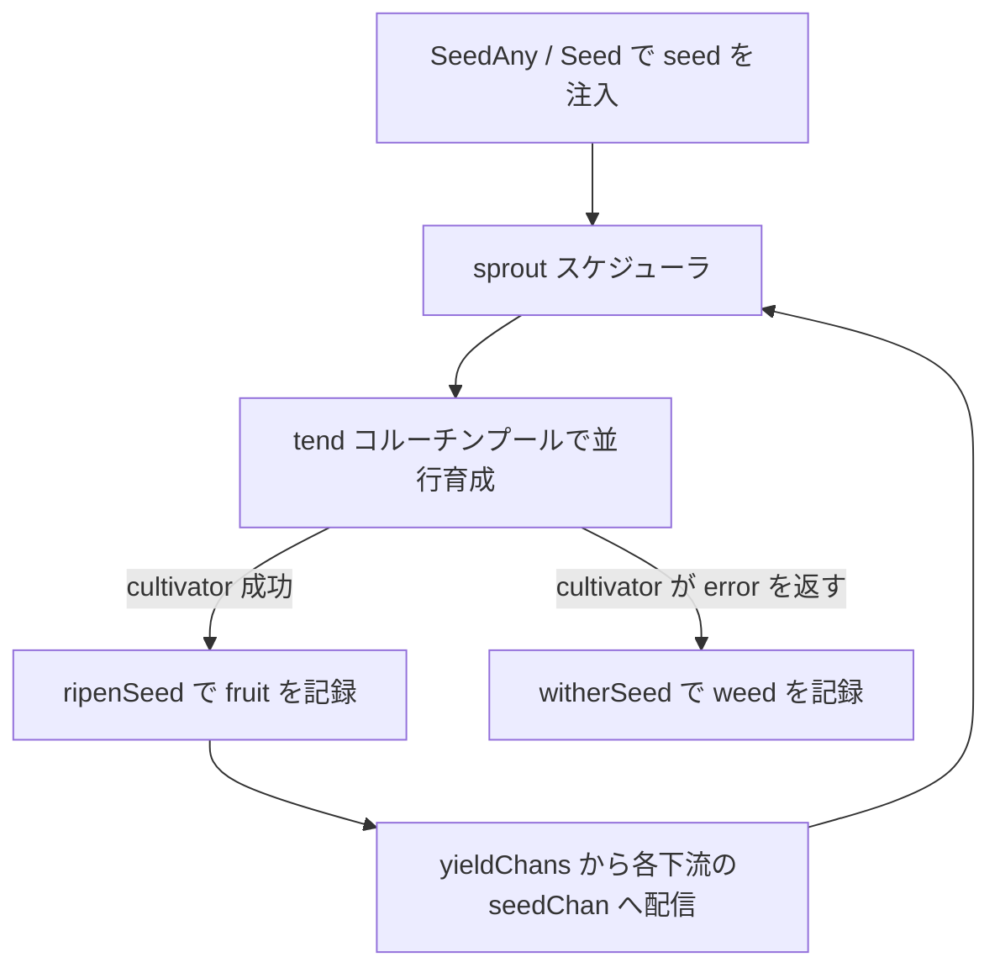

# pkg/api/api.go

> 📅 最終更新日: 2026/09/24

## 役割

`pkg/api` は CelestialGrow プロジェクトの**公開統一エントリパッケージ**です。このパッケージは新しい実装を一切導入せず、`pkg/farm`、`pkg/plot`、`pkg/observer` の主要な型とよく使う設定項目を 3 つの形式で再公開します。

1. **型エイリアス**: `type X = pkg.Y`。例えば `Farm`、`Plot`、`SplitPlot`、`RoutePlot`、`PlotNode`、`Option` です。
2. **コンストラクタの薄いラッパー**: `NewFarm`、`NewPlot`、`NewSplitPlot`、`NewRoutePlot`、`NewProgressBar`。
3. **パッケージレベルの関数変数**: `WithTenders`、`WithChanSize`、`WithMaxRetries`、`WithRetryDelay`、`WithRetryIf`、`WithLogLevel`。

下流のユーザーは `github.com/Mr-xiaotian/CelestialGrow/pkg/api` という 1 つのパッケージをインポートするだけで、フレームワーク全体を利用できます。

エクスポートされる項目はすべてエイリアス、関数変数、または 1 層のパススルーラッパーであるため、本パッケージの振る舞いの契約は完全に下位パッケージによって決まります。本ドキュメントでは「エクスポートシンボル一覧 + 型パラメータのセマンティクス + 既定値 + エラーシナリオ」に焦点を当てます。

## 主要なオブジェクト

| シンボル | 分類 | 参照先 | 説明 |
|------|------|------|------|
| `Farm` | 型エイリアス | `farm.Farm` | 複数のノードからなる静的な有向グラフで、ノード登録、ハイパーエッジ的な接続、spout 管理、全体のスケジューリングを担当します。 |
| `Plot[S, F]` | ジェネリック型エイリアス | `plot.Plot[S, F]` | 基本となる並行ノード。`S` は入力 seed 型、`F` は出力 fruit 型です。1 つの seed の処理に成功するごとに、下流へ **1 つ** の `F` を転送します。 |
| `SplitPlot[S, F]` | ジェネリック型エイリアス | `plot.SplitPlot[S, F]` | 分割ノード。`S` は入力 seed 型で、処理関数は `[]F` を返し、その**各要素を独立した yield として**それぞれの下流へ転送します。 |
| `RoutePlot[S, Y]` | ジェネリック型エイリアス | `plot.RoutePlot[S, Y]` | ルーティングノード。`S` は入力 seed 型で、処理関数は `map[string]Y` を返します。`key` は宛先となる下流の名前、`value` はその下流にのみ送信されます。 |
| `PlotNode` | 型エイリアス | `plot.PlotNode` | ジェネリックパラメータを消去した統一ノードインターフェースで、`Farm` はこれを使って seed/fruit 型がそれぞれ異なるノードを保持します。 |
| `Option` | 型エイリアス | `plot.Option` | ノードのオプション設定で、実体は `func(*plotOptions)` です。`plotOptions` が非公開のため、パッケージ外では `Option` を**独自定義できず**、組み込みの `With*` シリーズのみ使用できます。 |

> 型エイリアス（`type X = Y`）とは、`pkg/api` でこれらの型を使用するセマンティクスが下位パッケージを直接使用する場合と完全に等価であることを意味し、インターフェースに変化は生じません。下位パッケージのメソッドセットの変更は直ちに本パッケージに反映されます。

### `PlotNode` インターフェースの契約

`PlotNode` は `Farm` がノードを管理する際に使用する統一インターフェースで、「グラフ接続 + 実行時の組み立て + 実行制御」に必要な最小限の能力をカバーします（実装は `pkg/plot/plot_base.go` にあります）。

| メソッド | 役割 |
|------|------|
| `GetName() string` | ノード名を返します。`Farm` はこれを使って一意性の検証と接続時のアドレス解決を行います。 |
| `GetState() int32` | 状態を返します: `0` = idle、`1` = running、`2` = done。 |
| `GetSeedChanAny() any` | seed チャネルを `any` として返し、`ConnectTo` が型アサーションを行うために使用します。 |
| `ConnectTo(next PlotNode) error` | 本ノードの出力を下流の入力に接続します。上流下流の型が互換でない場合はエラーを返します。 |
| `SetUpstreamYieldCounter(name string, yieldCounter *atomic.Int64)` | 上流の産出カウンタを登録し、seal の集約と seed の統計に使用します。 |
| `BindInlet(logChan chan<- persist.LogRecord, lifecycleChan chan<- persist.LifecycleRecord)` | ログとライフサイクルの書き込みチャネルをバインドします。`Farm.Run` または standalone の `Plot.Run` から呼び出されます。 |
| `SetEventClient(eventClient runtime.EventClient)` | イベントクライアントを注入します。`Farm.AddPlot` はすべてのノードに Farm のクライアントを共有させます。 |
| `StartAsync()` | スケジューラを非同期に起動します（呼び出し前に必ず inlet をバインドする必要があります）。 |
| `WaitAsync()` | バックグラウンドのコルーチンが終了するのを待機します。 |
| `SeedAny(seed any) error` | `any` として seed を 1 つ投入し、内部で型アサーションを行います。 |
| `Seal()` | 本ノードに「外部入力の終了」信号を送信します。 |

典型的な実装は `basePlot` を埋め込んだ 3 つのノードです: `*plot.Plot[S, F]`、`*plot.SplitPlot[S, F]`、`*plot.RoutePlot[S, Y]`。

## 主要な関数

### `NewFarm(name string, logLevel string) *Farm`

`Farm` を作成して返します。内部でログ spout、ライフサイクル spout、およびそれらの inlet も同時に作成します。

- `name`: Farm の名前で、ログの識別（`FarmStart` / `FarmEnd` の記録）に使用します。
- `logLevel`: Farm **自身**のログ inlet の最低レベル（`"DEBUG"` / `"INFO"` / `"WARN"` / `"ERROR"`）です。各ノードのログレベルはノード自身の `WithLogLevel` で決まり、既定は `"INFO"` です。
- error は返しません。作成後すぐに `AddPlot` / `Connect` / `Run` を実行でき、呼び出し側が自分で `BindInlet` する必要はありません。

### `NewPlot[S any, F any](name string, cultivator func(S) (F, error), opts ...Option) *Plot[S, F]`

基本的な並行ノードを作成します。

- `name`: ノード名で、同一の `Farm` 内で一意でなければなりません。
- `cultivator`: 処理関数です。`error` を返した場合は `WithMaxRetries` / `WithRetryDelay` / `WithRetryIf` の戦略に従ってリトライし、リトライを使い切ると weed（失敗）として記録します。
- `opts`: オプション設定です。「設定関数」を参照してください。

### `NewSplitPlot[S any, F any](name string, splitter func(S) ([]F, error), opts ...Option) *SplitPlot[S, F]`

分割ノードを作成します。`splitter` は 1 つの seed を `[]F` にマッピングします。成功後、seed 全体は **1 つの fruit** として記録されますが、接続済みの**各**下流へそれぞれ `len(fruits)` 個の yield を送信します。

### `NewRoutePlot[S any, Y any](name string, cultivator func(S) (map[string]Y, error), opts ...Option) *RoutePlot[S, Y]`

ルーティングノードを作成します。`cultivator` が返すルーティングテーブルでは、`key` が宛先となる下流の名前、`value` がその下流へ送る yield です。**異なる下流は異なる yield を受け取ることができ、ルーティングされていない下流は一切データを受け取りません**。ルーティングテーブルに存在しても接続されていない下流はスキップされ、他のルーティング項目には影響しません。

### `NewProgressBar(description string) *observer.ProgressBar`

ターミナルプログレスバーオブザーバーを作成します。`description` はプログレスバーの接頭辞の位置に表示されます。戻り値は `Plot.AddObserver(...)` を通じて任意のノードに直接登録できます。

プログレスバーは `observer.Observer` インターフェースの `OnStart(total)` / `OnProgress(completed, total)` / `OnFinish(completed, total)` コールバックを監視し、手動で駆動する必要はありません。

> 下位の `ProgressBar` は**遅延初期化**です。最初に `total > 0` のイベントを受け取ったときに初めて内部の `progressbar` インスタンスを作成します。ノードの seed 総数が `0` の場合はプログレスバーを作成しません。

## 設定関数

`With*` は本パッケージでは**パッケージレベルの変数**（関数値）として転送されます。例えば `WithTenders = plot.WithTenders` です。`WithRetryDelay` のみ 1 層のクロージャで戻り値の型 `Option` を明示していますが、外部から見た振る舞いは下位とまったく同じです。

```go
package main

import (
    "context"
    "errors"
    "time"

    grow "github.com/Mr-xiaotian/CelestialGrow/pkg/api"
)

func main() {
    p := grow.NewPlot("worker", func(seed int) (int, error) {
        return seed * 2, nil
    },
        grow.WithTenders(4),
        grow.WithChanSize(16),
        grow.WithMaxRetries(3),
        grow.WithRetryDelay(func(attempt int) time.Duration {
            return time.Duration(attempt) * 100 * time.Millisecond
        }),
        grow.WithRetryIf(func(err error) bool { return !errors.Is(err, context.Canceled) }),
        grow.WithLogLevel("DEBUG"),
    )

    p.Run([]int{1, 2, 3})
}
```

| 関数 | 役割 | 既定値 | 備考 |
|------|------|--------|------|
| `WithTenders(n int)` | 並行 tender（世話をするコルーチン）数を設定します。つまり `sprout` セマフォの容量です。 | `runtime.NumCPU()` | 単一ノードの並行度を決定します。 |
| `WithChanSize(n int)` | seed チャネル `seedChan` のバッファサイズを設定します。 | `runtime.NumCPU()` | 下流の産出チャネルは下流の `seedChan` を直接再利用します。バッファが満杯になると上流下流がブロックし、自然なバックプレッシャーが形成されます。 |
| `WithMaxRetries(n int)` | 最大リトライ回数（**初回の実行は含みません**）。 | `1` | `WithMaxRetries(2)` は最大 3 回の実行を意味します。 |
| `WithRetryDelay(fn func(attempt int) time.Duration)` | リトライ間隔の戦略を設定します。`attempt` は `1` から増加します。 | `func(int) time.Duration { return 0 }`（即時リトライ） | `pkg/api` ではクロージャで二重にラップしており、引数の型は下位と一致します。 |
| `WithRetryIf(fn func(error) bool)` | エラーフィルタです。`true` を返したエラーのみがリトライをトリガーします。 | `func(error) bool { return true }`（すべてリトライ） | リトライ不可のエラー（`context.Canceled` など）を除外するために使用できます。 |
| `WithLogLevel(level string)` | 現在のノードのログ最低レベルを設定します。 | `"INFO"` | そのノードにのみ作用します。Farm 自身のレベルは `NewFarm` 時に設定します。 |

> 既定値はすべて `pkg/plot/option.go` の `defaultOptions()` に由来し、下位の既定値を変更すれば全体に反映されます。
>
> リトライのセマンティクス（`basePlot.tend`）: 最大で `maxRetries + 1` 回実行します。`retryIf(err)` が `false` を返すと直ちにリトライを停止します。`cultivator` が panic した場合は `recover` で捕捉されて失敗として記録され、エラーテキストは `cultivator panic: ...` になります。

## 使用例

### Farm モード（線形パイプライン）

```go
package main

import (
    "fmt"

    grow "github.com/Mr-xiaotian/CelestialGrow/pkg/api"
)

func main() {
    double := grow.NewPlot("double", func(seed int) (int, error) {
        return seed * 2, nil
    }, grow.WithTenders(2))

    format := grow.NewPlot("format", func(seed int) (string, error) {
        return fmt.Sprintf("result=%d", seed), nil
    })

    format.AddObserver(grow.NewProgressBar("format"))

    farm := grow.NewFarm("demo_farm", "INFO")
    if err := farm.AddPlot(double, format); err != nil {
        panic(err)
    }
    if err := farm.Connect([]grow.PlotNode{double}, []grow.PlotNode{format}); err != nil {
        panic(err)
    }

    if err := farm.Run(map[string][]any{
        "double": {1, 2, 3, 4},
    }); err != nil {
        panic(err)
    }
}
```

`farm.Run` を呼び出した後、フレームワークが各ノードに対して行う処理の順序は次のとおりです。



### 分割とルーティング

```go
package main

import (
    "fmt"

    grow "github.com/Mr-xiaotian/CelestialGrow/pkg/api"
)

func main() {
    // 一颗种子拆成多个 yield（F = string）
    split := grow.NewSplitPlot("split", func(seed int) ([]string, error) {
        return []string{fmt.Sprintf("v%d", seed), fmt.Sprintf("x%d", seed)}, nil
    }, grow.WithTenders(2))

    // 按 yield 长度把它们路由到不同下游（Y = string）
    route := grow.NewRoutePlot("route", func(seed string) (map[string]string, error) {
        if len(seed)%2 == 0 {
            return map[string]string{"left": "L-" + seed}, nil
        }
        return map[string]string{"right": "R-" + seed}, nil
    })

    left := grow.NewPlot("left", func(seed string) (string, error) { return seed, nil })
    right := grow.NewPlot("right", func(seed string) (string, error) { return seed, nil })

    farm := grow.NewFarm("dispatch_farm", "INFO")
    if err := farm.AddPlot(split, route, left, right); err != nil {
        panic(err)
    }
    if err := farm.Connect([]grow.PlotNode{split}, []grow.PlotNode{route}); err != nil {
        panic(err)
    }
    if err := farm.Connect([]grow.PlotNode{route}, []grow.PlotNode{left, right}); err != nil {
        panic(err)
    }

    if err := farm.Run(map[string][]any{
        "split": {1, 2, 3},
    }); err != nil {
        panic(err)
    }
}
```

### Standalone モード

ノードが 1 つだけで `Farm` を構築する必要がない場合は、standalone モードを直接使用できます。

```go
package main

import (
    "fmt"

    grow "github.com/Mr-xiaotian/CelestialGrow/pkg/api"
)

func main() {
    p := grow.NewPlot("double", func(seed int) (int, error) {
        return seed * 2, nil
    }, grow.WithTenders(4))

    p.AddObserver(grow.NewProgressBar("double"))
    p.Run([]int{1, 2, 3, 4, 5})

    records, err := p.Harvest()
    if err != nil {
        panic(err)
    }

    for _, record := range records {
        fmt.Println(record.SeedJSON, record.Status, record.FruitJSON)
    }
}
```

`Plot.Run` は内部でローカルのログ/ライフサイクル spout を作成し、inlet をバインドし、終了後に spout を停止します。`Harvest` は `[]persist.LifecycleStatusRecord` を返し、現在のノードに永続化済みのすべての seed 状態スナップショットを読み取るために使用します。

## エラーシナリオ

| エントリ | 発生しうる error |
|------|--------------|
| `Farm.AddPlot` | `nil` ノードの指定、名前が空、名前の重複。 |
| `Farm.Connect` | `from` / `to` のリストが空、ノードがその Farm に登録されていない、上流下流の型が互換でない（`ConnectTo` のアサーション失敗）。 |
| `Farm.Run` | `inputs` に未登録のノード名が含まれる、`SeedAny` の seed 型がノードの `S` と一致しない。 |
| `PlotNode.SeedAny` | 指定した値をノードの `S` にアサートできない。 |
| `Plot.Harvest` | ライフサイクル spout が `nil`（standalone の `Run` で起動していない）、またはその handler が状態の照会をサポートしていない。 |
| `NewFarm` / `NewPlot` / `NewSplitPlot` / `NewRoutePlot` / `NewProgressBar` | error は返しません。 |

## 注意事項

1. **型エイリアス ≠ 新しい型**: `Farm`、`Plot[S, F]`、`SplitPlot[S, F]`、`RoutePlot[S, Y]`、`PlotNode`、`Option` はいずれも `type X = pkg.Y` であり、下位の型と互換的に使用できます。
2. **Option パターン**: すべてのオプション設定は関数型の `Option` を通じて注入されます。`NewPlot` シリーズは渡された順に適用されるため、同じフィールドに対して後から渡した `With*` が前のものを上書きします。`plotOptions` が非公開のため、パッケージ外では `Option` を独自定義できません。
3. **設定の既定値は下位が管理する**: 既定値は `pkg/plot/option.go` の `defaultOptions()` から取得します。
4. **型安全な接続**: `Farm.Connect` はソースグループとターゲットグループを完全接続（直積）し、各接続について上流の `ConnectTo` を呼び出し、その中の型アサーションで「上流の `F`/`Y` と下流の `S`」が一致するかを検証します。コンパイル時に検査できない非互換の組み合わせは実行時に阻止され、直接エラーが返されます。
5. **ジェネリックパラメータは「下流の seed 型」に合わせる必要がある**: `Plot` の `F`、`SplitPlot` の `F`、`RoutePlot` の `Y` はいずれも**下流の `seedChan` の要素型**を表し、接続時に実行時のアサーションで検証されます。
6. **プログレスバーオブザーバー**: `NewProgressBar` は `*observer.ProgressBar` を返し、下位は `github.com/schollz/progressbar/v3` に基づき、出力先は `os.Stderr` です。出力をリダイレクトしたり描画をカスタマイズしたりする場合は、下位パッケージを直接使用してください。
7. **インポートパス**: 別名 `grow "github.com/Mr-xiaotian/CelestialGrow/pkg/api"` で導入し、ローカル変数名（例えば `farm`、`plot`、`runtime`）との衝突を避けることを推奨します。
