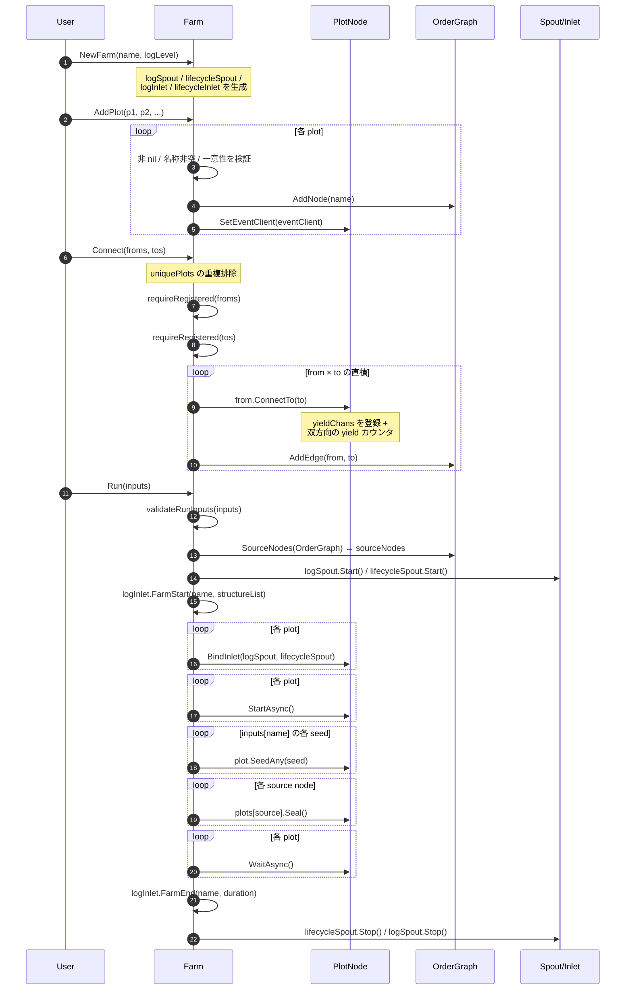

# pkg/farm/farm.go

> 📅 最終更新日: 2026/09/24

## 役割

`farm` パッケージは CelestialGrow の「グラフレベル」スケジューラであり、`farm.go` は `Farm` 型を提供する。複数の `plot.PlotNode` ノードを静的な有向グラフへと編成し、以下を担う：

- ノードの登録と名称の一意性検証
- グループ間（hyper-edge）方式の全結合の確立
- グローバルなログ / ライフサイクル spout の起動と inlet のバインド
- 実行前にグラフ構造をレンダリング（`getStructureList` → `RenderStructureList`）して farm 起動ログへ書き込む
- 統一的なソースノードの検出、初期種子の注入と seal
- すべての plot の完了を待機し、spout をクリーンアップする

`Farm` はオーケストレーション層のみを管理し、`Plot` のジェネリックな種子 / 果実の型には関与しない——これは `plot.PlotNode` インターフェースによって消去されている。`Farm` の内部では同ディレクトリの `OrderGraph` を用いてトポロジー情報を保持する。詳しくは [`graph.md`](./graph.md) を参照。

## 中核オブジェクト

### `Farm` 構造体

```go
type Farm struct {
    name        string
    plots       map[string]plot.PlotNode
    sourceNodes []string
    *OrderGraph

    eventClient runtime.EventClient

    logSpout       *funnel.Spout[persist.LogRecord]
    lifecycleSpout *funnel.Spout[persist.LifecycleRecord]
    logInlet       *persist.LogInlet
    lifecycleInlet *persist.LifecycleInlet
}
```

| フィールド | 役割 |
| --- | --- |
| `name` | Farm 名。ログ書き込み時に farm の識別子となる |
| `plots` | plot 名で索引されるノード表。登録検証と検索に用いる |
| `sourceNodes` | `Run` 時に一度だけ計算される「ソースノード代表」。各 Source SCC から 1 つ取る |
| `*OrderGraph` | 埋め込まれた有向グラフ。plot 間のエッジを記録し、トポロジーと SCC 分析に用いる |
| `eventClient` | 共有されるランタイムイベントクライアント。`AddPlot` によって各 plot に注入される |
| `logSpout` / `lifecycleSpout` | グローバルなログ / ライフサイクルメッセージの spout。`Run` 時に一括して起動する |
| `logInlet` / `lifecycleInlet` | farm 側の inlet ハンドル。`FarmStart`（グラフ構造を含む）/ `FarmEnd` のパッケージレベルログにのみ用いる |

### `PlotNode` インターフェース契約

`Farm` は `plot.PlotNode` インターフェースを通じて具体的な `Plot[S, F]` と疎結合になっている。このインターフェースは `pkg/plot/plot_base.go` に定義されており、`Farm` は以下のメソッドを呼び出す：

| メソッド | 用途 |
| --- | --- |
| `GetName() string` | 一意な識別とエッジのマッチング |
| `GetState() int32` | ノード状態の読み取り（`0=idle` / `1=running` / `2=done`） |
| `GetSeedChanAny() any` | `any` として `seedChan` を公開し、上流の `ConnectTo` が型アサーションを行えるようにする |
| `ConnectTo(next PlotNode) error` | 型の互換性を検証し、下流の yield チャネルを登録し、yield カウンタを双方向に配線する。型が一致しない場合は error を返す |
| `SetUpstreamYieldCounter(name string, yieldCounter *atomic.Int64)` | 上流名 + yield カウンタを登録し、`GetSeedNum` の集約と seal 待機に用いる |
| `BindInlet(logChan, lifecycleChan)` | `Run` 時にグローバル spout のチャネルをバインドする |
| `SetEventClient(runtime.EventClient)` | `AddPlot` 時に同一のイベントクライアントを一括注入する |
| `StartAsync()` / `WaitAsync()` | 非同期ライフサイクル制御 |
| `SeedAny(seed any) error` | `Run` 時に `inputs` に従って初期種子を注入する |
| `Seal()` | `Run` 時に各 source へ `SignalSeal` を送信する |

> yield カウンタの双方向配線は `ConnectTo` に内包されている（上流が `downstreamYields`、下流が `upstreamYields` を書き込む）ため、`Farm.Connect` では別途登録しない。インターフェースと実装の詳細は `pkg/plot` のドキュメントを参照。

## 公開シンボル

| シンボル | シグネチャ | 用途 |
| --- | --- | --- |
| `NewFarm` | `func NewFarm(name, logLevel string) *Farm` | Farm を構築し、2 つのグローバル spout と inlet を生成する |
| `PlotCount` | `func (f *Farm) PlotCount() int` | 登録済み plot の数を返す |
| `HasPlot` | `func (f *Farm) HasPlot(name string) bool` | 指定した plot が登録済みかを判定する |
| `GetPlot` | `func (f *Farm) GetPlot(name string) (plot.PlotNode, bool)` | 名前で plot を取得する。ok は存在有無を表す |
| `AddPlot` | `func (f *Farm) AddPlot(plots ...plot.PlotNode) error` | 1 つ以上の plot を登録する。非 nil、名称が非空かつ一意であることを要求する |
| `Connect` | `func (f *Farm) Connect(fromPlots, toPlots []plot.PlotNode) error` | ソースグループとターゲットグループの間に直積方式の接続を確立する |
| `Run` | `func (f *Farm) Run(inputs map[string][]any) error` | グラフ全体を同期的に実行し、すべての plot の完了を待つ |

> `Farm` には `SetLogLevel` のようなメソッドはない。ログレベルは `NewFarm` 時に `logLevel` パラメータを通じてグローバル `LogInlet` に注入され、実行時には変更できない。

## 主要フロー

### `AddPlot → Connect → Run` の全経路



### `AddPlot` がエラーを返すポイント

- いずれかの plot が `nil` → `plot is nil`
- 名称が空 → `plot name cannot be empty`
- 名称が重複 → `plot %q already exists`

注意：`AddPlot` は走査中に最初のエラーで直ちに返るため、既に `f.plots` とグラフに追加されたノードは**ロールバックされない**。

### `Connect` がエラーを返すポイント

- `fromPlots` / `toPlots` を重複排除した結果が空 → `from plots cannot be empty` / `to plots cannot be empty`
- いずれかの plot が farm に未登録 → `plot %q is not registered in farm`
- ある `from → to` の組が `from.ConnectTo(to)` の段階で型アサーションに失敗 → `plot.ConnectTo` のエラーをそのまま伝播する

> ⚠️ **部分的な失敗は取り消されない**：`Connect` は内側のループで一度失敗すると直ちに返る。既に確立された接続（`ConnectTo` 内部で上流の `yieldChans` が書き込まれ、yield カウンタが双方向に登録され、グラフに `AddEdge` 済み）は残る。後で再度 `Connect` した場合、グラフ層では重複エッジとして無視されるが、`PlotNode` 内部の `yieldChans` には古いマッピングが残る。再起動したい場合は新しい `Farm` を作成すること。

### `Run` がエラーを返すポイント

- `inputs` に未登録の plot が存在 → `plot %q is not registered in farm`
- `SeedAny` の型アサーションに失敗 → エラーをそのまま伝播する（この時点で一部の plot は既に `StartAsync` しているため、呼び出し側がリトライ時のグラフ状態を自ら保証する必要がある）

## 重要な詳細

### グループ間の直積

`Connect(froms, tos)` は両端に対してまず `uniquePlots` による重複排除 + `nil` のフィルタリングを行い、その後 `len(froms) × len(tos)` 本のエッジを確立する。たとえば：

```go
farm.Connect([]plot.PlotNode{root}, []plot.PlotNode{midA, midB})
// 等价于 root → midA 与 root → midB 两条独立边
```

注意：「ソースグループ」に現れるノードのみが「ターゲットグループ」の各ノードとの接続を確立する。`midA` と `midB` の間にはエッジは張られない。

### Source ノードの seal

`Run` は `SourceNodes(OrderGraph)` を通じて各 Source SCC の代表ノードを計算し、それに対して `Seal()` を呼び出す。`Seal()` は `Source == sourceInput`（すなわち `__input__`）で `SignalSeal` を送信し、上流接続を持つ plot に対して「強制終了」の意味論をトリガーする——まだ到達していない上流の seal を待たなくなる。

### 並行制御

- `Run` は**同期**呼び出しである。順に `StartAsync` した後、`WaitAsync` によってすべての plot の終了を待つ。
- `StartAsync` の内部では `sync.WaitGroup.Go`（Go 1.25 の新しい書き方）を用いて各 plot の `sprout` スケジューラを起動する。
- グローバルな `logSpout` / `lifecycleSpout` の容量はいずれも 100、flush 間隔は `1s` であり、`Run` の末尾で `defer` の順序に従って停止される。

### グラフ構造のレンダリング

`Run` は起動ログを書く前に `getStructureList()` を呼び出す。これは `Nodes()`、`OutEdges()` と今回算出した `sourceNodes` を `RenderStructureList` に渡し、枠付きのツリー状テキスト行のリストへレンダリングしてから、`logInlet.FarmStart` に渡して 1 行ずつ出力する。レンダリング規則とアルゴリズムの詳細は [`render.md`](./render.md) を参照。

> `sourceNodes` は `Run` の中で `logInlet.FarmStart` より先に計算されるため、レンダリングされた構造と実際に seal するノード集合は一致する。

### `pkg/persist` との協調

`Farm` は `Run` の間、`logInlet.FarmStart(name, structureList)` / `FarmEnd(name, duration)` を通じて「farm レベル」の実行サマリを書く。ここで `structureList` は前節のレンダリング結果である。各 plot は依然として `Plot` 自身が `BindInlet` で得た inlet を通じて、それぞれの `PlotStart` / `PlotEnd` / `SeedInput` / `SeedRipen` / `SeedWither` / `SeedReplant` の記録を書く。

### `pkg/runtime` との協調

`eventClient` は `AddPlot` 時に注入され、すべての plot が同一のイベント ID 名前空間を共有するため、plot をまたぐ seed → fruit → seal のイベント ID 連鎖を追跡できる。`Farm` 自身は直接イベントを発射しない。

## 使用例

以下の例は README の farm モードに対応し、`pkg/farm` を直接使用する版のみを示す（実際のプロジェクトでは `pkg/api` 経由が推奨される）：

```go
package main

import (
    "fmt"

    "github.com/Mr-xiaotian/CelestialGrow/pkg/farm"
    "github.com/Mr-xiaotian/CelestialGrow/pkg/plot"
)

func main() {
    double := plot.NewPlot("double", func(seed int) (int, error) {
        return seed * 2, nil
    }, plot.WithTenders(2))

    format := plot.NewPlot("format", func(seed int) (string, error) {
        return fmt.Sprintf("result=%d", seed), nil
    })

    f := farm.NewFarm("demo_farm", "INFO")
    if err := f.AddPlot(double, format); err != nil {
        panic(err)
    }
    if err := f.Connect([]plot.PlotNode{double}, []plot.PlotNode{format}); err != nil {
        panic(err)
    }

    if err := f.Run(map[string][]any{
        "double": {1, 2, 3, 4},
    }); err != nil {
        panic(err)
    }
}
```

## 注意事項

- **テストカバレッジ**：`pkg/farm` 配下の `farm_connect_test.go`、`farm_start_test.go`、`farm_structure_test.go`、`farm_route_test.go`、`farm_split_test.go`、`graph_test.go`、`render_test.go` が共同で、登録、接続（型不一致 / ハイパーエッジ / 重複名を含む）、`Run` の線形フロー、`121` / `21-fanin` / 複数の連結成分、`RoutePlot` の有向ルーティング、`SplitPlot` の分割、グラフアルゴリズムと構造レンダリングなどのシナリオをカバーしている。詳細は各テストの説明ドキュメントを参照。
- **グラフとノードの同期**：`OrderGraph` のノード集合と `f.plots` は強く等価ではない——`AddNode` は `Connect` における `AddEdge` によっても自動補完される。`Run` の `SourceNodes` は `OrderGraph` のビューを用いるため、孤立した plot（エッジが無いが `AddPlot` 済み）も source と見なされ `Seal()` を受け取る。
- **再入不可**：`Run` には並行保護がない。同一の `Farm` インスタンスで複数回の `Run` を並行実行することはできず、`Run` の実行中に `AddPlot` / `Connect` することもできない。
- **エラーからの復旧**：`Run` が失敗した後、一部の plot は既に起動している可能性がある。再実行したい場合は新しい `Farm` インスタンスを作成すること。
