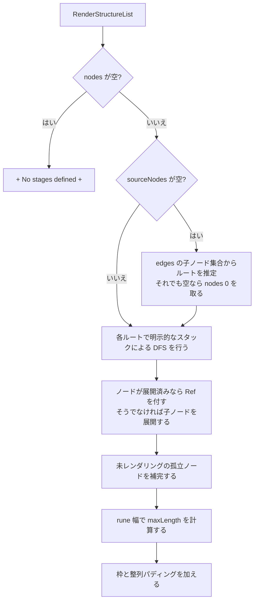

# pkg/farm/render.go

> 📅 最終更新日: 2026/09/24

## 役割

`render.go` は `OrderGraph` のグラフ構造（ノード集合 + 出エッジ隣接リスト + ソースノード）を**枠付きのツリー状テキスト行リスト**へレンダリングし、`Farm.Run` が起動ログへ書き込めるようにする。純粋関数的なレンダリングツールであり、状態を一切保持しない。

`Farm` における唯一の呼び出し点は `Farm.getStructureList()` である：

```go
func (f *Farm) getStructureList() []string {
    return RenderStructureList(f.Nodes(), f.OutEdges(), f.sourceNodes)
}
```

## 中核オブジェクト

### `RenderStructureList`

```go
func RenderStructureList(nodes []string, edges map[string][]string, sourceNodes []string) []string
```

| パラメータ | 意味 |
| --- | --- |
| `nodes` | すべてのノード名。順序は「孤立ノード」と「推定ソースノード」の追加順に影響する |
| `edges` | 出エッジ隣接リスト（`node → 後続リスト`）。通常は `OrderGraph.OutEdges()` に由来する |
| `sourceNodes` | レンダリングのルートノード。空の場合は規則に従って自動的に推定する |

戻り値はそのまま 1 行ずつ出力できる文字列スライスであり、上下の枠を既に含む。

### `renderFrame`（内部）

```go
type renderFrame struct {
    name   string
    prefix string
    isLast bool
    isRoot bool
}
```

明示的なスタックによる反復 DFS のスタックフレーム：`prefix` は現在行のインデントプレフィックス、`isLast` は接続子（`╞-->` または `╘-->`）を決め、`isRoot` はルートノードを表す（接続子を描かず、子ノードのプレフィックスは空）。これはレンダリングの私有実装の詳細であり、公開 API からは公開されない。

## レンダリング規則

1. **ルートノードは接続子を描かない**。ノード名をそのまま出力する。非ルートノードは `╞-->`（末子でない）または `╘-->`（末子）の接続子を用いる。
2. **サイクル / 共有サブグラフのノードは 1 回だけ展開する**：再び現れた場合は現在行に ` [Ref]` を付加し、その子ノードを再帰しない。
3. **ソースノードの推定**：`sourceNodes` が空のとき、`nodes` から「いずれの `edges` の子ノード集合にも現れない」ノードをルートとして選ぶ。それでも空であれば `nodes[0]` に退化する。
4. **孤立ノードの補完**：いずれのルートからもレンダリングされなかったノード（`RenderStructureList` が展開しなかったもの）を末尾に追加する。
5. **複数ルートの区切り**：異なるルートの間に空行を 1 行挿入する。
6. **枠の整列**：**rune 数**（`utf8.RuneCountInString`）で最大行幅を計算して整列するため、マルチバイトの接続子 `╞` / `╘` / `│` が枠を崩すことはない。
7. **空グラフのプレースホルダー**：`nodes` が空のときは直接 `["+ No stages defined +"]` を返す。

> この関数は**明示的なスタックによる反復**の DFS 先行順走査（再帰ではない）を用いて、深い連鎖グラフが Go の再帰深さ制限に達するのを避ける。`render_test.go` は 5000 ノードの深い連鎖で特にこの点を回帰している。

## 主要フロー



## 使用例

```go
package main

import (
    "fmt"

    "github.com/Mr-xiaotian/CelestialGrow/pkg/farm"
)

func main() {
    nodes := []string{"a", "b"}
    edges := map[string][]string{"a": {"b"}}

    for _, line := range farm.RenderStructureList(nodes, edges, []string{"a"}) {
        fmt.Println(line)
    }
    // +-------+
    // | a     |
    // | ╘-->b |
    // +-------+
}
```

共有サブグラフ / サイクルは `[Ref]` としてマークされる：

```go
nodes := []string{"c1", "c2", "c3"}
edges := map[string][]string{
    "c1": {"c2"},
    "c2": {"c3"},
    "c3": {"c1"},
}
// c1 首次展开输出连接符，回到 c1 时输出 "c1 [Ref]"
farm.RenderStructureList(nodes, edges, []string{"c1"})
```

## 注意事項

- **無状態・純関数**：同じ入力は同じ結果を生む。関数は `nodes` / `edges` を変更せず、グローバル状態にも一切アクセスしない。
- **ノード集合が無順序であることの影響**：`nodes` は通常 `OrderGraph.Nodes()` に由来し、順序は保証されない。したがって同一のビルド成果物内でも、複数ルート間の順序や孤立ノードの追加順は不安定になりうる（詳しくは [`graph.md`](./graph.md) を参照）。
- **テストカバレッジ**：`pkg/farm/render_test.go` は基本形状、正確な出力、空グラフ、サイクルの `[Ref]`、5000 ノードの深い連鎖と孤立ノード / ソースノードの推定をカバーする。詳しくは `render_test.md` を参照。
