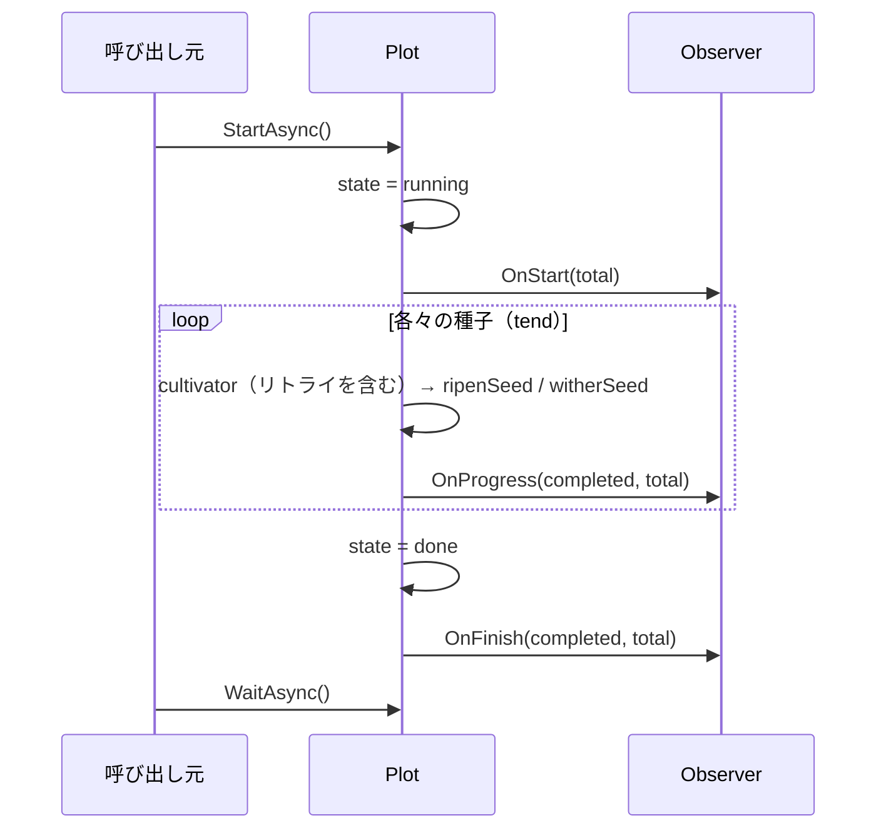

# pkg/observer/observer.go

> 📅 最終更新日: 2026/09/24

## 役割

`pkg/observer/observer.go` は**種子育成進捗オブザーバー**のインターフェース契約 `Observer` を定義し、`pkg/plot` と外部の進捗表示コンポーネント（典型的な実装は [`progress.md`](./progress.md) を参照）との間の疎結合ポイントとなっている。Plot は `Observer` を通じて起動・進捗更新・完了の 3 つの時点で業務側にコールバックし、これにより具体的な UI / 出力媒体に結合することなく、育成パイプラインの動作状態を可観測にする。

## 中核オブジェクト

### `Observer` インターフェース

```go
type Observer interface {
    OnStart(total int)
    OnProgress(completed, total int)
    OnFinish(completed, total int)
}
```

| メソッド | 発火タイミング | パラメータの意味 |
|------|----------|----------|
| `OnStart(total int)` | `notifyStart` 内：まず `state` を 1（running）に設定し、その後オブザーバーを走査して呼び出す。`StartAsync` の非同期 goroutine 内、`sprout` スケジューラの起動前に位置する | `total` = `GetSeedNum()`（ローカルに播いた数 + 上流が産出した累計数）。この時点では播種はまだ始まっておらず、実際の値は通常 `0` である |
| `OnProgress(completed, total int)` | 各々の種子が最終結果を出した後に 1 回呼び出される：成功経路 `ripenSeed`、失敗経路 `witherSeed` のいずれも先にカウントを更新してから `reportProgress` を呼び出す（両者とも `tend` goroutine 内で動作する）。リトライ処理自体は発火しない | `completed` = `GetCompleted()`（果実 + 雑草）、`total` = `GetSeedNum()` |
| `OnFinish(completed, total int)` | `sprout` が返った後に `notifyFinish` によって 1 回呼び出される：まず `state` を 2（done）に設定し、その後カウントをスナップショットする | `OnProgress` と同義であり、終了時のスナップショットに過ぎない |

> インターフェースは暗黙の契約である。上記 3 つのメソッドを実装した任意の型は、明示的な宣言なしに自動的に `Observer` を満たす。

## 登録方法

オブザーバーのリストは `pkg/plot/plot_base.go` の `basePlot[S, F, Y].observers []observer.Observer` フィールドが担い、`AddObserver` を通じてのみ追加できる。`Plot[S, F]` は `*basePlot[S, F, F]` を埋め込んでいるため、このメソッドは `Plot` / `SplitPlot` / `RoutePlot` の 3 種類のノードすべてで利用できる：

```go
// pkg/plot/plot_base.go
func (p *basePlot[S, F, Y]) AddObserver(observer observer.Observer) {
    p.observers = append(p.observers, observer)
}
```

> ⚠️ **注意**：本ファイルのソースコメントには「`NewPlot` の observers パラメータで注入する」と書かれているが、`plot.NewPlot` / `api.NewPlot` のシグネチャは `(name string, cultivator func(S) (F, error), opts ...Option)` であり、オブザーバーを受け取らない。現在の実装では `observers` は `AddObserver` によってのみ追加できる。

`ProgressBar` を登録する典型的な用法（standalone モードでは `Run` が `BindInlet` / `StartAsync` / `Seed` / `Seal` / `WaitAsync` を完了させる）：

```go
p := plot.NewPlot[Seed, Fruit]("harvester", cultivate, opts...)
p.AddObserver(observer.NewProgressBar("harvesting"))

p.Run(seeds)
```

手動で入力制御を行いたい場合は、自ら先に `BindInlet` してから `StartAsync` する必要がある。そうしないと `logInlet` が nil になる：

```go
p.BindInlet(logChan, lifecycleChan) // Farm 模式下由 Farm.Run 代劳
p.StartAsync()
p.Seed(seed)
p.Seal()
p.WaitAsync()
```

`AddObserver` は重複排除を行わないため、同じインスタンスを複数回追加するとコールバックが複数回発火する。

## Plot ライフサイクルとの接続点

Plot は 3 つの内部フックにおいて、登録順に `p.observers` を走査し、対応するメソッドを順に呼び出す：

```go
// pkg/plot/plot_base.go
func (p *basePlot[S, F, Y]) notifyStart() {
    p.state.Store(1) // running
    seedNum := p.GetSeedNum()
    for _, observer := range p.observers {
        observer.OnStart(seedNum)
    }
}

func (p *basePlot[S, F, Y]) reportProgress() {
    completed := p.GetCompleted()
    seedNum := p.GetSeedNum()
    for _, observer := range p.observers {
        observer.OnProgress(completed, seedNum)
    }
}

func (p *basePlot[S, F, Y]) notifyFinish() {
    p.state.Store(2) // done
    completed := p.GetCompleted()
    seedNum := p.GetSeedNum()
    for _, observer := range p.observers {
        observer.OnFinish(completed, seedNum)
    }
}
```

呼び出し順序は `StartAsync`（`pkg/plot/plot_base.go` の `*basePlot[S, F, Y]` に定義され、埋め込みによって `Plot` に昇格される）が編成する：



注意：

- `OnStart` と `OnFinish` はそれぞれ 1 回だけ発火する。`OnProgress` の発火回数は `果実数 + 雑草数` に等しい（種子レベルのリトライでは追加の発火はない）。
- 状態は `basePlot.state atomic.Int32` に格納され、値は `0=idle, 1=running, 2=done` である（`pkg/plot/plot_base.go` の `GetState` を参照）。Observer は `idle` を感知せず、`running` の開始時と `done` の終了時にのみ通知される。
- オブザーバーを走査する際に recover はない。`notifyStart` / `notifyFinish` における Observer の panic は `StartAsync` の非同期 goroutine を伝播して上位に達し、プロセス全体を直接 panic させる。`reportProgress` の panic はまず `tend` の `recover` に飲み込まれ、「cultivator panic」として誤って雑草に記録される。独自の Observer を実装する際は内部エラーを自ら処理すべきである。
- `AddObserver` は追加のみを行い、削除やクリアのインターフェースを提供しないため、Observer のリストは Plot のライフサイクル全体を通じて単調に増加し、同じインスタンスを重複して追加するとコールバックも重複する。

## 注意事項

- `Observer` のコールバックは Plot 内部の goroutine で発生する。`notifyStart` / `notifyFinish` は `StartAsync` goroutine、`reportProgress` は対応する `tend` goroutine で動作するため、独自実装では並行安全性を自ら保証する必要がある。
- `OnStart` の `total` は通常 `0` である。standalone の `Run` と `Farm.Run` はいずれも先に `StartAsync()` を呼び、その後で逐次 `Seed` / `SeedAny` するため、`notifyStart` と播種の間に競合状態が存在する。実装は `OnStart` で最終的な総量が得られると仮定してはならない（`ProgressBar` の遅延読み込みはまさにこのためである）。
- `OnProgress` の `total` は `GetSeedNum()` から取得され、「ローカルに播いた数 + 上流が産出した累計数」に等しく、上流が産出し続けるにつれて増大する。したがって `completed / total` は停滞したり後退したりする可能性があり（`completed` は `total` を超えることはない）、進捗バーの実装は比率が単調でないことを許容する必要がある。
- `Observer` はプロジェクト内で唯一の「オブザーバー」抽象であり、Farm が Plot の Observer リストにグローバルなコールバックを追加することはない。
