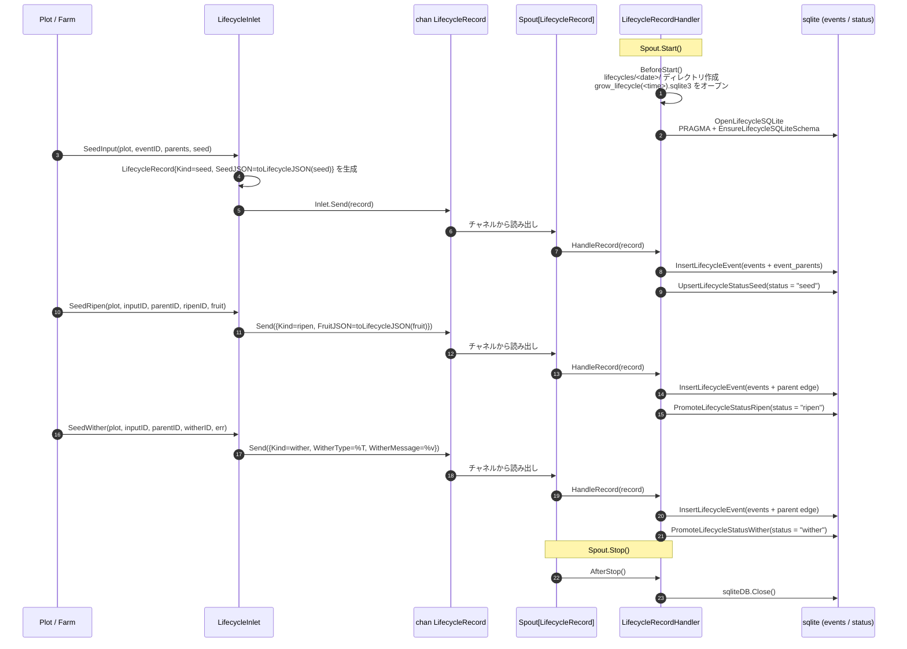

# pkg/persist/lifecycle.go

> 📅 最終更新日: 2026/09/24

## 役割

`pkg/persist/lifecycle.go` は、各種子の **育成の軌跡** を「イベント（events）」と「状態スナップショット（status）」の 2 種類のレコードに分解し、`LifecycleRecordHandler` を通じて `pkg/funnel` の非同期チャネルを購読して、[`sqlite.md`](./sqlite.md) が管理する SQLite ファイルへ書き込みます。同時に `LifecycleInlet` を通じて業務側向けのプロデューサ API（`SeedInput` / `SeedRipen` / `SeedWither`）を公開します。本ファイル自体は SQL を直接実行しません。永続化の詳細はすべて `sqlite.go` にあり、本ファイルはイベント → レコード → 永続化の **オーケストレーションと適応** のみを担当します。

> イベント ID は `runtime.EventClient`（例：`runtime.LocalEventClient.Emit`）が採番します。詳細は [`pkg/runtime/event.go`](../../../../pkg/runtime/event.go) を参照してください。本ファイルは `int` 形式の `EventID` をそのまま消費し、`runtime` パッケージには依存しません。

## 主要オブジェクト

### `LifecycleRecord` — チャネルペイロード

```go
type LifecycleRecord struct {
    Kind           string
    InputEventID   int
    CurrentEventID int
    ParentIDs      []int
    PlotName       string
    SeedJSON       string
    FruitJSON      string
    WitherType     string
    WitherMessage  string
    TS             float64
}
```

| フィールド | 意味 |
|------|------|
| `Kind` | 操作種別。次の 3 つのいずれか：`seed` / `ripen` / `wither`（パッケージ内定数 `lifecycleSeed` / `lifecycleRipen` / `lifecycleWither` で表現） |
| `InputEventID` | この種子（入力）のイベント ID。`status.input_event_id` に対応 |
| `CurrentEventID` | 今回生成されたイベント ID。`status.current_event_id` に対応し、`seed` 時は `InputEventID` と同じ |
| `ParentIDs` | 親イベント ID のリスト。`events` への書き込み時に `event_parents` の辺も同時に書き込む |
| `PlotName` | イベントが属する plot 名。`status.plot` に書き込む |
| `SeedJSON` | 種子ペイロードの JSON（`seed` 時のみプロデューサが提供） |
| `FruitJSON` | 果実の JSON（`ripen` 時のみプロデューサが提供） |
| `WitherType` | 枯死エラーの型文字列（`wither` 時のみ `fmt.Sprintf("%T", err)` で生成） |
| `WitherMessage` | 枯死エラーのテキスト（`wither` 時のみ `fmt.Sprintf("%v", err)` で生成） |
| `TS` | イベントのタイムスタンプ（秒、浮動小数点）。`time.Now().UnixMilli() / 1000` で生成 |

> `LifecycleRecord` は **フラット** な構造です。イベント本体（イベント ID / plot / タイムスタンプ / 親辺）はフィールドとして直接インライン化され、`sqlite.LifecycleEventRecord` をネストしません。

### `LifecycleRecordHandler` — コンシューマ側（Spout ハンドラ）

```go
type LifecycleRecordHandler struct {
    SQLitePath string
    sqliteDB   *sql.DB
}
```

`funnel.RecordHandler[LifecycleRecord]` を実装します。メソッドシグネチャは次のとおりです：

| メソッド | 呼び出しタイミング | 動作 |
|------|----------|------|
| `BeforeStart() error` | Spout 起動前 | `lifecycles/<YYYY-MM-DD>/` ディレクトリを作成し、`grow_lifecycle(<HH-MM-SS.mmm>).sqlite3` をオープンする。パスを `SQLitePath` に、接続ハンドルを `sqliteDB` に保存する |
| `HandleRecord(record LifecycleRecord) error` | レコード到着ごと | まず `sqliteDB != nil` を検査し、次に `record.Kind` に従って `InsertLifecycleEvent` + `UpsertLifecycleStatusSeed` / `PromoteLifecycleStatusRipen` / `PromoteLifecycleStatusWither` へルーティングする |
| `AfterStop() error` | Spout 停止後 | `sqliteDB` をクローズして nil を設定する |
| `LoadStatuses(plotName string) ([]LifecycleStatusRecord, error)` | 業務側が明示的に呼び出す | `sqliteDB` を優先的に再利用する。まだ初期化されていない場合は `SQLitePath` に従って再度オープンする |

> `SQLitePath` は公開フィールドとして公開されているため、呼び出し側は `AfterStop` の後でも `LoadStatuses` を通じて永続化済みの SQLite ファイルを再度オープンし、オフライン検索を行えます。
>
> `AfterStop` は `sqliteDB == nil` の場合に直接 `nil` を返すため、`BeforeStart` を呼んでいないインスタンスに対して呼び出しても安全です。

### `LifecycleInlet` — プロデューサ側

```go
type LifecycleInlet struct {
    funnel.Inlet[LifecycleRecord]
}
```

`funnel.Inlet[LifecycleRecord]` を埋め込み、その上に業務向けの送信メソッドを 3 つ重ねているだけです：

| メソッド | `Kind` | 動作 |
|------|--------|------|
| `SeedInput(plot string, eventID int, parentIDs []int, seed any)` | `seed` | seed レコードを 1 件送信する：`CurrentEventID = InputEventID = eventID`、`SeedJSON = toLifecycleJSON(seed)`。永続化時はまず `events` を書き込み（`status = "seed"`）、その後 `UpsertLifecycleStatusSeed` を実行する |
| `SeedRipen(plot string, inputEventID int, parentEventID int, ripenEventID int, fruit any)` | `ripen` | ripen レコードを 1 件送信する：`CurrentEventID = ripenEventID`、`ParentIDs = []int{parentEventID}`、`FruitJSON = toLifecycleJSON(fruit)`。永続化時はまず `events` を書き込み、その後 `PromoteLifecycleStatusRipen` を実行する |
| `SeedWither(plot string, inputEventID int, parentEventID int, witherEventID int, err error)` | `wither` | wither レコードを 1 件送信する：`CurrentEventID = witherEventID`、`ParentIDs = []int{parentEventID}`、`WitherType = %T`、`WitherMessage = %v`。永続化時はまず `events` を書き込み、その後 `PromoteLifecycleStatusWither` を実行する |

3 つのメソッドはいずれも内部で `time.Now().UnixMilli()` を使って `TS` を生成し、その後、埋め込まれた `Inlet` の `Send` を呼び出します。したがって **error を返しません**。送信タイムアウトは `funnel.Inlet` の内部で処理されます。

### `NewLifecycleInlet` — コンストラクタ

```go
func NewLifecycleInlet(ch chan<- LifecycleRecord, timeout time.Duration) *LifecycleInlet
```

- `ch` は対応する `funnel.Spout[LifecycleRecord].GetQueue()` から公開されている必要があります。
- `timeout` は `funnel.NewInlet` にそのまま渡されます。チャネルバッファが満杯のとき、`SeedInput` / `SeedRipen` / `SeedWither` 内部の `l.Send` はタイムアウト後に `inlet send timeout after <d>` を返します。

## 主要フロー

### イベント → レコード → 永続化の完全なパス



### `Kind` によるルーティング

`HandleRecord` はまずデータベースハンドルを検証し、内部の `switch record.Kind` で 3 方向にルーティングします。それ以外の値はすべて直接 `unsupported lifecycle operation: <kind>` を返します：

```go
func (l *LifecycleRecordHandler) HandleRecord(record LifecycleRecord) error {
    if l.sqliteDB == nil {
        return fmt.Errorf("生命周期 sqlite 未初始化")
    }

    switch record.Kind {
    case lifecycleSeed:
        InsertLifecycleEvent(l.sqliteDB, record.CurrentEventID, record.Kind, record.PlotName, record.TS, record.ParentIDs)
        UpsertLifecycleStatusSeed(l.sqliteDB, record.InputEventID, record.SeedJSON, record.PlotName, record.TS)
    case lifecycleRipen:
        InsertLifecycleEvent(l.sqliteDB, record.CurrentEventID, record.Kind, record.PlotName, record.TS, record.ParentIDs)
        PromoteLifecycleStatusRipen(l.sqliteDB, record.InputEventID, record.CurrentEventID, record.FruitJSON, record.TS)
    case lifecycleWither:
        InsertLifecycleEvent(l.sqliteDB, record.CurrentEventID, record.Kind, record.PlotName, record.TS, record.ParentIDs)
        PromoteLifecycleStatusWither(l.sqliteDB, record.InputEventID, record.CurrentEventID, record.WitherType, record.WitherMessage, record.TS)
    default:
        return fmt.Errorf("unsupported lifecycle operation: %s", record.Kind)
    }
}
```

要点：

- 3 つの Kind はいずれもまず `events` を書き込み（`event_type` は `record.Kind` をそのまま使用、すなわち `seed` / `ripen` / `wither`）、その後 `status` を更新します。
- `events.plot` と `status.plot` はいずれも `record.PlotName` に由来し、`status.ts` は `record.TS` に由来します。したがって 1 回の呼び出しで `status` テーブルに「現在のイベント種別 + plot + タイムスタンプ」を同時に記録できます。
- `InsertLifecycleEvent` が失敗した場合、状態更新は実行されません。イベントとその状態スナップショットの整合性が保たれます。

### ディレクトリとファイルの命名

`BeforeStart` は 2 つの時刻文字列から SQLite パスを組み立てます：

```text
SQLitePath = lifecycles/<YYYY-MM-DD>/grow_lifecycle(<HH-MM-SS.mmm>).sqlite3
```

- 日付フォーマット `2006-01-02` は当日の全イベントをカバーします（ログファイル `logs/grow_log(YYYY-MM-DD).log` の日付基準と一致）。
- 時刻フォーマット `15-04-05.000` は起動ごとに一意なファイル名を保証します。ディレクトリ内に複数の `.sqlite3` ファイルが存在する場合があります。
- ディレクトリ権限は `0755` で、ファイルは SQLite 自身が作成します（`sql.Open("sqlite", "file:...")`）。`BeforeStart` はファイルを明示的に作成しません。
- `os.MkdirAll` / `OpenLifecycleSQLite` が失敗した場合はそれぞれ `创建生命周期目录失败: ...` / `打开生命周期 sqlite 失败: ...` を返します。

### `LoadStatuses` の 2 モード

```go
func (l *LifecycleRecordHandler) LoadStatuses(plotName string) ([]LifecycleStatusRecord, error) {
    if l.sqliteDB != nil {
        return LoadLifecycleStatuses(l.sqliteDB, plotName)
    }
    if l.SQLitePath == "" {
        return nil, fmt.Errorf("生命周期 sqlite 未初始化")
    }
    db, err := OpenLifecycleSQLite(l.SQLitePath)
    if err != nil { return nil, ... }
    defer db.Close()
    return LoadLifecycleStatuses(db, plotName)
}
```

- プロセス内：Spout がまだ生存している → `sqliteDB` を再利用し、二重にオープンしません。
- プロセス外：Spout がすでに停止している（`AfterStop` が `sqliteDB` を nil に設定済み）→ `SQLitePath` を使って `OpenLifecycleSQLite` を再度実行し（PRAGMA + テーブル作成スクリプトをもう一度通す）、検索が終わったら直ちに `Close` します。
- どちらの分岐も未初期化の場合は `生命周期 sqlite 未初始化` を返します（再度のオープンに失敗した場合はさらに `重新打开生命周期 sqlite 失败: ...` でラップされます）。

### `toLifecycleJSON` のフォールバック

```go
func toLifecycleJSON(value any) string {
    data, err := json.Marshal(value)
    if err == nil { return string(data) }
    lifecycle, lifecycleErr := json.Marshal(fmt.Sprintf("%+v", value))
    if lifecycleErr == nil { return string(lifecycle) }
    return `"marshal_error"`
}
```

- まず `json.Marshal` を試みます。
- 失敗した場合は `fmt.Sprintf("%+v", value)` の文字列形式に退避します（struct / ポインタに対してのみフィールドを出力）。
- 2 度目も失敗した場合は `"marshal_error"`（正当な JSON 文字列）を固定で返します。これにより `status.seed_json` 列に SQLite の `NULL` が現れることがなくなり、下流は解析するだけで済みます。

## 公開シンボル一覧

| シンボル | 種別 | 用途 |
|------|------|------|
| `LifecycleRecord` | 型 | チャネルペイロード（`Kind` / イベントフィールド / 状態フィールドを含む） |
| `LifecycleRecordHandler` | 型 | コンシューマ側の `funnel.RecordHandler[LifecycleRecord]` 実装 |
| `LifecycleInlet` | 型 | プロデューサ側（`funnel.Inlet[LifecycleRecord]` を埋め込み） |
| `NewLifecycleInlet` | 関数 | `LifecycleInlet` を構築する |
| `(*LifecycleInlet).SeedInput` | メソッド | `seed` レコードを送信する |
| `(*LifecycleInlet).SeedRipen` | メソッド | `ripen` レコードを送信する |
| `(*LifecycleInlet).SeedWither` | メソッド | `wither` レコードを送信する |
| `(*LifecycleRecordHandler).BeforeStart` | メソッド | ディレクトリを作成し、データベースをオープンする |
| `(*LifecycleRecordHandler).HandleRecord` | メソッド | `Kind` に従ってルーティングし永続化する |
| `(*LifecycleRecordHandler).AfterStop` | メソッド | データベースをクローズしてハンドルを nil にする |
| `(*LifecycleRecordHandler).LoadStatuses` | メソッド | plot ごとにすべての状態スナップショットを読み取る |

> `lifecycleSeed` / `lifecycleRipen` / `lifecycleWither` はパッケージ内の非公開定数です。`toLifecycleJSON` はパッケージ内の非公開ヘルパー関数です。

## 使用例

`pkg/funnel` と組み合わせた最小の骨組み（エラー処理の詳細は省略）：

```go
package main

import (
    "context"
    "time"

    "github.com/Mr-xiaotian/CelestialGrow/pkg/funnel"
    "github.com/Mr-xiaotian/CelestialGrow/pkg/persist"
)

func main() {
    handler := &persist.LifecycleRecordHandler{}
    spout := funnel.NewSpout[persist.LifecycleRecord](handler, 100, time.Second)

    if err := spout.Start(); err != nil {
        panic(err)
    }
    inlet := persist.NewLifecycleInlet(spout.GetQueue(), time.Second)

    // 事件 1 输入种子 -> 事件 2 结果实
    inlet.SeedInput("stage_a", 1, nil, map[string]int{"v": 42})
    inlet.SeedRipen("stage_a", 1, 1, 2, map[string]int{"v": 84})

    // 事件 3 输入种子 -> 事件 4 枯萎
    inlet.SeedInput("stage_a", 3, nil, map[string]int{"v": 7})
    inlet.SeedWither("stage_a", 3, 3, 4, context.DeadlineExceeded)

    if err := spout.Stop(); err != nil {
        panic(err)
    }

    // 离线查询：spout 停止后 sqliteDB 已置空，LoadStatuses 会按 SQLitePath 重新打开
    statuses, err := handler.LoadStatuses("stage_a")
    if err != nil {
        panic(err)
    }
    for _, s := range statuses {
        println(s.Status, s.SeedJSON, s.FruitJSON, s.WitherType, s.WitherMessage)
    }
}
```

実行後、`lifecycles/<date>/grow_lifecycle(<time>).sqlite3` から 2 行の `status` を読み取れます。1 行は `status = "ripen"`（`fruit_json = {"v":84}`）、もう 1 行は `status = "wither"`（`wither_type` は `fmt.Sprintf("%T", context.DeadlineExceeded)` の結果、`wither_message` は `context deadline exceeded`）です。

## 注意事項

- **Kind ルーティングは単一の入口**：`HandleRecord` の `default` 分岐は `unsupported lifecycle operation: <kind>` を返します。`lifecycle.go` 内部で認めているのは `seed` / `ripen` / `wither` の 3 つの Kind だけであり、チャネルにそれ以外の値を投入するとパイプラインが壊れるため、プロデューサ側で保証する必要があります。
- **`sqliteDB == nil` はハードな失敗**：`HandleRecord` はハンドルが空の場合に直接 `生命周期 sqlite 未初始化` を返すため、必ず先に `Spout.Start()`（`BeforeStart` を発火）してからレコードを送信する必要があります。
- **タイムスタンプの単調性**：すべての `TS` は `LifecycleInlet` がパッケージング時に `time.Now().UnixMilli() / 1000` で生成します。同一ミリ秒内に大量のイベントがあると同一の TS が発生し、`status.ts` と `input_event_id` が共同で `LoadLifecycleStatuses` の並び順を決定します。
- **エラーメッセージは `fmt.Sprintf` 形式**：`WitherType` / `WitherMessage` は `fmt.Sprintf("%T", err)` / `fmt.Sprintf("%v", err)` で生成されるため、ラップされたエラーではエラーチェーンが失われる可能性があります。正確なエラーチェーンが必要な場合は業務側で別途記録するしかありません。
- **ディレクトリ権限は固定**：`lifecycles/<date>/` は一律 `0755` で、権限の絞り込みは行っていません。複数ユーザーのホストに配備する場合は `BeforeStart` の外側で別途 ACL を設定する必要があります。
- **Spout クローズ後は `sqliteDB == nil`**：`AfterStop` は `l.sqliteDB` を nil にするため、`LoadStatuses` は Spout が停止している場合に必ず「`SQLitePath` を再度オープンする」分岐を通り、履歴データが読み取れることを保証します。
- **`pkg/runtime` との分離**：`lifecycle.go` は `int` 形式の `EventID` のみを使用し、`runtime.LocalEventClient` を直接呼び出しません。イベント ID は依然として業務側（例えば `Plot`）で採番してから渡す必要があります。
