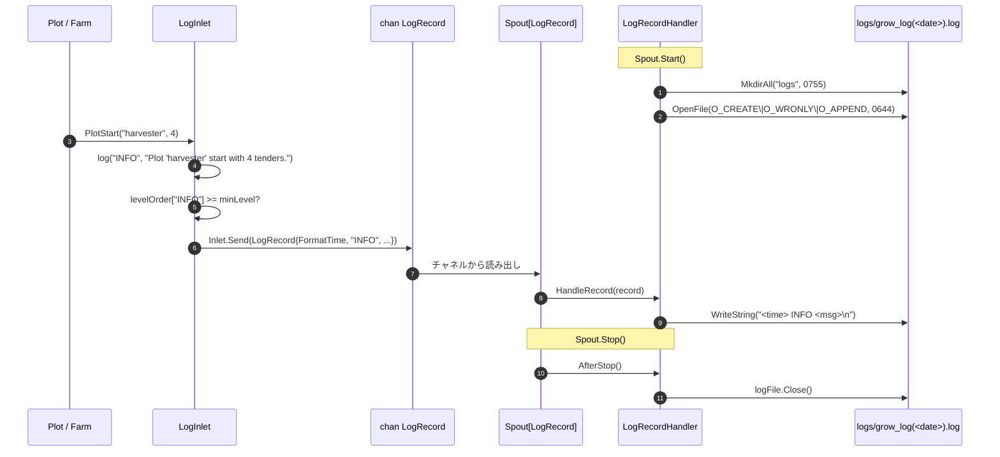

# pkg/persist/log.go

> 📅 最終更新日: 2026/09/24

## 役割

`pkg/persist/log.go` は **実行ログ** 向けの非同期ディスク書き込みを実装します。業務側は `LogInlet` を通じてレベル付きのログレコードを送信し、`funnel.Spout[LogRecord]` がスケジュールする `LogRecordHandler` が `logs/grow_log(YYYY-MM-DD).log` ファイルへ追記します。`LogInlet` には **最低レベルのしきい値** が組み込まれており、しきい値未満のレコードは黙って破棄されるため、上位の Plot / Farm は高頻度呼び出し時にフィルタリングを気にする必要がありません。

> ログと並行する **ライフサイクルの永続化** は [`lifecycle.md`](./lifecycle.md) / [`sqlite.md`](./sqlite.md) にあります。両者は `pkg/funnel` の Inlet/Spout 抽象を共用しますが、チャネルとファイルは **共用しません**。

## 主要オブジェクト

### `LogRecord` — チャネルペイロード

```go
type LogRecord struct {
    FormatTime string
    Level      string
    Message    string
}
```

| フィールド | 説明 |
|------|------|
| `FormatTime` | `LogInlet` が送信時に `time.Now().Format("2006-01-02 15:04:05")` で生成する。ファイルへの書き込み時には `Level` / `Message` と半角スペース 1 つで連結して 1 行にする |
| `Level` | ログレベルの文字列（`TRACE` / `DEBUG` / `SUCCESS` / `INFO` / `WARNING` / `ERROR` / `CRITICAL`） |
| `Message` | 業務側が提供する可読テキスト |

### `LogRecordHandler` — コンシューマ側（Spout ハンドラ）

```go
type LogRecordHandler struct {
    LogPath string
    logFile *os.File
}
```

`funnel.RecordHandler[LogRecord]` を実装します。メソッドシグネチャは次のとおりです：

| メソッド | 呼び出しタイミング | 動作 |
|------|----------|------|
| `BeforeStart() error` | Spout 起動前 | `logs/` ディレクトリを作成し（権限 `0755`）、`O_CREATE \| O_WRONLY \| O_APPEND`（権限 `0644`）で `logs/grow_log(<YYYY-MM-DD>).log` をオープンする |
| `HandleRecord(record LogRecord) error` | レコード到着ごと | `record.FormatTime + " " + record.Level + " " + record.Message + "\n"` をまとめて `WriteString` でファイルへ書き込む |
| `AfterStop() error` | Spout 停止後 | `logFile` ハンドルをクローズする（nil にはしない） |

> `LogPath` は公開フィールドで、実際にオープンしたファイルパスを公開するため、テストやトラブルシューティング時の特定が容易です。

### `LogInlet` — プロデューサ側

```go
type LogInlet struct {
    funnel.Inlet[LogRecord]
    minLevel int
}
```

- `funnel.Inlet[LogRecord]` を埋め込み、同時に `minLevel`（すなわち `levelOrder[level]` の数値）を保持します。
- 構築時は `NewLogInlet` を通じて文字列レベルを `minLevel` にマッピングします。**存在しないレベル文字列** は `INFO` に置き換えられ（`minLevel = levelOrder["INFO"]`）、エラーは返しません。

```go
func NewLogInlet(ch chan<- LogRecord, timeout time.Duration, level string) *LogInlet
```

### レベル表 `levelOrder`

```go
var levelOrder = map[string]int{
    "TRACE":    0,
    "DEBUG":    1,
    "SUCCESS":  2,
    "INFO":     3,
    "WARNING":  4,
    "ERROR":    5,
    "CRITICAL": 6,
}
```

数値が小さいほど優先度は低くなります。しきい値 `minLevel` は、この値と「**等しいか高い**」場合にのみ通過させることを意味します。例えば `NewLogInlet(ch, 1*time.Second, "WARNING")` は `minLevel = 4` と等価で、`WARNING` / `ERROR` / `CRITICAL` の 3 種類だけがファイルに書き込まれます。

## 主要フロー

### ディレクトリとファイルの配置

```text
logs/
└── grow_log(2026-09-24).log
```

- `BeforeStart` は `time.Now().Format("2006-01-02")` で日付を取得し、`logs/grow_log(YYYY-MM-DD).log` を組み立てます。
- `O_APPEND` により、同一日の複数回の起動や同一ホスト上の複数プロセスの書き込みはすべて同じファイルへ追記されます。並行書き込みは OS によって原子化されます（POSIX では `write(2)` ≤ `PIPE_BUF` も同様に原子性を保証し、1 行のログはこの上限よりはるかに小さい）。
- 明示的な「ローテーション」の手順はありません。日付が変われば自然に新しいファイル名になります。古いファイルはそのままの場所に残され、人手によるアーカイブや外部からの削除に委ねられます。

### `pkg/funnel` の非同期消費との協調



要点：

- `Inlet.Send` は `funnel.Inlet` の `select { case ch <- : case ctx.Done(): case time.After(timeout): }` を再利用するため、**チャネル満杯** の場合は `timeout` 後に `inlet send timeout after <d>` を返します。呼び出し側はそれを無視するか、上位へ投げるかを選べます。
- `LogInlet.log` は内部でまず `levelOrder[level] < l.minLevel` を判定し、**しきい値に達していなければそのまま `return`** するため、`Send` は呼ばれずエラーも発生しません。
- `LogRecordHandler` は `funnel.RecordHandler[LogRecord]` の実装であり、`Spout[LogRecord]` 内部の `spout()` goroutine が `HandleRecord` を直列に呼び出すため、単一プロセス内で行が混ざることはありません。

### フィルタリングと構築

```go
func (l *LogInlet) log(level string, message string) {
    if levelOrder[level] < l.minLevel {
        return
    }
    l.Send(LogRecord{
        FormatTime: time.Now().Format("2006-01-02 15:04:05"),
        Level:      level,
        Message:    message,
    })
}
```

`FormatTime` は **送信前** に生成されるため、チャネルに一時的な滞留が起きても、ディスク書き込みの時刻は「いつ記録を決定したか」を反映し、「いつ処理されたか」は反映しません。

## 業務レベルの送信メソッド

`LogInlet` は `log` の上に 8 つの業務メソッドを公開し、よく使う文言のフォーマットを `pkg/persist` に固定しています：

| メソッド | レベル | 実際のフォーマット | 呼び出しタイミング |
|------|------|----------|----------|
| `FarmStart(farmName string, structureList []string)` | `INFO` | 先頭行は `Farm '<name>' start. Graph structure:`、その後 `structureList` の各要素を **1 行ずつ** 出力 | Farm 起動 |
| `FarmEnd(farmName string, useTime float64)` | `INFO` | `Farm '<name>' end. Use <s>s.` | Farm 終了 |
| `PlotStart(plotName string, numTenders int)` | `INFO` | `Plot '<name>' start with <n> tenders.` | Plot 起動 |
| `PlotEnd(plotName string, useTime float64, fruitNum, weedNum int)` | `INFO` | `Plot '<name>' end. Use <s>s. <fruit> ripened, <weed> withered.` | Plot 終了 |
| `SeedInput(plotName, seedRepr string, seedID int)` | `DEBUG` | `In '<plot>', Seed <seedRepr> input. [<seedID>*]` | 種子が Plot に入る |
| `SeedRipen(plotName, seedRepr, fruitRepr string, useTime float64, seedID, fruitID int)` | `SUCCESS` | `In '<plot>', Seed <seedRepr> ripened. Fruit is <fruitRepr>. Use <s>s. [<seedID>-><fruitID>*]` | 種子の成功 |
| `SeedWither(plotName, seedRepr string, err error, useTime float64, seedID, weedID int)` | `ERROR` | `In '<plot>', Seed <seedRepr> withered: <err>. Use <s>s. [<seedID>-><weedID>*]` | 種子が最終的に失敗 |
| `SeedReplant(plotName, seedRepr string, attempt int, err error, seedID int)` | `WARNING` | `In '<plot>', Seed <seedRepr> attempt <n> withered: <err>. Replanting. [<seedID>*]` | 再試行の中間状態 |

> 上記のメソッドはすべて `log(level, ...)` を経由するため、同様に `minLevel` によるフィルタリングを受けます。`FarmStart` だけが 1 回の呼び出しで複数行を出力するメソッドです。
>
> `useTime` は呼び出し側が渡します（業務側では通常 `time.Since(start).Seconds()` を使用）。本ファイルは計時を行いません。`seedID` / `fruitID` / `weedID` は `runtime.EventClient` が採番したイベント ID です。

## 公開シンボル一覧

| シンボル | 種別 | 用途 |
|------|------|------|
| `LogRecord` | 型 | チャネルペイロード |
| `LogRecordHandler` | 型 | コンシューマ側の `funnel.RecordHandler[LogRecord]` 実装 |
| `LogInlet` | 型 | プロデューサ側（`funnel.Inlet[LogRecord]` を埋め込み、`minLevel` フィルタを含む） |
| `NewLogInlet` | 関数 | `LogInlet` を構築し、文字列レベルを `minLevel` にマッピングする。未知のレベルは `INFO` にフォールバック |
| `(*LogInlet).FarmStart` | メソッド | `INFO` Farm 起動 + グラフ構造の行ごと出力 |
| `(*LogInlet).FarmEnd` | メソッド | `INFO` Farm 終了 |
| `(*LogInlet).PlotStart` | メソッド | `INFO` Plot 起動 |
| `(*LogInlet).PlotEnd` | メソッド | `INFO` Plot 終了 |
| `(*LogInlet).SeedInput` | メソッド | `DEBUG` 種子入力 |
| `(*LogInlet).SeedRipen` | メソッド | `SUCCESS` 種子の成熟 |
| `(*LogInlet).SeedWither` | メソッド | `ERROR` 種子の枯死 |
| `(*LogInlet).SeedReplant` | メソッド | `WARNING` 再試行の中間状態 |

> `levelOrder` と `log` 非公開メソッドはパッケージ内の実装詳細であり、外部に公開されません。

## 使用例

`pkg/funnel` と組み合わせた最小の骨組み：

```go
package main

import (
    "context"
    "time"

    "github.com/Mr-xiaotian/CelestialGrow/pkg/funnel"
    "github.com/Mr-xiaotian/CelestialGrow/pkg/persist"
)

func main() {
    handler := &persist.LogRecordHandler{}
    spout := funnel.NewSpout[persist.LogRecord](handler, 100, time.Second)
    if err := spout.Start(); err != nil {
        panic(err)
    }

    inlet := persist.NewLogInlet(spout.GetQueue(), time.Second, "INFO")

    inlet.FarmStart("demo_farm", []string{"harvester -> packager"})
    inlet.PlotStart("harvester", 4)

    inlet.SeedInput("harvester", "{v:1}", 1)
    inlet.SeedRipen("harvester", "{v:1}", "{v:2}", 0.12, 1, 2)

    inlet.SeedInput("harvester", "{v:3}", 3)
    inlet.SeedReplant("harvester", "{v:3}", 1, context.DeadlineExceeded, 3)
    inlet.SeedWither("harvester", "{v:3}", context.DeadlineExceeded, 0.40, 3, 4)

    inlet.PlotEnd("harvester", 1.23, 1, 1)
    inlet.FarmEnd("demo_farm", 1.40)

    if err := spout.Stop(); err != nil {
        panic(err)
    }
}
```

実行後の `logs/grow_log(2026-09-24).log` の内容（抜粋。`minLevel = INFO` のとき `SeedInput` の DEBUG 行はフィルタリングされます）：

```text
2026-09-24 10:00:00 INFO Farm 'demo_farm' start. Graph structure:
2026-09-24 10:00:00 INFO harvester -> packager
2026-09-24 10:00:00 INFO Plot 'harvester' start with 4 tenders.
2026-09-24 10:00:00 SUCCESS In 'harvester', Seed {v:1} ripened. Fruit is {v:2}. Use 0.12s. [1->2*]
2026-09-24 10:00:00 WARNING In 'harvester', Seed {v:3} attempt 1 withered: context deadline exceeded. Replanting. [3*]
2026-09-24 10:00:00 ERROR In 'harvester', Seed {v:3} withered: context deadline exceeded. Use 0.40s. [3->4*]
2026-09-24 10:00:00 INFO Plot 'harvester' end. Use 1.23s. 1 ripened, 1 withered.
2026-09-24 10:00:00 INFO Farm 'demo_farm' end. Use 1.40s.
```

## 注意事項

- **レベルのフィルタリングはプロデューサ側で行われる**：`minLevel` のしきい値は `LogInlet.log` で判定され、しきい値に達しないログはチャネルに入りません。ログレベルを調整すると上流の `Send` 呼び出しも同時に止まるため、Spout 側でのフィルタリングに頼るよりもメモリを節約できます。デフォルトの構築（`"INFO"`）では `SeedInput` のような `DEBUG` ログは破棄されます。
- **未知のレベルは `INFO` にフォールバック**：`NewLogInlet(ch, d, "VERBOSE")` はエラーを出さず、`minLevel` を `levelOrder["INFO"]` に設定します。`log` 内部は `levelOrder[level]` を直接読むため、未登録のレベルは map のゼロ値 `0` となり、最低優先度として扱われます（`minLevel > 0` の場合は破棄されます）。業務コードは上表の 7 つのレベル名だけを使用してください。
- **明示的なローテーションはない**：日付をまたぐと自然にファイルが切り替わります。サイズによるローテーションが必要な場合は `LogRecordHandler` の外側で独自に実装する必要があります（現在は提供していません）。
- **並行書き込みの保護はない**：`LogRecordHandler` は `HandleRecord` が `Spout` の単一 goroutine から直列に呼ばれることを前提としています。`Spout` を迂回して複数の goroutine から同じ `LogRecordHandler` に書き込む場合、`os.File.WriteString` は依然として OS によって原子化されます（≤ `PIPE_BUF`）が、行と行の間に明示的なロックはなく、極端な場合には混ざります。
- **ログディレクトリの権限 `0755`**：`lifecycles/<date>/` と同じ方針です。複数ユーザーのホストで権限を絞る必要がある場合は、外側で `BeforeStart` をラップしてください。
- **エラーの伝播は `HandleRecord` / `BeforeStart` / `AfterStop` からのみ**：`LogInlet` 自身はエラーを返しません。`Send` がタイムアウトで失敗した場合のエラーは `funnel.Inlet` が記録しますが、現在の業務レベルメソッド（`FarmStart` など）はいずれも `l.Send` の戻り値をそのまま捨てています。
