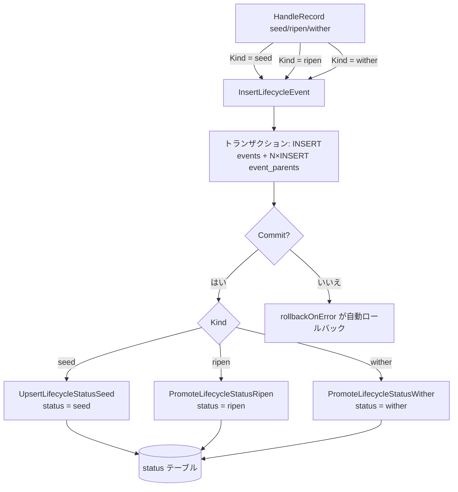
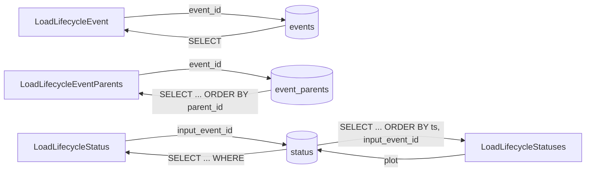

# pkg/persist/sqlite.go

> 📅 最終更新日: 2026/09/24

## 役割

`pkg/persist/sqlite.go` は **ライフサイクル永続化** の SQLite ストレージ層を集中的に実装します。テーブル構造の定義、接続管理、イベント / 親辺の書き込みと再読み出し、状態スナップショットの書き込みと昇格、および plot 単位の一括検索を含みます。本ファイル自体は SQL 層のラッピングのみを行い、`pkg/funnel` と `pkg/runtime` の並行モデルは関知しません。この層は [`lifecycle.md`](./lifecycle.md) において `LifecycleRecordHandler` の依存として再利用されます。

基盤ドライバは [`modernc.org/sqlite`](https://pkg.go.dev/modernc.org/sqlite)（純 Go 実装で CGo 不要）です。ドライバはファイル先頭で匿名インポート `_ "modernc.org/sqlite"` によって `database/sql` に登録されます。

## 主要オブジェクト

### `LifecycleEventRecord` — イベントテーブルのレコード

```go
type LifecycleEventRecord struct {
    EventID   int
    EventType string
    Plot      string
    TS        float64
}
```

| フィールド | 説明 |
|------|------|
| `EventID` | イベントの一意 ID（主キー）。通常は `runtime.LocalEventClient.Emit` が採番 |
| `EventType` | イベント種別。`pkg/persist` 自身は `seed` / `ripen` / `wither` を書き込むが、テーブル構造は列挙を強制しない |
| `Plot` | イベントが属する plot 名。plot によるフィルタリングと plot ごとのディレクトリ作成に使用 |
| `TS` | タイムスタンプ（秒、浮動小数点）。`LifecycleInlet` が書き込み時に `time.Now().UnixMilli() / 1000` で計算 |

### `LifecycleStatusRecord` — 状態スナップショットのレコード

```go
type LifecycleStatusRecord struct {
    InputEventID   int
    CurrentEventID int
    Plot           string
    Status         string
    SeedJSON       string
    FruitJSON      string
    WitherType     string
    WitherMessage  string
    TS             float64
}
```

| フィールド | 説明 |
|------|------|
| `InputEventID` | 種子（入力）イベント ID（主キー）。`events.event_id` と 1 対 1 で対応 |
| `CurrentEventID` | 現在指しているイベント ID（直近の `seed` / `ripen` / `wither` イベント） |
| `Plot` | 所属する plot。plot 単位の検索を容易にする |
| `Status` | 状態の列挙：`seed` / `ripen` / `wither` |
| `SeedJSON` | 入力種子の JSON シリアライズ文字列（`toLifecycleJSON` が生成） |
| `FruitJSON` | 成功時の果実 JSON。初期値はテーブル既定値の文字列 `"null"` で、`PromoteLifecycleStatusRipen` が上書きする |
| `WitherType` | 失敗時の Go エラー型の文字列（`fmt.Sprintf("%T", err)`）。失敗でない場合は空文字列 |
| `WitherMessage` | 失敗時のエラーテキスト（`fmt.Sprintf("%v", err)`）。失敗でない場合は空文字列 |
| `TS` | 状態変更のタイムスタンプ（秒、浮動小数点） |

## テーブル構造

データベースは初回オープン時に `EnsureLifecycleSQLiteSchema` が一度に作成します。schema 文字列は `lifecycleSQLiteSchema` 定数として与えられます（パッケージ内非公開）：

```sql
CREATE TABLE IF NOT EXISTS events (
    event_id INTEGER PRIMARY KEY,
    event_type TEXT NOT NULL,
    plot TEXT NOT NULL DEFAULT '',
    ts REAL NOT NULL
);

CREATE TABLE IF NOT EXISTS event_parents (
    event_id INTEGER NOT NULL,
    parent_id INTEGER NOT NULL,
    PRIMARY KEY (event_id, parent_id),
    FOREIGN KEY (event_id) REFERENCES events(event_id) ON DELETE CASCADE,
    FOREIGN KEY (parent_id) REFERENCES events(event_id) ON DELETE CASCADE
);

CREATE TABLE IF NOT EXISTS status (
    input_event_id INTEGER PRIMARY KEY,
    current_event_id INTEGER NOT NULL,
    plot TEXT NOT NULL,
    status TEXT NOT NULL,
    seed_json TEXT NOT NULL,
    fruit_json TEXT NOT NULL DEFAULT 'null',
    wither_type TEXT NOT NULL DEFAULT '',
    wither_message TEXT NOT NULL DEFAULT '',
    ts REAL NOT NULL,
    FOREIGN KEY (input_event_id) REFERENCES events(event_id) ON DELETE CASCADE,
    FOREIGN KEY (current_event_id) REFERENCES events(event_id)
);

CREATE INDEX IF NOT EXISTS idx_events_type_ts ON events(event_type, ts);
CREATE INDEX IF NOT EXISTS idx_status_plot_status_ts ON status(plot, status, ts);
CREATE INDEX IF NOT EXISTS idx_status_current_event ON status(current_event_id);
```

| テーブル | 主キー | 主要な外部キー / インデックス | 用途 |
|----|------|-----------------|------|
| `events` | `event_id` | `(event_type, ts)` インデックス | すべての seed / ripen / wither イベント本体を格納 |
| `event_parents` | `(event_id, parent_id)` | 2 つの `FOREIGN KEY` がいずれもカスケード | 多対多の親辺テーブルで、イベント DAG のトポロジを記述 |
| `status` | `input_event_id` | `idx_status_plot_status_ts`、`idx_status_current_event` | 各種子の最新状態スナップショット。`seed` 時に `seed` として挿入し、`ripen` で `ripen` に、`wither` で `wither` に昇格する |

> `fruit_json` の既定値は文字列 `"null"` で、`wither_type` / `wither_message` の既定値は空文字列です。これにより `seed` 段階で `NULL` テキストが生じて余分な分岐判定が発生するのを避けます。`seed_json` と `plot` には既定値がなく、書き込み時に明示的に指定する必要があります。

## 接続管理

### `OpenLifecycleSQLite`

```go
func OpenLifecycleSQLite(dbPath string) (*sql.DB, error)
```

- `dbPath == ":memory:"` の場合はそのままリテラルを DSN として使用し、`file:` プレフィックスが付かないようにします。
- それ以外の場合は DSN を `file:<スラッシュ区切りのパス>`（`filepath.ToSlash`）として構築し、`sql.Open("sqlite", dsn)` を呼び出します。
- オープンに成功したら、次の順に実行します：
  1. `configureLifecycleSQLite(db)`：WAL を有効化し、同期を NORMAL に引き下げ、外部キーを有効化します。
  2. `EnsureLifecycleSQLiteSchema(db)`：`lifecycleSQLiteSchema` 定数を実行します。
- いずれかの手順が失敗した場合はロールバックします。まず `_ = db.Close()` を実行し、その後呼び出し側にエラーを返します（エラーテキストは内部で `set sqlite ...` / `ensure lifecycle sqlite schema: ...` にラップ済み）。

### PRAGMA の設定

`configureLifecycleSQLite` は新しい接続ごとに 3 つの PRAGMA を実行します：

| PRAGMA | 役割 |
|--------|------|
| `journal_mode = WAL` | Write-Ahead Logging を有効化し、多読み取り・単一書き込みの並行を許可して、一括イベント書き込み時に検索がブロックされるのを避ける |
| `synchronous = NORMAL` | WAL と組み合わせて fsync の頻度を下げる。クラッシュ時には最後のトランザクションを失う可能性があるが、ライフサイクルのデータは再構築可能 |
| `foreign_keys = ON` | SQLite は既定で外部キーを無効にしており、有効化して初めて `event_parents` / `status` のカスケード削除が機能する |

### `EnsureLifecycleSQLiteSchema`

```go
func EnsureLifecycleSQLiteSchema(db *sql.DB) error
```

`lifecycleSQLiteSchema` スクリプトを冪等に実行します。呼び出し側がテーブル構造をアップグレードする必要があるときに明示的に呼び出せますが、通常は `OpenLifecycleSQLite` の内部から代わりに起動されます。

## トランザクションと状態の書き込み

### イベント + 親辺の一括書き込み

`InsertLifecycleEvent` は 1 回のトランザクションでイベント本体と複数の親辺の書き込みを完了します。本ファイル唯一の明示的なトランザクションです：

```go
func InsertLifecycleEvent(db *sql.DB, eventID int, eventType string, plot string, ts float64, parentIDs []int) error
```

```go
tx, err := db.Begin()
if err != nil { ... }
defer rollbackOnError(tx)

if _, err := tx.Exec(`INSERT INTO events ...`, ...); err != nil { ... }
for _, parentID := range parentIDs {
    if _, err := tx.Exec(`INSERT INTO event_parents ...`); err != nil { ... }
}
if err := tx.Commit(); err != nil { ... }
```

- 引数は **位置引数** です（構造体ではありません）。まず `events` の行を書き込み、次に `parentIDs` の順に `event_parents` の辺を 1 件ずつ書き込みます。`parentIDs` が `nil` の場合はイベント本体だけを書き込みます。
- `rollbackOnError` は明示的な `return` の前に `defer` で発火し、「Commit していなければ Rollback する」ことと等価です。
- 1 件の `events` 行 + 任意個の `event_parents` 辺が同じトランザクションに束縛され、親辺はすべてロールバック / すべてコミットされます。
- エラーテキストはそれぞれ `insert event <id>: ...`、`insert parent edge <parent>-><event>: ...`、`commit insert lifecycle event: ...` です。

### 状態スナップショットの書き込みと昇格

状態の書き込みは「初期スナップショットの挿入」と「UPDATE による昇格」の 2 段階に分かれます：

| 関数 | SQL の形式 | 動作 |
|------|----------|------|
| `UpsertLifecycleStatusSeed(db, InputEventID, SeedJSON, Plot, TS)` | 純粋な `INSERT` | `status = "seed"`、`current_event_id = input_event_id` のスナップショットを 1 行挿入する。`fruit_json` / `wither_*` はテーブルの既定値を取る |
| `PromoteLifecycleStatusRipen(db, inputEventID, currentEventID, fruitJSON, ts)` | `UPDATE` | `SET current_event_id = ?, status = 'ripen', fruit_json = ?, ts = ?`。`seed_json` と `plot` は **変更しない** |
| `PromoteLifecycleStatusWither(db, inputEventID, currentEventID, witherType, witherMessage, ts)` | `UPDATE` | `SET current_event_id = ?, status = 'wither', wither_type = ?, wither_message = ?, ts = ?`。`seed_json` と `plot` は **変更しない** |

> ⚠️ **注意**：`UpsertLifecycleStatusSeed` は Upsert という名前ですが、実際の実装は **純粋な `INSERT`** です（`ON CONFLICT ... DO UPDATE` はありません）。同じ `input_event_id` で繰り返し呼び出すと主キー衝突によりエラーを返します（エラーテキストは `insert lifecycle status seed for input event <id>: ...`）。再試行の場面では旧状態の上書きをこれに依存できません。
>
> 2 つの `Promote*` 関数はいずれも `RowsAffected` を検査しません。対象行が存在しない場合、`UPDATE` は 0 行に影響し、**エラーも出しません**。呼び出し側が `input_event_id` の存在を自分で確認する必要があります。

## 公開シンボル一覧

| シンボル | 種別 | 用途 |
|------|------|------|
| `LifecycleEventRecord` | 型 | イベントテーブルのレコード構造 |
| `LifecycleStatusRecord` | 型 | 状態スナップショットの構造 |
| `OpenLifecycleSQLite` | 関数 | データベースをオープンして初期化する（PRAGMA + テーブル作成を含む） |
| `EnsureLifecycleSQLiteSchema` | 関数 | テーブル作成スクリプトを冪等に実行する |
| `InsertLifecycleEvent` | 関数 | イベント + 親辺をトランザクションで書き込む |
| `LoadLifecycleEvent` | 関数 | `event_id` で単一のイベントを読み取る |
| `LoadLifecycleEventParents` | 関数 | 1 つのイベントのすべての親 ID を読み取る（`parent_id` の昇順） |
| `UpsertLifecycleStatusSeed` | 関数 | 種子の初期状態スナップショットを挿入する（`status = "seed"`） |
| `PromoteLifecycleStatusRipen` | 関数 | 状態を `ripen` に昇格させ、`fruit_json` を書き込む |
| `PromoteLifecycleStatusWither` | 関数 | 状態を `wither` に昇格させ、`wither_type` / `wither_message` を書き込む |
| `LoadLifecycleStatus` | 関数 | `input_event_id` でスナップショットを 1 件読み取る |
| `LoadLifecycleStatuses` | 関数 | `plot` で全スナップショットを読み取る（`ts, input_event_id` でソート） |

> `configureLifecycleSQLite` と `rollbackOnError` はパッケージ内の非公開ヘルパー関数です。`lifecycleSQLiteSchema` はパッケージ内の非公開なテーブル作成スクリプト定数です。

## 主要フロー

### 書き込みパス



### 検索パス



## 使用例

この層を直接使う典型的な書き方（`LifecycleRecordHandler` を経由しない）：

```go
package main

import (
    "fmt"

    "github.com/Mr-xiaotian/CelestialGrow/pkg/persist"
)

func main() {
    db, err := persist.OpenLifecycleSQLite("./lifecycles/demo.sqlite3")
    if err != nil {
        panic(err)
    }
    defer db.Close()

    // 1. 写入 seed 事件（无父边）
    if err := persist.InsertLifecycleEvent(db, 1, "seed", "stage_a", 1.0, nil); err != nil {
        panic(err)
    }

    // 2. 写入 ripen 事件 + 父边 [1]
    if err := persist.InsertLifecycleEvent(db, 2, "ripen", "stage_a", 2.0, []int{1}); err != nil {
        panic(err)
    }

    // 3. 插入种子初始快照
    if err := persist.UpsertLifecycleStatusSeed(db, 1, `{"v":42}`, "stage_a", 1.0); err != nil {
        panic(err)
    }

    // 4. 晋升为 ripen
    if err := persist.PromoteLifecycleStatusRipen(db, 1, 2, `{"v":84}`, 2.0); err != nil {
        panic(err)
    }

    // 5. 回读事件与父边
    event, err := persist.LoadLifecycleEvent(db, 2)
    if err != nil {
        panic(err)
    }
    parents, err := persist.LoadLifecycleEventParents(db, 2)
    if err != nil {
        panic(err)
    }
    fmt.Printf("event=%d type=%s parents=%v\n", event.EventID, event.EventType, parents)

    // 6. 查询整个 plot 的快照
    statuses, err := persist.LoadLifecycleStatuses(db, "stage_a")
    if err != nil {
        panic(err)
    }
    for _, s := range statuses {
        fmt.Printf("seed=%s status=%s fruit=%s wither=%s/%s\n",
            s.SeedJSON, s.Status, s.FruitJSON, s.WitherType, s.WitherMessage)
    }
}
```

## 注意事項

- **`UpsertLifecycleStatusSeed` は真の upsert ではない**：詳細は上記「状態スナップショットの書き込みと昇格」を参照してください。同じ種子を再試行する前には主キー衝突を自分で処理するか、`Promote*` 系で既存行を更新するようにしてください。
- **`Promote*` は行が存在しない場合も黙って成功する**：`UPDATE` がヒットしなくてもエラーを返さないため、状態が「書き込みに成功したように見えてデータベースには変化がない」ことがあります。
- **外部キーの有効化に依存**：`status` と `event_parents` のカスケード削除は `foreign_keys = ON` に依存しており、`OpenLifecycleSQLite` は有効化を保証しています。呼び出し側が `OpenLifecycleSQLite` を迂回して自分で `sql.Open` する場合は、PRAGMA を自分で実行する必要があります。
- **WAL の副作用**：WAL を有効化すると同じディレクトリに `*.sqlite3-wal` / `*.sqlite3-shm` の 2 つの補助ファイルが生成されます。`.sqlite3` をバックアップまたは転送する際は、先に `db.Close()` して WAL の内容をディスクへ書き出すか、SQLite の backup API を使用する必要があります。
- **タイムスタンプは秒単位の浮動小数点**：`TS` は `float64(now) / 1000` に由来し、単位は秒です。一括比較とソートには精度は十分ですが、ミリ秒をまたぐ密集イベントでは浮動小数点比較に注意が必要です。
- **状態テーブルには独立した外部キーカスケードがない**：`status.current_event_id` の `FOREIGN KEY` には `ON DELETE CASCADE` がなく、カスケードするのは `status.input_event_id` のみです。これにより `current_event_id` が誤って削除されたときに状態レコード全体が巻き添えになるのを防ぎます。
- **`EventType` の列挙を強制しない**：`events.event_type` には CHECK 制約がまったくないため、新しい種別（例えばカスタム plot の中間状態）を追加する場合はプロデューサ側で新しい文字列を決めるだけで済みます。`pkg/persist` 自身は `seed` / `ripen` / `wither` しか書き込みません。
- **パスと DSN**：ファイルパスは `filepath.ToSlash` を経て `file:...` に組み立てられ、Windows でバックスラッシュによる DSN 解析の問題を避けます。`:memory:` はリテラル分岐を通るため書き換えられません。
