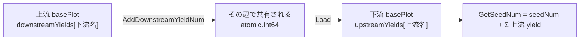

# pkg/plot/counter.go

> 📅 最終更新日: 2026/09/24

`counter.go` は `Counter` を定義します。これは並行安全な「種子 / 果実 / 雑草」の三連カウンタで、さらに **辺ごとに追跡する** 上流 / 下流の yield カウンタを維持します。

`basePlot` は `*Counter` を埋め込むことで `AddSeedNum` / `GetCompleted` などのメソッドを直接得ており、複数の tend goroutine が同時に書き、観察者が同時に読む場面でロックを避けるために使用します。

## 役割

- 現在の plot の「種子の総数」「成功した産出（果実）」「失敗した産出（雑草）」を追跡します。
- **辺ごとに**「本 plot が特定の下流へ送った yield 数」（`downstreamYields`）と「特定の上流が本 plot へ送った yield 数」（`upstreamYields`）を個別に記録します。
- `GetSeedNum` ではローカルに播いた種子と各上流から転入した yield を合算して「実際の総入力数」とし、観察者と `IsFinish` が使用します。

## 主要オブジェクト

### `Counter` の構造

```go
type Counter struct {
	seedNum  atomic.Int64
	fruitNum atomic.Int64
	weedNum  atomic.Int64

	upstreamYields   map[string]*atomic.Int64
	downstreamYields map[string]*atomic.Int64
}
```

| フィールド | 型 | 意味 |
|------|------|------|
| `seedNum` | `atomic.Int64` | **ローカルに** 播いた種子数（`AddSeedNum` だけが加算する） |
| `fruitNum` | `atomic.Int64` | 成功した果実の数 |
| `weedNum` | `atomic.Int64` | 失敗した雑草の数 |
| `upstreamYields` | `map[string]*atomic.Int64` | 上流 plot 名 → **その辺** で共有される yield カウンタのポインタ。`GetSeedNum` がこれらの値を合算する |
| `downstreamYields` | `map[string]*atomic.Int64` | 下流 plot 名 → **その辺** で共有される yield カウンタのポインタ。本 plot の `ripenSeed` が `AddDownstreamYieldNum` を通じて加算する |

> `upstreamYields` と `downstreamYields` 内のポインタは **同じオブジェクト群の両端** です。`ConnectTo` は辺ごとに `*atomic.Int64` を新しく作成し、上流は自分の `downstreamYields` に、下流は自分の `upstreamYields` に入れます。したがって上流が加算すると、下流が読み取るのは同じ辺のリアルタイムな産出量であり、辺同士が互いに干渉しません。

## 公開メソッド

### コンストラクタ

#### `NewCounter() *Counter`

カウンタを生成します。3 つのアトミック値はすべてゼロで、2 つの map も空（**nil ではない**）に初期化されるため、生成直後に `GetSeedNum` を呼んでも panic しません。

### カウンタの登録

| メソッド | シグネチャ | 動作 |
|------|------|------|
| `SetUpstreamYieldCounter` | `func (c *Counter) SetUpstreamYieldCounter(name string, yieldCounter *atomic.Int64)` | `name`（上流 plot 名）とその辺のカウンタを `upstreamYields` に書き込み、`GetSeedNum` の集計に供する |
| `SetDownstreamYieldCounter` | `func (c *Counter) SetDownstreamYieldCounter(name string, yieldCounter *atomic.Int64)` | `name`（下流 plot 名）とその辺のカウンタを `downstreamYields` に書き込み、`AddDownstreamYieldNum` の加算に供する |

> どちらも通常は `basePlot.ConnectTo` が対で呼び出し、業務コードが直接使用する必要はありません。同名の辺を重複して登録すると古いポインタが **上書き** されます（古いカウンタは破棄されます）。

### 加算系（Adders）

| メソッド | シグネチャ | 動作 |
|------|------|------|
| `AddSeedNum` | `func (c *Counter) AddSeedNum(addNum int)` | `seedNum` をアトミックに `addNum` だけ増やす |
| `AddFruitNum` | `func (c *Counter) AddFruitNum(addNum int)` | `fruitNum` をアトミックに `addNum` だけ増やす |
| `AddWeedNum` | `func (c *Counter) AddWeedNum(addNum int)` | `weedNum` をアトミックに `addNum` だけ増やす |
| `AddDownstreamYieldNum` | `func (c *Counter) AddDownstreamYieldNum(name string, addNum int)` | `downstreamYields[name]` をアトミックに `addNum` だけ増やす |

### 取得系（Getters、読み取り専用）

| メソッド | シグネチャ | 戻り値 |
|------|------|--------|
| `GetSeedNum` | `func (c *Counter) GetSeedNum() int` | `seedNum` + `Σ upstreamYields[*].Load()`。すなわち「本 plot が処理する / 処理した種子の総数」 |
| `GetFruitNum` | `func (c *Counter) GetFruitNum() int` | 成功した果実の数 |
| `GetWeedNum` | `func (c *Counter) GetWeedNum() int` | 失敗した雑草の数 |
| `GetCompleted` | `func (c *Counter) GetCompleted() int` | `GetFruitNum() + GetWeedNum()` |

### 述語

| メソッド | シグネチャ | 意味 |
|------|------|------|
| `IsFinish` | `func (c *Counter) IsFinish() bool` | `GetCompleted() == GetSeedNum()`。現在のリポジトリ内に呼び出し箇所はなく、将来用の判定として提供されている |

## ノードとの連携

`Counter` は `basePlot` に埋め込まれており、各ノードはこれを通じてタスクの統計と上流 / 下流の同期を行います：

| 呼び出し箇所 | 動作 |
|--------|------|
| `basePlot.Seed` | `AddSeedNum(1)`（ローカルに 1 粒播く） |
| `basePlot.ConnectTo` | その辺の `*atomic.Int64` を新規作成し、`p.SetDownstreamYieldCounter(nextName, c)` + `next.SetUpstreamYieldCounter(p.GetName(), c)` |
| `basePlot.witherSeed` | `AddWeedNum(1)` + `reportProgress` を発火 |
| `Plot.ripenSeed` | `AddFruitNum(1)` + **すべての** 下流に対して `AddDownstreamYieldNum(nextPlot, 1)` |
| `SplitPlot.ripenSeed` | `AddFruitNum(1)` + 各下流に対して `AddDownstreamYieldNum(nextPlot, len(fruits))` |
| `RoutePlot.ripenSeed` | `AddFruitNum(1)` + **ルーティング先の** 各下流に対して `AddDownstreamYieldNum(nextPlot, 1)` |
| `basePlot.reportProgress` / `notifyStart` / `notifyFinish` | `GetCompleted()` / `GetSeedNum()` を読み取り、`observer.Observer` をコールバックする |

データフローの概略：



## 注意事項

- `AddDownstreamYieldNum` は存在チェックを行いません。`name` が未登録の場合は `nil` の `*atomic.Int64` を取得してそのまま `Add` するため、**panic** します。したがって加算側は `ConnectTo` の登録と対で存在する必要があります（`Plot` / `SplitPlot` / `RoutePlot` はいずれも接続済みの対象にのみ加算します）。
- `seedNum`、`fruitNum`、`weedNum` と各 yield カウンタは **同一時刻の原子的なスナップショットではありません**。そのため `IsFinish` と観察者の進捗は並行下で瞬間的なずれが生じることがありますが、最終的には安定します。
- `upstreamYields` は `GetSeedNum` からのみ読み取られ、`Counter` 自身は上流からのデータを書き込みません。上流の yield カウントは上流自身が `Add` し、本 Counter は同じポインタを保持しているだけです。
- `AddSeedNum` / `AddFruitNum` / `AddWeedNum` / `AddDownstreamYieldNum` は `int` を受け取り、内部で `int64` に変換します。負数を渡すとカウントが逆戻りするため、業務層では避けてください。
