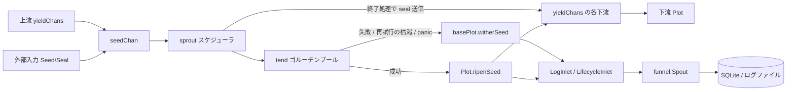

# pkg/plot/plot.go

> 📅 最終更新日: 2026/09/24

`plot.go` は `pkg/plot` で最もよく使われるノード型 `Plot[S, F]` を定義します。「seed を受け取る → cultivator を並行実行する → fruit を生成する → 下流へ転送する」という流れを、接続可能・観測可能・再試行可能なジェネリックノードとしてカプセル化します。

`Plot` 自体は非常に薄く、最も素朴な成功セマンティクス（**1 つの seed から 1 つの fruit を育て、その fruit をそのまま接続済みの各下流へ転送する**）だけを担当します。それ以外の汎用機能（状態機械、並行スケジューリング、再試行、seal の伝播、ログ/ライフサイクルの組み立て、standalone 実行）はすべて内蔵の `basePlot` が提供します。詳細は `plot_base.md` を参照してください。

## 役割

- ジェネリックな並行ノード `Plot[S, F]` を公開します（`S` は種子型、`F` は果実型）。
- 内蔵の `*basePlot[S, F, F]` を通じて共有骨格を再利用し、`Plot` が `PlotNode` インターフェースを満たすようにします。これにより `pkg/farm` からの登録、接続、スケジューリングが可能になります。
- 成功フック `ripenSeed` を注入します。カウントの更新、ログとライフサイクル記録の書き込み、すべての下流への yield の 1 つずつの転送を行います。

## 中核となるオブジェクト

### `Plot[S, F]` 構造

```go
type Plot[S any, F any] struct {
	*basePlot[S, F, F]
}
```

`Plot` は独自のフィールドを持たず、すべての状態と機能は `*basePlot[S, F, F]` に由来します。

| ジェネリックパラメータ | 意味 |
|---------|------|
| `S` | 種子（seed）の入力型。すなわち `cultivator` の引数型 |
| `F` | 果実（fruit）の出力型。すなわち `cultivator` の戻り値型 |

`basePlot` の 3 番目のジェネリックパラメータ（下流 yield 型 `Y`）は本型では `F` に具体化されます。つまり**本ノードの果実型と下流向け出力型は一致します**。3 種類のノードの比較は次のとおりです。

| ノード | 基底の `basePlot` | 結果型（fruit） | 下流 yield 型 `Y` |
|------|----------------|------------------|--------------------|
| `Plot[S, F]` | `basePlot[S, F, F]` | `F` | `F` |
| `SplitPlot[S, F]` | `basePlot[S, []F, F]` | `[]F` | `F` |
| `RoutePlot[S, Y]` | `basePlot[S, map[string]Y, Y]` | `map[string]Y` | `Y` |

> `ConnectTo` は型アサーションで「上流の `Y`」と「下流の `S`」が一致するかを検証します。したがって `Plot[S, F]` は `S == F` の下流ノードにしか接続できず、それ以外の場合は接続時にただちに型非互換エラーを返します。

## 公開関数

### `NewPlot[S, F](name string, cultivator func(S) (F, error), opts ...Option) *Plot[S, F]`

`Plot` インスタンスを生成します。

| パラメータ | 意味 |
|------|------|
| `name` | plot 名。`Farm` 内で一意である必要があります |
| `cultivator` | 単一の seed を育てる関数。fruit またはエラーを返します |
| `opts` | 任意の設定（`option.md` 参照）。`defaultOptions()` の後に順に適用されます |

実装上のポイント：

1. まず `var p *Plot[S, F]` を宣言し、次に `newBasePlot[S, F, F]` で共有骨格を構築し、最後に `base` を `p` に代入します。
2. `newBasePlot` に渡す `ripenSeed` フックはクロージャであり、内部で `p.ripenSeed(...)` を呼び出します。これはまだ代入されていない `p` を捕捉しますが、このクロージャは `StartAsync` 以降の `sprout` / `tend` 経路でしか呼ばれないため、その時点で `p` への代入は必ず完了しています。
3. channel の確保、デフォルトの `EventClient`、`context` と `Counter` の初期化はすべて `newBasePlot` 内で行われます（`plot_base.md` 参照）。

### `ripenSeed(seedPayload runtime.Payload[S], fruit F, startTime time.Time)`（未エクスポート）

`Plot` の成功経路の実装です。フックとして `basePlot.ripenSeed` フィールドに書き込まれ、`cultivator` が `nil` エラーを返したときに `basePlot.tend` から呼び出されます。手順は次のとおりです。

1. `AddFruitNum(1)` を呼び、`reportProgress()` を呼び出して、すべての `Observer.OnProgress` を発火させます。
2. `seedPayload.EventID` を `seedID` として取り出し、`eventClient.Emit("fruit", []int{seedID})` で `fruitID` を割り当てます。
3. ログ `logInlet.SeedRipen(...)` とライフサイクル `lifecycleInlet.SeedRipen(...)` を書き込みます（親イベントは `seedID`、果実は `fruit`。ログでは seed を 50 rune、fruit を 25 rune に切り詰めます）。
4. `p.yieldChans`（`下流 plot 名 → その下流の seed チャネル`）を走査し、**接続済みの各下流**に対して：
   - `AddDownstreamYieldNum(nextPlot, 1)`：本ノードがその下流へ yield を 1 つ貢献します。
   - `eventClient.Emit("seed", []int{fruitID})` で下流 seed イベント ID を割り当てます（親イベントは `fruitID`）。
   - `logInlet.SeedInput` と `lifecycleInlet.SeedInput` を書き込みます（親イベントは `fruitID`）。
   - その下流チャネルへ `runtime.Payload[F]{Value: fruit, EventID: downstreamSeedID}` を送信します。

> セマンティクスの要点：`Plot` の成功経路は「**1 つの fruit を 1 つの下流 yield に転送する**」であり、しかも**接続済みのすべての下流へ 1 回ずつ転送します**（ブロードキャスト）。「宛先を指定した転送」が必要な場合は `RoutePlot`（`plot_route.md` 参照）を、「1 つの seed を複数の下流 yield に分割する」必要がある場合は `SplitPlot`（`plot_split.md` 参照）を使用してください。

## 主要なフロー

### データフロー



### seed から下流 yield まで

`basePlot.tend` は `cultivator(seed)` を呼び出した後、結果に応じて分岐します。

- **成功**（`err == nil`）：注入された `ripenSeed`、すなわち本ファイルの実装を呼び出します。
- **失敗**（再試行の枯渇、`retryIf` による拒否、または `panic` が `recover` で捕捉された場合）：`basePlot.witherSeed` を通り、**どの下流へも転送しません**。

再試行ループ、seal の伝播、並行モデルなどの汎用ロジックは `plot_base.md` を参照してください。

## 使用例

### Standalone モード

```go
package main

import (
	"fmt"

	"github.com/Mr-xiaotian/CelestialGrow/pkg/plot"
)

func main() {
	p := plot.NewPlot("double",
		func(seed int) (int, error) { return seed * 2, nil },
		plot.WithTenders(4),
	)

	p.Run([]int{1, 2, 3, 4, 5})

	records, err := p.Harvest()
	if err != nil {
		panic(err)
	}
	for _, r := range records {
		fmt.Println(r.SeedJSON, r.Status, r.FruitJSON)
	}
}
```

### 再試行とログレベルを伴う場合

```go
package main

import (
	"errors"
	"time"

	"github.com/Mr-xiaotian/CelestialGrow/pkg/plot"
)

var errPermanent = errors.New("permanent")

func main() {
	p := plot.NewPlot("flaky",
		func(seed int) (int, error) {
			if seed == 0 {
				return 0, errPermanent
			}
			return seed * 2, nil
		},
		plot.WithTenders(2),
		plot.WithMaxRetries(3),
		plot.WithRetryDelay(func(attempt int) time.Duration {
			return time.Duration(attempt) * 100 * time.Millisecond
		}),
		plot.WithRetryIf(func(err error) bool {
			return !errors.Is(err, errPermanent)
		}),
		plot.WithLogLevel("DEBUG"),
	)

	p.Run([]int{0, 1, 2})
}
```

> 進捗オブザーバは `p.AddObserver(myObserver{})` で登録します（`myObserver` は `observer.Observer` の `OnStart` / `OnProgress` / `OnFinish` を実装する必要があります）。詳細は `plot_base.md` の「オブザーバフック」を参照してください。

### Farm モード

Farm モードでは `Run` / `Seed` / `Seal` を直接呼び出さず、`Plot` を `plot.PlotNode` として `pkg/farm` に渡します。

```go
package main

import (
	"fmt"

	"github.com/Mr-xiaotian/CelestialGrow/pkg/farm"
	"github.com/Mr-xiaotian/CelestialGrow/pkg/plot"
)

func main() {
	double := plot.NewPlot("double", func(seed int) (int, error) {
		return seed * 2, nil
	}, plot.WithTenders(2))

	addOne := plot.NewPlot("addOne", func(seed int) (int, error) {
		return seed + 1, nil
	}, plot.WithTenders(2))

	f := farm.NewFarm("demo", "INFO")
	if err := f.AddPlot(double, addOne); err != nil {
		panic(err)
	}
	if err := f.Connect([]plot.PlotNode{double}, []plot.PlotNode{addOne}); err != nil {
		panic(err)
	}
	if err := f.Run(map[string][]any{"double": {1, 2, 3}}); err != nil {
		panic(err)
	}

	fmt.Println("done")
}
```

このとき `BindInlet` は `Farm.Run` が一括で呼び出し、`StartSpouts` / `StopSpouts` は実行されません（Farm がグローバルな spout を自身で保持するため）。

## テストの重点

`plot.go` の挙動は `plot_harvest_test.go`（結果スナップショット）と `plot_retry_test.go`（再試行セマンティクス）でカバーされています。ケースごとの説明は `plot_harvest_test.md` と `plot_retry_test.md` を参照してください。

## 注意事項

- `NewPlot` はデフォルトで `runtime.NumCPU()` を並行数と channel バッファに使用します。I/O 集約型の処理では `WithTenders` / `WithChanSize` を組み合わせて調整できます。
- `Run` は**ブロッキング**呼び出しであり、すべての種子の処理が完了するまで戻りません。
- 上流の `F` と下流の `S` の型が一致しない場合、`ConnectTo` は panic せずただちにエラーを返します。`Farm.AddPlot` / `Farm.Connect` の後にエラーを確認することを推奨します。
- `Plot` はルーティングや分割の機能を提供せず、その転送は「全下流へのブロードキャスト」です。宛先を指定した配信として使わないでください。
