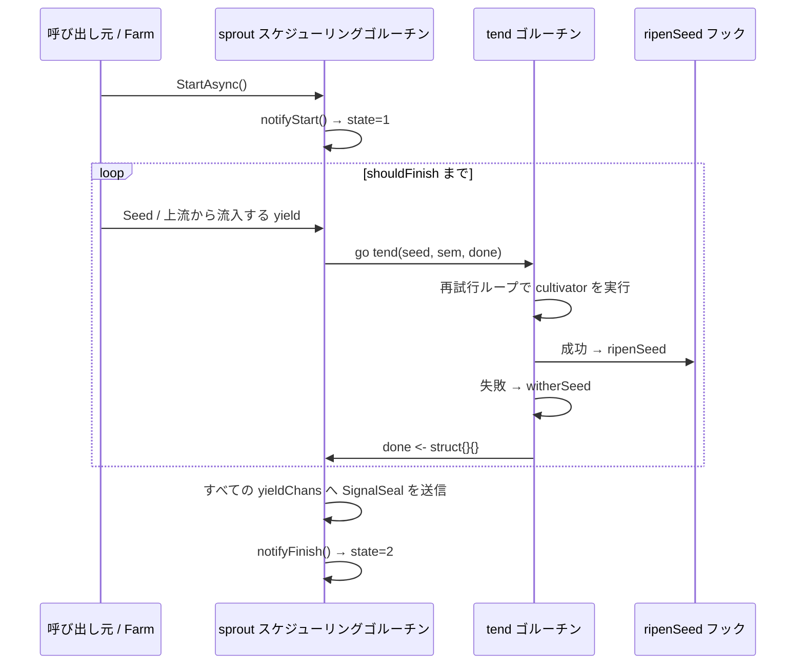

# pkg/plot/plot_base.go

> 📅 最終更新日: 2026/09/24

`plot_base.go` は `pkg/plot` の**共有実行骨格**です。次の 2 つを定義します。

1. `PlotNode` インターフェース —— ジェネリックを消去して、`pkg/farm` が異なる seed/fruit 型のノードを統一的に保持できるようにするもの。
2. `basePlot[S, F, Y]` ジェネリック構造 —— すべての具象ノード（`Plot`、`SplitPlot`、`RoutePlot`）が共通して内蔵する基底クラス。

`basePlot` はほぼすべての汎用責務を担います。状態機械、並行スケジューリング（`sprout` + `tend`）、再試行、seal の伝播、上流/下流の接続、ログとライフサイクルの組み立て、standalone の実行と結果のエクスポートです。ノード間の唯一の違いは構築時に注入される `ripenSeed` フックで表現されるため、3 種類のノードはそれぞれ `ripenSeed` メソッドを 1 つ実装するだけで済みます。

## 役割

- `PlotNode` インターフェースを定義し、`Farm` と plot の間の契約とします。
- `basePlot` 共有骨格を提供し、`Plot` / `SplitPlot` / `RoutePlot` がスケジューリング、再試行、永続化の組み立てを重複して実装するのを避けます。
- 3 つのジェネリックパラメータで「種子型」「結果型」「下流 yield 型」を分離し、同じ骨格がブロードキャスト（`Plot`）、分割（`SplitPlot`）、ルーティング（`RoutePlot`）の 3 種類の成功セマンティクスを支えられるようにします。

## 中核となるオブジェクト

### `PlotNode` インターフェース

```go
type PlotNode interface {
	GetName() string
	GetState() int32
	GetSeedChanAny() any

	ConnectTo(next PlotNode) error
	SetUpstreamYieldCounter(name string, yieldCounter *atomic.Int64)
	BindInlet(logChan chan<- persist.LogRecord, lifecycleChan chan<- persist.LifecycleRecord)
	SetEventClient(eventClient runtime.EventClient)

	StartAsync()
	WaitAsync()
	SeedAny(seed any) error
	Seal()
}
```

| メソッド | 用途 |
|------|------|
| `GetName()` | plot 名を返します（`Farm` 内で一意である必要があります） |
| `GetState()` | 状態を返します：`0=idle`、`1=running`、`2=done` |
| `GetSeedChanAny()` | `any` として `seedChan` を公開し、`ConnectTo` が型アサーションを行えるようにします |
| `ConnectTo(next)` | 「本ノードの yield → 下流の seed」の接続を確立し、型を検証します |
| `SetUpstreamYieldCounter(name, counter)` | 接続時に**上流**が呼び出し、そのエッジで共有される yield カウンタを本ノードに登録します |
| `BindInlet(logChan, lifecycleChan)` | ログとライフサイクル記録のチャネルをバインドします |
| `SetEventClient(eventClient)` | イベント ID の割り当て器を注入します（`Farm` は同一の client を一括で注入します） |
| `StartAsync()` / `WaitAsync()` | スケジューラを非同期に開始します / バックグラウンドのゴルーチンの終了をブロッキングで待ちます |
| `SeedAny(seed)` | 単一の種子を `any` として播種します。`Farm` が初期タスクを注入するために使用します |
| `Seal()` | 外部からの終了シグナルを送信します |

> 成果カウンタはインターフェース上に公開されません。`ConnectTo` の内部で `SetDownstreamYieldCounter`（上流側）と `SetUpstreamYieldCounter`（下流側）を同時に呼び出し、**エッジごとに**独立したカウンタを割り当てます。

### `basePlot[S, F, Y]` 構造

```go
type basePlot[S any, F any, Y any] struct {
	name       string
	cultivator func(S) (F, error)
	ripenSeed  func(seedPayload runtime.Payload[S], fruit F, startTime time.Time)
	plotOptions

	seedChan   chan runtime.Payload[S]
	yieldChans map[string]chan runtime.Payload[Y]

	eventClient runtime.EventClient
	observers   []observer.Observer

	logSpout       *funnel.Spout[persist.LogRecord]
	lifecycleSpout *funnel.Spout[persist.LifecycleRecord]
	logInlet       *persist.LogInlet
	lifecycleInlet *persist.LifecycleInlet

	ctx    context.Context
	cancel context.CancelFunc
	wg     sync.WaitGroup
	state  atomic.Int32 // 0=idle, 1=running, 2=done
	*Counter
}
```

| ジェネリックパラメータ | 意味 |
|---------|------|
| `S` | 種子（seed）の入力型。すなわち `cultivator` の引数型 |
| `F` | 本ノードの**結果**型。すなわち `cultivator` の戻り値型（`Plot`/`SplitPlot`/`RoutePlot` でそれぞれ異なります） |
| `Y` | 下流へ出力する yield 型。下流ノードの `S` と一致する必要があります |

| フィールド | 意味 |
|------|------|
| `name` | plot 名 |
| `cultivator` | 育成関数。本ノードの結果型 `F` を返します |
| `ripenSeed` | 成功フック。具象ノードが注入します。シグネチャは `(seedPayload, fruit F, startTime)` で固定です |
| `plotOptions` | 内蔵される任意設定（並行数、バッファ、再試行戦略、ログレベル）。`option.md` 参照 |
| `seedChan` | seed 入力チャネル。容量 = `WithChanSize`。データと制御シグナル（`SignalSeal`）が共用します |
| `yieldChans` | `下流 plot 名 → その下流の seed チャネル`。`ConnectTo` が設定します |
| `eventClient` | プロセス内のイベント ID 割り当て器。デフォルトは `runtime.NewLocalEventClient()` |
| `observers` | 進捗オブザーバのリスト。`AddObserver` が追加します |
| `logSpout` / `lifecycleSpout` | standalone モードのローカルなログ/ライフサイクルコンシューマ。`Run` だけが生成します |
| `logInlet` / `lifecycleInlet` | ログとライフサイクルイベントを非同期に書き込む送信側。`BindInlet` が生成します |
| `ctx` / `cancel` | `context.WithCancel(context.Background())` から派生し、内部での強制終了に使用します |
| `wg` | `StartAsync` が起動したバックグラウンドのゴルーチンを集約します |
| `state` | 状態のアトミック変数（0/1/2） |
| `*Counter` | 種子/果実/雑草のカウントと上流/下流の yield カウント（`counter.md` 参照） |

## 公開メソッド

### 構築（未エクスポート）

#### `newBasePlot[S, F, Y](name, cultivator, ripenSeed, opts...) *basePlot[S, F, Y]`

同じパッケージの `NewPlot` / `NewSplitPlot` / `NewRoutePlot` からのみ呼び出されます。流れは次のとおりです。

1. `defaultOptions()` を取得し、`opts` を順に適用します。
2. `context.WithCancel(context.Background())` から `ctx / cancel` を派生させます。
3. `seedChan`（容量 `chanSize`）と空の `yieldChans` を確保します。
4. `eventClient = runtime.NewLocalEventClient()` を初期化します。
5. `Counter = NewCounter()` を初期化します。

### オブザーバ

#### `AddObserver(observer observer.Observer)`

進捗オブザーバを追加します。`notifyStart` / `reportProgress` / `notifyFinish` の際にそれぞれ `OnStart` / `OnProgress` / `OnFinish` をコールバックします（インターフェースの契約は `pkg/observer` 参照）。

### 初期化（standalone / Farm 共用）

| メソッド | 用途 | 呼び出し時期 |
|------|------|----------|
| `BindInlet(logChan, lifecycleChan)` | `persist.NewLogInlet(logChan, time.Second, logLevel)` と `persist.NewLifecycleInlet(lifecycleChan, time.Second)` で 2 つの inlet を生成します | `StartAsync` の前。standalone では `Run` が呼び出し、Farm では `Farm.Run` が一括で呼び出します |
| `StartSpouts()` | ローカルの `logSpout` / `lifecycleSpout` を起動します | standalone モードのみ |
| `StopSpouts()` | ローカルの spout を停止してフラッシュします | standalone モードのみ |
| `SetEventClient(eventClient)` | イベント ID の割り当て器を差し替えます | 任意（デフォルトはローカル client） |

> `StartSpouts` / `StopSpouts` は `p.logSpout` / `p.lifecycleSpout` を直接デリファレンスするため、**必ず `Run` を経由して spout を生成しておく**必要があります。そうでない場合は panic します。

### グラフの接続

#### `ConnectTo(next PlotNode) error`

本ノードの yield チャネルを下流の seed チャネルに接続します。

1. `next.GetSeedChanAny().(chan runtime.Payload[Y])` をアサートし、失敗した場合は `plot %q yield type is incompatible with plot %q seed type` を返します。
2. `p.yieldChans[next.GetName()] = seedChan` を設定します。
3. **このエッジ専用**の yield カウンタとして新しい `*atomic.Int64` を生成します。
   - `p.SetDownstreamYieldCounter(next.GetName(), downstreamYield)`（上流側。`AddDownstreamYieldNum` に使用）
   - `next.SetUpstreamYieldCounter(p.GetName(), downstreamYield)`（下流側。`GetSeedNum` の集計に使用）

> **エッジ単位で追跡する**意義：同じ上流/下流の組は同じカウンタを共有し、異なるエッジのカウンタは互いに干渉しません。上流が yield を 1 つ転送するたびに `AddDownstreamYieldNum` でインクリメントし、下流は `GetSeedNum` で各上流のカウンタを合算することで、「ローカルに播種した種子 + 各上流から実際に流入した種子」の真の合計を得ます。
>
> 下流が `ConnectTo` でそのエッジを登録していない場合（例えば `RoutePlot` で未接続のターゲットへルーティングした場合）、上流はカウンタへ書き込みません。`ConnectTo` は登録とインクリメントが必ず対になることを保証するため、nil ポインタへの書き込みは発生しません。

### 状態の問い合わせ

| メソッド | 用途 |
|------|------|
| `GetName() string` | plot 名を返します |
| `GetState() int32` | 状態コードを返します（0=idle / 1=running / 2=done） |
| `GetSeedChanAny() any` | `seedChan` を公開し、`ConnectTo` が型アサーションを行えるようにします |

### 入力と非同期実行

| メソッド | 用途 |
|------|------|
| `SeedAny(seed any) error` | `S` に型アサーションし、失敗した場合は `plot %q seed type mismatch: got %T` を返します。成功した場合は `Seed` へ転送します |
| `Seed(seed S)` | 単一の外部種子を播種します：seed イベント ID を割り当て（親イベントなし）、`SeedInput` のログとライフサイクルを書き込み、`seedChan` へ `Payload[S]{Value: seed, EventID: seedID}` を投入し、最後に `AddSeedNum(1)` を呼びます |
| `Seal()` | seal イベント ID を割り当て、`seedChan` へ `Payload[S]{Signal: SignalSeal, Source: sourceInput, EventID: sealID}` を投入し、**強制終了**セマンティクスを発火させます |
| `StartAsync()` | `p.wg.Go` でバックグラウンドのゴルーチンを 1 つ起動します：まず `logInlet.PlotStart`、次に `notifyStart`（state=1）、`sprout` メインループ、`notifyFinish`（state=2）、最後に `logInlet.PlotEnd` |
| `WaitAsync()` | `p.wg.Wait()`。バックグラウンドのゴルーチンの終了をブロッキングで待ちます |

> `Seed` / `Seal` はいずれも channel への**同期書き込み**です。`seedChan` のバッファが満杯で tender が消費しない場合、呼び出し側はブロックします。
> `Seed` は `parentIDs` を `nil` として記録します（ログ側では出所を区別せず、ライフサイクル側にも親イベントがありません）。そのため外部から注入した種子と上流から流入した種子は、ライフサイクルテーブル上で親イベントの有無によって区別できます。

### Standalone 実行

#### `Run(seeds []S)`

standalone モードのワンストップ入口です（ブロッキング）。

1. ローカルの `logSpout`（`&persist.LogRecordHandler{}`、バッチ 100、フラッシュ 1s）と `lifecycleSpout`（`&persist.LifecycleRecordHandler{}`、同様にバッチ 100、フラッシュ 1s）を生成します。
2. `BindInlet(logSpout.GetQueue(), lifecycleSpout.GetQueue())` を呼びます。
3. `StartSpouts()` を呼び、`defer StopSpouts()` で終了時のフラッシュを保証します。
4. `StartAsync()` を呼びます。
5. 順に `Seed(seed)` で `seeds` を注入します。
6. `Seal()` を呼び、これ以上外部入力がないことを宣言します。
7. `WaitAsync()` でブロッキングしてすべての終了を待ちます。

### 結果のエクスポート

#### `Harvest() ([]persist.LifecycleStatusRecord, error)`

現在の plot に永続化されたタスク状態のスナップショットを読み取ります。

- `lifecycleSpout == nil` → `plot %q lifecycle spout is nil` を返します（すなわち `Run` を経由していない、または Farm モードでは Farm 側で問い合わせる必要があります）。
- `lifecycleSpout.Handler()` が `LoadStatuses(plotName string) ([]persist.LifecycleStatusRecord, error)` を実装しているかアサートします。サポートしていない場合は `plot %q lifecycle handler does not support status queries` を返します。
- それ以外の場合は `LoadStatuses(p.name)` を呼び出し、結果とエラーをそのまま透過します。

> 返される `LifecycleStatusRecord` の主要フィールド：`Status`（`ripen` / `wither`）、`SeedJSON`、`FruitJSON`、`WitherType`、`WitherMessage`。

## 主要なフロー

### 内部パイプラインと並行モデル



- `StartAsync` はゴルーチンを 1 つ（`sprout`）だけ起動し、ゴルーチンの終了は `wg` が集約します。
- `sprout` は容量 `numTenders` の `sem` セマフォで並行数を制限します。`sem <- struct{}{}` が満杯になるとブロックし、スケジューリング側でバックプレッシャを形成します。
- 各 seed は `tend` ゴルーチンを 1 つ派生し、`inFlight` カウントの増減は `done` チャネルに依存します。
- `tend` は戻る前に必ず `<-sem`（トークンの解放）と `done <- struct{}{}` を行います。

### `sprout` メインループ

```go
sem := make(chan struct{}, p.numTenders)
done := make(chan struct{}, p.numTenders)
sealedFrom := make(map[string]int, len(p.upstreamYields))

ctxCancel := false
inputClosed := false
inFlight := 0
shouldFinish := func() bool {
	return ctxCancel || (inputClosed && inFlight == 0)
}
```

`select` の 3 つの分岐：

| 分岐 | 挙動 |
|------|------|
| `seed := <-p.seedChan` | `Signal == SignalSeal` の場合は `inputClosed = p.markSealed(seed.Source, seed.EventID, sealedFrom)`。そうでなければセマフォを占有し、`inFlight++`、`go p.tend(...)` |
| `<-done` | `inFlight--` |
| `<-p.ctx.Done()` | `ctxCancel = true`（内部キャンセルによる強制終了） |

`shouldFinish()` が真になると終了処理に入ります。`sealedFrom` に記録された各上流の seal イベント ID を `patents` として収集し、`eventClient.Emit("seal", patents)` で `sealID` を割り当て、その後**すべての** `yieldChans` へ `Payload[Y]{Signal: SignalSeal, Source: p.name, EventID: sealID}` を送信し、最後に return します。

### 入力のクローズと seal の伝播

`markSealed(source string, sealID int, sealedFrom map[string]int) bool` の判定順序は次のとおりです。

| 条件 | 結果 |
|------|------|
| `source == sourceInput`（外部 `Seal()`） | `sealedFrom` に記録し、**そのまま `true` を返します** —— 強制終了であり、他の上流を待ちません |
| `source == ""` | `false` を返し、無視します |
| `source` が `p.upstreamYields` にない（未登録の上流） | `false` を返し、無視します |
| その他の登録済み上流 | `sealedFrom` に記録し、`len(sealedFrom) == len(p.upstreamYields)` を返します |

すなわち、**すべての**登録済み上流からの seal が揃って初めて入力がクローズしたと見なされます。一方、外部の `Seal()` は 1 票でクローズできます。

### 失敗経路 `witherSeed`

```go
func (p *basePlot[S, F, Y]) witherSeed(seedPayload runtime.Payload[S], err error, startTime time.Time)
```

1. `AddWeedNum(1)`、`reportProgress()`。
2. `eventClient.Emit("weed", []int{seedID})` で `weedID` を割り当てます。
3. `logInlet.SeedWither(...)` と `lifecycleInlet.SeedWither(...)` を書き込みます（親イベントは `seedID`）。
4. どの下流へも転送**しません**。

### 再試行ループ `tend`

```go
for attempt := 1; attempt <= p.maxRetries+1; attempt++ {
	fruit, err = p.cultivator(seed)
	if err == nil {
		break
	}
	if !p.retryIf(err) {
		break
	}
	if attempt <= p.maxRetries {
		p.logInlet.SeedReplant(p.name, seedRepr, attempt, err, seedID)
	}
	time.Sleep(p.retryDelay(attempt))
}
```

| シナリオ | 挙動 |
|------|------|
| `cultivator` が `nil` を返す | ただちに break し、`ripenSeed` へ進みます |
| err を返し `retryIf(err) == false` | ただちに break し、`witherSeed` へ進みます（再試行しません） |
| `attempt <= maxRetries` | `SeedReplant` ログを書き（attempt 番号を含む）、その後 `Sleep(retryDelay(attempt))` します |
| `attempt == maxRetries+1` でも失敗 | `SeedReplant` を書かず（最後の 1 回には「再試行」のセマンティクスがない）、`witherSeed` へ進みます |
| `cultivator` が panic | `defer recover` で捕捉し、`cultivator panic: %v` エラーとして `witherSeed` へ進みます（ループ内で panic が発生した場合は再試行せず、`recover` は `defer` 内でループの外にあります） |

### 成功経路は `ripenSeed` フックで注入される

`basePlot` 自体は成功結果をどのように変換・転送するかに関知せず、注入されたフックを呼び出すだけです。

```go
ripenSeed func(seedPayload runtime.Payload[S], fruit F, startTime time.Time)
```

| ノード | 注入される `ripenSeed` の挙動 |
|------|------------------------|
| `Plot[S, F]` | 1 つの fruit → 各下流に yield を 1 つ（ブロードキャスト） |
| `SplitPlot[S, F]` | `[]F` の各要素 → 各下流に yield をそれぞれ 1 つ |
| `RoutePlot[S, Y]` | `map[string]Y` → key に従って宛先を指定して配信し、未接続のターゲットはスキップ |

### オブザーバフック

| メソッド | タイミング | コールバック |
|------|------|------|
| `notifyStart` | `sprout` 起動前 | `state=1`，`OnStart(GetSeedNum())` |
| `reportProgress` | `ripenSeed` / `witherSeed` のたびにその内部で | `OnProgress(GetCompleted(), GetSeedNum())` |
| `notifyFinish` | `sprout` の return 後 | `state=2`，`OnFinish(GetCompleted(), GetSeedNum())` |

## 使用例

`basePlot` は直接外部に公開されず、通常は具象ノードを通じて使用します。

```go
package main

import (
	"errors"

	"github.com/Mr-xiaotian/CelestialGrow/pkg/plot"
)

func main() {
	// Plot / SplitPlot / RoutePlot 都内嵌 basePlot，因此共享 Run / Harvest / AddObserver 等方法。
	upstream := plot.NewPlot("double", func(seed int) (int, error) {
		return seed * 2, nil
	}, plot.WithTenders(2))

	downstream := plot.NewPlot("addOne", func(seed int) (int, error) {
		if seed < 0 {
			return 0, errors.New("negative seed")
		}
		return seed + 1, nil
	}, plot.WithTenders(2))

	if err := upstream.ConnectTo(downstream); err != nil { // 上游 int → 下游 int，类型匹配
		panic(err)
	}

	upstream.Run([]int{1, 2, 3})
	downstream.Run(nil) // 仅收上游 seal，处理上游转入的 yield
}
```

## 注意事項

- `basePlot` の `Y` は下流ノードの `S` と完全に一致する必要があり、そうでなければ `ConnectTo` がエラーになります。`any` と具象型の間に暗黙の互換性はありません。
- `Run` はローカルの spout を生成するため、同じ plot で `Run` を繰り返すと `logSpout` / `lifecycleSpout` の参照が上書きされます（古い spout は Stop されません。誤用です）。
- `GetSeedNum()` は「ローカルの `AddSeedNum` の累計 + 各上流の yield カウンタの現在値」の瞬間的な合計であり、`IsFinish()` はその安定性に依存します。エッジをまたぐカウントは並行下では同一スナップショットではありません（`counter.md` 参照）。
- 外部の `Seal()` は**強制終了**セマンティクスを持ちます。一度到達すると、他の上流が seal を送っていなくてもただちに終了処理に入ります。
- `ctx` / `cancel` は現在 `newBasePlot` 内でのみ生成され `sprout` が監視しており、`cancel` に外部公開された呼び出し地点はありません。予約された内部終了チャネルです。
- seal の終了処理段階で `yieldChans` へ送信するのは**ブロッキング**です。下流がすでに消費を停止している場合、上流は `sprout` の終了処理で詰まります。
