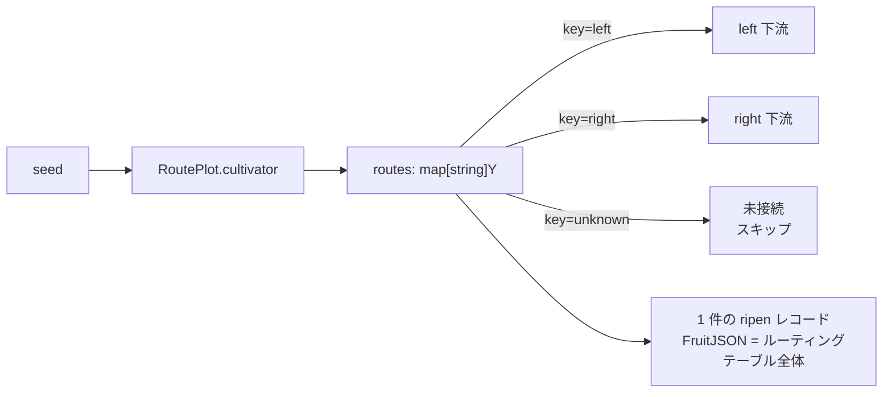

# pkg/plot/plot_route.go

> 📅 最終更新日: 2026/09/24

`plot_route.go` は `RoutePlot[S, Y]` を定義します。これは**宛先指定型の転送**ノードです。その `cultivator` が返すのは単一の fruit ではなく、ルーティングテーブル `map[string]Y` です。key はターゲットとなる下流の名前、value はその下流へ送る yield です。

したがって `Plot` の「全下流ブロードキャスト」とは異なり、`RoutePlot` では「下流ごとに異なるデータを受け取る」ことができ、**ルーティングされなかった下流は一切データを受け取りません**。

## 役割

- ジェネリックノード `RoutePlot[S, Y]` を提供します：1 つの seed → 名前で宛先を指定して複数の下流へ配信します。
- `basePlot[S, map[string]Y, Y]` 共有骨格（`plot_base.md` 参照）を再利用し、`ripenSeed` 成功フックのみを実装します。
- 「配信戦略」をグラフのトポロジではなくビジネス関数が決められるようにします。

## 中核となるオブジェクト

### `RoutePlot[S, Y]` 構造

```go
type RoutePlot[S any, Y any] struct {
	*basePlot[S, map[string]Y, Y]
}
```

| ジェネリックパラメータ | 意味 |
|---------|------|
| `S` | 種子の入力型。すなわち `cultivator` の引数型 |
| `Y` | **単一の**下流 yield 型。ルーティングテーブルの値型は `Y` であり、基底の `basePlot` の yield 型も `Y` です |

本ノードの「結果型」は `map[string]Y` であり（ルーティングテーブル全体が 1 件の `ripen` レコードとして永続化されます）、下流へ出力する型は `Y` であることに注意してください。

## 公開関数

### `NewRoutePlot[S, Y](name string, cultivator func(S) (map[string]Y, error), opts ...Option) *RoutePlot[S, Y]`

| パラメータ | 意味 |
|------|------|
| `name` | plot 名。`Farm` 内で一意である必要があります |
| `cultivator` | ルーティング関数。`map[下流名]yield` またはエラーを返します |
| `opts` | 任意の設定（`option.md` 参照） |

実装上のポイントは `NewPlot` と同じです。まず `var p *RoutePlot[S, Y]` を宣言し、次に `newBasePlot[S, map[string]Y, Y]` を構築して `p.ripenSeed(...)` を呼び出すクロージャを注入し、最後に base を `p` に代入します。クロージャが捕捉する `p` は `StartAsync` 以降にしか呼ばれないため、代入順序は安全です。

### `ripenSeed(seedPayload runtime.Payload[S], routes map[string]Y, startTime time.Time)`（未エクスポート）

成功経路であり、ルーティング関数が `nil` エラーを返したときに `basePlot.tend` から呼び出されます。

1. `AddFruitNum(1)`、`reportProgress()` —— **いくつの下流へルーティングしても、1 つの seed は fruit を 1 つだけ記録します**。
2. `eventClient.Emit("fruit", []int{seedID})` で `fruitID` を割り当てます。
3. `logInlet.SeedRipen`（ルーティングテーブルを 25 rune に切り詰め）と `lifecycleInlet.SeedRipen`（`FruitJSON` はルーティングテーブル全体の JSON）を書き込みます。
4. ルーティングテーブル `routes` を走査します：
   - `ch, ok := p.yieldChans[nextPlot]`。`!ok`（そのターゲットが未接続）の場合は `continue` でスキップし、他のルーティング項目には影響しません。
   - `AddDownstreamYieldNum(nextPlot, 1)` —— ルーティングされた各下流はちょうど +1 されます。
   - `eventClient.Emit("seed", []int{fruitID})` で下流 seed イベント ID を割り当てます（親イベントは `fruitID`）。
   - `logInlet.SeedInput`（yield を 50 rune に切り詰め）と `lifecycleInlet.SeedInput` を書き込みます。
   - `runtime.Payload[Y]{Value: yield, EventID: downstreamSeedID}` を送信します。

## 主要なフロー

### `Plot` との違い



| 比較項目 | `Plot` | `RoutePlot` |
|--------|--------|-------------|
| 結果型 | `F` | `map[string]Y` |
| 配信範囲 | 接続済みの全下流に各 1 つ | ルーティングテーブル内かつ**接続済み**のターゲットのみ |
| 各下流が受け取るデータ | まったく同じ | まったく異なる場合がある（それぞれルーティングテーブル内の自分の value を取る） |
| 未接続のターゲット | 該当なし | 黙ってスキップ |
| `fruit` カウント | +1 | +1 |
| 下流 yield カウントの増分 | 各下流 +1 | ルーティングされた各下流 +1 |

### 空のルーティングテーブル / `nil`

`cultivator` が `nil` map または空 map を返した場合でも 1 件の `ripen` を記録します（`FruitJSON` は `null` または `{}`）が、**下流 yield は一切生成されません**。

## 使用例

### Standalone ルーティング

```go
package main

import (
	"fmt"

	"github.com/Mr-xiaotian/CelestialGrow/pkg/plot"
)

func main() {
	route := plot.NewRoutePlot("route", func(seed int) (map[string]string, error) {
		routes := map[string]string{}
		if seed%2 == 0 {
			routes["even"] = fmt.Sprintf("even-%d", seed)
		} else {
			routes["odd"] = fmt.Sprintf("odd-%d", seed)
		}
		return routes, nil
	}, plot.WithTenders(2))

	route.Run([]int{1, 2, 3})

	records, err := route.Harvest()
	if err != nil {
		panic(err)
	}
	for _, r := range records {
		fmt.Println(r.SeedJSON, r.Status, r.FruitJSON)
	}
}
```

### Farm でターゲット別に分岐

```go
f := farm.NewFarm("route_demo", "INFO")

left := plot.NewPlot("left", func(seed string) (string, error) { return "L:" + seed, nil })
right := plot.NewPlot("right", func(seed string) (string, error) { return "R:" + seed, nil })
route := plot.NewRoutePlot("route", func(seed int) (map[string]string, error) {
	return map[string]string{"left": fmt.Sprintf("%d", seed)}, nil
})

_ = f.AddPlot(route, left, right)
// 只连 route → left、route → right；路由表中未出现的目标不会收到数据
_ = f.Connect([]plot.PlotNode{route}, []plot.PlotNode{left, right})
_ = f.Run(map[string][]any{"route": {1, 2, 3}})
```

> 下流の `left` / `right` の `S` は `string` であるため、`RoutePlot` の `Y` も `string` でなければなりません。そうでない場合は `Connect` の段階で型の不一致によりエラーになります。

## 注意事項

- ルーティングテーブルの key は下流 plot の `name` と完全に一致する必要があります。名前が一致しない場合（またはそのターゲットが `Connect` されていない場合）は**黙ってスキップ**され、エラーもログも発生しません。
- ルーティングテーブルは全体が 1 件の `ripen` ライフサイクルレコードの `FruitJSON` としてシリアライズされます。map の内容が非常に大きい場合は、ビジネス側で先に絞り込むことを推奨します。
- `map` の反復順序はランダムであるため、複数の下流への配信**順序は不定**です。ただし各ターゲットは自分用の yield を 1 つだけ受け取ります。
- `AddDownstreamYieldNum` は接続済みのターゲットに対してのみ呼ばれるため、下流の `GetSeedNum` と実際に受け取った yield 数は厳密に一致します。
- `cultivator` が同じ map を変更して再利用しないでください（並行な tend 呼び出し下でデータ競合が発生します）。毎回新しい map を返すのが最も安全です。
