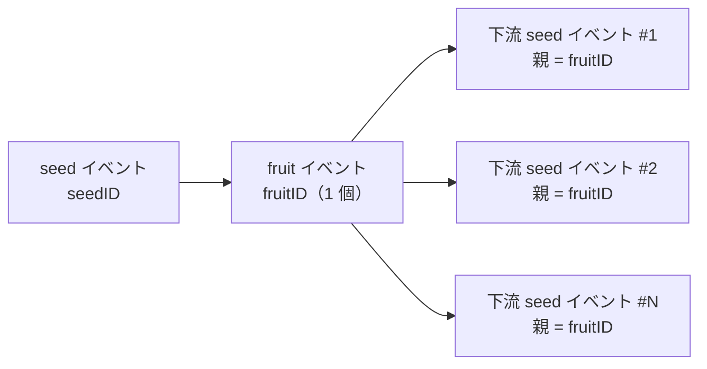

# pkg/plot/plot_split.go

> 📅 最終更新日: 2026/09/24

`plot_split.go` は `SplitPlot[S, F]` を定義します。これは**1 つを複数に分割する**ノードです。その `cultivator`（構築パラメータ名は `splitter`）は `[]F` を返し、ノードはスライス内の各要素を個別の下流 yield として転送します。

「1 つのタスクから N 個のサブタスクを派生させる」ような場面に適しています（例：1 つのディレクトリを複数のファイルに分割する、1 つの注文を複数の明細に分割する）。

## 役割

- ジェネリックノード `SplitPlot[S, F]` を提供します：1 つの seed → 複数の下流 yield。
- `basePlot[S, []F, F]` 共有骨格（`plot_base.md` 参照）を再利用し、`ripenSeed` 成功フックのみを実装します。
- 「**1 つの seed は `ripen` レコードを 1 件だけ記録する**」という統計の基準を維持します。何個の要素に分割しても、成功した育成 1 回として数えます。

## 中核となるオブジェクト

### `SplitPlot[S, F]` 構造

```go
type SplitPlot[S any, F any] struct {
	*basePlot[S, []F, F]
}
```

| ジェネリックパラメータ | 意味 |
|---------|------|
| `S` | 種子の入力型。すなわち `splitter` の引数型 |
| `F` | 分割後の**単一要素**型。結果型は `[]F`、下流へ出力する型は `F` です |

## 公開関数

### `NewSplitPlot[S, F](name string, splitter func(S) ([]F, error), opts ...Option) *SplitPlot[S, F]`

| パラメータ | 意味 |
|------|------|
| `name` | plot 名。`Farm` 内で一意である必要があります |
| `splitter` | 分割関数。`[]F` またはエラーを返します |
| `opts` | 任意の設定（`option.md` 参照） |

実装上のポイントは `NewPlot` と同じです。まず `var p *SplitPlot[S, F]` を宣言し、次に `newBasePlot[S, []F, F]` を構築して `p.ripenSeed(...)` を呼び出すクロージャを注入し、最後に `p` に代入します。

> 注意：`splitter` が `(nil, nil)` を返す場合も正当な成功です —— このとき下流 yield は一切生成されませんが、依然として `ripen` を 1 件記録します（`FruitJSON` は `null`）。

### `ripenSeed(seedPayload runtime.Payload[S], fruits []F, startTime time.Time)`（未エクスポート）

成功経路であり、`splitter` が `nil` エラーを返したときに `basePlot.tend` から呼び出されます。

1. `AddFruitNum(1)`、`reportProgress()` —— **1 だけ加算**し、`len(fruits)` とは関係ありません。
2. `eventClient.Emit("fruit", []int{seedID})` で**唯一の** `fruitID` を割り当てます（1 回の分割全体で 1 つの fruit イベントを共有します）。
3. `logInlet.SeedRipen`（`[]F` の文字列表現を 25 rune に切り詰め）と `lifecycleInlet.SeedRipen`（`FruitJSON` はスライス全体の JSON）を書き込みます。
4. `p.yieldChans`（すなわち**すべての**接続済み下流）を走査し、各下流に対して：
   - `AddDownstreamYieldNum(nextPlot, len(fruits))` —— その下流が受け取る yield 数を一度に `len(fruits)` だけ加算します。
   - 内側で `fruits` を走査し、**各要素**について：
     - `eventClient.Emit("seed", []int{fruitID})` で独立した下流 seed イベント ID を割り当てます（親イベントはすべて同じ `fruitID`）。
     - `logInlet.SeedInput`（要素を 50 rune に切り詰め）と `lifecycleInlet.SeedInput` を書き込みます。
     - `runtime.Payload[F]{Value: fruit, EventID: downstreamSeedID}` を送信します。

## 主要なフロー

### イベント ID と親子関係



- 1 回の分割で `fruitID` を 1 つだけ割り当て、`N` 個の下流 seed イベントはすべてそれを親イベントとします。
- ログ側では各要素ごとに `SeedInput` を 1 件ずつ書き、ライフサイクル側も同様です（`InputEventID` はそれぞれ異なります）。

### `Plot` / `RoutePlot` との違い

| 比較項目 | `Plot` | `SplitPlot` | `RoutePlot` |
|--------|--------|-------------|-------------|
| 結果型 | `F` | `[]F` | `map[string]Y` |
| 配信範囲 | 接続済みの全下流に各 1 つ | 接続済みの全下流に各 `len(fruits)` 個 | ルーティングテーブルにヒットしたターゲットのみ |
| 下流 yield カウントの増分 | 各下流 +1 | 各下流 +`len(fruits)` | ヒットした各ターゲット +1 |
| `fruit` カウント | +1 | +1（要素数とは無関係） | +1 |
| 宛先の下流が受け取るデータ | 同じ | 同じ（同一のスライス） | 異なる場合がある |

### 空スライスと全下流ブロードキャスト

- `fruits` が空（`nil` または `[]F{}`）の場合：`AddDownstreamYieldNum(nextPlot, 0)` が呼ばれ内側のループは実行されず、**下流は一切データを受け取りません**（ただし上流の終了処理時の seal は正常に受け取ります）。
- `fruits` に `N` 個の要素がある場合：**接続済みの各下流がすべての `N` 個の要素を受け取ります** —— `SplitPlot` は「分割 + ブロードキャスト」であり、「ターゲット別の配信」ではありません（ターゲット別の配信には `RoutePlot` を使用してください）。

## 使用例

### Standalone 分割

```go
package main

import (
	"fmt"
	"strings"

	"github.com/Mr-xiaotian/CelestialGrow/pkg/plot"
)

func main() {
	split := plot.NewSplitPlot("split", func(seed string) ([]string, error) {
		if seed == "" {
			return nil, nil
		}
		return strings.Split(seed, ","), nil
	}, plot.WithTenders(2))

	split.Run([]string{"a,b,c", ""})

	records, err := split.Harvest()
	if err != nil {
		panic(err)
	}
	for _, r := range records {
		fmt.Println(r.SeedJSON, r.Status, r.FruitJSON)
	}
}
```

### Farm で分割してから処理

```go
f := farm.NewFarm("split_demo", "INFO")

// split：把 "1,2,3" 拆成 int 列表
split := plot.NewSplitPlot("split", func(seed string) ([]int, error) {
	parts := strings.Split(seed, ",")
	values := make([]int, 0, len(parts))
	for _, part := range parts {
		v, err := strconv.Atoi(strings.TrimSpace(part))
		if err != nil {
			return nil, err
		}
		values = append(values, v)
	}
	return values, nil
})

// head：对每个拆出来的 int 再处理
head := plot.NewPlot("head", func(seed int) (int, error) {
	return seed * 10, nil
}, plot.WithTenders(2))

_ = f.AddPlot(split, head)
_ = f.Connect([]plot.PlotNode{split}, []plot.PlotNode{head}) // 上游 yield int → 下游 seed int
_ = f.Run(map[string][]any{"split": {"1,2,3"}})
```

## 注意事項

- `SplitPlot` の `F` は**要素型**であり、`ConnectTo` の際に下流の `S` は `F` と等しくなければなりません（`[]F` ではありません）。ここが最も嵌りやすい型不一致のポイントです。
- オブザーバが見る進捗は**seed の粒度**で進みます（`GetCompleted` は `ripenSeed` ごとに 1 だけ増えます）。5 個の要素に分割しても +5 にはなりません。
- 下流の `GetSeedNum()` は `AddDownstreamYieldNum(len(fruits))` によって相応に増加するため、「分割前後で種子の総数が合わない」のは想定どおりの挙動です —— 下流が見るのは分割後の種子量です。
- `splitter` が返すスライスはすべての下流へブロードキャストされます。下流でスライスの要素を変更しないでください（データ競合を引き起こす可能性があります）。または `splitter` が毎回新しく生成したスライスを返すようにしてください。
- `fruits` の要素数が非常に大きい場合は、`seedChan` のバッファと下流の並行度に注意してください。バッファが満杯になると、上流の `ripenSeed` は送信箇所でブロックします。
