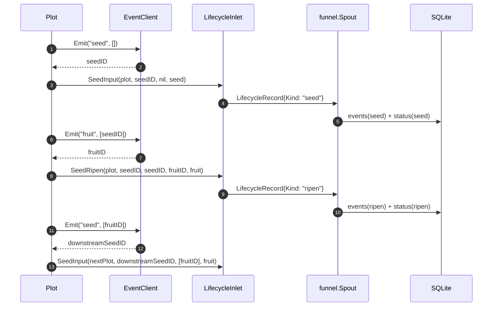

# pkg/runtime/event.go

> 📅 最終更新日: 2026/09/24

`event.go` はランタイムにおけるイベント ID 割り当ての抽象を定義します。「seed / fruit / weed / seal の各イベントに一意な数値 ID を割り当てる」という処理を最小限のインターフェース `EventClient` としてカプセル化し、プロセス内の既定実装 `LocalEventClient` を提供します。`pkg/plot` の各 plot ノードはこの抽象を通じて、「イベント ID をどのように生成するか」をスケジューリングロジックから切り離します。

## 役割

- **イベント ID 割り当て器**の最小契約 `EventClient` を定義します。
- プロセス内で並行安全な既定実装 `LocalEventClient` を提供します。
- plot がグローバルな状態に一切依存することなく、各業務イベント（seed の進入、fruit の生成、weed の失敗、seal の伝播）に対して単調増加する整数 ID を取得できるようにし、`pkg/persist` の SQLite 内で完全な因果チェーンとしてつなげられるようにします。

> 本パッケージには `EventClient`、`LocalEventClient`、`NewLocalEventClient`、`(*LocalEventClient).Emit` の **4 つ**のエクスポートシンボルのみがあります。`EventKind` 列挙型も `Event` 構造体もありません。イベント種別（`"seed"` / `"fruit"` / `"weed"` / `"seal"`）は文字列リテラルとして `pkg/plot` から `Emit` の `type_` 引数に渡されます。

## 主要なオブジェクト

### `EventClient` インターフェース

イベントクライアントの最小限の発行能力です。runtime パッケージ全体が要求するのは、**イベント ID を 1 つ割り当てる**というただ 1 つのことだけです。

```go
type EventClient interface {
    Emit(type_ string, parents []int) int
}
```

| メソッド | 用途 |
|------|------|
| `Emit(type_ string, parents []int) int` | 型が `type_`、親イベント ID のリストが `parents` であるイベントを 1 回宣言し、割り当てられたイベント ID を返します |

> `type_` と `parents` は `LocalEventClient` の実装では**署名の契約にのみ関与します**。既定実装は `type_` を永続化せず、`parents` も保存せず、増加するローカル ID を返すだけです。両者の実際の意味は呼び出し側（`pkg/plot`）が解釈し、`persist.LifecycleRecord` とともに SQLite へ格納されます。この設計により、将来 plot のコードを変更することなく、分散 ID 生成器で既定実装を置き換えられます。

### `LocalEventClient` 構造体

プロセス内のイベント ID 割り当て器です。`newBasePlot` は各 plot を構築する際に既定でこれを作成して使用します。

```go
type LocalEventClient struct {
    mu     sync.Mutex
    nextID int
}
```

| フィールド | 型 | 意味 |
|------|------|------|
| `mu` | `sync.Mutex` | `nextID` を保護するミューテックスロックで、`Emit` をマルチコルーチン下でもアトミックにします |
| `nextID` | `int` | 次に割り当てるイベント ID（`0` から始まり、最初の `Emit` は `1` を返します） |

### 構築と発行

```go
func NewLocalEventClient() EventClient

func (e *LocalEventClient) Emit(type_ string, parents []int) int
```

| 関数 | 振る舞い |
|------|------|
| `NewLocalEventClient()` | `EventClient` インターフェース値を返し、内部にゼロ値の `LocalEventClient`（`nextID = 0`）を保持します |
| `Emit(type_, parents)` | ロックし、`nextID++` し、新しい `nextID` を返し、ロックを解放します。並行安全で、プロセス内で単調増加します |

```go
c := runtime.NewLocalEventClient()
id1 := c.Emit("seed", []int{})      // 1
id2 := c.Emit("fruit", []int{id1})  // 2
```

> `LocalEventClient` は履歴を保存しません。担当するのは「ID の割り当て」だけです。プロセス終了後もイベントチェーンを追跡したい場合は、plot の `lifecycleInlet` と `persist.LifecycleRecordHandler` を組み合わせて SQLite に書き込んでください。

## 公開シンボル一覧

| シンボル | 型 | 説明 |
|------|------|------|
| `EventClient` | `interface` | イベント ID 割り当ての最小契約 |
| `LocalEventClient` | `struct`（エクスポート） | プロセス内で並行安全な既定実装 |
| `NewLocalEventClient` | `func() EventClient` | コンストラクタで、インターフェース値を返します |
| `(*LocalEventClient).Emit` | `func(string, []int) int` | 新しい ID を割り当てて返します |

## イベントの発行箇所（plot 内部）

`Seed` / `Seal` / `witherSeed` / `sprout` は `basePlot`（`plot_base.go`）で定義されています。`ripenSeed` は成功パスから注入され、`Plot`、`SplitPlot`、`RoutePlot` にそれぞれ 1 つずつ実装があります。すべての呼び出し箇所は次のとおりです。

| トリガーメソッド | 所在する型 | `type_` | `parents` | 説明 |
|---------|---------|---------|-----------|------|
| `Seed` | `basePlot` | `"seed"` | `[]int{}`（空） | 外部から seed を 1 つ注入し、その seed の開始イベント ID を割り当てます。`Source` フィールドは空のままです |
| `Seal` | `basePlot` | `"seal"` | `[]int{}`（空） | 外部からの終了信号で、`Payload.Source` は `sourceInput` として記録されます |
| `witherSeed` | `basePlot` | `"weed"` | `[]int{seedID}` | 育成が最終的に失敗（cultivator が error を返す、`retryIf` がリトライを拒否する、または panic） |
| `ripenSeed` | `Plot` | `"fruit"` | `[]int{seedID}` | 育成に成功し、fruitID を割り当てます。1 つの fruit は 1 つの下流 yield として転送されます |
| `ripenSeed` | `Plot` | `"seed"` | `[]int{fruitID}` | 上流に登録された各下流に新しい seedID を割り当てます |
| `ripenSeed` | `SplitPlot` | `"fruit"` + 各 fruit に 1 つの `"seed"` | 同上 | 1 回の成功で複数の fruit を生成し、1 つずつ転送します |
| `ripenSeed` | `RoutePlot` | `"fruit"` + 各ルートに 1 つの `"seed"` | 同上 | ルーティングテーブルに従って yield を該当する下流へ配信します |
| `sprout` の終了処理 | `basePlot` | `"seal"` | `[]int{...受信済みのすべての上流 sealID...}` | 入力が閉じられ、処理中の seed がなくなった後、すべての下流へ seal をブロードキャストします |

> 完全な因果チェーンは `parents` によって伝わります: seed → fruit → seed（下流）→ fruit（下流）→ … という流れで、その中の seed / fruit / weed イベントは SQLite の `events` + `event_parents` テーブルに永続化されます。**seal イベントはデータベースに保存されません**。その ID はメモリ内の `sealedFrom` マップで、後続の seal イベントの `parents` としてのみ使用されます。

> 同じ `EventClient` インスタンスはファーム内のすべての plot で共有されます。`Farm.AddPlot` は登録時に `PlotNode.SetEventClient(f.eventClient)` を呼び出して注入するため、Farm 全体の範囲でイベント ID は**単調かつ連続**になり、ID の再利用は発生しません。単体の standalone モードでは、各 plot が `newBasePlot` で既定で作成される `LocalEventClient` をそれぞれ使用します。

## `pkg/persist` との連携

イベント ID 自体は業務情報を運びません。`pkg/plot` はイベント ID、業務データ、由来を `persist.LifecycleRecord` に組み立て、`persist.LifecycleInlet` → `funnel.Spout` → `persist.LifecycleRecordHandler` を経て SQLite へ格納します。

`"seed"` / `"fruit"` / `"weed"` は `LifecycleRecordHandler.HandleRecord` の `switch record.Kind` で振り分けられて処理されます。`"seal"` は `LifecycleRecord` を生成しません。

| `Emit` の `type_` | `LifecycleRecord.Kind`（定数 / リテラル） | `events.event_type` | `status.status` | 説明 |
|-------------------|----------------------------------------|---------------------|-----------------|------|
| `"seed"` | `lifecycleSeed` / `"seed"` | `"seed"` | `"seed"` | seed がシステムに入り、`seed_json` に書き込まれます |
| `"fruit"` | `lifecycleRipen` / `"ripen"` | `"ripen"` | `"ripen"` | 育成に成功し、`fruit_json` に書き込まれます |
| `"weed"` | `lifecycleWither` / `"wither"` | `"wither"` | `"wither"` | 育成に失敗し、`wither_type` / `wither_message` に書き込まれます |
| `"seal"` | （`LifecycleRecord` を生成しません） | — | — | メモリ内の因果チェーンのノードとしてのみ機能し、データベースには保存されません |

> 命名の階層に注意してください。`Emit` の `type_` は `"fruit"` / `"weed"`（植物学の比喩）を使用しますが、`LifecycleRecord.Kind` とデータベースに保存される値は `"ripen"` / `"wither"`（状態のセマンティクス）を使用します。`events.event_type` に保存されるのは `Kind` なので、実際の値は `"seed"` / `"ripen"` / `"wither"` です。

データベースに保存される各 `LifecycleRecord` は `event_id` と `event_parents` テーブルを通じて親子エッジを確立し、これにより SQLite 内で因果グラフ全体を再構築できます。

## 主要なフロー



## 使用例

### 既定実装の置き換え

ローカルの自動増加 ID をスノーフレーク ID、UUID ハッシュ、外部サービスの割り当て器に置き換えたい場合は、`EventClient` インターフェースを実装し、`SetEventClient` を通じて注入するだけです。

```go
type snowflakeClient struct {
    // 内部状态略
}

func (s *snowflakeClient) Emit(type_ string, parents []int) int {
    // 分配全局唯一 ID（具体策略略）
    return nextSnowflake()
}

f := farm.NewFarm("demo", "INFO")
client := &snowflakeClient{}

// 在注册时注入；也可注册后对单个 plot 覆盖
if err := f.AddPlot(plotA, plotB); err != nil {
    panic(err)
}
plotA.SetEventClient(client)
plotB.SetEventClient(client) // 同一实例可被多个 plot 共享
```

> `Emit` の `type_` / `parents` 引数は必ずシグネチャに含める必要があります。独自実装がそれらを読み取らない場合でも残さなければなりません。そうでなければ `runtime.EventClient` を実装できません。

### 現在の ID 割り当て状態のみを確認する

`LocalEventClient` は `Len()` / `Current()` のような照会メソッドを提供しません。現在の割り当て済み数を観察したい場合は、外側で 1 層ラップします。

```go
type countedClient struct {
    inner runtime.EventClient
    n     atomic.Int64
}

func (c *countedClient) Emit(type_ string, parents []int) int {
    id := c.inner.Emit(type_, parents)
    c.n.Add(1)
    return id
}
```

## 重要な詳細

- **並行安全**: `LocalEventClient.Emit` は `sync.Mutex` で `nextID++` を直列化するため、マルチコルーチンからの並行呼び出しでも返される ID は一意で単調増加します。
- **永続化しない**: `LocalEventClient` は「**割り当て器**」であり「**記憶装置**」ではありません。状態は `nextID` という 1 つの `int` だけです。プロセス終了後は、イベント ID の意味を SQLite の `events` テーブルによってのみ追跡できます。
- **インターフェース設計の動機**: `type_ string, parents []int` は「将来的に分散トレーシングシステムを接続する可能性」のために用意されています。OpenTelemetry / Jaeger の実装に置き換える際、シグネチャはすでに十分で、plot を変更する必要はありません。
- **plot 間での共有**: `Farm.AddPlot` は同じ `EventClient` インスタンスをすべてのインスタンスに注入し、Farm 全体の範囲でイベント ID が単調で重複しないことを保証します。そのため SQLite では `plot` による部分的な絞り込みも、`event_id` による全体的な追跡も可能です。
- **型ラベルはパススルーにすぎない**: `LocalEventClient` 自身は `"seed"` / `"fruit"` / `"weed"` / `"seal"` を**区別せず**、呼び出し側のセマンティックラベルとしてパススルーするだけで、型の格納は `persist` 側で行われます。

## 注意事項

- 外部で直接 `&runtime.LocalEventClient{}` を構築しないでください。`NewLocalEventClient()` を使用して `EventClient` インターフェース値を取得してください（後から実装をスムーズに置き換えられます）。
- `parents` は「**親イベント ID**」のリストであり、因果パス上のすべての祖先 ID では**ありません**。SQLite へ書き込む際、`InsertLifecycleEvent` が `event_parents` テーブルに `(event_id, parent_id)` のエッジを挿入します。
- 同じ因果チェーン上で 2 つの `LocalEventClient` インスタンスを混在させないでください。そうしないと同じ論理タスクに異なる ID が割り当てられ、SQLite 内のエッジ関係が壊れます。
- 新しいイベント型を拡張した場合は、`persist.LifecycleRecordHandler.HandleRecord` の `switch record.Kind` 分岐も同期して更新してください。そうでなければ消費時に `unsupported lifecycle operation: <新しい型>` が返されます。
