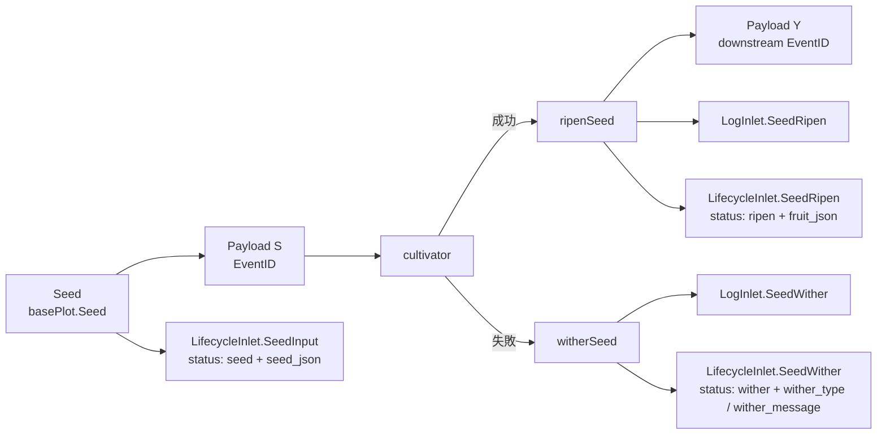

# pkg/runtime/type.go

> 📅 最終更新日: 2026/09/24

`type.go` はパッケージをまたいで共有されるランタイムの基本型を定義します。パイプライン段階の統一データキャリア `Payload[V]`、制御信号の定数 `SignalNone` / `SignalSeal`、および「seed — fruit」のペア型 `Karma[S, F]` です。このうち `Payload` は `pkg/plot` のすべてのチャネル（`seedChan` / `yieldChans`）の要素型です。`Karma` は現時点では拡張ポイントとして用意されているだけで、ランタイムのメインフローでは使用されていません。

## 役割

- **データ**（seed、yield）と**制御信号**（seal）を同じジェネリックなチャネル型に統一的にカプセル化し、plot 間の接続に `chan Payload[X]` が 1 本だけで済むようにします。
- `SignalNone` / `SignalSeal` という 2 つの定数によって、データフローと制御フローを同じチャネル上で共存させ、受信側が `Signal` に応じて振り分けます。
- `Karma` という「seed — fruit」のペア型を提供し、上位層が必要とする可能性のある「振り返り」インターフェースの余地を残します。

> `pkg/runtime` パッケージには `Task` / `TaskResult` / `TaskStatus` 構造体は**含まれていません**。これらの概念は `pkg/persist` に `LifecycleStatusRecord`（`SeedJSON` / `FruitJSON` フィールド + 文字列の `Status` フィールド）として存在します。本ドキュメントはこれらの型を捏造せず、「`pkg/persist` との連携」の節でのみ、それらが `Payload` / plot からどのように導出されるかを説明します。

## 主要なオブジェクト

### 制御信号の定数

```go
const (
    SignalNone = iota // 正常数据
    SignalSeal        // 终止信号，通知下游不再有新数据
)
```

| 定数 | 値 | セマンティクス |
|------|----|------|
| `SignalNone` | `0` | チャネル内のこの `Payload` が運ぶのは正常なデータ（seed または yield）です |
| `SignalSeal` | `1` | チャネル内のこの `Payload` は終了信号で、下流に「本 plot は新しいデータを生成しない」ことを通知します |

設計上のポイント:

- **同じ `chan Payload[V]`** でデータと制御フローを同時に運び、制御信号のために別のチャネルを追加で開くことを避けます。
- `Signal == SignalSeal` のときは `Value` を**運びません**。`Signal` だけで判定します。
- 下流の `sprout` は `select` で `SignalSeal` を読み取ると `markSealed` を呼び出します。由来がセンチネル `sourceInput`（リテラル `"__input__"`）と等しい場合は強制終了し、そうでなければ登録済みのすべての上流が seal を送るまで待機します。詳細は `plot_base.go` を参照してください。

### `Payload[V]` 構造体

```go
type Payload[V any] struct {
    // Signal与Seed通用
    Signal  int
    EventID int

    // Signal使用
    Source string

    // Seed使用
    Value V
}
```

| フィールド | 型 | 用途 | `SignalSeal` 時のセマンティクス |
|------|------|------|--------------------------|
| `Signal` | `int` | `SignalNone`（正常データ）または `SignalSeal`（終了信号） | 固定で `SignalSeal` |
| `EventID` | `int` | `EventClient.Emit` が割り当てるイベント ID（`event.md` 参照） | seal イベントの ID（メモリ内でのみ使用し、データベースには保存されません） |
| `Source` | `string` | データ/信号の由来: 外部注入は `""`、外部終了は `sourceInput`、内部伝播は上流の plot 名です | seal がどの plot（または `sourceInput`）から来たか |
| `Value` | `V` | 実際のデータ（seed または yield） | **使用しません**。ゼロ値になります |

> フィールドの意味は `Signal` によって決まります。
> - `Signal == SignalNone`（正常データ）: `Value` が有効なデータです。`Source` は構築側が決定します（`Seed` は空のまま、`ripenSeed` が下流へ転送する際も空のまま、`sprout` の seal のみ plot 名を使用します）。
> - `Signal == SignalSeal`（制御信号）: `Value` は無意味です。`Source` は下流の `markSealed` が由来を判定するために使用します。

### `Karma[S, F]` 構造体

```go
type Karma[S any, F any] struct {
    Seed  S
    Fruit F
}
```

| フィールド | 型 | 意味 |
|------|------|------|
| `Seed` | `S` | 1 つの seed の元の入力 |
| `Fruit` | `F` | この seed が育成を経て生成した fruit |

> `Karma` は現時点で **`pkg/plot` や他のどのパッケージからも使用されていません**。`pkg/runtime` はこれを拡張ポイントとして公開しています（例えば、失敗時にも `Seed` を保存して再生可能なキャッシュにする、あるいは `Harvest` 時に `[]Karma` を返すなど）。本番パスでこれに依存することは避けてください。

## 公開シンボル一覧

| シンボル | 型 | 用途 |
|------|------|------|
| `SignalNone` | `const int` | `Payload.Signal` の値: 正常データ |
| `SignalSeal` | `const int` | `Payload.Signal` の値: 終了信号 |
| `Payload[V any]` | `struct` | パイプライン段階の統一データキャリアで、データと制御信号を同時に運びます |
| `Karma[S any, F any]` | `struct` | seed — fruit のペア（拡張ポイントとして用意） |

ジェネリックパラメータのセマンティクス:

| パラメータ | 出現位置 | 意味 |
|------|---------|------|
| `V` | `Payload[V]` | そのパイプライン段階が運ぶデータ型です。上流は `S`（seed）、下流は `Y`（yield）で、標準の `Plot` では `Y = F` です |
| `S` | `Karma[S, F]` | seed 型 |
| `F` | `Karma[S, F]` | fruit 型 |

## パッケージをまたぐ使用の約束

`Payload[V]` は `pkg/plot` のすべての `chan` の要素型です:

| チャネル | 要素型 | 由来 | 宛先 |
|------|----------|------|--------|
| `basePlot.seedChan` | `chan runtime.Payload[S]` | 外部の `Seed` / 上流の yield / seal | 現在の plot の `sprout` |
| `basePlot.yieldChans[name]` | `chan runtime.Payload[Y]` | 現在の plot の `ripenSeed` / `sprout` の終了処理 | 下流の plot の `seedChan`（標準の `Plot` では `Y = F`） |

4 か所の構築ポイント（いずれも `pkg/plot`）:

- `basePlot.Seed`: `Payload[S]{Value: seed, EventID: seedID}`（`Signal` は既定で `SignalNone`、`Source` は空のまま）。
- `basePlot.Seal`: `Payload[S]{Signal: SignalSeal, Source: sourceInput, EventID: sealID}`。
- `ripenSeed` が下流へ転送: `Payload[Y]{Value: fruit, EventID: downstreamSeedID}`。
- `sprout` の終了処理で seal をブロードキャスト: `Payload[Y]{Signal: SignalSeal, Source: p.name, EventID: sealID}`。

> `ConnectTo` は型アサーション `next.GetSeedChanAny().(chan runtime.Payload[Y])` を行うため、上流下流の `Payload` 要素型は一致していなければなりません。これが「データ/信号を 2 つの型に分割しない」という強い制約の由来でもあります。

## 状態の値（`seed` / `ripen` / `wither`）

`pkg/runtime` には状態型が**ありません**。タスクの状態は `pkg/persist` の `LifecycleStatusRecord.Status` によって**文字列リテラル**で維持されます。その値とランタイムのトリガーポイントの対応関係は次のとおりです。

| ランタイムのトリガーポイント | 書き込まれる `status.status` | 説明 |
|--------------|------------------------|------|
| `LifecycleInlet.SeedInput`（`basePlot.Seed`、`ripenSeed` が下流へ転送する時） | `"seed"` | seed がシステムに入り、`seed_json` に書き込まれます |
| `LifecycleInlet.SeedRipen`（`ripenSeed`） | `"ripen"` | 昇格に成功し、`fruit_json` に書き込まれます |
| `LifecycleInlet.SeedWither`（`witherSeed`） | `"wither"` | 昇格に失敗し、`wither_type` / `wither_message` に書き込まれます |
| `basePlot.tend` が次のリトライへ進む | （**新しい状態を生成しません**） | 行は `"seed"` のままで、`LogInlet.SeedReplant` が `WARNING` レベルのログを 1 件書き込むだけです |

> 「**リトライ中**」は `status` テーブルの独立した状態では**ありません**。リトライは `tend` の `for attempt := 1; attempt <= p.maxRetries+1; attempt++` ループ内でのみ発生します（`retryIf` が `false` を返すと途中で終了します）。リトライの履歴を観察したい場合は、`logs/grow_log(*).log` の `Seed ... attempt N withered: ... Replanting.` という行を読み取ってください。
> Option とリトライの詳細な振る舞いは `pkg/plot/option.md` を参照してください。

## `pkg/persist` との連携

`Payload` 自体は「タスクコンテキスト」のフィールドを**持ちません**。業務データは plot が `Payload.Value` から取り出して `cultivator` に渡し、さらに `any` の形で `persist` に渡されます。`pkg/persist` は次の 2 種類の Record によって、業務データとイベント ID を照会可能な永続構造へ変換します（`pkg/persist` は `pkg/runtime` を import せず、`int` 形式の `EventID` のみを消費します）。

- `persist.LogRecord` — テキストログ。`basePlot.Seed` / `ripenSeed` の転送時に `SeedInput`（`DEBUG`）を書き、`ripenSeed` は `SeedRipen`（`SUCCESS`）を書き、`witherSeed` は `SeedWither`（`ERROR`）を書き、`tend` のリトライ時に `SeedReplant`（`WARNING`）を書きます。
- `persist.LifecycleRecord` — ライフサイクル記録。`Kind` は `lifecycleSeed`（`"seed"`）/ `lifecycleRipen`（`"ripen"`）/ `lifecycleWither`（`"wither"`）を取ります。それぞれ `SeedInput` / `SeedRipen` / `SeedWither` から生成され、`InsertLifecycleEvent` を経て `events` + `event_parents` に書き込まれ、さらに `UpsertLifecycleStatusSeed` / `PromoteLifecycleStatusRipen` / `PromoteLifecycleStatusWither` を経て `status` テーブルを更新します。

タスクコンテキスト（タスク JSON、結果 JSON、エラー情報）の格納フロー:



> `SeedJSON` は `SeedInput(plot, eventID, parentIDs, seed)` の `seed any` 引数に由来し、`toLifecycleJSON` によって文字列にシリアライズされます。`FruitJSON` も同様に `SeedRipen` の `fruit any` に由来します。`WitherType` / `WitherMessage` は `SeedWither` の `err error` 引数（`%T` / `%v`）に由来します。業務側で強い型が必要な場合は、逆に `json.Unmarshal` して独自の `Task` / `TaskResult` 構造体へ変換できます。

## 使用例

### `seedChan` 上でデータ / 信号を判別する

```go
for {
    select {
    case p := <-seedChan:
        switch p.Signal {
        case runtime.SignalNone:
            // 正常数据
            handle(p.Value, p.EventID)
        case runtime.SignalSeal:
            // 终止信号：记录来源、判断是否关闭输入
            handleSeal(p.Source, p.EventID)
        }
    case <-ctx.Done():
        return
    }
}
```

### 下流へ送る yield Payload を構築する

```go
yieldPayload := runtime.Payload[Y]{
    Value:   fruit,
    EventID: p.eventClient.Emit("seed", []int{fruitID}),
}
ch <- yieldPayload
```

### seal Payload を構築する

```go
sealPayload := runtime.Payload[Y]{
    Signal:  runtime.SignalSeal,
    Source:  p.name,          // 外部终止时用 sourceInput
    EventID: sealID,
}
ch <- sealPayload
```

### `Karma` で「seed — fruit」のペアをキャッシュする（プレースホルダー用法）

```go
k := runtime.Karma[S, F]{Seed: seed, Fruit: fruit}
// 业务侧可以把它放进自己管理的回放缓存里
_ = k
```

## 重要な詳細

- **ゼロ値は「正常データ」**: `Payload.Signal` のゼロ値は `SignalNone`（`iota` の先頭）なので、`Signal` フィールドを書かない `Payload{}` は自動的に正常データを表します。`Seed` / `ripenSeed` はいずれも `Value` / `EventID` のみを設定し、`Signal` を明示的に設定しません。
- **`Payload` のフィールドは「共用のセマンティクス」**: `Signal` / `Source` / `Value` の 3 つのフィールドは実際には `Signal` の値に応じて個別に使用されるため、すべてのフィールドが意味を持つと仮定しないでください。
- **リトライは内部ループで、新しいイベントを生成しない**: `tend` のリトライループは再度 `Emit` することも、新しい `status` 行を書くこともなく、最終的な成功/失敗時にのみ `ripenSeed` / `witherSeed` を通ります。
- **`Status` は列挙型ではなく文字列**: `pkg/persist` は状態をリテラル `"seed"` / `"ripen"` / `"wither"` として書き込み、Go の型レベルでは列挙定数を定義していません。業務側で型安全が必要な場合は独自にマッピングしてください。

## 注意事項

- `Payload` を「データのみ / 信号のみを入れられる」複数の型に分割しないでください。本フレームワークの設計は「同じパイプラインでデータと制御フローを同時に運ぶ」というもので、型を分割すると `ConnectTo` の型アサーションが壊れます。
- `Signal == SignalSeal` の状況で `Payload.Value` を使用しないでください。その内容は未定義で、通常は `V` のゼロ値です。
- 独自の業務構造体を `Payload[V]` でラップすると、ログ内で `fmt.Sprintf("%+v", ...)` により出力・切り詰められます（`SeedRipen` / `SeedWither` の seed / fruit repr）。その出力が可読であることを確認してください。そうでなければログは `{}` のような無意味な内容になります。
- 「リトライも即座に失敗とみなす」セマンティクスが必要な場合は、リトライの上限を `0`（`WithMaxRetries(0)`）に設定し、初回の失敗を直接 `witherSeed` に通してください。
- `Karma` は現在**plot のメインフローでは使用されていません**。導入したのは拡張ポイントとして用意するためであり、本番パスでこれに依存することは避けてください。
