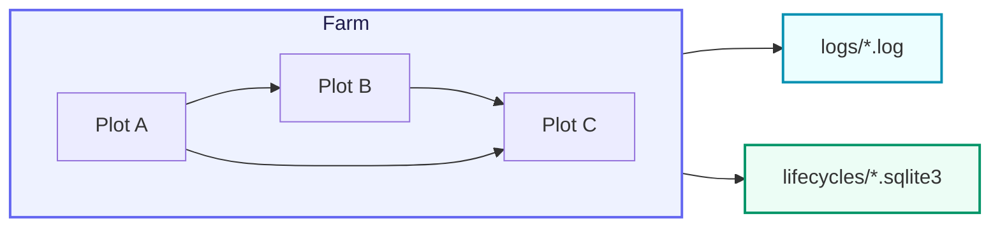

# CelestialGrow

> 最后更新日期: 2026/09/01

<p align="center">
  
  
  
</p>

**CelestialGrow** 是一个轻量级、可组合、基于 `Plot` / `Farm` 模型的 Go 并发任务编排框架。

它把任务处理拆成两个层次：

- **Plot**: 泛型并发处理节点，负责消费 seed、执行 cultivator、产出 fruit
- **Farm**: 由多个 Plot 组成的静态有向图，负责注册、连接、启动与全局调度

除了执行编排本身，CelestialGrow 还内置了：

- 基于事件 ID 的任务生命周期追踪
- 基于 SQLite 的状态快照持久化
- 基于文件的结构化运行日志
- 终端进度条观察器
- 一个统一的对外入口包 `pkg/api`

如果你希望在 Go 中用一种比"零散 goroutine + channel"更结构化的方式表达任务流，但又不想引入过重的工作流系统，CelestialGrow 就是为这个场景准备的。

## 项目结构（Project Structure）



CelestialGrow 的核心数据流可以概括为：

1. 外部输入 seed
2. Plot 并发执行 cultivator
3. 成功时产出 fruit 并转发给下游 Plot
4. 失败时记录 weed / error 生命周期
5. 全流程写入日志与生命周期 SQLite

## 快速开始（Quick Start）

安装：

```bash
go get github.com/Mr-xiaotian/CelestialGrow@latest
```

推荐从统一入口 `pkg/api` 开始使用。

一个最小的 `Farm` 示例（与 `demo/demo_farm.go` 完全一致）：

```go
package main

import grow "github.com/Mr-xiaotian/CelestialGrow/pkg/api"

// double 将种子翻倍。
func double(num int) (int, error) {
	return num * 2, nil
}

// addOne 为种子加一。
func addOne(num int) (int, error) {
	return num + 1, nil
}

func main() {
	root := grow.NewPlot("root", double, grow.WithTends(2))
	head := grow.NewPlot("head", addOne, grow.WithTends(2))

	farm := grow.NewFarm("demo_farm", "INFO")
	if err := farm.AddPlot(root, head); err != nil {
		panic(err)
	}
	if err := farm.Connect([]grow.PlotNode{root}, []grow.PlotNode{head}); err != nil {
		panic(err)
	}
	if err := farm.Run(map[string][]any{
		"root": {1, 2, 3},
	}); err != nil {
		panic(err)
	}
}
```

运行后会得到两类产物：

- `logs/grow_log(YYYY-MM-DD).log`: 运行日志
- `lifecycles/YYYY-MM-DD/grow_lifecycle(...).sqlite3`: 生命周期事件与状态快照

如果你只想单独运行一个 `Plot`，也可以直接使用 standalone 模式：

```go
package main

import (
	"fmt"

	grow "github.com/Mr-xiaotian/CelestialGrow/pkg/api"
)

func main() {
	plot := grow.NewPlot("double", func(seed int) (int, error) {
		return seed * 2, nil
	}, grow.WithTends(4))

	plot.AddObserver(grow.NewProgressBar("double"))
	plot.Run([]int{1, 2, 3, 4, 5})

	records, err := plot.Harvest()
	if err != nil {
		panic(err)
	}

	for _, record := range records {
		fmt.Println(record.TaskJSON, record.Status, record.ResultJSON)
	}
}
```

## 核心能力（Core Features）

- **泛型 Plot 节点**：`Plot[S, F]` 明确表达输入 seed 类型与输出 fruit 类型
- **类型安全连接**：上游 `F` 与下游 `S` 不匹配时，`Connect` 会直接报错
- **并发培育模型**：通过 `WithTends` 控制并发工作协程数
- **失败重试机制**：支持 `WithMaxRetries`、`WithRetryDelay`、`WithRetryIf`
- **图级调度**：`Farm` 统一管理节点注册、连边、源节点 seal 与整体运行
- **生命周期持久化**：默认将事件图和状态快照写入 SQLite
- **可观测性**：支持文件日志与进度条观察器

## 包说明（Packages）

- `pkg/api`: 对外统一入口，封装 `Farm`、`Plot`、`PlotNode` 以及常用配置项
- `pkg/farm`: 图结构、节点注册、连边与整体调度
- `pkg/plot`: 泛型任务节点、并发执行、重试、上下游数据传播
- `pkg/observer`: 观察器接口与终端进度条实现
- `pkg/persist`: 日志与生命周期 SQLite 持久化
- `pkg/funnel`: 通用异步记录生产/消费基础设施
- `pkg/runtime`: Payload、事件 ID、控制信号等运行时基础类型

## 典型使用方式（Typical Usage）

比较推荐的调用顺序是：

1. 用 `api.NewPlot(...)` 定义若干处理节点
2. 用 `api.NewFarm(...)` 创建调度图
3. 调用 `farm.AddPlot(...)` 注册节点
4. 调用 `farm.Connect(...)` 建立上下游关系
5. 调用 `farm.Run(...)` 注入初始输入并执行

其中 `Farm.Connect` 使用的是"组到组的全连接"语义，也就是源组与目标组之间建立笛卡尔积式连接。

## 文件结构（File Structure）

```text
pkg/
  api/       # 对外统一入口
  farm/      # 图结构与调度
  funnel/    # 通用异步消费基础设施
  observer/  # 进度观察器
  persist/   # 日志与生命周期持久化
  plot/      # 泛型并发节点
  runtime/   # 事件、信号与运行时载体
```

## 环境要求（Requirements）

当前模块声明：

- `go 1.25.5`
- `toolchain go1.26.2`

核心依赖如下：

| 依赖 | 说明 |
| --- | --- |
| `modernc.org/sqlite` | 纯 Go SQLite 驱动，用于生命周期持久化 |
| `github.com/schollz/progressbar/v3` | 终端进度条观察器 |

## 开发（Development）

```bash
go mod tidy
go test ./pkg/...
```

如果你修改了 `pkg/**/*.go`，建议运行对应包的相关测试，优先验证本次改动影响到的那部分行为。

## 文档索引（Documentation Index）

本仓库的详细中文文档按 `pkg/<name>/<file>.go` → `docs/zh-CN/pkg/<name>/<file>.md` 的镜像方式组织。当前已生成的中文子文档如下：

### pkg/api

- [`docs/zh-CN/pkg/api/api.md`](./pkg/api/api.md) — 对外统一入口包

### pkg/farm

- [`docs/zh-CN/pkg/farm/farm.md`](./pkg/farm/farm.md) — Farm 调度器
- [`docs/zh-CN/pkg/farm/graph.md`](./pkg/farm/graph.md) — 拓扑图（OrderGraph）
- [`docs/zh-CN/pkg/farm/farm_structure_test.md`](./pkg/farm/farm_structure_test.md) — Farm 结构测试重点
- [`docs/zh-CN/pkg/farm/farm_connect_test.md`](./pkg/farm/farm_connect_test.md) — Farm Connect 测试重点
- [`docs/zh-CN/pkg/farm/farm_start_test.md`](./pkg/farm/farm_start_test.md) — Farm Start 测试重点
- [`docs/zh-CN/pkg/farm/graph_test.md`](./pkg/farm/graph_test.md) — OrderGraph 测试重点

### pkg/plot

- [`docs/zh-CN/pkg/plot/plot.md`](./pkg/plot/plot.md) — 泛型 Plot 节点
- [`docs/zh-CN/pkg/plot/option.md`](./pkg/plot/option.md) — Plot 可选配置（Option）
- [`docs/zh-CN/pkg/plot/constant.md`](./pkg/plot/constant.md) — Plot 常量与信号定义
- [`docs/zh-CN/pkg/plot/counter.md`](./pkg/plot/counter.md) — Plot 计数器与同步原语
- [`docs/zh-CN/pkg/plot/helper.md`](./pkg/plot/helper.md) — Plot 内部辅助函数
- [`docs/zh-CN/pkg/plot/plot_harvest_test.md`](./pkg/plot/plot_harvest_test.md) — Plot Harvest 测试重点
- [`docs/zh-CN/pkg/plot/plot_retry_test.md`](./pkg/plot/plot_retry_test.md) — Plot 重试测试重点

### pkg/observer

- [`docs/zh-CN/pkg/observer/observer.md`](./pkg/observer/observer.md) — 观察器接口
- [`docs/zh-CN/pkg/observer/progress.md`](./pkg/observer/progress.md) — 终端进度条实现

### pkg/persist

- [`docs/zh-CN/pkg/persist/lifecycle.md`](./pkg/persist/lifecycle.md) — 生命周期事件记录
- [`docs/zh-CN/pkg/persist/log.md`](./pkg/persist/log.md) — 结构化运行日志
- [`docs/zh-CN/pkg/persist/sqlite.md`](./pkg/persist/sqlite.md) — SQLite 状态快照
- [`docs/zh-CN/pkg/persist/sqlite_test.md`](./pkg/persist/sqlite_test.md) — SQLite 持久化测试重点

### pkg/funnel

- [`docs/zh-CN/pkg/funnel/inlet.md`](./pkg/funnel/inlet.md) — 通用 Inlet 消费接口
- [`docs/zh-CN/pkg/funnel/spout.md`](./pkg/funnel/spout.md) — 通用 Spout 生产接口

### pkg/runtime

- [`docs/zh-CN/pkg/runtime/event.md`](./pkg/runtime/event.md) — 事件 ID 分配与流转
- [`docs/zh-CN/pkg/runtime/type.md`](./pkg/runtime/type.md) — 运行时基础类型

### demo

- [`docs/zh-CN/demo/demo_farm.md`](./demo/demo_farm.md) — 最小 Farm 示例解析
