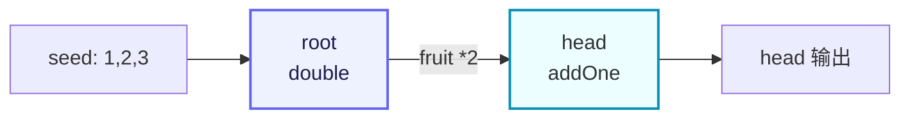

# demo/demo_farm.go

> 📅 最后更新日期: 2026/09/24

## 作用

`demo/demo_farm.go` 是 CelestialGrow 项目自带的最简 `Farm` 示例，演示了如何用对外统一入口 `pkg/api` 搭建并运行一条由两个 `Plot` 组成的小型流水线：

- 用 `NewPlot` 创建两个并发处理节点（`root` 与 `head`）；
- 用 `NewFarm` 创建调度图并将节点注册进去；
- 用 `Connect` 在两个节点之间建立上下游关系；
- 用 `Run` 注入初始 seed 并执行整张图。

整条流水线的语义是「root 将种子翻倍后传给 head 加一」，是非常适合用作上手演示的最小闭环。

## 代码结构

文件由三段组成：

1. **包与导入**：以 `package main` 形式提供可执行入口，仅导入 `pkg/api` 别名 `grow`。
2. **两个 cultivator 函数**：`double` 与 `addOne`，分别作为 `root` 与 `head` 的处理逻辑。
3. **`main` 函数**：依次完成 Plot 1、Plot 2 的构建，Farm 的注册、连接与运行。

对应的数据流（两个节点 + 一条边）可以简化为：



## 关键调用

`demo_farm.go` 中出现的关键 API（均来自 `pkg/api`）：

| 调用 | 来源 | 作用 |
|------|------|------|
| `grow.NewPlot[S, F](name, cultivator, opts...)` | `pkg/api` → `plot.NewPlot` | 构造一个泛型并发节点，`S` 为种子类型、`F` 为果实类型。 |
| `grow.NewFarm(name, logLevel)` | `pkg/api` → `farm.NewFarm` | 构造一个 Farm，内部创建日志 spout 与生命周期 spout，并按 `logLevel` 设置全局日志级别。 |
| `farm.AddPlot(plots ...plot.PlotNode)` | `pkg/farm` | 把若干 `PlotNode` 注册到 Farm，并加入拓扑图。 |
| `farm.Connect(from, to)` | `pkg/farm` | 在源组与目标组之间建立全连接（笛卡尔积），并对每条连接做种子/果实类型校验。 |
| `farm.Run(inputs map[string][]any)` | `pkg/farm` | 同步执行整张图，阻塞到全部 Plot 完成。 |
| `grow.WithTenders(n int)` | `pkg/api` → `plot.WithTenders` | 设置 Plot 的并发 tender（照料协程）数，默认为 `runtime.NumCPU()`。 |
| `grow.PlotNode` | `pkg/api` → `plot.PlotNode` | `Farm.Connect` 入参使用的统一接口，对 `Plot` / `SplitPlot` / `RoutePlot` 做了泛型擦除。 |

## 关键流程

`main` 函数内部按以下顺序执行：

1. 构建 `root` 节点，cultivator 为 `double`，并发 tender 数为 2。
2. 构建 `head` 节点，cultivator 为 `addOne`，并发 tender 数为 2。
3. 创建 `demo_farm`，全局日志级别 `INFO`。
4. `AddPlot(root, head)`：把两个节点注册进 Farm，名称必须唯一。
5. `Connect({root}, {head})`：在 `root` → `head` 之间建立一条边。
6. `Run({"root": {1, 2, 3}})`：注入 3 个初始 seed 到 `root`，整张图开始执行；`Run` 会同步等待所有 Plot 完成才返回。

## 运行产物

`Run` 返回后会在当前工作目录下生成（或追加）两类产物（与 `pkg/farm` 内置的日志/生命周期 spout 一致）：

- `logs/grow_log(YYYY-MM-DD).log`：本次 Farm 运行产生的结构化日志，按天追加；日志级别由 `NewFarm(name, "INFO")` 控制。
- `lifecycles/YYYY-MM-DD/grow_lifecycle(HH-MM-SS.mmm).sqlite3`：本次 Farm 的生命周期库，存放在以当天日期命名的子目录中，文件名带启动时刻。

其中 sqlite 库包含三张表：`events`（seed/fruit/weed/seal 事件）、`event_parents`（事件父子边）与 `status`（每颗种子的状态快照，状态为 `seed` / `ripen` / `wither`）。

> 上述路径与文件命名由 `pkg/persist` 决定，本示例未做自定义配置。如需清理，可以直接删除 `logs/` 与 `lifecycles/` 目录。

## 使用示例

以下代码与 `demo/demo_farm.go` 源码完全一致，可直接复制运行：

```go
package main

import grow "github.com/Mr-xiaotian/CelestialGrow/pkg/api"

// double 将种子翻倍。
func double(num int) (int, error) {
	return num * 2, nil
}

// addOne 为种子加一。
func addOne(num int) (int, error) {
	return num + 1, nil
}

// main 演示一条 Farm 流水线：root 将种子翻倍后传给 head 加一。
func main() {
	root := grow.NewPlot("root", double, grow.WithTenders(2))
	head := grow.NewPlot("head", addOne, grow.WithTenders(2))

	farm := grow.NewFarm("demo_farm", "INFO")
	if err := farm.AddPlot(root, head); err != nil {
		panic(err)
	}
	if err := farm.Connect([]grow.PlotNode{root}, []grow.PlotNode{head}); err != nil {
		panic(err)
	}
	if err := farm.Run(map[string][]any{
		"root": {1, 2, 3},
	}); err != nil {
		panic(err)
	}
}
```

### 逐段注解

- **导入**：仅导入 `pkg/api` 并以别名 `grow` 引用，避免与局部变量名 `farm` 冲突。
- **`double` / `addOne`**：两个最简单的 `func(S) (F, error)` 形态 cultivator，返回值恒不为 nil error，因此示例中所有 seed 都会正常产出 fruit 并被下游消费。
- **`NewPlot`**：两个节点的 seed 与 fruit 类型均为 `int`，泛型参数 `S = F = int` 由 Go 编译器自动推导；`WithTenders(2)` 把单 Plot 并发 tender 数限制为 2。
- **`NewFarm`**：内部已创建日志 spout 与生命周期 spout，调用方无需再手动 `BindInlet`。
- **`AddPlot`**：会把 `Plot` 加入 Farm 的 `plots` 映射与拓扑图，并共享 Farm 的事件客户端；名称为空或重复注册都会返回错误。
- **`Connect`**：使用「组到组全连接」语义，本例中两组都只有一个节点，因此只产生一条 `root → head` 的有向边。
- **`Run`**：注入 3 个 seed 到 `root` 后，内部依次启动 spout、绑定 inlet、启动所有 Plot、注入 seed、向 source 节点（此处即 `root`）发送 seal、`WaitAsync` 等待所有 Plot 完成，最终停止 spout 并返回。

### 运行方式

在项目根目录下执行：

```bash
go run ./demo/demo_farm.go
```

执行成功后：

- 终端完全无输出：`double` / `addOne` 没有副作用，日志全部写入文件而非标准输出，`Farm` 停止 spout 时的错误也不会被打印。
- 当前目录下会生成 `logs/grow_log(YYYY-MM-DD).log` 与 `lifecycles/YYYY-MM-DD/grow_lifecycle(HH-MM-SS.mmm).sqlite3` 两类产物。

`INFO` 级别下日志文件只包含 `INFO` 消息（图结构、各 Plot 启停、Farm 起止），`SeedInput` 的 `DEBUG` 与 `SeedRipen` 的 `SUCCESS` 消息会被过滤。如果想观察种子级别的细节，可以把 `NewFarm` 的 `logLevel` 调整为 `"DEBUG"`：

```go
farm := grow.NewFarm("demo_farm", "DEBUG")
```

## 注意事项

1. **依赖要求**：本示例与项目同属 `github.com/Mr-xiaotian/CelestialGrow` 模块，无需额外导入路径；`pkg/persist` 通过 `modernc.org/sqlite` 写入生命周期库，首次运行前可执行 `go mod download` 确保依赖就绪。
2. **`Run` 只为 source 节点发送 seal**：`inputs` 可以向任意已注册的 Plot 注入初始 seed，但 `Run` 只对 source 节点（此处 `root`）发送终止信号；非 source 节点（此处 `head`）的输入何时关闭，取决于其上游转发的 seal。因此按设计应只向 source 节点注入 seed。
3. **错误处理**：示例采用 `panic(err)` 形式，仅用于演示；生产代码建议把 `AddPlot` / `Connect` / `Run` 的错误向上层返回并集中处理。
4. **执行是同步阻塞的**：`farm.Run` 会一直阻塞到所有 Plot 完成；如需并行运行多张 Farm，请使用多个 goroutine 各自调用。
5. **观察器未注册**：本示例未调用 `AddObserver`，因此终端不会出现进度条；如需可视化进度，可参考 `docs/zh-CN/pkg/api/api.md` 中 Farm 模式的 `format.AddObserver(grow.NewProgressBar("format"))` 用法。
6. **类型安全**：`Connect` 会校验「上游 fruit 类型」与「下游 seed 类型」是否匹配，不匹配时返回错误；本例两个 Plot 的 S/F 都是 `int`，不会报错。
7. **其他节点类型**：本示例只演示 `Plot`。`pkg/api` 另外导出了 `NewSplitPlot`（一进多出）与 `NewRoutePlot`（按名称定向路由），它们同样实现 `PlotNode`，可与 `Plot` 混用在同一张图中。
