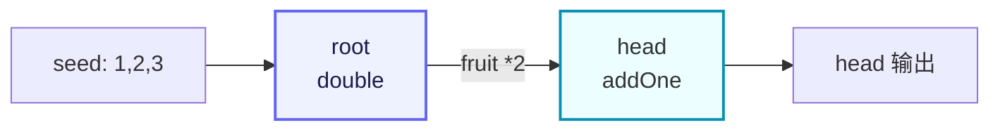

# demo/demo_farm.go

> 最后更新日期: 2026/09/01

## 作用

`demo/demo_farm.go` 是 CelestialGrow 项目自带的最简 `Farm` 示例，演示了如何用对外统一入口 `pkg/api` 搭建并运行一条由两个 `Plot` 组成的小型流水线：

- 用 `NewPlot` 创建两个并发处理节点（`root` 与 `head`）；
- 用 `NewFarm` 创建调度图并将节点注册进去；
- 用 `Connect` 在两个节点之间建立上下游关系；
- 用 `Run` 注入初始 seed 并执行整张图。

整条流水线的语义是「root 将种子翻倍后传给 head 加一」，是非常适合用作上手演示的最小闭环。

## 代码结构

文件由三段组成：

1. **包与导入**：以 `package main` 形式提供可执行入口，仅导入 `pkg/api` 别名 `grow`。
2. **两个 cultivator 函数**：`double` 与 `addOne`，分别作为 `root` 与 `head` 的处理逻辑。
3. **`main` 函数**：依次完成 Plot 1、Plot 2 的构建，Farm 的注册、连接与运行。

对应的数据流（两个节点 + 一条边）可以简化为：



## 关键调用

`demo_farm.go` 中出现的关键 API（均来自 `pkg/api`）：

| 调用 | 来源 | 作用 |
|------|------|------|
| `grow.NewPlot(name, cultivator, opts...)` | `pkg/api` → `plot.NewPlot` | 构造一个泛型并发节点。 |
| `grow.NewFarm(name, logLevel)` | `pkg/api` → `farm.NewFarm` | 构造一个 Farm，同时创建日志与生命周期 spout。 |
| `farm.AddPlot(plots ...)` | `pkg/farm` | 把若干 `PlotNode` 注册到 Farm，并加入拓扑图。 |
| `farm.Connect(from, to)` | `pkg/farm` | 在源组与目标组之间建立全连接（笛卡尔积）。 |
| `farm.Run(inputs map[string][]any)` | `pkg/farm` | 同步执行整张图，阻塞到全部 Plot 完成。 |
| `grow.WithTends(n int)` | `pkg/api` → `plot.WithTends` | 设置 Plot 的并发 tend 协程数。 |
| `grow.PlotNode` | `pkg/api` | `Farm.Connect` 入参使用的统一接口，对 `Plot` 做了泛型擦除。 |

## 关键流程

`main` 函数内部按以下顺序执行：

1. 构建 `root` 节点，cultivator 为 `double`，并发度为 2。
2. 构建 `head` 节点，cultivator 为 `addOne`，并发度为 2。
3. 创建 `demo_farm`，全局日志级别 `INFO`。
4. `AddPlot(root, head)`：把两个节点注册进 Farm，名称必须唯一。
5. `Connect({root}, {head})`：在 `root` → `head` 之间建立一条边。
6. `Run({"root": {1, 2, 3}})`：注入 3 个初始 seed 到 `root`，整张图开始执行；`Run` 会同步等待所有 Plot 完成才返回。

## 运行产物

`Run` 返回后会在当前工作目录下生成（或追加）两类产物（与 `pkg/farm` 内置的日志/生命周期 spout 一致）：

- `logs/grow_log(YYYY-MM-DD).log`：本次 Farm 运行产生的结构化日志，日志级别由 `NewFarm(name, "INFO")` 控制。
- `lifecycles/YYYY-MM-DD/grow_lifecycle(...).sqlite3`：本次 Farm 内各 Plot 的事件 ID、状态快照与生命周期记录，存放在以当天日期命名的子目录中。

> 上述路径与文件命名由 `pkg/persist` 决定，本示例未做自定义配置。如需清理，可以直接删除 `logs/` 与 `lifecycles/` 目录。

## 使用示例

以下代码与 `demo/demo_farm.go` 源码严格一致（仅在外部注释上做了必要的分行说明），可复制后直接 `go run`：

```go
package main

import grow "github.com/Mr-xiaotian/CelestialGrow/pkg/api"

// double 将种子翻倍。
func double(num int) (int, error) {
    return num * 2, nil
}

// addOne 为种子加一。
func addOne(num int) (int, error) {
    return num + 1, nil
}

// main 演示一条 Farm 流水线：root 将种子翻倍后传给 head 加一。
func main() {
    // Plot 1：root 节点，处理函数 double，并发 tend 数 = 2
    root := grow.NewPlot("root", double, grow.WithTends(2))

    // Plot 2：head 节点，处理函数 addOne，并发 tend 数 = 2
    head := grow.NewPlot("head", addOne, grow.WithTends(2))

    // 创建一个名为 "demo_farm" 的 Farm，全局日志级别 INFO
    farm := grow.NewFarm("demo_farm", "INFO")

    // 把 root、head 注册到 Farm（名称必须唯一）
    if err := farm.AddPlot(root, head); err != nil {
        panic(err)
    }

    // 在 root -> head 之间建立全连接（组到组的笛卡尔积）
    if err := farm.Connect([]grow.PlotNode{root}, []grow.PlotNode{head}); err != nil {
        panic(err)
    }

    // 注入初始 seed 到 root：1、2、3，Run 会同步等待整张图执行结束
    if err := farm.Run(map[string][]any{
        "root": {1, 2, 3},
    }); err != nil {
        panic(err)
    }
}
```

### 逐段注解

- **导入**：仅导入 `pkg/api` 并以别名 `grow` 引用，避免与局部变量名 `farm` 冲突。
- **`double` / `addOne`**：两个最简单的 `func(S) (F, error)` 形态 cultivator，返回值恒不为 nil error，因此示例中所有 seed 都会正常产出 fruit 并被下游消费。
- **`NewPlot`**：两个节点的 seed 与 fruit 类型均为 `int`，泛型参数 `S = F = int` 由 Go 编译器自动推导；`WithTends(2)` 把单 Plot 并发度限制为 2。
- **`NewFarm`**：内部已创建日志 spout 与生命周期 spout，调用方无需再手动 `BindInlet`。
- **`AddPlot`**：会把 `Plot` 加入 `Farm.plots` 映射与拓扑图，并共享 Farm 的事件客户端；同名称重复注册会返回错误。
- **`Connect`**：使用「组到组全连接」语义，本例中两组都只有一个节点，因此只产生一条 `root → head` 的有向边。
- **`Run`**：注入 3 个 seed 到 `root` 后，内部依次启动 spout、绑定 inlet、启动所有 Plot、注入 seed、向 source 节点（此处即 `root`）发送 seal、`WaitAsync` 等待所有 Plot 完成，最终停止 spout 并返回。

### 运行方式

在项目根目录下执行：

```bash
go run ./demo/demo_farm.go
```

执行成功后：

- 终端不会输出业务结果（`double` / `addOne` 没有副作用），仅可能出现 spout 停止时的内部日志。
- 当前目录下会生成 `logs/grow_log(YYYY-MM-DD).log` 与 `lifecycles/YYYY-MM-DD/grow_lifecycle(...).sqlite3` 两类产物。

如果想观察事件级别更详细的内容，可以把 `NewFarm` 的 `logLevel` 调整为 `"DEBUG"`：

```go
farm := grow.NewFarm("demo_farm", "DEBUG")
```

## 注意事项

1. **依赖要求**：运行本示例前需先在 `go.mod` 中存在 `github.com/Mr-xiaotian/CelestialGrow` 模块，且 `pkg/api` 及其间接依赖（`modernc.org/sqlite`、`github.com/schollz/progressbar/v3`）均可用；首次拉取可执行 `go mod tidy`。
2. **seed 仅注入 source 节点**：`Run` 接收的 `inputs` 中键对应的 Plot 必须是 source 节点（无上游），否则 seed 不会被消费；本例中 `root` 即为 source，`head` 不应出现在 `inputs` 中。
3. **错误处理**：示例采用 `panic(err)` 形式，仅用于演示；生产代码建议把 `AddPlot` / `Connect` / `Run` 的错误向上层返回并集中处理。
4. **执行是同步阻塞的**：`farm.Run` 会一直阻塞到所有 Plot 完成；如需并行运行多张 Farm，请使用多个 goroutine 各自调用。
5. **观察器未注册**：本示例未调用 `AddObserver`，因此终端不会出现进度条；如需可视化进度，可参考 `docs/zh-CN/pkg/api/api.md` 中 Farm 模式的 `format.AddObserver(grow.NewProgressBar("format"))` 用法。
6. **类型安全**：`Connect` 会校验「上游 fruit 类型」与「下游 seed 类型」是否匹配；本例两个 Plot 的 S/F 都是 `int`，编译期与运行期都不会报错。若上下游类型不一致，请把对应节点改为 Standalone 模式或重新设计 S/F。
