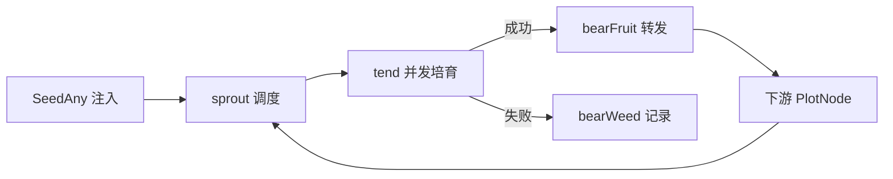

# pkg/api/api.go

> 最后更新日期: 2026/09/01

## 作用

`pkg/api` 是 CelestialGrow 项目的**对外统一入口包**。该包不引入任何新实现，而是把 `pkg/farm`、`pkg/plot`、`pkg/observer` 中的核心类型与常用配置项以**类型别名（type alias）**和**包级变量**的形式重新暴露出来，让下游用户只需导入 `github.com/Mr-xiaotian/CelestialGrow/pkg/api` 一个包即可使用整个框架。

由于本包大量使用 `type X = pkg.Y` 形式声明类型别名，因此文档中描述的所有方法的最终实现都位于底层包；本文档聚焦于本包导出的「符号清单 + 行为契约 + 默认值」。

## 核心对象

| 符号 | 类别 | 对应底层类型 | 说明 |
|------|------|--------------|------|
| `Farm` | 类型别名 | `farm.Farm` | 由多个 `Plot` 组成的静态有向图，负责节点注册、连接、启动与整体调度。 |
| `Plot[S any, F any]` | 泛型类型别名 | `plot.Plot[S, F]` | 并发任务节点；`S` 是输入 seed 类型，`F` 是输出 fruit 类型。 |
| `PlotNode` | 类型别名 | `plot.PlotNode` | `Farm` 在连接节点时使用的统一接口，对 `Plot` 做了泛型擦除。 |
| `Option` | 类型别名 | `plot.Option` | `Plot` 的可选配置函数，配合 `With*` 系列配置函数使用。 |

> 类型别名（`type X = Y`）意味着在 `pkg/api` 中调用 `Farm` 的方法和直接使用 `farm.Farm` 完全等价，接口不会发生任何语义变化。

## 关键函数

### `NewFarm(name string, logLevel string) *Farm`

创建并返回一个 `Farm` 实例。

- `name`：Farm 名称，会写入日志文件以及生命周期 SQLite 标识字段。
- `logLevel`：全局日志最低级别（`DEBUG` / `INFO` / `WARN` / `ERROR`），默认 `"INFO"`，会被后续 `WithLogLevel` 覆盖。

> Farm 在内部已经创建了日志与生命周期 spout，调用方无需自行 `BindInlet`。

### `NewPlot[S any, F any](name string, cultivator func(S) (F, error), opts ...Option) *Plot[S, F]`

创建一个泛型 `Plot` 节点。

- `name`：Plot 名称，在同一 `Farm` 中必须唯一。
- `cultivator`：处理函数；输入为 `S`，返回 `(F, error)`。返回 error 时节点会按 `WithMaxRetries` / `WithRetryDelay` / `WithRetryIf` 策略重试，最终失败将作为 weed 记录。
- `opts`：可选配置项，参见下节「配置函数」。

### `NewProgressBar(description string) *observer.ProgressBar`

创建一个终端进度条观察器，`description` 显示在进度条前缀。返回值可直接通过 `Plot.AddObserver(...)` 注册到任意 `Plot` 上。

进度条会监听 `Observer` 接口的 `OnStart` / `OnProgress` / `OnFinish` 事件，无需手动驱动。

## 配置函数

所有 `With*` 函数均为 `Option` 类型，可变参数传入 `NewPlot`：

```go
p := grow.NewPlot("worker", fn,
    grow.WithTends(4),
    grow.WithChanSize(16),
    grow.WithMaxRetries(3),
    grow.WithRetryDelay(func(attempt int) time.Duration { return time.Duration(attempt) * 100 * time.Millisecond }),
    grow.WithRetryIf(func(err error) bool { return !errors.Is(err, context.Canceled) }),
    grow.WithLogLevel("DEBUG"),
)
```

| 函数 | 作用 | 默认值 | 备注 |
|------|------|--------|------|
| `WithTends(n int)` | 设置并发 tend 协程数（即并发处理 seed 的最大工作协程数）。 | `runtime.NumCPU()` | 决定单 Plot 的并行度。 |
| `WithChanSize(n int)` | 设置 `seedChan` / `fruitChan` 的缓冲区大小。 | `runtime.NumCPU()` | 缓冲满时上下游会阻塞，从而实现天然背压。 |
| `WithMaxRetries(n int)` | 最大重试次数（**不含**首次执行）。 | `1` | `WithMaxRetries(2)` 表示最多执行 3 次。 |
| `WithRetryDelay(fn func(attempt int) time.Duration)` | 设置重试间隔策略。`attempt` 从 `1` 开始递增。 | `func(int) time.Duration { return 0 }`（立即重试） | 在 `pkg/api` 中通过闭包二次封装，签名与底层完全一致。 |
| `WithRetryIf(fn func(error) bool)` | 错误过滤器；返回 `true` 的错误才会触发重试。 | `func(error) bool { return true }`（所有错误都重试） | 可用于屏蔽不可重试错误（如 `context.Canceled`）。 |
| `WithLogLevel(level string)` | 设置当前 Plot 的日志最低级别。 | `"INFO"` | 仅作用于本 Plot；Farm 的全局级别在 `NewFarm` 时设置。 |

> `pkg/api` 中 `WithRetryDelay` 的签名与底层完全相同（`func(attempt int) time.Duration`），但实现是一个本地小闭包，用于在赋值前显式标注 `Option` 返回类型，对外行为零差异。

## 使用示例

### Farm 模式

```go
package main

import (
    "fmt"

    grow "github.com/Mr-xiaotian/CelestialGrow/pkg/api"
)

func main() {
    double := grow.NewPlot("double", func(seed int) (int, error) {
        return seed * 2, nil
    }, grow.WithTends(2))

    format := grow.NewPlot("format", func(seed int) (string, error) {
        return fmt.Sprintf("result=%d", seed), nil
    })

    format.AddObserver(grow.NewProgressBar("format"))

    farm := grow.NewFarm("demo_farm", "INFO")
    if err := farm.AddPlot(double, format); err != nil {
        panic(err)
    }
    if err := farm.Connect([]grow.PlotNode{double}, []grow.PlotNode{format}); err != nil {
        panic(err)
    }

    if err := farm.Run(map[string][]any{
        "double": {1, 2, 3, 4},
    }); err != nil {
        panic(err)
    }
}
```

调用 `farm.Run` 后，框架会按以下顺序执行：



### Standalone 模式

如果只有一个 `Plot` 不需要构建 `Farm`，可以直接使用 standalone 模式：

```go
package main

import (
    "fmt"

    grow "github.com/Mr-xiaotian/CelestialGrow/pkg/api"
)

func main() {
    p := grow.NewPlot("double", func(seed int) (int, error) {
        return seed * 2, nil
    }, grow.WithTends(4))

    p.AddObserver(grow.NewProgressBar("double"))
    p.Run([]int{1, 2, 3, 4, 5})

    records, err := p.Harvest()
    if err != nil {
        panic(err)
    }

    for _, record := range records {
        fmt.Println(record.TaskJSON, record.Status, record.ResultJSON)
    }
}
```

`Plot.Run` 内部会创建本地日志/生命周期 spout 并在结束后停止；`Harvest` 用于读取当前 Plot 已持久化的全部任务状态快照。

## 注意事项

1. **类型别名 ≠ 新类型**：`Farm`、`Plot[S, F]`、`PlotNode`、`Option` 都是 `type X = pkg.Y` 形式声明，可以与底层类型互换使用；底层包的方法集变更会立刻反映到本包。
2. **Option 模式**：所有可选配置通过函数式 `Option` 注入；`NewPlot` 内部按顺序应用，因此同一字段后传入的 `With*` 会覆盖前者。
3. **配置默认值由底层维护**：上表中的默认值取自 `pkg/plot/option.go` 的 `defaultOptions()`，修改底层默认值即可全局生效。
4. **类型安全连接**：`Farm.Connect` 会借助 `Plot.ConnectTo` 中的类型断言校验「上游 `F` 与下游 `S`」是否匹配；不匹配时 `Connect` 直接返回错误，编译期无法检查的不兼容组合会在运行期被拦截。
5. **进度条观察器**：`NewProgressBar` 返回的是 `*observer.ProgressBar`，其底层基于 `github.com/schollz/progressbar/v3`，输出目标为 `os.Stderr`；若需要重定向终端输出，请直接使用底层包。
6. **导入路径**：推荐以别名 `grow "github.com/Mr-xiaotian/CelestialGrow/pkg/api"` 引入，避免与本地变量名（例如 `farm`、`plot`）冲突。
