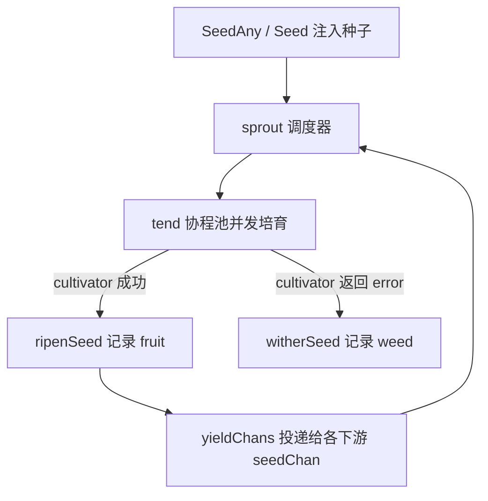

# pkg/api/api.go

> 📅 最后更新日期: 2026/09/24

## 作用

`pkg/api` 是 CelestialGrow 项目的**对外统一入口包**。该包不引入任何新实现，而是把 `pkg/farm`、`pkg/plot`、`pkg/observer` 中的核心类型与常用配置项以三种形式重新暴露：

1. **类型别名**：`type X = pkg.Y`，例如 `Farm`、`Plot`、`SplitPlot`、`RoutePlot`、`PlotNode`、`Option`；
2. **构造函数薄包装**：`NewFarm`、`NewPlot`、`NewSplitPlot`、`NewRoutePlot`、`NewProgressBar`；
3. **包级函数变量**：`WithTenders`、`WithChanSize`、`WithMaxRetries`、`WithRetryDelay`、`WithRetryIf`、`WithLogLevel`。

下游用户只需导入 `github.com/Mr-xiaotian/CelestialGrow/pkg/api` 一个包即可使用整个框架。

由于导出项全部是别名、函数变量或一层直通包装，本包的行为契约完全由底层包决定；本文档聚焦「导出符号清单 + 类型参数语义 + 默认值 + 错误场景」。

## 核心对象

| 符号 | 类别 | 指向 | 说明 |
|------|------|------|------|
| `Farm` | 类型别名 | `farm.Farm` | 由多个节点组成的静态有向图，负责节点注册、超边式连接、spout 管理与整体调度。 |
| `Plot[S, F]` | 泛型类型别名 | `plot.Plot[S, F]` | 基础并发节点。`S` 为输入种子类型，`F` 为输出果实类型；每成功处理一颗种子，向下游转发 **1 个** `F`。 |
| `SplitPlot[S, F]` | 泛型类型别名 | `plot.SplitPlot[S, F]` | 拆分节点。`S` 为输入种子类型，处理函数返回 `[]F`，其中**每个元素作为独立 yield** 分别转发给每个下游。 |
| `RoutePlot[S, Y]` | 泛型类型别名 | `plot.RoutePlot[S, Y]` | 路由节点。`S` 为输入种子类型，处理函数返回 `map[string]Y`，`key` 为目标下游名称，`value` 只发送给该下游。 |
| `PlotNode` | 类型别名 | `plot.PlotNode` | 抹掉泛型参数的统一节点接口，`Farm` 用它持有种子/产果类型各异的节点。 |
| `Option` | 类型别名 | `plot.Option` | 节点可选配置，底层为 `func(*plotOptions)`。因 `plotOptions` 未导出，包外**无法自定义** `Option`，只能使用内置 `With*` 系列。 |

> 类型别名（`type X = Y`）意味着在 `pkg/api` 中使用这些类型的语义与直接使用底层包完全等价，接口不会发生任何变化；底层包的方法集变更会立刻反映到本包。

### `PlotNode` 接口契约

`PlotNode` 是 `Farm` 管理节点时使用的统一接口，覆盖「图连接 + 运行装配 + 执行控制」所需的最小能力（实现位于 `pkg/plot/plot_base.go`）：

| 方法 | 作用 |
|------|------|
| `GetName() string` | 返回节点名称，`Farm` 以此做唯一性校验与连接寻址。 |
| `GetState() int32` | 返回状态：`0` = idle，`1` = running，`2` = done。 |
| `GetSeedChanAny() any` | 以 `any` 返回种子通道，供 `ConnectTo` 做类型断言。 |
| `ConnectTo(next PlotNode) error` | 把本节点产出接到下游输入；上下游类型不兼容时返回错误。 |
| `SetUpstreamYieldCounter(name string, yieldCounter *atomic.Int64)` | 登记上游产出计数器，用于 seal 聚合与种子统计。 |
| `BindInlet(logChan chan<- persist.LogRecord, lifecycleChan chan<- persist.LifecycleRecord)` | 绑定日志与生命周期写入通道；由 `Farm.Run` 或 standalone 的 `Plot.Run` 调用。 |
| `SetEventClient(eventClient runtime.EventClient)` | 注入事件客户端；`Farm.AddPlot` 会让所有节点共享 Farm 的客户端。 |
| `StartAsync()` | 异步启动调度器（调用前必须先绑定 inlet）。 |
| `WaitAsync()` | 等待后台协程退出。 |
| `SeedAny(seed any) error` | 以 `any` 播入一颗种子，内部做类型断言。 |
| `Seal()` | 向本节点发送「外部输入终止」信号。 |

典型实现是内嵌 `basePlot` 的三个节点：`*plot.Plot[S, F]`、`*plot.SplitPlot[S, F]`、`*plot.RoutePlot[S, Y]`。

## 关键函数

### `NewFarm(name string, logLevel string) *Farm`

创建并返回一个 `Farm`，内部同时创建日志 spout、生命周期 spout 及其 inlet。

- `name`：Farm 名称，用于日志标识（`FarmStart` / `FarmEnd` 记录）。
- `logLevel`：Farm **自身**日志 inlet 的最低级别（`"DEBUG"` / `"INFO"` / `"WARN"` / `"ERROR"`）；各节点的日志级别由节点自己的 `WithLogLevel` 决定，默认 `"INFO"`。
- 不返回 error；创建后即可 `AddPlot` / `Connect` / `Run`，调用方无需自行 `BindInlet`。

### `NewPlot[S any, F any](name string, cultivator func(S) (F, error), opts ...Option) *Plot[S, F]`

创建基础并发节点。

- `name`：节点名称，在同一 `Farm` 中必须唯一。
- `cultivator`：处理函数；返回 `error` 时按 `WithMaxRetries` / `WithRetryDelay` / `WithRetryIf` 策略重试，重试耗尽后作为 weed（失败）记录。
- `opts`：可选配置，见「配置函数」。

### `NewSplitPlot[S any, F any](name string, splitter func(S) ([]F, error), opts ...Option) *SplitPlot[S, F]`

创建拆分节点。`splitter` 把一颗种子映射为 `[]F`；成功后整颗种子记为 **1 个 fruit**，但会向**每个**已连接下游各发送 `len(fruits)` 个 yield。

### `NewRoutePlot[S any, Y any](name string, cultivator func(S) (map[string]Y, error), opts ...Option) *RoutePlot[S, Y]`

创建路由节点。`cultivator` 返回的路由表中，`key` 为目标下游名称、`value` 为发给该下游的 yield：**不同下游可以收到不同 yield，未被路由到的下游收不到任何数据**；路由表中出现但并未连接的下游会被跳过，不影响其余路由项。

### `NewProgressBar(description string) *observer.ProgressBar`

创建终端进度条观察器，`description` 显示在进度条前缀位置。返回值可直接通过 `Plot.AddObserver(...)` 注册到任意节点上。

进度条会监听 `observer.Observer` 接口的 `OnStart(total)` / `OnProgress(completed, total)` / `OnFinish(completed, total)` 回调，无需手动驱动。

> 底层 `ProgressBar` 是**延迟初始化**的：只有在第一次收到 `total > 0` 的事件时才创建内部 `progressbar` 实例。若节点的种子总数为 `0`，则不会创建进度条。

## 配置函数

`With*` 在本包中以**包级变量**（函数值）形式转发，例如 `WithTenders = plot.WithTenders`；仅 `WithRetryDelay` 用一层闭包显式标注了返回类型 `Option`，对外行为与底层零差异。

```go
package main

import (
    "context"
    "errors"
    "time"

    grow "github.com/Mr-xiaotian/CelestialGrow/pkg/api"
)

func main() {
    p := grow.NewPlot("worker", func(seed int) (int, error) {
        return seed * 2, nil
    },
        grow.WithTenders(4),
        grow.WithChanSize(16),
        grow.WithMaxRetries(3),
        grow.WithRetryDelay(func(attempt int) time.Duration {
            return time.Duration(attempt) * 100 * time.Millisecond
        }),
        grow.WithRetryIf(func(err error) bool { return !errors.Is(err, context.Canceled) }),
        grow.WithLogLevel("DEBUG"),
    )

    p.Run([]int{1, 2, 3})
}
```

| 函数 | 作用 | 默认值 | 备注 |
|------|------|--------|------|
| `WithTenders(n int)` | 设置并发 tender（照料协程）数，即 `sprout` 信号量容量。 | `runtime.NumCPU()` | 决定单节点的并行度。 |
| `WithChanSize(n int)` | 设置种子通道 `seedChan` 的缓冲区大小。 | `runtime.NumCPU()` | 下游产出通道直接复用下游的 `seedChan`；缓冲满时上下游阻塞，形成天然背压。 |
| `WithMaxRetries(n int)` | 最大重试次数（**不含**首次执行）。 | `1` | `WithMaxRetries(2)` 表示最多执行 3 次。 |
| `WithRetryDelay(fn func(attempt int) time.Duration)` | 设置重试间隔策略，`attempt` 从 `1` 开始递增。 | `func(int) time.Duration { return 0 }`（立即重试） | 在 `pkg/api` 中通过闭包二次封装，参数类型与底层一致。 |
| `WithRetryIf(fn func(error) bool)` | 错误过滤器；仅返回 `true` 的错误才触发重试。 | `func(error) bool { return true }`（全部重试） | 可用于屏蔽不可重试错误（如 `context.Canceled`）。 |
| `WithLogLevel(level string)` | 设置当前节点的日志最低级别。 | `"INFO"` | 只作用于该节点；Farm 自身的级别在 `NewFarm` 时设置。 |

> 默认值统一来自 `pkg/plot/option.go` 的 `defaultOptions()`，修改底层默认值即可全局生效。
>
> 重试语义（`basePlot.tend`）：最多执行 `maxRetries + 1` 次；`retryIf(err)` 返回 `false` 时立即停止重试；`cultivator` 若 panic 会被 `recover` 捕获并记为失败，错误文本为 `cultivator panic: ...`。

## 使用示例

### Farm 模式（线性流水线）

```go
package main

import (
    "fmt"

    grow "github.com/Mr-xiaotian/CelestialGrow/pkg/api"
)

func main() {
    double := grow.NewPlot("double", func(seed int) (int, error) {
        return seed * 2, nil
    }, grow.WithTenders(2))

    format := grow.NewPlot("format", func(seed int) (string, error) {
        return fmt.Sprintf("result=%d", seed), nil
    })

    format.AddObserver(grow.NewProgressBar("format"))

    farm := grow.NewFarm("demo_farm", "INFO")
    if err := farm.AddPlot(double, format); err != nil {
        panic(err)
    }
    if err := farm.Connect([]grow.PlotNode{double}, []grow.PlotNode{format}); err != nil {
        panic(err)
    }

    if err := farm.Run(map[string][]any{
        "double": {1, 2, 3, 4},
    }); err != nil {
        panic(err)
    }
}
```

调用 `farm.Run` 后，框架对每个节点的处理顺序如下：



### 拆分与路由

```go
package main

import (
    "fmt"

    grow "github.com/Mr-xiaotian/CelestialGrow/pkg/api"
)

func main() {
    // 一颗种子拆成多个 yield（F = string）
    split := grow.NewSplitPlot("split", func(seed int) ([]string, error) {
        return []string{fmt.Sprintf("v%d", seed), fmt.Sprintf("x%d", seed)}, nil
    }, grow.WithTenders(2))

    // 按 yield 长度把它们路由到不同下游（Y = string）
    route := grow.NewRoutePlot("route", func(seed string) (map[string]string, error) {
        if len(seed)%2 == 0 {
            return map[string]string{"left": "L-" + seed}, nil
        }
        return map[string]string{"right": "R-" + seed}, nil
    })

    left := grow.NewPlot("left", func(seed string) (string, error) { return seed, nil })
    right := grow.NewPlot("right", func(seed string) (string, error) { return seed, nil })

    farm := grow.NewFarm("dispatch_farm", "INFO")
    if err := farm.AddPlot(split, route, left, right); err != nil {
        panic(err)
    }
    if err := farm.Connect([]grow.PlotNode{split}, []grow.PlotNode{route}); err != nil {
        panic(err)
    }
    if err := farm.Connect([]grow.PlotNode{route}, []grow.PlotNode{left, right}); err != nil {
        panic(err)
    }

    if err := farm.Run(map[string][]any{
        "split": {1, 2, 3},
    }); err != nil {
        panic(err)
    }
}
```

### Standalone 模式

如果只有一个节点、不需要构建 `Farm`，可以直接使用 standalone 模式：

```go
package main

import (
    "fmt"

    grow "github.com/Mr-xiaotian/CelestialGrow/pkg/api"
)

func main() {
    p := grow.NewPlot("double", func(seed int) (int, error) {
        return seed * 2, nil
    }, grow.WithTenders(4))

    p.AddObserver(grow.NewProgressBar("double"))
    p.Run([]int{1, 2, 3, 4, 5})

    records, err := p.Harvest()
    if err != nil {
        panic(err)
    }

    for _, record := range records {
        fmt.Println(record.SeedJSON, record.Status, record.FruitJSON)
    }
}
```

`Plot.Run` 内部会创建本地日志/生命周期 spout、绑定 inlet，并在结束后停止 spout；`Harvest` 返回 `[]persist.LifecycleStatusRecord`，用于读取当前节点已持久化的全部种子状态快照。

## 错误场景

| 入口 | 可能的 error |
|------|--------------|
| `Farm.AddPlot` | 传入 `nil` 节点、名称为空、名称重复。 |
| `Farm.Connect` | `from` / `to` 列表为空；节点未注册到该 Farm；上下游类型不兼容（`ConnectTo` 断言失败）。 |
| `Farm.Run` | `inputs` 中出现未注册的节点名；`SeedAny` 的种子类型与节点 `S` 不匹配。 |
| `PlotNode.SeedAny` | 传入值无法断言为节点的 `S`。 |
| `Plot.Harvest` | 生命周期 spout 为 `nil`（未通过 standalone `Run` 启动）；或其 handler 不支持状态查询。 |
| `NewFarm` / `NewPlot` / `NewSplitPlot` / `NewRoutePlot` / `NewProgressBar` | 不返回 error。 |

## 注意事项

1. **类型别名 ≠ 新类型**：`Farm`、`Plot[S, F]`、`SplitPlot[S, F]`、`RoutePlot[S, Y]`、`PlotNode`、`Option` 均为 `type X = pkg.Y`，可与底层类型互换使用。
2. **Option 模式**：所有可选配置通过函数式 `Option` 注入；`NewPlot` 系列按传入顺序依次应用，因此同一字段后传入的 `With*` 会覆盖前者。由于 `plotOptions` 未导出，包外无法自定义 `Option`。
3. **配置默认值由底层维护**：默认值取自 `pkg/plot/option.go` 的 `defaultOptions()`。
4. **类型安全连接**：`Farm.Connect` 会对源组与目标组做全连接（笛卡尔积），每条连接调用上游的 `ConnectTo`，由其中的类型断言校验「上游 `F`/`Y` 与下游 `S`」是否匹配；编译期无法检查的不兼容组合会在运行期被拦截并直接返回错误。
5. **泛型参数需与「下游种子类型」对齐**：`Plot` 的 `F`、`SplitPlot` 的 `F`、`RoutePlot` 的 `Y` 都表示**下游 `seedChan` 的元素类型**，连接时由运行期断言校验。
6. **进度条观察器**：`NewProgressBar` 返回 `*observer.ProgressBar`，底层基于 `github.com/schollz/progressbar/v3`，输出目标为 `os.Stderr`；若需重定向输出或自定义渲染，请直接使用底层包。
7. **导入路径**：推荐以别名 `grow "github.com/Mr-xiaotian/CelestialGrow/pkg/api"` 引入，避免与本地变量名（例如 `farm`、`plot`、`runtime`）冲突。
