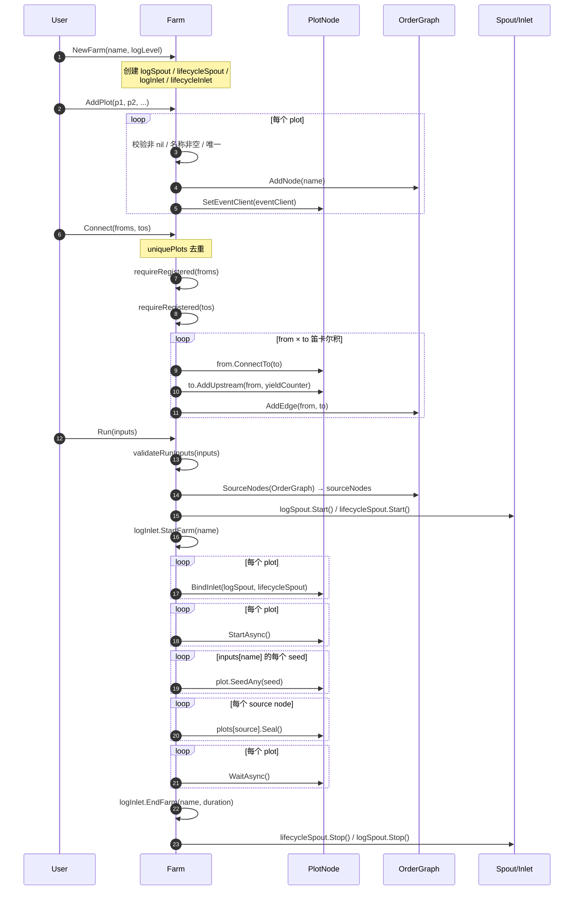

# pkg/farm/farm.go

> 最后更新日期: 2026/09/01

## 作用

`farm` 包是 CelestialGrow 的「图级」调度器，`farm.go` 提供了 `Farm` 类型，负责把多个 `plot.PlotNode` 节点组织成一张静态有向图，并完成：

- 节点注册与名称唯一性校验
- 组到组（hyper-edge）式的全连接建立
- 全局日志 / 生命周期 spout 启动与 inlet 绑定
- 统一的 source 节点探测、初始种子注入与 seal
- 等待所有 plot 完成并清理 spout

`Farm` 仅管理编排层，不关心 `Plot` 的泛型种子 / 果实类型——这是通过 `plot.PlotNode` 接口抹除的。`Farm` 内部使用同目录下的 `OrderGraph` 维护拓扑信息，详见 [`graph.md`](./graph.md)。

## 核心对象

### `Farm` 结构体

```go
type Farm struct {
    name        string
    plots       map[string]plot.PlotNode
    sourceNodes []string
    *OrderGraph

    eventClient runtime.EventClient

    logSpout       *funnel.Spout[persist.LogRecord]
    lifecycleSpout *funnel.Spout[persist.LifecycleRecord]
    logInlet       *persist.LogInlet
    lifecycleInlet *persist.LifecycleInlet
}
```

| 字段 | 作用 |
| --- | --- |
| `name` | Farm 名称，写入日志时作为 farm 标识 |
| `plots` | 按 plot 名称索引的节点表，用于注册校验与查找 |
| `sourceNodes` | `Run` 时一次性计算的「源节点代表」，每个 Source SCC 取一个 |
| `*OrderGraph` | 嵌入的有向图，记录 plot 间的连边，用于拓扑与 SCC 分析 |
| `eventClient` | 共享的运行时事件客户端，通过 `AddPlot` 注入到每个 plot |
| `logSpout` / `lifecycleSpout` | 全局的日志 / 生命周期消息 spout，`Run` 时统一启动 |
| `logInlet` / `lifecycleInlet` | farm 侧的 inlet 句柄，仅用于 `StartFarm` / `EndFarm` 包级日志 |

### `PlotNode` 接口契约

`Farm` 通过 `plot.PlotNode` 接口与具体 `Plot[S, F]` 解耦。`Farm` 调用以下方法：

| 方法 | 用途 |
| --- | --- |
| `GetName() string` | 唯一标识与连边匹配 |
| `GetYieldCounter() *atomic.Int64` | 把上游 yield 计数器登记到下游用于种子同步 |
| `ConnectTo(next PlotNode) error` | 真正建立下游 seed 通道；类型不匹配时返回 error |
| `AddUpstream(name, yieldCounter)` | 登记上游名 + 计数器，用于 seal 聚合 |
| `SetEventClient(runtime.EventClient)` | `AddPlot` 时统一注入同一事件客户端 |
| `BindInlet(logChan, lifecycleChan)` | `Run` 时绑定全局 spout 通道 |
| `StartAsync()` / `WaitAsync()` | 异步生命周期控制 |
| `SeedAny(seed any) error` | `Run` 时按 `inputs` 注入初始种子 |
| `Seal()` | `Run` 时向每个 source 发送 `SignalSeal` |

接口实现细节参见 `pkg/plot` 文档。

## 公开符号

| 符号 | 签名 | 用途 |
| --- | --- | --- |
| `NewFarm` | `func NewFarm(name, logLevel string) *Farm` | 构造一个 Farm，并创建两个全局 spout 与 inlet |
| `PlotCount` | `func (f *Farm) PlotCount() int` | 返回已注册 plot 数量 |
| `HasPlot` | `func (f *Farm) HasPlot(name string) bool` | 判断指定 plot 是否已注册 |
| `GetPlot` | `func (f *Farm) GetPlot(name string) (plot.PlotNode, bool)` | 按名称取 plot，ok 表示是否存在 |
| `AddPlot` | `func (f *Farm) AddPlot(plots ...plot.PlotNode) error` | 注册一个或多个 plot，要求非 nil、名称非空且唯一 |
| `Connect` | `func (f *Farm) Connect(fromPlots, toPlots []plot.PlotNode) error` | 在源组与目标组之间建立笛卡尔积式连接 |
| `Run` | `func (f *Farm) Run(inputs map[string][]any) error` | 同步运行整张图，等待所有 plot 完成 |

> `Farm` 没有 `SetLogLevel` 之类的方法：日志级别在 `NewFarm` 时通过 `logLevel` 参数注入到全局 `LogInlet`，运行时不可更改。

## 关键流程

### `AddPlot → Connect → Run` 全链路



### `AddPlot` 错误返回点

- 任一 plot 为 `nil` → `plot is nil`
- 名称为空 → `plot name cannot be empty`
- 名称重复 → `plot %q already exists`

注意：`AddPlot` 在遍历过程中遇到第一个错误即返回，已成功加入 `f.plots` 与图中的节点**不会**回滚。

### `Connect` 错误返回点

- `fromPlots` / `toPlots` 整体去重后为空 → `from plots cannot be empty` / `to plots cannot be empty`
- 任意 plot 未注册到 farm → `plot %q is not registered in farm`
- 某对 `from → to` 在 `from.ConnectTo(to)` 阶段类型断言失败 → 透传 `plot.ConnectTo` 的错误

> ⚠️ **部分失败不撤销**：`Connect` 在内层循环中一旦失败立即返回。已成功建立的连接（`ConnectTo` 内部已写入下游 `fruitChans`、图已 `AddEdge`）会保留下来，后续再次 `Connect` 时图层面会因重复边被忽略，但 `PlotNode` 内部的 `fruitChans` 会保留旧映射。如需重启，请新建 `Farm`。

### `Run` 错误返回点

- `inputs` 中存在未注册的 plot → `plot %q is not registered in farm`
- `SeedAny` 类型断言失败 → 透传错误（此时部分 plot 已 `StartAsync`，调用方需自行保证 retry 时的图状态）

## 重要细节

### 组到组笛卡尔积

`Connect(froms, tos)` 会对两端先做 `uniquePlots` 去重 + 过滤 `nil`，然后建立 `len(froms) × len(tos)` 条边。例如：

```go
farm.Connect([]plot.PlotNode{root}, []plot.PlotNode{midA, midB})
// 等价于 root → midA 与 root → midB 两条独立边
```

注意：只有出现在「源组」中的节点会与「目标组」中每个节点建立连接。`midA` 与 `midB` 不会互相连边。

### Source 节点 seal

`Run` 通过 `SourceNodes(OrderGraph)` 计算每个 Source SCC 的代表节点，并对其调用 `Seal()`。`Seal()` 会以 `Source == sourceInput`（即 `__input__`）发送 `SignalSeal`，对带上游连接的 plot 触发「强终止」语义——不再等待尚未到达的上游 seal。

### 并发控制

- `Run` 是**同步**调用：依次 `StartAsync` 后通过 `WaitAsync` 等待所有 plot 退出。
- `StartAsync` 内部使用 `sync.WaitGroup.Go`（Go 1.25 新写法）启动每个 plot 的 `sprout` 调度器。
- 全局 `logSpout` / `lifecycleSpout` 容量均为 100，flush 间隔 `1s`，由 `Run` 末尾 `defer` 顺序停止。

### 与 `pkg/persist` 的协作

`Farm` 在 `Run` 期间通过 `logInlet.StartFarm(name)` / `EndFarm(name, duration)` 写「farm 级别」的运行摘要；每个 plot 仍由 `Plot` 自身通过 `BindInlet` 拿到的 inlet 写各自的 `StartPlot` / `EndPlot` / `SeedRipen` / `SeedWither` / `SeedIn` / `SeedSuccess` / `SeedFailed` 记录。

### 与 `pkg/runtime` 的协作

`eventClient` 是在 `AddPlot` 时注入的，所有 plot 共享同一个事件 ID 命名空间，保证跨 plot 的 seed → fruit → seal 事件 ID 链可追溯。`Farm` 自身不直接发射事件。

## 使用示例

下面示例对应 README 中的 farm 模式，只展示直接使用 `pkg/farm` 的版本（实际项目推荐通过 `pkg/api`）：

```go
package main

import (
    "fmt"

    "github.com/Mr-xiaotian/CelestialGrow/pkg/farm"
    "github.com/Mr-xiaotian/CelestialGrow/pkg/plot"
)

func main() {
    double := plot.NewPlot("double", func(seed int) (int, error) {
        return seed * 2, nil
    }, plot.WithTends(2))

    format := plot.NewPlot("format", func(seed int) (string, error) {
        return fmt.Sprintf("result=%d", seed), nil
    })

    f := farm.NewFarm("demo_farm", "INFO")
    if err := f.AddPlot(double, format); err != nil {
        panic(err)
    }
    if err := f.Connect([]plot.PlotNode{double}, []plot.PlotNode{format}); err != nil {
        panic(err)
    }

    if err := f.Run(map[string][]any{
        "double": {1, 2, 3, 4},
    }); err != nil {
        panic(err)
    }
}
```

## 注意事项

- **测试覆盖**：`pkg/farm` 下的 `farm_connect_test.go`、`farm_start_test.go`、`farm_structure_test.go` 共同覆盖了注册、连接（含类型不匹配 / 超边 / 重复名）、`Run` 线性流、`121` / `21-fanin` / 多个连通分量等拓扑形态。详情见各自测试说明文档。
- **图与节点的同步**：`OrderGraph` 节点集与 `f.plots` 并不强等价——`AddNode` 也会在 `Connect` 中因 `AddEdge` 自动补全。`Run` 中的 `SourceNodes` 使用的是 `OrderGraph` 视图，因此孤立 plot（未连边但已 `AddPlot`）也会被当作 source 收到 `Seal()`。
- **不可重入**：`Run` 没有并发保护；同一 `Farm` 实例不支持并发执行多次 `Run`，也不支持在 `Run` 进行中再 `AddPlot` / `Connect`。
- **错误恢复**：`Run` 失败后部分 plot 可能已经启动；如需重跑请新建 `Farm` 实例。
