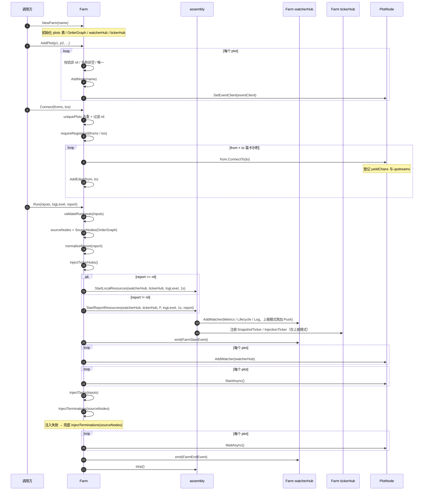
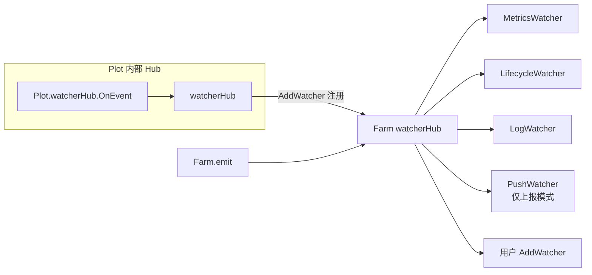
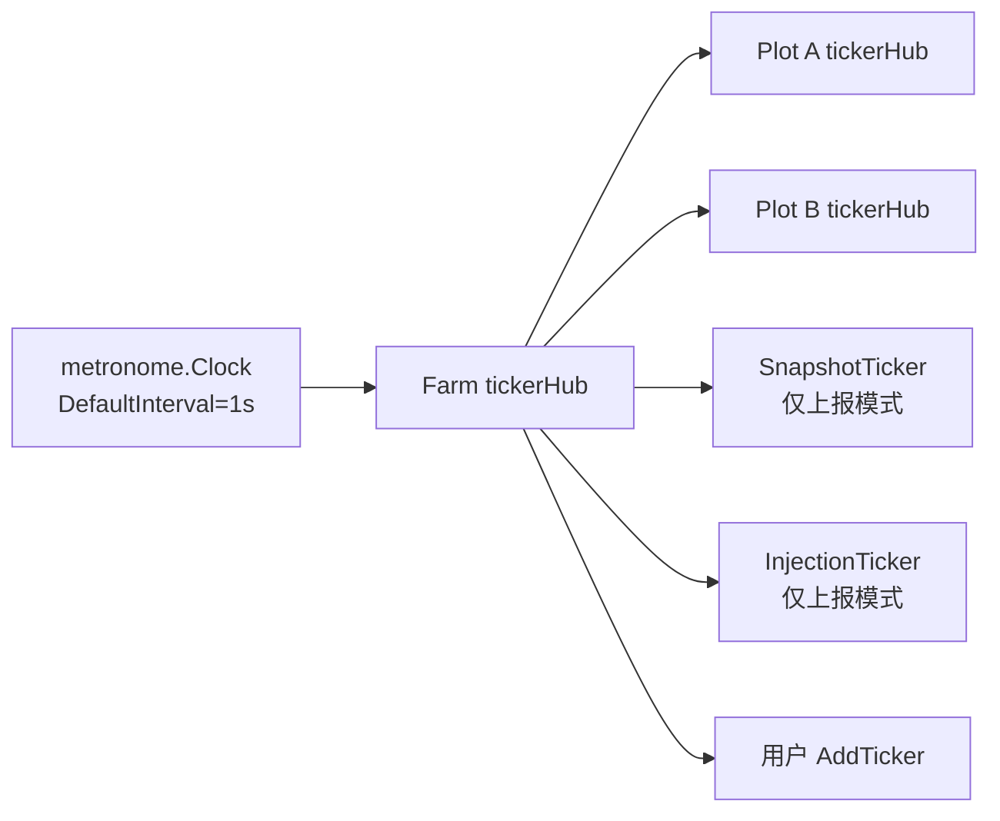

# pkg/farm/farm.go

> 📅 最后更新日期: 2026/11/26

## 作用

`farm` 包是 CelestialGrow 的「图级」调度器，`farm.go` 提供 `Farm` 类型，负责把多个 `plot.PlotNode` 节点组织成一张静态有向图，并完成：

- 节点注册与名称唯一性校验
- 组到组（hyper-edge）式的全连接建立
- Farm 级观察者注册，并通过**层级 Hub** 同时接收 Farm 事件与所有 Plot 事件
- Farm 级节拍注册：把各 Plot 的 ticker Hub 收进 Farm 的 ticker Hub，并允许用户追加 ticker
- 运行期资源装配（`assembly.StartLocalResources` / `StartReportResources` 统一创建/启动/回收观察者、节拍 Hub 与时钟）
- 运行前渲染图结构（`getStructureList` → `RenderStructureList`）写入 `FarmStartEvent`
- 源节点探测（`SourceNodes`）、初始种子注入、终止信号注入与等待退出
- 远程上报模式：补齐会话标识，把 Farm 作为 `reporter.InjectionTarget` 交给注入 ticker

`Farm` 只管理编排层，不关心 Plot 的泛型种子 / 果实类型——这一点由 `plot.PlotNode` 接口抹除。图算法本身位于同目录的 `graph.go`，结构渲染位于 `render.go`，详见 [`graph.md`](./graph.md) 与 [`render.md`](./render.md)。

## 核心对象

### `Farm` 结构体

```go
type Farm struct {
    name        string
    plots       map[string]plot.PlotNode
    sourceNodes []string
    *OrderGraph

    eventClient runtime.EventClient
    watcherHub  *scarecrow.Hub
    tickerHub   *metronome.Hub
}
```

| 字段 | 作用 |
| --- | --- |
| `name` | Farm 名称，写入 `FarmStartEvent` / `FarmEndEvent` 与日志；上报会话标识为空时也用于生成默认 `SessionID` |
| `plots` | 按 plot 名称索引的节点表，用于注册校验与查找 |
| `sourceNodes` | `Run` / `Start` 开始时一次性计算的「源节点代表」，每个 Source SCC 取一个 |
| `*OrderGraph` | 嵌入的有向图，记录 plot 间的连边，用于拓扑与 SCC 分析 |
| `eventClient` | 共享的运行时事件客户端，通过 `AddPlot` 注入到每个 plot |
| `watcherHub` | Farm 级观察者 Hub；也是注册到每个 Plot 的嵌套 Hub，同时接收 Farm 与 Plot 事件 |
| `tickerHub` | Farm 级节拍 Hub；运行前会把各 Plot 的 ticker Hub 收进来，形成整棵节拍树 |

> `Farm` 不持有 spout / inlet / 持久化观察者或时钟。观察者与时钟由 `pkg/assembly` 装配，Farm 只暴露观察者 Hub 与节拍 Hub。`NewFarm` 创建 `metronome.Hub` 失败时会直接 `panic`。

### `PlotNode` 接口契约

`Farm` 通过 `plot.PlotNode` 接口与具体节点解耦。该接口定义在 `pkg/plot/plot.go`，`Farm` 实际调用以下方法：

| 方法 | 用途 |
| --- | --- |
| `GetName() string` | 唯一标识与连边匹配 |
| `GetState() int32` | 读取节点状态（`0=idle` / `1=running` / `2=done`） |
| `GetMeta() scarecrow.NodeMeta` | 返回构建期元信息（类型名、tender 数等），由 `getNodeMeta` 汇总进 `FarmStartEvent.NodeMeta` |
| `GetSeedChanAny() any` | 以 `any` 暴露 `seedChan`，供上游 `ConnectTo` 做类型断言 |
| `ConnectTo(next PlotNode) error` | 校验类型兼容、登记下游产出通道与上游名；类型不匹配时返回 error |
| `AddUpstream(name string)` | 由上游 `ConnectTo` 调用，登记上游名用于 seal 聚合 |
| `AddWatcher(listener scarecrow.Watcher) error` | 注册观察者；Farm 在启动时把 `watcherHub` 注册进来 |
| `AddTicker(ticker metronome.Ticker) error` | 注册节拍；`Farm.AddTicker` 直接代转 |
| `GetTickerHub() *metronome.Hub` | 返回 Plot 自己的节拍 Hub，`injectTickerHubs` 把它收进 Farm 的 ticker Hub |
| `SetEventClient(runtime.EventClient)` | `AddPlot` 时统一注入同一事件客户端 |
| `StartAsync()` / `WaitAsync()` | 异步生命周期控制 |
| `SeedAny(seed any) error` | 注入初始种子（`InjectTasks` 逐颗调用） |
| `Seal()` | 注入外部终止信号（`InjectTerminations` 调用） |

## 公开符号

| 符号 | 签名 | 用途 |
| --- | --- | --- |
| `NewFarm` | `func NewFarm(name string) *Farm` | 构造 Farm：初始化 plot 表、空图、本地事件客户端、观察者 Hub 与节拍 Hub |
| `PlotCount` | `func (f *Farm) PlotCount() int` | 返回已注册 plot 数量 |
| `HasPlot` | `func (f *Farm) HasPlot(name string) bool` | 判断指定 plot 是否已注册 |
| `GetPlot` | `func (f *Farm) GetPlot(name string) (plot.PlotNode, bool)` | 按名称取 plot，`ok` 表示是否存在 |
| `AddPlot` | `func (f *Farm) AddPlot(plots ...plot.PlotNode) error` | 注册一个或多个 plot，要求非 nil、名称非空且唯一 |
| `Connect` | `func (f *Farm) Connect(fromPlots, toPlots []plot.PlotNode) error` | 在源组与目标组之间建立笛卡尔积式连接 |
| `AddWatcher` | `func (f *Farm) AddWatcher(watcher scarecrow.Watcher) error` | 注册 Farm 级观察者（同时接收 Farm 与 Plot 事件） |
| `AddTicker` | `func (f *Farm) AddTicker(ticker metronome.Ticker) error` | 注册 Farm 级 ticker，接收整个 Farm 运行期间的节拍 |
| `Run` | `func (f *Farm) Run(inputs map[string][]any, logLevel string, report *reporter.Config) error` | 同步运行：启动 → 注入种子 → 终止 source → 等待退出；`report` 为远程上报配置 |
| `Start` | `func (f *Farm) Start(logLevel string, report *reporter.Config) error` | 同步运行但不做任何注入，由外部驱动；`report` 为远程上报配置 |
| `InjectTasks` | `func (f *Farm) InjectTasks(tasks map[string][]any) error` | 向指定 Plot 注入种子，可在运行期调用；同时满足 `reporter.InjectionTarget` |
| `InjectTerminations` | `func (f *Farm) InjectTerminations(nodes []string) error` | 向指定 Plot 注入终止信号，可在运行期调用；同时满足 `reporter.InjectionTarget` |

> `report` 为 `nil` 表示本地运行，只装配本地资源；非 `nil` 时额外装配推送观察者、快照 ticker 与远程注入 ticker。`reporter.Config` 的 `URL` 为上报服务地址，`SessionID` 留空时由 `normalizeReport` 按 `<Farm 名称>@<UnixNano>` 生成，`SnapshotPeriod` / `InjectionPeriod` 以节拍为单位（0 表示默认周期）。

### `Run` / `Start` / `Inject*` 的语义差异

| 方法 | 是否启动 Plot | 是否注入种子 | 是否注入终止信号 | 阻塞 | 典型场景 |
| --- | :---: | :---: | :---: | :---: | --- |
| `Run(inputs, logLevel, report)` | ✅ | ✅ `inputs` | ✅ `sourceNodes` | 是 | 一次性批处理（可远程上报） |
| `Start(logLevel, report)` | ✅ | ❌ | ❌ | 是 | 外部驱动（如 reporter、交互式注入） |
| `InjectTasks(tasks)` | ❌ | ✅ `tasks` | ❌ | 否 | 运行期追加种子 |
| `InjectTerminations(nodes)` | ❌ | ❌ | ✅ `nodes` | 否 | 运行期终止指定 Plot |

- `Run` = `validateRunInputs` + `start(logLevel, report, prepare)`，`prepare` 依次执行 `InjectTasks(inputs)` 与 `InjectTerminations(f.sourceNodes)`。
- `Start` 不做输入校验，直接调用 `start(logLevel, report, nil)`；**没有任何外部注入终止信号时 `Start` 不会返回**。远程上报模式下，`InjectionTicker` 可把 web 端提交的任务与终止信号交回 `Start` 驱动的 Farm。
- `InjectTasks` / `InjectTerminations` 只操作已注册的 Plot，不触发资源装配，也不改变 `sourceNodes`。

> 日志级别不再由 `NewFarm` 决定：`logLevel` 是每次运行（`Run` / `Start`）的参数，空字符串按 `INFO` 处理。

## 关键流程

### `AddPlot → Connect → Run` 全链路


```mermaid
sequenceDiagram
    autonumber
    participant U as 调用方
    participant F as Farm
    participant A as assembly
    participant H as Farm watcherHub
    participant T as Farm tickerHub
    participant P as PlotNode

    U->>F: NewFarm(name)
    Note over F: 初始化 plots 表 / OrderGraph / watcherHub / tickerHub

    U->>F: AddPlot(p1, p2, ...)
    loop 每个 plot
        F->>F: 校验非 nil / 名称非空 / 唯一
        F->>F: AddNode(name)
        F->>P: SetEventClient(eventClient)
    end

    U->>F: Connect(froms, tos)
    F->>F: uniquePlots 去重 + 过滤 nil
    F->>F: requireRegistered(froms / tos)
    loop from × to 笛卡尔积
        F->>P: from.ConnectTo(to)
        Note over P: 登记 yieldChans 与 upstreams
        F->>F: AddEdge(from, to)
    end

    U->>F: Run(inputs, logLevel, report)
    F->>F: validateRunInputs(inputs)
    F->>F: sourceNodes = SourceNodes(OrderGraph)
    F->>F: normalizeReport(report)
    F->>F: injectTickerHubs()
    alt report == nil
        F->>A: StartLocalResources(watcherHub, tickerHub, logLevel, 1s)
    else report != nil
        F->>A: StartReportResources(watcherHub, tickerHub, F, logLevel, 1s, report)
    end
    A->>H: AddWatcher(Metrics / Lifecycle / Log，上报模式再加 Push)
    A->>T: 注册 SnapshotTicker / InjectionTicker（仅上报模式）
    F->>H: emit(FarmStartEvent)
    loop 每个 plot
        F->>P: AddWatcher(watcherHub)
    end
    loop 每个 plot
        F->>P: StartAsync()
    end
    F->>F: InjectTasks(inputs)
    F->>F: InjectTerminations(sourceNodes)
    Note over F: 注入失败 → 兜底 InjectTerminations(sourceNodes)
    loop 每个 plot
        F->>P: WaitAsync()
    end
    F->>H: emit(FarmEndEvent)
    F->>A: stop()
```

### `start` 内部流程（`Run` / `Start` 共用）

1. 记录 `startTime`。
2. `normalizeReport(report)`：`report` 为 `nil` 或已有非空 `SessionID` 时原样返回；否则复制一份并填入 `<Farm 名称>@<UnixNano>`。
3. `injectTickerHubs()`：把每个 Plot 的 `GetTickerHub()` 注册进 Farm 的 `tickerHub`，已注册的跳过。失败时立即返回，Plot 尚未启动。
4. 按 `report` 分支装配运行期资源：
   - `nil` → `assembly.StartLocalResources(watcherHub, tickerHub, logLevel, metronome.DefaultInterval)`；
   - 非 `nil` → `assembly.StartReportResources(watcherHub, tickerHub, f, logLevel, metronome.DefaultInterval, report)`。Farm 自身实现 `InjectTasks` / `InjectTerminations`，因此可作为 `reporter.InjectionTarget`。

   资源包含 `MetricsWatcher`、`LifecycleWatcher`、`LogWatcher`（上报模式再加 `PushWatcher`、`SnapshotTicker`、`InjectionTicker`）以及节拍时钟。失败时立即返回，Plot 尚未启动。
5. `defer stop()`：运行结束时按「时钟 → tickerHub → watcherHub」的逆序停止并刷盘；`StopFunc` 幂等。
6. 发射 `scarecrow.FarmStartEvent`，包含 `Farm`、`IsDAG`、`Plots`、`Edges`、`SourcePlots`、`NodeMeta`、`Structure`、`StartTime`。
7. `defer` 发射 `scarecrow.FarmEndEvent`（`Elapsed` 为 `time.Since(startTime)`）。
8. 对每个 plot 调用 `plot.AddWatcher(f.watcherHub)`——**Farm 观察者 Hub 作为嵌套 Hub 注册到每个 Plot**。
9. 对每个 plot 调用 `StartAsync()`。
10. 调用 `prepare()`（`Run` 时为注入逻辑，`Start` 时为 `nil`）。
11. 若 `prepare` 返回错误，仍执行一次 `InjectTerminations(f.sourceNodes)` 作为兜底（忽略其错误），避免等待一个永远不会收到终止信号的图。
12. 对每个 plot 调用 `WaitAsync()`，全部退出后返回 `prepareErr`。

> `start` 只返回装配错误或注入错误；Plot 内部的培育失败以 `SeedWitherEvent` 形式进入观察者体系，不会让 `Run` / `Start` 返回 error。

### 层级 Hub 分发


```mermaid
flowchart LR
    subgraph PlotHub[Plot 内部 Hub]
        PE[Plot.watcherHub.OnEvent] --> PH[watcherHub]
    end
    PH -->|AddWatcher 注册| FH[Farm watcherHub]
    FH --> M[MetricsWatcher]
    FH --> L[LifecycleWatcher]
    FH --> G[LogWatcher]
    FH --> PU[PushWatcher<br/>仅上报模式]
    FH --> W[用户 AddWatcher]
    FE[Farm.emit] --> FH

    style FH fill:#eef
```

- Plot 事件（`PlotStart`、`SeedRipen` 等）由 Plot 自身 Hub 分发给已注册的观察者，Farm 观察者 Hub 是其中之一，因此会继续向上分发。
- Farm 事件（`FarmStartEvent` / `FarmEndEvent`）直接进入 Farm 观察者 Hub，**不会**下发到 Plot。
- `scarecrow.Find` 可沿嵌套 Hub 查找观察者，`plot.Harvest()` 正是借此在 Plot Hub → Farm Hub 链上找到 `LifecycleWatcher`。
- `Hub` 的写时复制语义允许运行期追加观察者，但只对之后的事件生效；重复注册同一 Hub 会导致重复分发。

节拍侧同样是一棵树：


```mermaid
flowchart LR
    C[metronome.Clock<br/>DefaultInterval=1s] --> FT[Farm tickerHub]
    FT --> PT1[Plot A tickerHub]
    FT --> PT2[Plot B tickerHub]
    FT --> ST[SnapshotTicker<br/>仅上报模式]
    FT --> IT[InjectionTicker<br/>仅上报模式]
    FT --> UT[用户 AddTicker]
```

- `injectTickerHubs` 只把 Plot 的 ticker Hub 挂到 Farm `tickerHub` 下；Farm 自身不创建 Plot ticker。
- `assembly` 在启动 `tickerHub` 前注册快照/注入 ticker，并创建唯一时钟驱动整棵树。
- Plot ticker 与 Farm ticker 都按自己的 `TickPeriod` 过滤节拍，周期语义由 `pkg/metronome` 定义。

### `sourceNodes` 的计算

`Run` 与 `Start` 在启动前都执行 `f.sourceNodes = SourceNodes(f.OrderGraph)`：

1. `TarjanSCC` 求强连通分量；
2. 计算凝聚图中入度为 0 的 Source SCC（`SourceSCCs`）；
3. 每个 Source SCC 取 `scc[0]` 作为代表节点（`SourceNodes`）。

这样即使 source 处于一个强连通环内，也只对一个代表节点发终止信号，避免重复 seal。孤立节点（`AddPlot` 后未连边）同样会成为 Source SCC，因此也会被注入终止信号。

## 错误场景

### `AddPlot`

- 任一 plot 为 `nil` → `plot is nil`
- 名称为空 → `plot name cannot be empty`
- 名称重复 → `plot %q already exists`

遇到第一个错误即返回；此前已成功加入的 plot **不会回滚**。

### `Connect`

- 去重后 `fromPlots` 为空 → `from plots cannot be empty`
- 去重后 `toPlots` 为空 → `to plots cannot be empty`
- 任意 plot 为 `nil` 或未注册 → `plot is nil` / `plot %q is not registered in farm`
- `from.ConnectTo(to)` 类型断言失败 → 透传 `plot %q yield type is incompatible with plot %q seed type`

> ⚠️ **部分失败不撤销**：内层循环一旦失败立即返回，已建立的连接（`yieldChans`、`upstreams`、图边）保留。再次 `Connect` 时图层面会因重复边被忽略，但 Plot 内部映射仍保留旧状态。

### `AddWatcher` / `AddTicker`

- `watcher` 为 `nil` → `scarecrow: cannot add nil listener`
- 会形成 Hub 环 → `scarecrow: cyclic hub registration rejected: ...` / `scarecrow: cannot add a hub to itself`
- `ticker` 为 `nil` → `metronome: cannot add nil ticker`
- ticker 的节拍周期非法 → `metronome: tick period must be positive ...`
- ticker 重复注册或形成 Hub 环 → `metronome: ticker already registered` / `metronome: cyclic hub registration rejected: ...`

### `Run` / `Start`

| 阶段 | 错误来源 | 说明 |
| --- | --- | --- |
| 校验（仅 `Run`） | `validateRunInputs` | `inputs` 中存在未注册的 plot → `plot %q is not registered in farm`，此时**未启动任何 Plot** |
| 节拍装配 | `injectTickerHubs` | Plot ticker Hub 注册失败（nil / 重复 / 环）；Plot 尚未启动 |
| 资源装配 | `assembly.StartLocalResources` / `StartReportResources` | Hub 或 ticker Hub 为 nil、观察者/ticker 启动失败、`report` 配置非法；Plot 尚未启动 |
| 注册 | `plot.AddWatcher(f.watcherHub)` | Hub 环或 nil 观察者；在 `StartAsync` 之前返回 |
| 注入 | `InjectTasks` | 未注册 plot、`SeedAny` 类型断言失败（`plot %q seed type mismatch: got %T`） |
| 注入 | `InjectTerminations` | 未注册 plot |
| 等待 | `WaitAsync` | 不返回错误 |

### `InjectTasks`

- 先对所有 key 做 `validateRunInputs`：任一目标未注册 → 返回错误，**不注入任何种子**。
- 随后按 map 迭代顺序逐颗 `SeedAny`；中途某颗类型不匹配会立即返回，此前已注入的种子**无法撤回**。

### `InjectTerminations`

- 先校验所有名称均已注册；任一未注册 → 返回错误，**不注入任何终止信号**。
- 校验通过后逐个调用 `Seal()`，注入外部终止信号（`Source == "__input__"`），具有强终止语义：不再等待未到达的上游 seal。
- 向某个 Plot 注入终止信号后，再向它注入种子将不会被处理。

## 重要细节

### 组到组笛卡尔积

`Connect(froms, tos)` 先对两端做 `uniquePlots`（去重 + 过滤 `nil`），再建立 `len(froms) × len(tos)` 条边：

```go
farm.Connect([]plot.PlotNode{root}, []plot.PlotNode{midA, midB})
// 等价于 root → midA 与 root → midB 两条独立边
```

只有「源组 × 目标组」之间会连边，同组内节点不会互相连接。

### 注入失败的终止兜底

`start` 中 `prepare()` 失败后仍调用 `InjectTerminations(f.sourceNodes)`：

- 避免 `WaitAsync` 永久阻塞在一个没有终止信号的图上；
- 兜底错误被显式忽略（`_ =`），返回值仍是原始的 `prepareErr`；
- 该兜底只终止 `sourceNodes`，下游收到 seal 信号后按正常传播路径退出。

### 事件与日志

- `Farm` 只发射两个事件：`FarmStartEvent`、`FarmEndEvent`，定义在 `pkg/scarecrow/event.go`。
- `Structure` 字段来自 `getStructureList()`，即 `RenderStructureList(f.Nodes(), f.OutEdges(), f.sourceNodes)`；`NodeMeta` 来自 `getNodeMeta()`，按 Plot 名称汇总 `GetMeta()`。
- `persist.LogWatcher` 消费 `FarmStartEvent` 时逐行输出结构，消费 `FarmEndEvent` 时输出耗时。
- 上报模式下，`reporter.PushWatcher` 消费 `FarmStartEvent` 推送图元信息、消费 `SeedWitherEvent` 推送错误、消费 `FarmEndEvent` 先补推终态快照再通知会话下线；周期快照由 `SnapshotTicker` 驱动。
- `Farm` 自身不写数据库；生命周期、日志与远程上报全部由 `assembly` 注册的观察者完成。

### 与 `pkg/runtime` 的协作

`eventClient` 在 `AddPlot` 时注入，所有 plot 共享同一事件 ID 命名空间，保证跨 plot 的 seed → fruit → seal 事件链可追溯。

### 会话标识与上报

- `normalizeReport` 只补齐空 `SessionID`，不修改调用方传入的配置（会先复制结构体）。
- 生成格式为 `fmt.Sprintf("%s@%d", f.name, time.Now().UnixNano())`，保证同一 Farm 的多次运行在服务端不会互相覆盖。
- `StartReportResources` 会把 Farm 作为注入目标，周期拉取 `/api/pull_injection` 并把 `tasks` / `terminations` 交回 `InjectTasks` / `InjectTerminations`。

### 并发控制

- `Run` / `Start` 是**同步**调用：依次 `StartAsync` 后通过 `WaitAsync` 等待全部 plot 退出。
- `StartAsync` 内部使用 `sync.WaitGroup.Go`（Go 1.25 写法）启动每个 plot 的 `sprout` 调度器。
- `InjectTasks` / `InjectTerminations` 设计为可在 `Start` 阻塞期间由其它协程调用；`Farm` 的 `plots` 表本身不加锁，因此**注册/连接阶段不能与运行阶段并发**。
- `watcherHub` / `tickerHub` 自身线程安全，但 `injectTickerHubs` 只在启动前调用一次。

## 使用示例

### 批处理：`Run`

```go
package main

import (
    "fmt"

    "github.com/Mr-xiaotian/CelestialGrow/pkg/farm"
    "github.com/Mr-xiaotian/CelestialGrow/pkg/plot"
)

func main() {
    double := plot.NewSinglePlot("double", func(seed int) (int, error) {
        return seed * 2, nil
    }, plot.WithTenders(2))

    format := plot.NewSinglePlot("format", func(seed int) (string, error) {
        return fmt.Sprintf("result=%d", seed), nil
    })

    f := farm.NewFarm("demo_farm")
    if err := f.AddPlot(double, format); err != nil {
        panic(err)
    }
    if err := f.Connect([]plot.PlotNode{double}, []plot.PlotNode{format}); err != nil {
        panic(err)
    }

    if err := f.Run(map[string][]any{
        "double": {1, 2, 3, 4},
    }, "INFO", nil); err != nil {
        panic(err)
    }
}
```

需要把运行状态推到 `celestialflow-web` 时，传入上报配置（额外导入 `github.com/Mr-xiaotian/CelestialGrow/pkg/reporter`）；`SessionID` 留空即可自动生成：

```go
if err := f.Run(map[string][]any{
    "double": {1, 2, 3, 4},
}, "INFO", &reporter.Config{
    URL: "http://127.0.0.1:5005",
}); err != nil {
    panic(err)
}
```

### 外部驱动：`Start` + `InjectTasks` / `InjectTerminations`

```go
package main

import (
    "fmt"

    "github.com/Mr-xiaotian/CelestialGrow/pkg/farm"
    "github.com/Mr-xiaotian/CelestialGrow/pkg/plot"
    "github.com/Mr-xiaotian/CelestialGrow/pkg/scarecrow"
)

func main() {
    root := plot.NewSinglePlot("root", func(seed int) (int, error) {
        return seed * 2, nil
    }, plot.WithTenders(2), plot.WithChanSize(8))

    f := farm.NewFarm("external_driven")
    if err := f.AddPlot(root); err != nil {
        panic(err)
    }

    if err := f.AddWatcher(scarecrow.WatcherFunc(func(event scarecrow.Event) error {
        switch ev := event.(type) {
        case scarecrow.PlotStartEvent:
            fmt.Println("plot started:", ev.Plot)
        case scarecrow.FarmEndEvent:
            fmt.Println("farm done in", ev.Elapsed)
        }
        return nil
    })); err != nil {
        panic(err)
    }

    go func() {
        for i := 0; i < 3; i++ {
            if err := f.InjectTasks(map[string][]any{"root": {i}}); err != nil {
                panic(err)
            }
        }
        if err := f.InjectTerminations([]string{"root"}); err != nil {
            panic(err)
        }
    }()

    if err := f.Start("INFO", nil); err != nil {
        panic(err)
    }
}
```

> `Start` 会阻塞到所有 Plot 退出；必须确保有外部协程（或信号处理逻辑）最终调用 `InjectTerminations`，否则调用不会返回。传入非 nil 的 `report` 时，远程注入 ticker 也会驱动 `InjectTasks` / `InjectTerminations`。

### 运行结束后读取结果

```go
records, err := root.Harvest()
if err != nil {
    panic(err)
}
for _, record := range records {
    fmt.Println(record.Status) // 例如 ripen
}
```

`Harvest` 依赖 Farm 观察者 Hub 已注册到 Plot Hub，从而能沿嵌套 Hub 找到 `LifecycleWatcher`。

## 注意事项

- **非重入**：同一个 `Farm` 实例不支持并发或重复 `Run` / `Start`。每次 `start` 都会再次把 `watcherHub` 注册到每个 Plot，导致事件重复分发；Plot 的 `state` 也停留在 `done`。
- **注入顺序**：`InjectTasks` 依赖 `plots[name]` 已注册。运行期注入前不要修改注册表。
- **终止不可逆**：`Seal()` 之后该 Plot 的 `sprout` 不再消费种子；`InjectTasks` 不报错，但种子只会滞留在 `seedChan` 中，缓冲写满后调用会被阻塞。
- **图与节点集合**：`OrderGraph` 的节点可能由 `AddEdge` 自动补全，但正常路径下 `AddPlot` 已注册全部节点；`sourceNodes` 使用图视图而非 `plots` 视图。
- **日志级别**：`logLevel` 取值见 `pkg/persist` 的级别表，未知值按 `INFO` 处理。
- **上报与注入**：`report == nil` 时不会装配 `PushWatcher` / `SnapshotTicker` / `InjectionTicker`，也不会访问任何 web 服务；`report != nil` 时 `URL` 必须是合法 `http(s)` 地址，否则资源装配阶段返回错误。
- **测试覆盖**：`farm_connect_test.go`、`farm_start_test.go`、`farm_structure_test.go`、`farm_route_test.go`、`farm_split_test.go`、`farm_inject_test.go`、`farm_harvest_test.go`、`farm_report_test.go`、`graph_test.go`、`render_test.go` 覆盖注册/连接、Run 线性流、非平凡拓扑、路由/拆分、外部注入、Harvest、远程上报、图算法与结构渲染。
