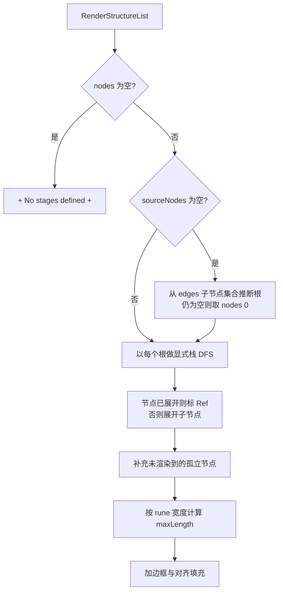

# pkg/farm/render.go

> 📅 最后更新日期: 2026/09/24

## 作用

`render.go` 把 `OrderGraph` 的图结构（节点集合 + 出边邻接表 + 源节点）渲染成**带边框的树形文本行列表**，供 `Farm.Run` 写入启动日志。它是纯函数式的渲染工具，不持有任何状态。

`Farm` 中唯一调用点是 `Farm.getStructureList()`：

```go
func (f *Farm) getStructureList() []string {
    return RenderStructureList(f.Nodes(), f.OutEdges(), f.sourceNodes)
}
```

## 核心对象

### `RenderStructureList`

```go
func RenderStructureList(nodes []string, edges map[string][]string, sourceNodes []string) []string
```

| 参数 | 含义 |
| --- | --- |
| `nodes` | 全部节点名。顺序会影响「孤立节点」与「推断源节点」的追加顺序 |
| `edges` | 出边邻接表（`node → 后继列表`），通常来自 `OrderGraph.OutEdges()` |
| `sourceNodes` | 渲染根节点。为空时按规则自动推断 |

返回值为可直接逐行打印的字符串切片，已包含上下边框。

### `renderFrame`（内部）

```go
type renderFrame struct {
    name   string
    prefix string
    isLast bool
    isRoot bool
}
```

显式栈迭代 DFS 的栈帧：`prefix` 是当前行缩进前缀，`isLast` 决定连接符（`╞-->` 或 `╘-->`），`isRoot` 表示根节点（不画连接符、子节点前缀为空）。它是渲染的私有实现细节，不经由公开 API 暴露。

## 渲染规则

1. **根节点不画连接符**，直接输出节点名；非根节点使用 `╞-->`（非末子）或 `╘-->`（末子）连接符。
2. **环 / 共享子图节点只展开一次**：再次出现时在当前行追加 ` [Ref]`，且不再递归其子节点。
3. **源节点推断**：当 `sourceNodes` 为空时，从 `nodes` 中挑选「不出现在任何 `edges` 子节点集合中」的节点作为根；若仍为空，退化为 `nodes[0]`。
4. **孤立节点补充**：未被任何根渲染到的节点（`RenderStructureList` 未展开过）追加在末尾。
5. **多根分隔**：不同根之间插入一个空行。
6. **边框对齐**：以 **rune 数**（`utf8.RuneCountInString`）计算最大行宽并对齐，因此多字节连接符 `╞` / `╘` / `│` 不会破坏边框。
7. **空图占位**：`nodes` 为空时直接返回 `["+ No stages defined +"]`。

> 该函数使用**显式栈迭代**的 DFS 先序遍历（而非递归），以避免深链图触发 Go 的递归深度限制；`render_test.go` 用 5000 节点深链专门回归这一点。

## 关键流程



## 使用示例

```go
package main

import (
    "fmt"

    "github.com/Mr-xiaotian/CelestialGrow/pkg/farm"
)

func main() {
    nodes := []string{"a", "b"}
    edges := map[string][]string{"a": {"b"}}

    for _, line := range farm.RenderStructureList(nodes, edges, []string{"a"}) {
        fmt.Println(line)
    }
    // +-------+
    // | a     |
    // | ╘-->b |
    // +-------+
}
```

共享子图 / 环会被标记为 `[Ref]`：

```go
nodes := []string{"c1", "c2", "c3"}
edges := map[string][]string{
    "c1": {"c2"},
    "c2": {"c3"},
    "c3": {"c1"},
}
// c1 首次展开输出连接符，回到 c1 时输出 "c1 [Ref]"
farm.RenderStructureList(nodes, edges, []string{"c1"})
```

## 注意事项

- **无状态、纯函数**：相同入参产生相同结果；函数不修改 `nodes` / `edges`，也不访问任何全局状态。
- **节点集合无序的影响**：`nodes` 通常来自 `OrderGraph.Nodes()`，顺序不保证；因此在同一编译产物内多根之间的顺序、孤立节点的追加顺序可能不稳定（详见 [`graph.md`](./graph.md)）。
- **测试覆盖**：`pkg/farm/render_test.go` 覆盖基础形状、精确输出、空图、环 `[Ref]`、5000 节点深链与孤立节点 / 源节点推断。详见 `render_test.md`。
