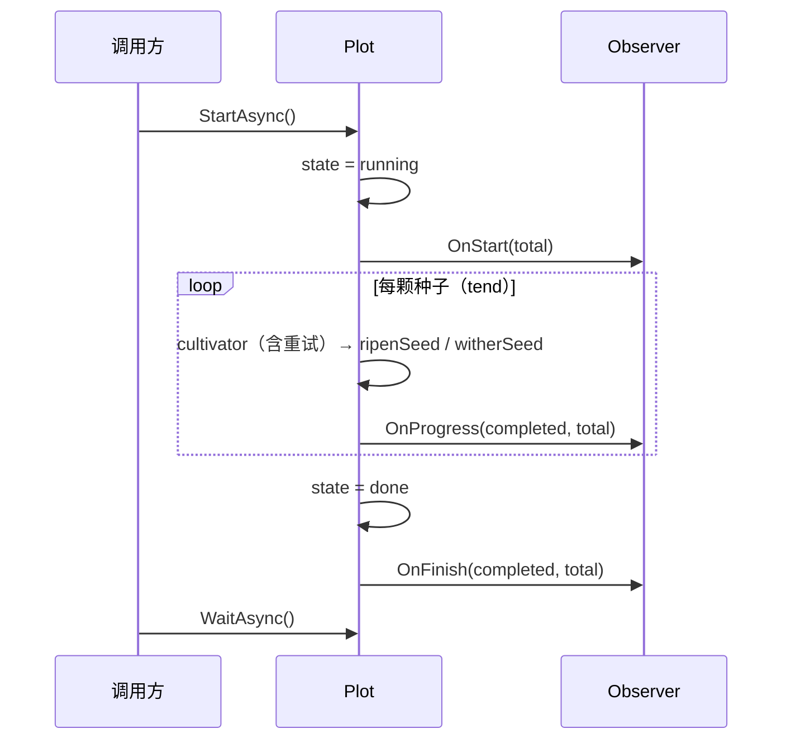

# pkg/observer/observer.go

> 📅 最后更新日期: 2026/09/24

## 作用

`pkg/observer/observer.go` 定义了 **种子培育进度观察者**的接口契约 `Observer`，是 `pkg/plot` 与外部进度展示组件（典型实现见 [`progress.md`](./progress.md)）之间的解耦点。Plot 通过 `Observer` 在启动、进度更新、完成三个时刻回调业务方，从而在不耦合具体 UI / 输出介质的前提下让培育流水线的运行状态可观测。

## 核心对象

### `Observer` 接口

```go
type Observer interface {
    OnStart(total int)
    OnProgress(completed, total int)
    OnFinish(completed, total int)
}
```

| 方法 | 触发时机 | 参数含义 |
|------|----------|----------|
| `OnStart(total int)` | `notifyStart` 内：先把 `state` 置为 1（running），再遍历观察者调用。位于 `StartAsync` 的异步协程中、`sprout` 调度器启动前 | `total` = `GetSeedNum()`（本地播入数 + 上游已产出累计数）；此时播种尚未开始，实际取值通常为 `0` |
| `OnProgress(completed, total int)` | 每颗种子得出最终结果后调用一次：成功路径 `ripenSeed`、失败路径 `witherSeed` 都先更新计数再调用 `reportProgress`（两者均运行在 `tend` 协程内）。重试过程本身不触发 | `completed` = `GetCompleted()`（果实 + 杂草），`total` = `GetSeedNum()` |
| `OnFinish(completed, total int)` | `sprout` 返回后由 `notifyFinish` 调用一次：先把 `state` 置为 2（done），再快照计数 | 与 `OnProgress` 同义，仅作收尾快照 |

> 接口是隐式契约：任何实现了上述三个方法的类型都自动满足 `Observer`，无需显式声明。

## 注册方式

观察者列表由 `pkg/plot/plot_base.go` 的 `basePlot[S, F, Y].observers []observer.Observer` 字段承载，仅能通过 `AddObserver` 追加；`Plot[S, F]` 嵌入 `*basePlot[S, F, F]`，因此该方法对 `Plot` / `SplitPlot` / `RoutePlot` 三种节点都可用：

```go
// pkg/plot/plot_base.go
func (p *basePlot[S, F, Y]) AddObserver(observer observer.Observer) {
    p.observers = append(p.observers, observer)
}
```

> ⚠️ **注意**：本文件源码注释写的是「通过 `NewPlot` 的 observers 参数注入」，但 `plot.NewPlot` / `api.NewPlot` 的签名是 `(name string, cultivator func(S) (F, error), opts ...Option)`，并不接收观察者；当前实现里 `observers` 只能由 `AddObserver` 追加。

注册一个 `ProgressBar` 的典型用法（standalone 模式下交由 `Run` 完成 `BindInlet` / `StartAsync` / `Seed` / `Seal` / `WaitAsync`）：

```go
p := plot.NewPlot[Seed, Fruit]("harvester", cultivate, opts...)
p.AddObserver(observer.NewProgressBar("harvesting"))

p.Run(seeds)
```

若要手动控制输入，则必须自己先 `BindInlet` 再 `StartAsync`，否则 `logInlet` 为 nil：

```go
p.BindInlet(logChan, lifecycleChan) // Farm 模式下由 Farm.Run 代劳
p.StartAsync()
p.Seed(seed)
p.Seal()
p.WaitAsync()
```

`AddObserver` 不会去重，多次添加同一实例会触发多次回调。

## 与 Plot 生命周期的对接点

Plot 在三个内部钩子中按注册顺序遍历 `p.observers`，依次调用对应方法：

```go
// pkg/plot/plot_base.go
func (p *basePlot[S, F, Y]) notifyStart() {
    p.state.Store(1) // running
    seedNum := p.GetSeedNum()
    for _, observer := range p.observers {
        observer.OnStart(seedNum)
    }
}

func (p *basePlot[S, F, Y]) reportProgress() {
    completed := p.GetCompleted()
    seedNum := p.GetSeedNum()
    for _, observer := range p.observers {
        observer.OnProgress(completed, seedNum)
    }
}

func (p *basePlot[S, F, Y]) notifyFinish() {
    p.state.Store(2) // done
    completed := p.GetCompleted()
    seedNum := p.GetSeedNum()
    for _, observer := range p.observers {
        observer.OnFinish(completed, seedNum)
    }
}
```

调用顺序由 `StartAsync`（定义在 `pkg/plot/plot_base.go` 的 `*basePlot[S, F, Y]` 上，经嵌入提升给 `Plot`）编排：



注意：

- `OnStart` 与 `OnFinish` 各只触发一次；`OnProgress` 触发次数等于 `果实数 + 杂草数`（种子级重试不额外触发）。
- 状态存放于 `basePlot.state atomic.Int32`，取值为 `0=idle, 1=running, 2=done`（见 `pkg/plot/plot_base.go` 的 `GetState`）。Observer 不会感知 `idle`，仅在 `running` 起始与 `done` 收尾被通知。
- 遍历观察者时没有 recover：`notifyStart` / `notifyFinish` 中 Observer 的 panic 会沿 `StartAsync` 的异步协程向上传播，直接使整个进程 panic；`reportProgress` 的 panic 则会先被 `tend` 的 `recover` 吞掉，并被误记为「cultivator panic」的杂草。实现自定义 Observer 时应自行处理内部错误。
- 由于 `AddObserver` 仅做追加，没有提供移除或清空接口，Observer 列表在 Plot 整个生命周期内单调增长，重复添加同一实例会重复回调。

## 注意事项

- `Observer` 的回调发生在 Plot 内部 goroutine 中：`notifyStart` / `notifyFinish` 在 `StartAsync` 协程，`reportProgress` 在对应的 `tend` 协程；自定义实现需自行保证并发安全。
- `OnStart` 的 `total` 通常为 `0`：standalone `Run` 与 `Farm.Run` 都是先调用 `StartAsync()`、之后才逐条 `Seed` / `SeedAny`，`notifyStart` 与播种之间存在竞态。实现不能假设 `OnStart` 就能拿到最终总量（`ProgressBar` 的懒加载正是为此）。
- `OnProgress` 的 `total` 取自 `GetSeedNum()`，等于「本地播入数 + 上游已产出累计数」，会随上游持续产出而增大；因此 `completed / total` 可能停滞甚至回退（`completed` 不会超过 `total`），进度条实现需容忍比例不单调。
- `Observer` 是项目内唯一的「观察者」抽象，Farm 不会向 Plot 的 Observer 列表中追加任何全局回调。
