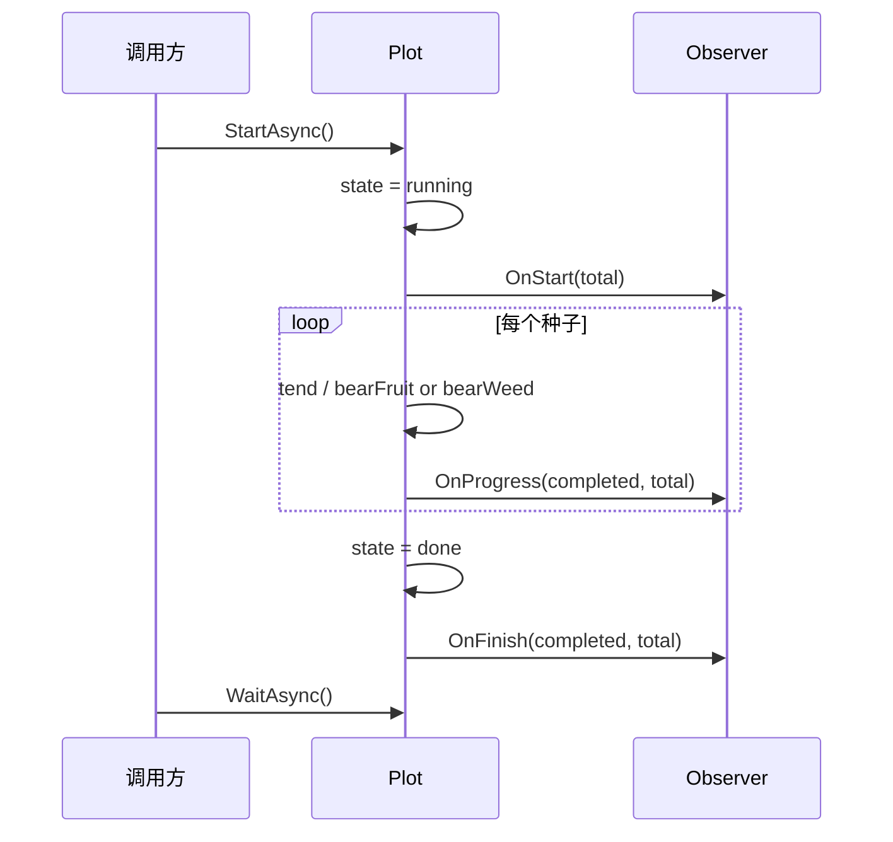

# pkg/observer/observer.go

> 最后更新日期: 2026/09/01

## 作用

`pkg/observer/observer.go` 定义了 **种子培育进度观察者**的接口契约 `Observer`，是 `pkg/plot` 与外部进度展示组件（典型实现见 [`progress.md`](./progress.md)）之间的解耦点。Plot 通过 `Observer` 在启动、进度更新、完成三个时刻回调业务方，从而在不耦合具体 UI / 输出介质的前提下让培育流水线的运行状态可观测。

## 核心对象

### `Observer` 接口

```go
type Observer interface {
    OnStart(total int)
    OnProgress(completed, total int)
    OnFinish(completed, total int)
}
```

| 方法 | 触发时机 | 参数含义 |
|------|----------|----------|
| `OnStart(total int)` | Plot 进入 `running` 状态时（异步协程 `StartAsync` 内、`sprout` 调度器启动前）调用一次 | `total` = 当前 Plot 已登记的种子总数 `GetSeedNum()` |
| `OnProgress(completed, total int)` | 每次有种子处理完成（无论培育成功 `bearFruit` 或失败 `bearWeed`）后调用 | `completed` = 已完成数 `GetCompleted()`（果实 + 杂草），`total` = 当前种子总数 |
| `OnFinish(completed, total int)` | `sprout` 调度器退出后、Plot 进入 `done` 状态时调用一次 | `completed` 与 `total` 与 `OnProgress` 同义，仅作收尾快照 |

> 接口是隐式契约：任何实现了上述三个方法的类型都自动满足 `Observer`，无需显式声明。

## 注册方式

Plot 通过 `(*Plot[S, F]).AddObserver` 维护观察者列表。Plot 内部并不区分「通过 `NewPlot` 注入」与「运行时追加」两类来源——文档源码注释中提到的「`NewPlot` 的 observers 参数」并非当前实现，`observers` 字段只能通过 `AddObserver` 追加：

```go
// pkg/plot/plot.go
func (p *Plot[S, F]) AddObserver(observer observer.Observer) {
    p.observers = append(p.observers, observer)
}
```

注册一个 `ProgressBar` 的典型用法：

```go
plot := plot.NewPlot[Seed, Fruit]("harvester", cultivate, opts...)

bar := observer.NewProgressBar("harvesting")
plot.AddObserver(bar)

plot.StartAsync()
// ... 播入种子
plot.WaitAsync()
```

`AddObserver` 不会去重，多次添加同一实例会触发多次回调。

## 与 Plot 生命周期的对接点

Plot 在三个内部钩子中按注册顺序遍历 `p.observers`，依次调用对应方法：

```go
// pkg/plot/plot.go
func (p *Plot[S, F]) notifyStart() {
    p.state.Store(1) // running
    seedNum := p.GetSeedNum()
    for _, o := range p.observers {
        o.OnStart(seedNum)
    }
}

func (p *Plot[S, F]) reportProgress() {
    completed := p.GetCompleted()
    seedNum := p.GetSeedNum()
    for _, o := range p.observers {
        o.OnProgress(completed, seedNum)
    }
}

func (p *Plot[S, F]) notifyFinish() {
    p.state.Store(2) // done
    completed := p.GetCompleted()
    seedNum := p.GetSeedNum()
    for _, o := range p.observers {
        o.OnFinish(completed, seedNum)
    }
}
```

调用顺序由 `(*Plot[S, F]).StartAsync` 编排：



注意：

- `OnStart` 与 `OnFinish` 各只触发一次；`OnProgress` 触发次数等于成功 + 失败的种子总数。
- Plot 状态机为 `0=idle → 1=running → 2=done`（`pkg/runtime/type.go` 中的 `runtime.PlotState` 约定）。Observer 不会感知 `idle`，仅在 `running` 起始与 `done` 收尾被通知。
- Plot 在遍历观察者时**不捕获 panic**：单个 Observer 抛错会让整个 `notifyStart` / `reportProgress` / `notifyFinish` 链路中断，进而影响 Plot 主流程。实现自定义 Observer 时应自行处理内部错误，避免影响培育流水线。
- 由于 `AddObserver` 仅做追加，没有提供移除或清空接口，Observer 列表在 Plot 整个生命周期内单调增长。

## 注意事项

- `Observer` 的回调发生在 Plot 内部 goroutine 中；自定义实现需自行保证并发安全。
- `OnProgress` 中的 `total` 取自 `GetSeedNum()`，会随外部 `Seed` 调用实时增长；因此 `completed / total` 比例可能阶段性超过 100%，实现进度条时需要容忍这种动态。
- `Observer` 是项目内唯一的「观察者」抽象，Farm 不会向 Plot 的 Observer 列表中追加任何全局回调。
