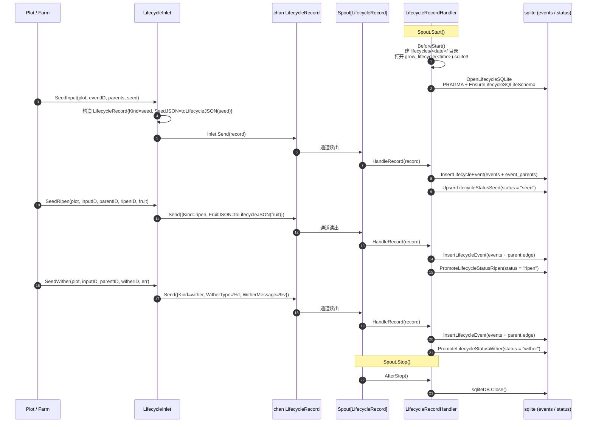

# pkg/persist/lifecycle.go

> 📅 最后更新日期: 2026/09/24

## 作用

`pkg/persist/lifecycle.go` 把每颗种子的 **培育轨迹** 拆成「事件（events）」与「状态快照（status）」两类记录，通过 `LifecycleRecordHandler` 订阅 `pkg/funnel` 的异步通道，写入由 [`sqlite.md`](./sqlite.md) 维护的 SQLite 文件中；同时通过 `LifecycleInlet` 暴露面向业务方的生产端 API（`SeedInput` / `SeedRipen` / `SeedWither`）。本文件本身不直接执行 SQL——所有持久化细节都在 `sqlite.go`，本文件只做事件 → 记录 → 入库的 **编排与适配**。

> 事件 ID 由 `runtime.EventClient`（如 `runtime.LocalEventClient.Emit`）分配，参见 [`pkg/runtime/event.go`](../../../../pkg/runtime/event.go)。本文件直接消费 `int` 形式的 `EventID`，不依赖 `runtime` 包。

## 核心对象

### `LifecycleRecord` — 通道载荷

```go
type LifecycleRecord struct {
    Kind           string
    InputEventID   int
    CurrentEventID int
    ParentIDs      []int
    PlotName       string
    SeedJSON       string
    FruitJSON      string
    WitherType     string
    WitherMessage  string
    TS             float64
}
```

| 字段 | 含义 |
|------|------|
| `Kind` | 操作类型；取以下三者之一：`seed` / `ripen` / `wither`（由包内常量 `lifecycleSeed` / `lifecycleRipen` / `lifecycleWither` 表示） |
| `InputEventID` | 本颗种子（输入）的事件 ID，对应 `status.input_event_id` |
| `CurrentEventID` | 本次产生的事件 ID，对应 `status.current_event_id`；`seed` 时与 `InputEventID` 相同 |
| `ParentIDs` | 父事件 ID 列表，写入 `events` 时同步写入 `event_parents` 边 |
| `PlotName` | 事件所属 plot 名称，写入 `status.plot` |
| `SeedJSON` | 种子载荷 JSON（仅 `seed` 时由生产者提供） |
| `FruitJSON` | 果实 JSON（仅 `ripen` 时由生产者提供） |
| `WitherType` | 枯萎错误类型字符串（仅 `wither` 时由 `fmt.Sprintf("%T", err)` 生成） |
| `WitherMessage` | 枯萎错误文本（仅 `wither` 时由 `fmt.Sprintf("%v", err)` 生成） |
| `TS` | 事件时间戳（秒，浮点），由 `time.Now().UnixMilli() / 1000` 生成 |

> `LifecycleRecord` 是**扁平**结构：事件本体（事件 ID / plot / 时间戳 / 父边）直接内联为字段，不再嵌套 `sqlite.LifecycleEventRecord`。

### `LifecycleRecordHandler` — 消费端（Spout 处理器）

```go
type LifecycleRecordHandler struct {
    SQLitePath string
    sqliteDB   *sql.DB
}
```

实现 `funnel.RecordHandler[LifecycleRecord]`，方法签名如下：

| 方法 | 触发时机 | 行为 |
|------|----------|------|
| `BeforeStart() error` | Spout 启动前 | 创建 `lifecycles/<YYYY-MM-DD>/` 目录并打开 `grow_lifecycle(<HH-MM-SS.mmm>).sqlite3`；保存路径到 `SQLitePath`、连接句柄到 `sqliteDB` |
| `HandleRecord(record LifecycleRecord) error` | 每条记录到达 | 先检查 `sqliteDB != nil`；再按 `record.Kind` 路由到 `InsertLifecycleEvent` + `UpsertLifecycleStatusSeed` / `PromoteLifecycleStatusRipen` / `PromoteLifecycleStatusWither` |
| `AfterStop() error` | Spout 停止后 | 关闭 `sqliteDB` 并置空 |
| `LoadStatuses(plotName string) ([]LifecycleStatusRecord, error)` | 业务方主动调用 | 优先复用 `sqliteDB`；若尚未初始化则按 `SQLitePath` 重新打开 |

> `SQLitePath` 暴露为公开字段，让调用方在 `AfterStop` 之后仍能通过 `LoadStatuses` 重新打开已落盘的 SQLite 文件做离线查询。
>
> `AfterStop` 在 `sqliteDB == nil` 时直接返回 `nil`，因此对未 `BeforeStart` 的实例调用是安全的。

### `LifecycleInlet` — 生产端

```go
type LifecycleInlet struct {
    funnel.Inlet[LifecycleRecord]
}
```

内嵌 `funnel.Inlet[LifecycleRecord]`，仅在此基础上叠加 3 个面向业务的发送方法：

| 方法 | `Kind` | 行为 |
|------|--------|------|
| `SeedInput(plot string, eventID int, parentIDs []int, seed any)` | `seed` | 发送一条 seed 记录：`CurrentEventID = InputEventID = eventID`，`SeedJSON = toLifecycleJSON(seed)`；落库时先写 `events`（`status = "seed"`），再 `UpsertLifecycleStatusSeed` |
| `SeedRipen(plot string, inputEventID int, parentEventID int, ripenEventID int, fruit any)` | `ripen` | 发送一条 ripen 记录：`CurrentEventID = ripenEventID`，`ParentIDs = []int{parentEventID}`，`FruitJSON = toLifecycleJSON(fruit)`；落库时先写 `events`，再 `PromoteLifecycleStatusRipen` |
| `SeedWither(plot string, inputEventID int, parentEventID int, witherEventID int, err error)` | `wither` | 发送一条 wither 记录：`CurrentEventID = witherEventID`，`ParentIDs = []int{parentEventID}`，`WitherType = %T`、`WitherMessage = %v`；落库时先写 `events`，再 `PromoteLifecycleStatusWither` |

三个方法都在内部用 `time.Now().UnixMilli()` 生成 `TS`，然后调用内嵌 `Inlet` 的 `Send`；因此**不返回 error**，发送超时会由 `funnel.Inlet` 内部处理。

### `NewLifecycleInlet` — 构造

```go
func NewLifecycleInlet(ch chan<- LifecycleRecord, timeout time.Duration) *LifecycleInlet
```

- `ch` 必须由对应的 `funnel.Spout[LifecycleRecord].GetQueue()` 暴露。
- `timeout` 透传给 `funnel.NewInlet`；当通道缓冲区满时 `SeedInput` / `SeedRipen` / `SeedWither` 内部 `l.Send` 会在超时后返回 `inlet send timeout after <d>`。

## 关键流程

### 事件 → 记录 → 入库的完整链路



### `Kind` 路由

`HandleRecord` 先校验数据库句柄，再在内部 `switch record.Kind` 上做三向路由；任何其它取值都直接返回 `unsupported lifecycle operation: <kind>`：

```go
func (l *LifecycleRecordHandler) HandleRecord(record LifecycleRecord) error {
    if l.sqliteDB == nil {
        return fmt.Errorf("生命周期 sqlite 未初始化")
    }

    switch record.Kind {
    case lifecycleSeed:
        InsertLifecycleEvent(l.sqliteDB, record.CurrentEventID, record.Kind, record.PlotName, record.TS, record.ParentIDs)
        UpsertLifecycleStatusSeed(l.sqliteDB, record.InputEventID, record.SeedJSON, record.PlotName, record.TS)
    case lifecycleRipen:
        InsertLifecycleEvent(l.sqliteDB, record.CurrentEventID, record.Kind, record.PlotName, record.TS, record.ParentIDs)
        PromoteLifecycleStatusRipen(l.sqliteDB, record.InputEventID, record.CurrentEventID, record.FruitJSON, record.TS)
    case lifecycleWither:
        InsertLifecycleEvent(l.sqliteDB, record.CurrentEventID, record.Kind, record.PlotName, record.TS, record.ParentIDs)
        PromoteLifecycleStatusWither(l.sqliteDB, record.InputEventID, record.CurrentEventID, record.WitherType, record.WitherMessage, record.TS)
    default:
        return fmt.Errorf("unsupported lifecycle operation: %s", record.Kind)
    }
}
```

要点：

- 三种 Kind 都先写 `events`（`event_type` 直接取 `record.Kind`，即 `seed` / `ripen` / `wither`），再更新 `status`。
- `events.plot` 与 `status.plot` 都来自 `record.PlotName`，`status.ts` 来自 `record.TS`，因此一次调用即可让 `status` 表同时记录「当前事件类型 + plot + 时间戳」。
- 若 `InsertLifecycleEvent` 失败，状态更新不会执行——事件与其状态快照保持一致。

### 目录与文件命名

`BeforeStart` 用两份时间字符串拼出 SQLite 路径：

```text
SQLitePath = lifecycles/<YYYY-MM-DD>/grow_lifecycle(<HH-MM-SS.mmm>).sqlite3
```

- 日期格式 `2006-01-02` 覆盖当天全部事件（与日志文件 `logs/grow_log(YYYY-MM-DD).log` 的日期口径一致）。
- 时间格式 `15-04-05.000` 保证每次启动得到唯一的文件名；目录内可能存在多个 `.sqlite3` 文件。
- 目录权限 `0755`，文件由 SQLite 自身创建（`sql.Open("sqlite", "file:...")`），`BeforeStart` 不显式创建文件。
- `os.MkdirAll` / `OpenLifecycleSQLite` 失败时分别返回 `创建生命周期目录失败: ...` / `打开生命周期 sqlite 失败: ...`。

### `LoadStatuses` 的双模式

```go
func (l *LifecycleRecordHandler) LoadStatuses(plotName string) ([]LifecycleStatusRecord, error) {
    if l.sqliteDB != nil {
        return LoadLifecycleStatuses(l.sqliteDB, plotName)
    }
    if l.SQLitePath == "" {
        return nil, fmt.Errorf("生命周期 sqlite 未初始化")
    }
    db, err := OpenLifecycleSQLite(l.SQLitePath)
    if err != nil { return nil, ... }
    defer db.Close()
    return LoadLifecycleStatuses(db, plotName)
}
```

- 进程内：Spout 仍存活 → 复用 `sqliteDB`，不重复打开。
- 进程外：Spout 已停止（`AfterStop` 已把 `sqliteDB` 置空）→ 用 `SQLitePath` 重新 `OpenLifecycleSQLite`（再走一次 PRAGMA + 建表脚本），查询完立即 `Close`。
- 两条分支都未初始化时会返回 `生命周期 sqlite 未初始化`（重新打开失败则额外包装为 `重新打开生命周期 sqlite 失败: ...`）。

### `toLifecycleJSON` 兜底

```go
func toLifecycleJSON(value any) string {
    data, err := json.Marshal(value)
    if err == nil { return string(data) }
    lifecycle, lifecycleErr := json.Marshal(fmt.Sprintf("%+v", value))
    if lifecycleErr == nil { return string(lifecycle) }
    return `"marshal_error"`
}
```

- 优先 `json.Marshal`；
- 失败时退到 `fmt.Sprintf("%+v", value)` 的字符串形式（仅对 struct/指针打印字段）；
- 二次失败写死 `"marshal_error"`（合法 JSON 字符串），保证 `status.seed_json` 列不会出现 SQLite `NULL`，下游读取时只需解析即可。

## 公开符号清单

| 符号 | 类别 | 用途 |
|------|------|------|
| `LifecycleRecord` | 类型 | 通道载荷（含 `Kind` / 事件字段 / 状态字段） |
| `LifecycleRecordHandler` | 类型 | 消费端 `funnel.RecordHandler[LifecycleRecord]` 实现 |
| `LifecycleInlet` | 类型 | 生产端（内嵌 `funnel.Inlet[LifecycleRecord]`） |
| `NewLifecycleInlet` | 函数 | 构造 `LifecycleInlet` |
| `(*LifecycleInlet).SeedInput` | 方法 | 发送 `seed` 记录 |
| `(*LifecycleInlet).SeedRipen` | 方法 | 发送 `ripen` 记录 |
| `(*LifecycleInlet).SeedWither` | 方法 | 发送 `wither` 记录 |
| `(*LifecycleRecordHandler).BeforeStart` | 方法 | 建目录、开库 |
| `(*LifecycleRecordHandler).HandleRecord` | 方法 | 按 `Kind` 路由落库 |
| `(*LifecycleRecordHandler).AfterStop` | 方法 | 关库并置空句柄 |
| `(*LifecycleRecordHandler).LoadStatuses` | 方法 | 按 plot 读取全部状态快照 |

> `lifecycleSeed` / `lifecycleRipen` / `lifecycleWither` 为包内私有常量。`toLifecycleJSON` 为包内私有辅助函数。

## 使用示例

与 `pkg/funnel` 配合的最小骨架（省略错误处理细节）：

```go
package main

import (
    "context"
    "time"

    "github.com/Mr-xiaotian/CelestialGrow/pkg/funnel"
    "github.com/Mr-xiaotian/CelestialGrow/pkg/persist"
)

func main() {
    handler := &persist.LifecycleRecordHandler{}
    spout := funnel.NewSpout[persist.LifecycleRecord](handler, 100, time.Second)

    if err := spout.Start(); err != nil {
        panic(err)
    }
    inlet := persist.NewLifecycleInlet(spout.GetQueue(), time.Second)

    // 事件 1 输入种子 -> 事件 2 结果实
    inlet.SeedInput("stage_a", 1, nil, map[string]int{"v": 42})
    inlet.SeedRipen("stage_a", 1, 1, 2, map[string]int{"v": 84})

    // 事件 3 输入种子 -> 事件 4 枯萎
    inlet.SeedInput("stage_a", 3, nil, map[string]int{"v": 7})
    inlet.SeedWither("stage_a", 3, 3, 4, context.DeadlineExceeded)

    if err := spout.Stop(); err != nil {
        panic(err)
    }

    // 离线查询：spout 停止后 sqliteDB 已置空，LoadStatuses 会按 SQLitePath 重新打开
    statuses, err := handler.LoadStatuses("stage_a")
    if err != nil {
        panic(err)
    }
    for _, s := range statuses {
        println(s.Status, s.SeedJSON, s.FruitJSON, s.WitherType, s.WitherMessage)
    }
}
```

运行后在 `lifecycles/<date>/grow_lifecycle(<time>).sqlite3` 中可读到两行 `status`：一行 `status = "ripen"`（`fruit_json = {"v":84}`），一行 `status = "wither"`（`wither_type` 为 `fmt.Sprintf("%T", context.DeadlineExceeded)` 的结果、`wither_message` 为 `context deadline exceeded`）。

## 注意事项

- **Kind 路由是单点**：`HandleRecord` 的 `default` 分支会返回 `unsupported lifecycle operation: <kind>`；`lifecycle.go` 内部只承认 `seed` / `ripen` / `wither` 三种 Kind，向通道塞入其它值会破坏流水线，需要在生产者侧保证。
- **`sqliteDB == nil` 是硬失败**：`HandleRecord` 在句柄为空时直接返回 `生命周期 sqlite 未初始化`，因此必须先 `Spout.Start()`（触发 `BeforeStart`）再发送记录。
- **时间戳单调性**：所有 `TS` 都由 `LifecycleInlet` 在打包时 `time.Now().UnixMilli() / 1000` 生成；同一毫秒内大量事件会产生相同 TS，`status.ts` 与 `input_event_id` 共同决定 `LoadLifecycleStatuses` 的排序。
- **错误信息为 `fmt.Sprintf` 形式**：`WitherType` / `WitherMessage` 由 `fmt.Sprintf("%T", err)` / `fmt.Sprintf("%v", err)` 生成，包装过的错误可能丢失错误链；需要精确错误链时只能从业务侧另行记录。
- **目录权限固定**：`lifecycles/<date>/` 一律 `0755`，未做权限收敛；如部署在多用户主机上需在 `BeforeStart` 之外另设 ACL。
- **Spout 关闭后 `sqliteDB == nil`**：`AfterStop` 会把 `l.sqliteDB` 置空，因此 `LoadStatuses` 在 Spout 已停止时一定走「重新打开 `SQLitePath`」分支，确保历史数据可读。
- **与 `pkg/runtime` 解耦**：`lifecycle.go` 只使用 `int` 形式的 `EventID`，不直接调用 `runtime.LocalEventClient`；事件 ID 仍然需要在业务方（例如 `Plot`）处分配后再传入。
