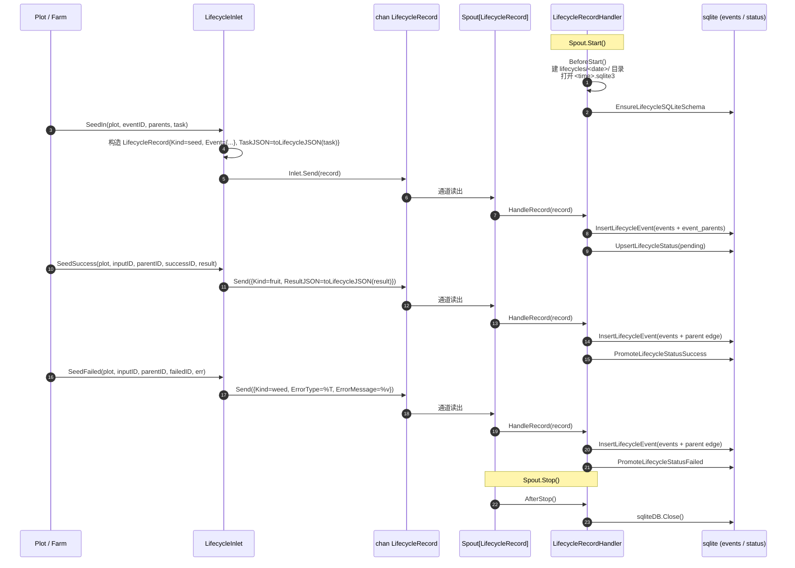

# pkg/persist/lifecycle.go

> 最后更新日期: 2026/09/01

## 作用

`pkg/persist/lifecycle.go` 把每颗种子的 **培育轨迹** 拆成「事件（events）」与「状态快照（status）」两类记录，通过 `LifecycleRecordHandler` 订阅 `pkg/funnel` 的异步通道，写入由 [`sqlite.md`](./sqlite.md) 维护的 SQLite 文件中；同时通过 `LifecycleInlet` 暴露面向业务方的生产端 API（`SeedIn` / `SeedSuccess` / `SeedFailed`）。本文件本身不直接执行 SQL——所有持久化细节都在 `sqlite.go`，本文件只做事件 → 记录 → 入库的 **编排与适配**。

> 基础事件 ID 与 `runtime.EventClient` 的对应关系参见 [`pkg/runtime/event.go`](../../../../pkg/runtime/event.go)。本文件直接消费 `EventID` 整数，不依赖 `runtime` 包。

## 核心对象

### `LifecycleRecord` — 通道载荷

```go
type LifecycleRecord struct {
    Kind           string
    Event          LifecycleEventRecord
    ParentIDs      []int
    InputEventID   int
    CurrentEventID int
    TaskJSON       string
    ResultJSON     string
    ErrorType      string
    ErrorMessage   string
}
```

| 字段 | 含义 |
|------|------|
| `Kind` | 操作类型；取以下三者之一：`seed` / `fruit` / `weed`（由包内常量 `lifecycleSeed` / `lifecycleFruit` / `lifecycleWeed` 表示） |
| `Event` | 本次产生的事件本体，结构见 `sqlite.md` 中的 `LifecycleEventRecord` |
| `ParentIDs` | 父事件 ID 列表，仅 `seed` / `fruit` / `weed` 写入 `events` 时使用 |
| `InputEventID` | 任务的输入事件 ID（对应 `status.input_event_id`） |
| `CurrentEventID` | 任务当前指向的事件 ID（`status.current_event_id`），由 `LifecycleInlet` 在打包记录时设置 |
| `TaskJSON` | 任务载荷 JSON（`seed` 时由生产者提供） |
| `ResultJSON` | 结果 JSON（`fruit` 时由生产者提供） |
| `ErrorType` | 错误类型字符串（`weed` 时由 `fmt.Sprintf("%T", err)` 生成） |
| `ErrorMessage` | 错误文本（`weed` 时由 `fmt.Sprintf("%v", err)` 生成） |

### `LifecycleRecordHandler` — 消费端（Spout 处理器）

```go
type LifecycleRecordHandler struct {
    SQLitePath string
    sqliteDB   *sql.DB
}
```

实现 `funnel.RecordHandler[LifecycleRecord]`，方法签名如下：

| 方法 | 触发时机 | 行为 |
|------|----------|------|
| `BeforeStart() error` | Spout 启动前 | 创建 `lifecycles/<YYYY-MM-DD>/` 目录并打开 `<HH-MM-SS.mmm>.sqlite3` 数据库；保存路径到 `SQLitePath`、连接句柄到 `sqliteDB` |
| `HandleRecord(record LifecycleRecord) error` | 每条记录到达 | 根据 `record.Kind` 路由到 `InsertLifecycleEvent` + `UpsertLifecycleStatus` / `PromoteLifecycleStatusSuccess` / `PromoteLifecycleStatusFailed` |
| `AfterStop() error` | Spout 停止后 | 关闭 `sqliteDB` 并置空 |
| `LoadStatuses(plotName string) ([]LifecycleStatusRecord, error)` | 业务方主动调用 | 优先复用 `sqliteDB`；若尚未初始化则按 `SQLitePath` 重新打开 |

> `SQLitePath` 暴露为公开字段，让调用方在 `AfterStop` 之后仍能通过 `LoadStatuses` 重新打开已落盘的 SQLite 文件做离线查询。

### `LifecycleInlet` — 生产端

```go
type LifecycleInlet struct {
    funnel.Inlet[LifecycleRecord]
}
```

内嵌 `funnel.Inlet[LifecycleRecord]`，仅在此基础上叠加 3 个面向业务的发送方法：

| 方法 | 行为 |
|------|------|
| `SeedIn(plot, eventID, parentIDs, task)` | 发送一条 `seed` 记录：先写 `events`，再 `UpsertLifecycleStatus`（`status = "pending"`、`result_json = "null"`） |
| `SeedSuccess(plot, inputEventID, parentEventID, successEventID, result)` | 发送一条 `fruit` 记录：先写 `events`（`parent = [parentEventID]`），再 `PromoteLifecycleStatusSuccess` |
| `SeedFailed(plot, inputEventID, parentEventID, failedEventID, err)` | 发送一条 `weed` 记录：先写 `events`（`parent = [parentEventID]`），再 `PromoteLifecycleStatusFailed` |

### `NewLifecycleInlet` — 构造

```go
func NewLifecycleInlet(ch chan<- LifecycleRecord, timeout time.Duration) *LifecycleInlet
```

- `ch` 必须由对应的 `funnel.Spout[LifecycleRecord].GetQueue()` 暴露。
- `timeout` 透传给 `funnel.NewInlet`，当通道缓冲区满时 `SeedIn` / `SeedSuccess` / `SeedFailed` 内部 `l.Send` 会在超时后返回 `inlet send timeout after <d>`。

## 关键流程

### 事件 → 记录 → 入库的完整链路



### `Kind` 路由

`HandleRecord` 在内部 `switch record.Kind` 上做三向路由；任何其它取值都直接返回 `unsupported lifecycle operation: <kind>`：

```go
switch record.Kind {
case lifecycleSeed:
    InsertLifecycleEvent(...) + UpsertLifecycleStatus(... pending, result="null")
case lifecycleFruit:
    InsertLifecycleEvent(...) + PromoteLifecycleStatusSuccess(...)
case lifecycleWeed:
    InsertLifecycleEvent(...) + PromoteLifecycleStatusFailed(...)
}
```

`UpsertLifecycleStatus` 阶段会把 `record.Event.Plot` 拷贝到 `status.plot`，`record.Event.TS` 拷贝到 `status.ts`，因此一次调用即可让 `status` 表同时记录「当前事件类型 + plot + 时间戳」。

### 目录与文件命名

`BeforeStart` 用两份时间字符串拼出 SQLite 路径：

```text
SQLitePath = lifecycles/<YYYY-MM-DD>/grow_lifecycle(<HH-MM-SS.mmm>).sqlite3
```

- 日期格式 `2006-01-02` 与日志文件 `logs/grow_log(YYYY-MM-DD).log` 保持一致（同一天的事件落入同一目录）。
- 时间格式 `15-04-05.000` 保证每次启动得到唯一的文件名；目录内可能存在多个 `.sqlite3` 文件。
- 目录权限 `0755`，文件由 SQLite 自身创建（`sql.Open("sqlite", "file:...")`）。

### `LoadStatuses` 的双模式

```go
func (l *LifecycleRecordHandler) LoadStatuses(plotName string) ([]LifecycleStatusRecord, error) {
    if l.sqliteDB != nil {
        return LoadLifecycleStatuses(l.sqliteDB, plotName)
    }
    if l.SQLitePath == "" {
        return nil, fmt.Errorf("生命周期 sqlite 未初始化")
    }
    db, err := OpenLifecycleSQLite(l.SQLitePath)
    if err != nil { return nil, ... }
    defer db.Close()
    return LoadLifecycleStatuses(db, plotName)
}
```

- 进程内：Spout 仍存活 → 复用 `sqliteDB`，不重复打开。
- 进程外：Spout 已停止 → 用 `SQLitePath` 重新 `OpenLifecycleSQLite`（再走一次 PRAGMA + 建表脚本），保证幂等。

## 关键流程

### `toLifecycleJSON` 兜底

```go
func toLifecycleJSON(value any) string {
    data, err := json.Marshal(value)
    if err == nil { return string(data) }
    fallback, fallbackErr := json.Marshal(fmt.Sprintf("%+v", value))
    if fallbackErr == nil { return string(fallback) }
    return `"marshal_error"`
}
```

- 优先 `json.Marshal`；
- 失败时退到 `fmt.Sprintf("%+v", value)` 的字符串形式（仅对 struct/指针打印字段）；
- 二次失败写死 `"marshal_error"`（合法 JSON 字符串），保证 `status.task_json` 列不会出现 SQLite `NULL`，下游读取时只需解析即可。

## 公开符号清单

| 符号 | 类别 | 用途 |
|------|------|------|
| `LifecycleRecord` | 类型 | 通道载荷（含 `Kind` / `Event` / 父边 / 状态字段） |
| `LifecycleRecordHandler` | 类型 | 消费端 `funnel.RecordHandler[LifecycleRecord]` 实现 |
| `LifecycleInlet` | 类型 | 生产端（内嵌 `funnel.Inlet[LifecycleRecord]`） |
| `NewLifecycleInlet` | 函数 | 构造 `LifecycleInlet` |
| `(*LifecycleInlet).SeedIn` | 方法 | 发送 `seed` 记录 |
| `(*LifecycleInlet).SeedSuccess` | 方法 | 发送 `fruit` 记录 |
| `(*LifecycleInlet).SeedFailed` | 方法 | 发送 `weed` 记录 |

> `lifecycleSeed` / `lifecycleFruit` / `lifecycleWeed` 为包内私有常量。`toLifecycleJSON` 为包内私有辅助函数。

## 使用示例

与 `pkg/funnel` 配合的最小骨架（伪代码，省略错误处理）：

```go
package main

import (
    "time"

    "github.com/Mr-xiaotian/CelestialGrow/pkg/funnel"
    "github.com/Mr-xiaotian/CelestialGrow/pkg/persist"
)

func main() {
    handler := &persist.LifecycleRecordHandler{}
    spout := funnel.NewSpout[persist.LifecycleRecord](handler, 256, 3*time.Second)

    if err := spout.Start(); err != nil { panic(err) }
    inlet := persist.NewLifecycleInlet(spout.GetQueue(), 1*time.Second)

    inlet.SeedIn("stage_a", 1, nil, map[string]int{"v": 42})
    inlet.SeedSuccess("stage_a", 1, 1, 2, map[string]int{"v": 84})
    inlet.SeedFailed("stage_a", 3, 3, 4, context.DeadlineExceeded)

    if err := spout.Stop(); err != nil { panic(err) }

    // 离线查询
    statuses, err := handler.LoadStatuses("stage_a")
    if err != nil { panic(err) }
    for _, s := range statuses {
        println(s.TaskJSON, s.Status, s.ResultJSON)
    }
}
```

## 注意事项

- **Kind 路由是单点**：`HandleRecord` 的 `default` 分支会返回错误；`lifecycle.go` 内部只承认 `seed` / `fruit` / `weed` 三种 Kind，向通道塞入其它值会破坏流水线，需要在生产者侧保证。
- **时间戳单调性**：所有 `Event.TS` 都由 `LifecycleInlet` 在打包时 `time.Now().UnixMilli() / 1000` 生成；同一毫秒内大量事件会产生相同 TS，`status.ts` 与 `input_event_id` 共同决定 `LoadLifecycleStatuses` 的排序。
- **错误信息为 `fmt.Sprintf` 形式**：`ErrorType` / `ErrorMessage` 由 `fmt.Sprintf("%T", err)` / `fmt.Sprintf("%v", err)` 生成，包装过的错误可能丢失错误链；需要精确错误链时直接读 `task_json` 即可。
- **目录权限固定**：`lifecycles/<date>/` 一律 `0755`，未做权限收敛；如部署在多用户主机上需在 `BeforeStart` 之外另设 ACL。
- **Spout 关闭后 `sqliteDB == nil`**：`AfterStop` 会把 `l.sqliteDB` 置空，因此 `LoadStatuses` 在 Spout 已停止时一定走「重新打开 `SQLitePath`」分支，确保历史数据可读。
- **与 `pkg/runtime` 解耦**：`lifecycle.go` 只使用 `int` 形式的 `EventID`，不直接调用 `runtime.LocalEventClient`；事件 ID 仍然需要在业务方（例如 `Plot`）处分配后再传入。
