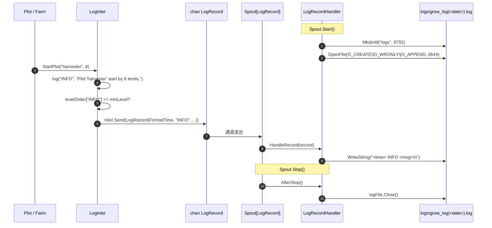

# pkg/persist/log.go

> 最后更新日期: 2026/09/01

## 作用

`pkg/persist/log.go` 实现面向 **运行日志** 的异步落盘：业务方通过 `LogInlet` 发送带级别的日志记录，由 `funnel.Spout[LogRecord]` 调度的 `LogRecordHandler` 追加写入 `logs/grow_log(YYYY-MM-DD).log` 文件。`LogInlet` 内置 **最低级别阈值**，低于阈值的记录会被静默丢弃，从而让上层 Plot / Farm 在高频调用时不必关心过滤。

> 与日志并行的 **生命周期持久化** 在 [`lifecycle.md`](./lifecycle.md) / [`sqlite.md`](./sqlite.md)；两者共用 `pkg/funnel` 的 Inlet/Spout 抽象，但**不**共用通道与文件。

## 核心对象

### `LogRecord` — 通道载荷

```go
type LogRecord struct {
    FormatTime string
    Level      string
    Message    string
}
```

| 字段 | 说明 |
|------|------|
| `FormatTime` | 由 `LogInlet` 在发送时用 `time.Now().Format("2006-01-02 15:04:05")` 生成；写入文件时与 `Level` / `Message` 用单空格拼接成一行 |
| `Level` | 日志级别字符串（`TRACE` / `DEBUG` / `SUCCESS` / `INFO` / `WARNING` / `ERROR` / `CRITICAL`） |
| `Message` | 业务方提供的可读文本 |

### `LogRecordHandler` — 消费端（Spout 处理器）

```go
type LogRecordHandler struct {
    LogPath string
    logFile *os.File
}
```

实现 `funnel.RecordHandler[LogRecord]`，方法签名如下：

| 方法 | 触发时机 | 行为 |
|------|----------|------|
| `BeforeStart() error` | Spout 启动前 | 创建 `logs/` 目录（权限 `0755`），并以 `O_CREATE \| O_WRONLY \| O_APPEND`（权限 `0644`）打开 `logs/grow_log(<YYYY-MM-DD>).log` |
| `HandleRecord(record LogRecord) error` | 每条记录到达 | 将 `record.FormatTime + " " + record.Level + " " + record.Message + "\n"` 整体 `WriteString` 到文件 |
| `AfterStop() error` | Spout 停止后 | 关闭 `logFile` 句柄 |

> `LogPath` 为公开字段，暴露实际打开的文件路径，便于在测试或排查时定位。

### `LogInlet` — 生产端

```go
type LogInlet struct {
    funnel.Inlet[LogRecord]
    minLevel int
}
```

- 内嵌 `funnel.Inlet[LogRecord]`，同时持有 `minLevel`（即 `levelOrder[level]` 的数值）。
- 构造时通过 `NewLogInlet` 把字符串级别映射成 `minLevel`；**不存在的级别字符串**会被替换为 `INFO`（`minLevel = levelOrder["INFO"]`），不会返回错误。

### 级别表 `levelOrder`

```go
var levelOrder = map[string]int{
    "TRACE":    0,
    "DEBUG":    1,
    "SUCCESS":  2,
    "INFO":     3,
    "WARNING":  4,
    "ERROR":    5,
    "CRITICAL": 6,
}
```

数值越小优先级越低；阈值 `minLevel` 表示「**等于或高于**」此值才放行。例如 `NewLogInlet(ch, 1*time.Second, "WARNING")` 等价于 `minLevel = 4`，只有 `WARNING` / `ERROR` / `CRITICAL` 三类能落到文件。

## 关键流程

### 目录与文件布局

```text
logs/
└── grow_log(2026-09-01).log
```

- `BeforeStart` 用 `time.Now().Format("2006-01-02")` 得到日期，拼出 `logs/grow_log(YYYY-MM-DD).log`。
- `O_APPEND` 让同一天的多次启动 / 多进程同主机写入都追加到同一文件；并发写由 OS 原子化（POSIX 下 `write(2)` ≤ `PIPE_BUF` 同理保证原子性，单行日志远小于此上限）。
- 没有显式「轮转」步骤——超过日期会自然得到新文件名，旧文件保留在原处供人工归档或外部清理。

### 与 `pkg/funnel` 异步消费的协作



要点：

- `Inlet.Send` 复用 `funnel.Inlet` 的 `select { case ch <- : case ctx.Done(): case time.After(timeout): }`，因此**通道满**会在 `timeout` 后返回 `inlet send timeout after <d>`，调用方可以选择忽略或上抛。
- `LogInlet.log` 内部先做 `levelOrder[level] < l.minLevel` 判断，**未达阈值直接 `return`**，不会触发 `Send` 也不会产生错误。
- `LogRecordHandler` 是 `funnel.RecordHandler[LogRecord]` 实现，由 `Spout[LogRecord]` 内部 `spout()` goroutine 串行调用 `HandleRecord`，因此单进程内不会出现行交错。

### 过滤与构造

```go
func (l *LogInlet) log(level string, message string) {
    if levelOrder[level] < l.minLevel {
        return
    }
    l.Send(LogRecord{
        FormatTime: time.Now().Format("2006-01-02 15:04:05"),
        Level:      level,
        Message:    message,
    })
}
```

`FormatTime` 在**发送前**生成，确保即使通道短暂积压，落盘时间仍反映「何时决定记录」而非「何时被处理」。

## 业务级发送方法

`LogInlet` 在 `log` 之上暴露 7 个业务方法，把常用文案格式固化在 `pkg/persist` 中：

| 方法 | 级别 | 典型格式 | 触发时机 |
|------|------|----------|----------|
| `StartFarm(farmName string)` | `INFO` | `Farm '<name>' start.` | Farm 启动 |
| `EndFarm(farmName string, useTime float64)` | `INFO` | `Farm '<name>' end. Use <s>s.` | Farm 结束 |
| `StartPlot(plotName string, numTends int)` | `INFO` | `Plot '<name>' start by <n> tends.` | Plot 启动 |
| `EndPlot(plotName string, useTime float64, fruitNum, weedNum int)` | `INFO` | `Plot '<name>' end. Use <s>s. <fruit> ripened, <weed> withered.` | Plot 结束 |
| `SeedRipen(plotName, seedRepr, fruitRepr string, useTime float64, seedID, fruitID int)` | `SUCCESS` | `In '<plot>', Seed <s> ripened. Fruit is <f>. Use <s>s. [<seedID>-><fruitID>*]` | 种子成功 |
| `SeedWither(plotName, seedRepr string, err error, useTime float64, seedID, weedID int)` | `ERROR` | `In '<plot>', Seed <s> withered: <err>. Use <s>s. [<seedID>-><weedID>*]` | 种子失败 |
| `SeedReplant(plotName, seedRepr string, attempt int, err error)` | `WARNING` | `In '<plot>', Seed <s> attempt <n> withered: <err>. Replanting...` | 重试中间态 |

> 上述方法全部经过 `log(level, ...)`，因此同样受 `minLevel` 过滤。

## 公开符号清单

| 符号 | 类别 | 用途 |
|------|------|------|
| `LogRecord` | 类型 | 通道载荷 |
| `LogRecordHandler` | 类型 | 消费端 `funnel.RecordHandler[LogRecord]` 实现 |
| `LogInlet` | 类型 | 生产端（内嵌 `funnel.Inlet[LogRecord]`，含 `minLevel` 过滤） |
| `NewLogInlet` | 函数 | 构造 `LogInlet`，把字符串级别映射成 `minLevel`；未知级别回落到 `INFO` |
| `(*LogInlet).StartFarm` | 方法 | `INFO` Farm 启动 |
| `(*LogInlet).EndFarm` | 方法 | `INFO` Farm 结束 |
| `(*LogInlet).StartPlot` | 方法 | `INFO` Plot 启动 |
| `(*LogInlet).EndPlot` | 方法 | `INFO` Plot 结束 |
| `(*LogInlet).SeedRipen` | 方法 | `SUCCESS` 种子成熟 |
| `(*LogInlet).SeedWither` | 方法 | `ERROR` 种子枯萎 |
| `(*LogInlet).SeedReplant` | 方法 | `WARNING` 重试中间态 |

> `levelOrder` 与 `log` 私有方法为包内实现细节，不对外暴露。

## 使用示例

与 `pkg/funnel` 配合的最小骨架：

```go
package main

import (
    "time"

    "github.com/Mr-xiaotian/CelestialGrow/pkg/funnel"
    "github.com/Mr-xiaotian/CelestialGrow/pkg/persist"
)

func main() {
    handler := &persist.LogRecordHandler{}
    spout := funnel.NewSpout[persist.LogRecord](handler, 256, 3*time.Second)
    if err := spout.Start(); err != nil { panic(err) }

    inlet := persist.NewLogInlet(spout.GetQueue(), 1*time.Second, "INFO")
    inlet.StartFarm("demo_farm")
    inlet.StartPlot("harvester", 4)
    inlet.SeedRipen("harvester", "{v:1}", "{v:2}", 0.12, 1, 2)
    inlet.SeedWither("harvester", "{v:3}", context.DeadlineExceeded, 0.40, 3, 4)
    inlet.EndPlot("harvester", 1.23, 1, 1)
    inlet.EndFarm("demo_farm", 1.40)

    if err := spout.Stop(); err != nil { panic(err) }
}
```

运行后 `logs/grow_log(2026-09-01).log` 内容（节选）：

```text
2026-09-01 10:00:00 INFO Farm 'demo_farm' start.
2026-09-01 10:00:00 INFO Plot 'harvester' start by 4 tends.
2026-09-01 10:00:00 SUCCESS In 'harvester', Seed {v:1} ripened. Fruit is {v:2}. Use 0.12s. [1->2*]
2026-09-01 10:00:00 ERROR In 'harvester', Seed {v:3} withered: context deadline exceeded. Use 0.40s. [3->4*]
2026-09-01 10:00:00 INFO Plot 'harvester' end. Use 1.23s. 1 ripened, 1 withered.
2026-09-01 10:00:00 INFO Farm 'demo_farm' end. Use 1.40s.
```

## 注意事项

- **级别过滤发生在生产端**：`minLevel` 阈值在 `LogInlet.log` 中判断，未达阈值的日志不会进入通道；调整日志级别会同时关闭上游 `Send` 调用，比依赖 Spout 端过滤更省内存。
- **未知级别回落到 `INFO`**：`NewLogInlet(ch, d, "VERBOSE")` 不会报错，而是把 `minLevel` 设为 `levelOrder["INFO"]`；若想完全静默请直接传 `"CRITICAL"+1`（但目前没有显式 `OFF` 常量）。
- **没有显式轮转**：跨日期会自然切换文件；如需按体积轮转，需要在 `LogRecordHandler` 之外自行实现（当前未提供）。
- **没有并发写保护**：`LogRecordHandler` 假设 `HandleRecord` 由 `Spout` 单 goroutine 串行调用；如果绕开 `Spout` 自行多 goroutine 写入同一 `LogRecordHandler`，`os.File.WriteString` 仍由 OS 原子化（≤ `PIPE_BUF`），但行与行之间没有显式锁，极端情况下会交错。
- **日志目录权限 `0755`**：与 `lifecycles/<date>/` 风格一致；多用户主机上需要收紧权限时请在外层封装 `BeforeStart`。
- **错误传播只来自 `HandleRecord` / `BeforeStart` / `AfterStop`**：`LogInlet` 自身**不**返回错误；如果 `Send` 在超时后失败，错误会被 `funnel.Inlet` 静默返回给调用方；当前业务级方法（`StartFarm` 等）都直接丢弃 `l.Send` 的返回值。
