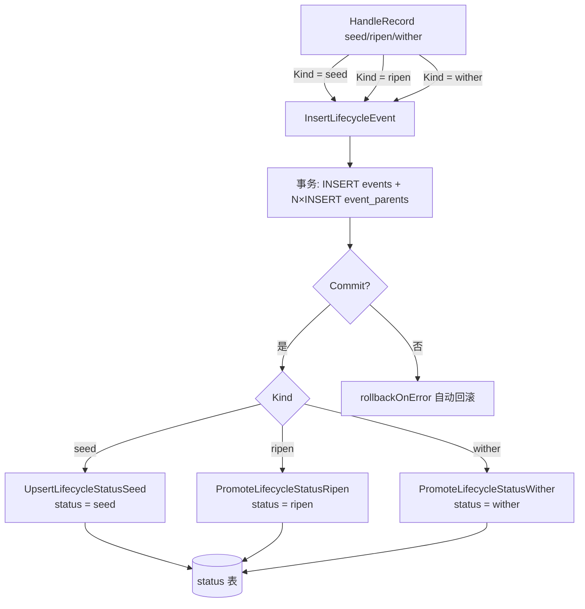
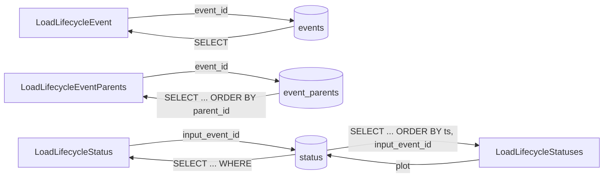

# pkg/persist/sqlite.go

> 📅 最后更新日期: 2026/09/24

## 作用

`pkg/persist/sqlite.go` 集中实现 **生命周期持久化** 的 SQLite 存储层，包括表结构定义、连接管理、事件/父边写入与回查、状态快照的写入与晋升，以及按 plot 维度的批量查询。文件本身只做 SQL 层的封装，不感知 `pkg/funnel` 与 `pkg/runtime` 的并发模型——这一层会在 [`lifecycle.md`](./lifecycle.md) 中作为 `LifecycleRecordHandler` 的依赖被复用。

底层驱动为 [`modernc.org/sqlite`](https://pkg.go.dev/modernc.org/sqlite)（纯 Go 实现，无需 CGo），驱动在文件顶部通过匿名导入 `_ "modernc.org/sqlite"` 注册到 `database/sql`。

## 核心对象

### `LifecycleEventRecord` — 事件表记录

```go
type LifecycleEventRecord struct {
    EventID   int
    EventType string
    Plot      string
    TS        float64
}
```

| 字段 | 说明 |
|------|------|
| `EventID` | 事件唯一 ID（主键），通常由 `runtime.LocalEventClient.Emit` 分配 |
| `EventType` | 事件类型；`pkg/persist` 自身写入 `seed` / `ripen` / `wither`，但表结构不强制枚举 |
| `Plot` | 事件所属 plot 名称；用于按 plot 过滤与按 plot 创建目录 |
| `TS` | 时间戳（秒，浮点）。由 `LifecycleInlet` 写入时通过 `time.Now().UnixMilli() / 1000` 计算 |

### `LifecycleStatusRecord` — 状态快照记录

```go
type LifecycleStatusRecord struct {
    InputEventID   int
    CurrentEventID int
    Plot           string
    Status         string
    SeedJSON       string
    FruitJSON      string
    WitherType     string
    WitherMessage  string
    TS             float64
}
```

| 字段 | 说明 |
|------|------|
| `InputEventID` | 种子（输入）事件 ID（主键），与 `events.event_id` 一一对应 |
| `CurrentEventID` | 当前指向的事件 ID（最近一次 `seed` / `ripen` / `wither` 事件） |
| `Plot` | 所属 plot，便于按 plot 维度查询 |
| `Status` | 状态枚举：`seed` / `ripen` / `wither` |
| `SeedJSON` | 输入种子的 JSON 序列化文本（由 `toLifecycleJSON` 生成） |
| `FruitJSON` | 成功时的果实 JSON；初始为表默认值字符串 `"null"`，由 `PromoteLifecycleStatusRipen` 覆盖 |
| `WitherType` | 失败时的 Go 错误类型字符串（`fmt.Sprintf("%T", err)`），非失败时为空串 |
| `WitherMessage` | 失败时的错误文本（`fmt.Sprintf("%v", err)`），非失败时为空串 |
| `TS` | 状态变更时间戳（秒，浮点） |

## 表结构

数据库在首次打开时由 `EnsureLifecycleSQLiteSchema` 一次性建好，schema 字符串以 `lifecycleSQLiteSchema` 常量形式给出（包内私有）：

```sql
CREATE TABLE IF NOT EXISTS events (
    event_id INTEGER PRIMARY KEY,
    event_type TEXT NOT NULL,
    plot TEXT NOT NULL DEFAULT '',
    ts REAL NOT NULL
);

CREATE TABLE IF NOT EXISTS event_parents (
    event_id INTEGER NOT NULL,
    parent_id INTEGER NOT NULL,
    PRIMARY KEY (event_id, parent_id),
    FOREIGN KEY (event_id) REFERENCES events(event_id) ON DELETE CASCADE,
    FOREIGN KEY (parent_id) REFERENCES events(event_id) ON DELETE CASCADE
);

CREATE TABLE IF NOT EXISTS status (
    input_event_id INTEGER PRIMARY KEY,
    current_event_id INTEGER NOT NULL,
    plot TEXT NOT NULL,
    status TEXT NOT NULL,
    seed_json TEXT NOT NULL,
    fruit_json TEXT NOT NULL DEFAULT 'null',
    wither_type TEXT NOT NULL DEFAULT '',
    wither_message TEXT NOT NULL DEFAULT '',
    ts REAL NOT NULL,
    FOREIGN KEY (input_event_id) REFERENCES events(event_id) ON DELETE CASCADE,
    FOREIGN KEY (current_event_id) REFERENCES events(event_id)
);

CREATE INDEX IF NOT EXISTS idx_events_type_ts ON events(event_type, ts);
CREATE INDEX IF NOT EXISTS idx_status_plot_status_ts ON status(plot, status, ts);
CREATE INDEX IF NOT EXISTS idx_status_current_event ON status(current_event_id);
```

| 表 | 主键 | 关键外键 / 索引 | 用途 |
|----|------|-----------------|------|
| `events` | `event_id` | `(event_type, ts)` 索引 | 存放所有 seed / ripen / wither 事件本身 |
| `event_parents` | `(event_id, parent_id)` | 两条 `FOREIGN KEY` 均级联 | 多对多父边表，描述事件 DAG 的拓扑 |
| `status` | `input_event_id` | `idx_status_plot_status_ts`、`idx_status_current_event` | 每颗种子的最新状态快照：`seed` 时插入为 `seed`，`ripen` 提升为 `ripen`，`wither` 提升为 `wither` |

> `fruit_json` 默认值为字符串 `"null"`，`wither_type` / `wither_message` 默认空串，避免在 `seed` 阶段出现 `NULL` 文本导致的额外分支判断；`seed_json` 与 `plot` 没有默认值，写入时必须显式提供。

## 连接管理

### `OpenLifecycleSQLite`

```go
func OpenLifecycleSQLite(dbPath string) (*sql.DB, error)
```

- 当 `dbPath == ":memory:"` 时直接以字面量作为 DSN，避免被拼上 `file:` 前缀。
- 其余情况构造 DSN 为 `file:<正斜杠路径>`（`filepath.ToSlash`），再调用 `sql.Open("sqlite", dsn)`。
- 成功打开后依次执行：
  1. `configureLifecycleSQLite(db)`：开启 WAL、同步降级为 NORMAL、启用外键。
  2. `EnsureLifecycleSQLiteSchema(db)`：执行 `lifecycleSQLiteSchema` 常量。
- 任一步骤失败都会回滚：先 `_ = db.Close()`，再向调用方返回错误（错误文本已由内部包装为 `set sqlite ...` / `ensure lifecycle sqlite schema: ...`）。

### PRAGMA 配置

`configureLifecycleSQLite` 在每次新连接上执行三条 PRAGMA：

| PRAGMA | 作用 |
|--------|------|
| `journal_mode = WAL` | 启用 Write-Ahead Logging，允许多读单写并发，避免批量事件写入时阻塞查询 |
| `synchronous = NORMAL` | 配合 WAL 降低 fsync 频率；崩溃时可能丢最后一条事务，但生命周期数据可重建 |
| `foreign_keys = ON` | SQLite 默认关闭外键，启用后 `event_parents` / `status` 的级联删除才会生效 |

### `EnsureLifecycleSQLiteSchema`

```go
func EnsureLifecycleSQLiteSchema(db *sql.DB) error
```

幂等地执行 `lifecycleSQLiteSchema` 脚本，可由调用方在需要升级表结构时显式调用；通常由 `OpenLifecycleSQLite` 内部代为触发。

## 事务与状态写入

### 事件 + 父边的批量写入

`InsertLifecycleEvent` 在一次事务中完成事件本体与多条父边的写入，是本文件唯一的显式事务：

```go
func InsertLifecycleEvent(db *sql.DB, eventID int, eventType string, plot string, ts float64, parentIDs []int) error
```

```go
tx, err := db.Begin()
if err != nil { ... }
defer rollbackOnError(tx)

if _, err := tx.Exec(`INSERT INTO events ...`, ...); err != nil { ... }
for _, parentID := range parentIDs {
    if _, err := tx.Exec(`INSERT INTO event_parents ...`); err != nil { ... }
}
if err := tx.Commit(); err != nil { ... }
```

- 参数为**位置参数**（不是结构体）：先写 `events` 行，再按 `parentIDs` 顺序逐条写 `event_parents` 边；`parentIDs` 为 `nil` 时只写事件本体。
- `rollbackOnError` 在显式 `return` 前由 `defer` 触发，等价于「如果未 Commit 则 Rollback」。
- 单条 `events` 行 + 任意数量 `event_parents` 边绑定在同一事务，父边全部回滚 / 全部提交。
- 错误文本分别为 `insert event <id>: ...`、`insert parent edge <parent>-><event>: ...`、`commit insert lifecycle event: ...`。

### 状态快照的写入与晋升

状态写入分为「插入初始快照」与「UPDATE 晋升」两步：

| 函数 | SQL 形态 | 行为 |
|------|----------|------|
| `UpsertLifecycleStatusSeed(db, InputEventID, SeedJSON, Plot, TS)` | 纯 `INSERT` | 插入一行 `status = "seed"`、`current_event_id = input_event_id` 的快照；`fruit_json` / `wither_*` 取表默认值 |
| `PromoteLifecycleStatusRipen(db, inputEventID, currentEventID, fruitJSON, ts)` | `UPDATE` | `SET current_event_id = ?, status = 'ripen', fruit_json = ?, ts = ?`，**不**变更 `seed_json` 与 `plot` |
| `PromoteLifecycleStatusWither(db, inputEventID, currentEventID, witherType, witherMessage, ts)` | `UPDATE` | `SET current_event_id = ?, status = 'wither', wither_type = ?, wither_message = ?, ts = ?`，**不**变更 `seed_json` 与 `plot` |

> ⚠️ **注意**：`UpsertLifecycleStatusSeed` 名为 Upsert，实际实现是**纯 `INSERT`**（没有 `ON CONFLICT ... DO UPDATE`）。同一 `input_event_id` 重复调用会因主键冲突返回错误（错误文本为 `insert lifecycle status seed for input event <id>: ...`）；重试场景下不能依赖它覆盖旧状态。
>
> 两个 `Promote*` 函数都不检查 `RowsAffected`：目标行不存在时 `UPDATE` 影响 0 行且**不报错**，调用方需自行确认 `input_event_id` 已存在。

## 公开符号清单

| 符号 | 类别 | 用途 |
|------|------|------|
| `LifecycleEventRecord` | 类型 | 事件表记录结构 |
| `LifecycleStatusRecord` | 类型 | 状态快照结构 |
| `OpenLifecycleSQLite` | 函数 | 打开并初始化数据库（含 PRAGMA + 建表） |
| `EnsureLifecycleSQLiteSchema` | 函数 | 幂等执行建表脚本 |
| `InsertLifecycleEvent` | 函数 | 事务化写入事件 + 父边 |
| `LoadLifecycleEvent` | 函数 | 按 `event_id` 读取单条事件 |
| `LoadLifecycleEventParents` | 函数 | 读取一个事件的所有父 ID（按 `parent_id` 升序） |
| `UpsertLifecycleStatusSeed` | 函数 | 插入种子初始状态快照（`status = "seed"`） |
| `PromoteLifecycleStatusRipen` | 函数 | 提升状态为 `ripen` 并写入 `fruit_json` |
| `PromoteLifecycleStatusWither` | 函数 | 提升状态为 `wither` 并写入 `wither_type` / `wither_message` |
| `LoadLifecycleStatus` | 函数 | 按 `input_event_id` 读取一条快照 |
| `LoadLifecycleStatuses` | 函数 | 按 `plot` 读取全部快照（按 `ts, input_event_id` 排序） |

> `configureLifecycleSQLite` 与 `rollbackOnError` 为包内私有辅助函数；`lifecycleSQLiteSchema` 为包内私有建表脚本常量。

## 关键流程

### 写入路径



### 查询路径



## 使用示例

直接使用本层的典型写法（不经过 `LifecycleRecordHandler`）：

```go
package main

import (
    "fmt"

    "github.com/Mr-xiaotian/CelestialGrow/pkg/persist"
)

func main() {
    db, err := persist.OpenLifecycleSQLite("./lifecycles/demo.sqlite3")
    if err != nil {
        panic(err)
    }
    defer db.Close()

    // 1. 写入 seed 事件（无父边）
    if err := persist.InsertLifecycleEvent(db, 1, "seed", "stage_a", 1.0, nil); err != nil {
        panic(err)
    }

    // 2. 写入 ripen 事件 + 父边 [1]
    if err := persist.InsertLifecycleEvent(db, 2, "ripen", "stage_a", 2.0, []int{1}); err != nil {
        panic(err)
    }

    // 3. 插入种子初始快照
    if err := persist.UpsertLifecycleStatusSeed(db, 1, `{"v":42}`, "stage_a", 1.0); err != nil {
        panic(err)
    }

    // 4. 晋升为 ripen
    if err := persist.PromoteLifecycleStatusRipen(db, 1, 2, `{"v":84}`, 2.0); err != nil {
        panic(err)
    }

    // 5. 回读事件与父边
    event, err := persist.LoadLifecycleEvent(db, 2)
    if err != nil {
        panic(err)
    }
    parents, err := persist.LoadLifecycleEventParents(db, 2)
    if err != nil {
        panic(err)
    }
    fmt.Printf("event=%d type=%s parents=%v\n", event.EventID, event.EventType, parents)

    // 6. 查询整个 plot 的快照
    statuses, err := persist.LoadLifecycleStatuses(db, "stage_a")
    if err != nil {
        panic(err)
    }
    for _, s := range statuses {
        fmt.Printf("seed=%s status=%s fruit=%s wither=%s/%s\n",
            s.SeedJSON, s.Status, s.FruitJSON, s.WitherType, s.WitherMessage)
    }
}
```

## 注意事项

- **`UpsertLifecycleStatusSeed` 不是真正的 upsert**：详见上文「状态快照的写入与晋升」。重试同一颗种子前需要先自行处理主键冲突，或改用 `Promote*` 系列更新既有行。
- **`Promote*` 对缺失行静默成功**：`UPDATE` 未命中时不返回错误，状态可能「看起来写入成功但库里没有变化」。
- **依赖外键启用**：`status` 与 `event_parents` 的级联删除依赖 `foreign_keys = ON`，`OpenLifecycleSQLite` 已保证开启；若调用方绕开 `OpenLifecycleSQLite` 自行 `sql.Open`，需自己执行 PRAGMA。
- **WAL 副作用**：启用 WAL 后同一目录下会生成 `*.sqlite3-wal` / `*.sqlite3-shm` 两个辅助文件；备份或传输 `.sqlite3` 时需要先 `db.Close()` 让 WAL 内容落盘，或使用 SQLite 的 backup API。
- **时间戳为秒级浮点**：`TS` 来自 `float64(now) / 1000`，单位为秒；批量比较与排序时精度足够，但跨毫秒密集事件需注意浮点比较。
- **状态表无独立外键级联**：`status.current_event_id` 的 `FOREIGN KEY` 没有 `ON DELETE CASCADE`，仅 `status.input_event_id` 级联——防止在 `current_event_id` 被误删时把整条状态记录一起带走。
- **不强制枚举 `EventType`**：`events.event_type` 没有任何 CHECK 约束，新增类型（如自定义 plot 的中间状态）只需在生产者处约定新字符串即可；`pkg/persist` 自身只会写入 `seed` / `ripen` / `wither`。
- **路径与 DSN**：文件路径经 `filepath.ToSlash` 后拼成 `file:...`，在 Windows 上避免反斜杠带来的 DSN 解析问题；`:memory:` 走字面量分支不会被改写。
