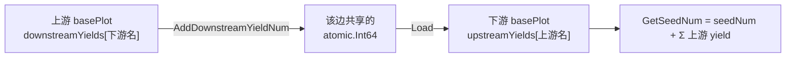

# pkg/plot/counter.go

> 📅 最后更新日期: 2026/09/24

`counter.go` 定义 `Counter`：一个并发安全的「种子 / 果实 / 杂草」三联计数器，并额外维护**按边跟踪**的上下游 yield 计数器。

`basePlot` 通过内嵌 `*Counter` 直接获得 `AddSeedNum` / `GetCompleted` 等方法，用于在多个 tend 协程同时写、观察者同时读的场景下避免加锁。

## 作用

- 跟踪当前 plot 的「种子总数」「成功产出（果实）」「失败产出（杂草）」；
- 按**每条边**分别记录「本 plot 发给某下游的 yield 数」（`downstreamYields`）与「某上游发给本 plot 的 yield 数」（`upstreamYields`）；
- 在 `GetSeedNum` 中把本地播入的种子与各上游转入的 yield 合并成「真实总输入数」，供观察者与 `IsFinish` 使用。

## 核心对象

### `Counter` 结构

```go
type Counter struct {
	seedNum  atomic.Int64
	fruitNum atomic.Int64
	weedNum  atomic.Int64

	upstreamYields   map[string]*atomic.Int64
	downstreamYields map[string]*atomic.Int64
}
```

| 字段 | 类型 | 含义 |
|------|------|------|
| `seedNum` | `atomic.Int64` | **本地**播入的种子数（只有 `AddSeedNum` 自增） |
| `fruitNum` | `atomic.Int64` | 成功产出的果实数 |
| `weedNum` | `atomic.Int64` | 失败产出的杂草数 |
| `upstreamYields` | `map[string]*atomic.Int64` | 上游 plot 名 → **该边**共享的 yield 计数器指针；`GetSeedNum` 会把这些值累加进来 |
| `downstreamYields` | `map[string]*atomic.Int64` | 下游 plot 名 → **该边**共享的 yield 计数器指针；由本 plot 的 `ripenSeed` 通过 `AddDownstreamYieldNum` 自增 |

> `upstreamYields` 与 `downstreamYields` 中的指针是**同一批对象的两端**：`ConnectTo` 为每条边新建一个 `*atomic.Int64`，上游放进自己的 `downstreamYields`，下游放进自己的 `upstreamYields`。因此上游自增、下游读到的就是同一条边的实时产量，不同边之间互不干扰。

## 公开方法

### 构造

#### `NewCounter() *Counter`

创建一个计数器：三个原子量都是零，两个 map 都初始化为空（**非 nil**），因此新建后立即调用 `GetSeedNum` 不会 panic。

### 计数器登记

| 方法 | 签名 | 行为 |
|------|------|------|
| `SetUpstreamYieldCounter` | `func (c *Counter) SetUpstreamYieldCounter(name string, yieldCounter *atomic.Int64)` | 把 `name`（上游 plot 名）与该边计数器写入 `upstreamYields`，供 `GetSeedNum` 聚合 |
| `SetDownstreamYieldCounter` | `func (c *Counter) SetDownstreamYieldCounter(name string, yieldCounter *atomic.Int64)` | 把 `name`（下游 plot 名）与该边计数器写入 `downstreamYields`，供 `AddDownstreamYieldNum` 自增 |

> 两者通常由 `basePlot.ConnectTo` 成对调用，业务代码一般不需要直接使用。重复登记同名边会**覆盖**旧指针（旧计数器被丢弃）。

### Adders（自增）

| 方法 | 签名 | 行为 |
|------|------|------|
| `AddSeedNum` | `func (c *Counter) AddSeedNum(addNum int)` | 原子地把 `seedNum` 增加 `addNum` |
| `AddFruitNum` | `func (c *Counter) AddFruitNum(addNum int)` | 原子地把 `fruitNum` 增加 `addNum` |
| `AddWeedNum` | `func (c *Counter) AddWeedNum(addNum int)` | 原子地把 `weedNum` 增加 `addNum` |
| `AddDownstreamYieldNum` | `func (c *Counter) AddDownstreamYieldNum(name string, addNum int)` | 原子地把 `downstreamYields[name]` 增加 `addNum` |

### Getters（只读）

| 方法 | 签名 | 返回值 |
|------|------|--------|
| `GetSeedNum` | `func (c *Counter) GetSeedNum() int` | `seedNum` + `Σ upstreamYields[*].Load()`，即「本 plot 将要/已经处理的总种子数」 |
| `GetFruitNum` | `func (c *Counter) GetFruitNum() int` | 成功果实数 |
| `GetWeedNum` | `func (c *Counter) GetWeedNum() int` | 失败杂草数 |
| `GetCompleted` | `func (c *Counter) GetCompleted() int` | `GetFruitNum() + GetWeedNum()` |

### 谓词

| 方法 | 签名 | 含义 |
|------|------|------|
| `IsFinish` | `func (c *Counter) IsFinish() bool` | `GetCompleted() == GetSeedNum()`；当前仓库内没有调用点，作为预留判断提供 |

## 与节点的协作

`Counter` 被 `basePlot` 内嵌，各节点通过它完成任务统计与上下游同步：

| 调用点 | 动作 |
|--------|------|
| `basePlot.Seed` | `AddSeedNum(1)`（本地播入 1 颗） |
| `basePlot.ConnectTo` | 新建该边的 `*atomic.Int64`，`p.SetDownstreamYieldCounter(nextName, c)` + `next.SetUpstreamYieldCounter(p.GetName(), c)` |
| `basePlot.witherSeed` | `AddWeedNum(1)` + 触发 `reportProgress` |
| `Plot.ripenSeed` | `AddFruitNum(1)` + 对**每个**下游 `AddDownstreamYieldNum(nextPlot, 1)` |
| `SplitPlot.ripenSeed` | `AddFruitNum(1)` + 对每个下游 `AddDownstreamYieldNum(nextPlot, len(fruits))` |
| `RoutePlot.ripenSeed` | `AddFruitNum(1)` + 对**每个被路由到的**下游 `AddDownstreamYieldNum(nextPlot, 1)` |
| `basePlot.reportProgress` / `notifyStart` / `notifyFinish` | 读取 `GetCompleted()` / `GetSeedNum()` 并回调 `observer.Observer` |

数据流示意：



## 注意事项

- `AddDownstreamYieldNum` 不做存在性检查：`name` 未登记时会取到 `nil` 的 `*atomic.Int64` 并直接 `Add`，从而**panic**。因此自增方必须与 `ConnectTo` 的注册保持成对出现（`Plot` / `SplitPlot` / `RoutePlot` 都只在已连接目标上自增）。
- `seedNum`、`fruitNum`、`weedNum` 与各 yield 计数器**不是同一时刻的原子快照**，因此 `IsFinish` 与观察者进度在并发下可能出现瞬时偏差，最终会趋于稳定。
- `upstreamYields` 只被 `GetSeedNum` 读取，`Counter` 自身不写入来自上游的数据——上游的 yield 计数由上游自己 `Add`，本 Counter 只是持有同一个指针。
- `AddSeedNum` / `AddFruitNum` / `AddWeedNum` / `AddDownstreamYieldNum` 接受 `int` 并在内部转为 `int64`；传负数会让计数倒退，业务层应避免。
