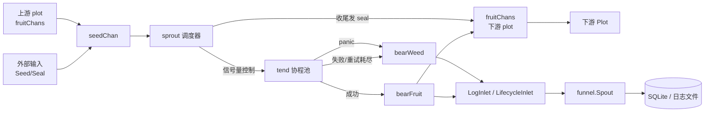

# pkg/plot/plot.go

> 最后更新日期: 2026/09/01

`plot` 包是 CelestialGrow 框架的核心执行单元。它把「**接收 seed → 并发执行 cultivator → 产出 fruit → 转发下游**」这一典型任务流封装为可连接、可观察、可重试的泛型节点 `Plot[S, F]`，并通过 `PlotNode` 接口抹除泛型信息，使 `pkg/farm` 能用同一类型持有不同 seed/fruit 类型的 plot。

## 作用

- 提供泛型并发任务节点 `Plot[S, F]`，其中 `S` 为输入种子类型，`F` 为输出果实类型。
- 暴露 `PlotNode` 接口，供 `pkg/farm` 进行注册、连边、调度。
- 内置可配置的并发执行、重试、计数器、事件 ID、生命周期记录与数据传播。
- 既支持 standalone 模式（单 plot 跑批），也支持 Farm 模式（多 plot 图调度）。

## 核心对象

### `PlotNode` 接口

`PlotNode` 是 Farm 用来管理 plot 的统一抽象。它把泛型 plot 抹成 `any` 通道，使 Farm 能用同一类型持有 seed/fruit 类型各异的 plot。

```go
type PlotNode interface {
    GetName() string
    GetState() int32
    GetSeedChanAny() any

    ConnectTo(next PlotNode) error
    AddUpstream(name string, yieldCounter *atomic.Int64)
    GetYieldCounter() *atomic.Int64
    BindInlet(logChan chan<- persist.LogRecord, lifecycleChan chan<- persist.LifecycleRecord)
    SetEventClient(eventClient runtime.EventClient)

    StartAsync()
    WaitAsync()
    SeedAny(seed any) error
    Seal()
}
```

| 方法 | 用途 |
|------|------|
| `GetName` | 返回 plot 名称（Farm 中需唯一） |
| `GetState` | 返回状态：`0=idle`，`1=running`，`2=done` |
| `GetSeedChanAny` | 以 `any` 返回 seed 通道，供 `ConnectTo` 做类型断言 |
| `ConnectTo` | 将当前 plot 的 fruit 接到下游 plot 的 seed（校验类型） |
| `AddUpstream` | 登记上游 plot 名称及其产出计数器（用于 sprout 等待所有上游 seal） |
| `GetYieldCounter` | 返回当前 plot 提供给下游的产出计数器 |
| `BindInlet` | 绑定日志与生命周期记录的写入通道 |
| `SetEventClient` | 注入事件 ID 分配器 |
| `StartAsync` / `WaitAsync` | 异步启动并等待后台协程退出 |
| `SeedAny` | 以 `any` 播入单颗种子（Farm 统一注入入口） |
| `Seal` | 显式发送外部终止信号 |

### `Plot[S, F]` 结构

```go
type Plot[S any, F any] struct {
    name       string
    cultivator func(S) (F, error)
    observers  []observer.Observer
    plotOptions

    seedChan   chan runtime.Payload[S]
    fruitChans map[string]chan runtime.Payload[F]

    eventClient runtime.EventClient

    logSpout       *funnel.Spout[persist.LogRecord]
    lifecycleSpout *funnel.Spout[persist.LifecycleRecord]
    logInlet       *persist.LogInlet
    lifecycleInlet *persist.LifecycleInlet

    ctx    context.Context
    cancel context.CancelFunc
    wg     sync.WaitGroup
    state  atomic.Int32
    *Counter
}
```

| 字段 | 含义 |
|------|------|
| `cultivator` | 培育函数，对单颗 seed 进行处理，产出 fruit 或 error |
| `seedChan` | seed 输入通道（容量 = `WithChanSize`），与控制信号共用 |
| `fruitChans` | 下游 plot 集合：`plot 名 → 该下游的 seed 通道` |
| `eventClient` | 进程内事件 ID 分配器（`runtime.NewLocalEventClient`） |
| `logSpout` / `lifecycleSpout` | standalone 模式下的本地日志/生命周期消费者 |
| `logInlet` / `lifecycleInlet` | 异步记录日志与生命周期事件的发送端 |
| `state` | plot 状态原子变量 |
| `*Counter` | 种子/果实/杂草计数（详见 `counter.md`） |

> 泛型语义：**`S` 是 seed 输入类型，`F` 是 fruit 输出类型**。`ConnectTo` 时上游的 `F` 与下游的 `S` 必须一致，否则会在运行时通过类型断言失败并返回错误。

## 公开方法

### 构造

#### `NewPlot[S, F](name, cultivator, opts...) *Plot[S, F]`

创建一个 Plot 实例。`opts` 应用顺序遵循 Go 函数选项模式（见 `option.md`）。构造时即分配好：

- 容量为 `WithChanSize` 的 `seedChan`；
- 空 `fruitChans` 映射（由 `ConnectTo` 填充）；
- 一个本地 `EventClient`；
- 由 `WithCancel(context.Background())` 派生的 `ctx / cancel`；
- 一个空 `Counter`。

### 观察者

#### `AddObserver(observer.Observer)`

追加一个进度观察者（如终端进度条）。在 `notifyStart` / `reportProgress` / `notifyFinish` 时被回调 `OnStart` / `OnProgress` / `OnFinish`。

### 初始化（standalone / Farm 共用）

| 方法 | 用途 | 何时调用 |
|------|------|----------|
| `BindInlet(logChan, lifecycleChan)` | 注入日志/生命周期记录通道 | `StartAsync` 之前；standalone 模式由 `Run` 调用，Farm 模式由 `Farm.Run` 统一调用 |
| `StartSpouts` / `StopSpouts` | 启动/停止本地 spout 并刷盘 | 仅 standalone 模式 |
| `SetEventClient` | 替换事件 ID 分配器 | 可选（默认使用本地 client） |

### 图连接

| 方法 | 用途 |
|------|------|
| `ConnectTo(next PlotNode) error` | 将当前 plot 的 fruit 接入下游 plot 的 seed。类型不匹配时返回 `plot %q fruit type is incompatible with plot %q seed type` 错误 |
| `AddUpstream(name, yieldCounter)` | 登记上游 plot 名称与计数器；空名直接忽略 |
| `GetYieldCounter() *atomic.Int64` | 返回当前 plot 给下游的 fruit 计数器 |

### 状态查询

| 方法 | 用途 |
|------|------|
| `GetName() string` | 返回 plot 名 |
| `GetState() int32` | 返回状态码（0/1/2） |
| `GetSeedChanAny() any` | 暴露 `seedChan` 供 `ConnectTo` 做类型断言 |

### 输入与异步执行

| 方法 | 用途 |
|------|------|
| `SeedAny(seed any) error` | Farm 注入初始任务用；类型不匹配返回 `seed type mismatch: got %T` 错误；类型正确则转发到 `Seed` |
| `Seed(seed S)` | 播入单颗种子，事件来源记为空（视为「外部输入」）。同步向 `seedChan` 投递 `runtime.Payload[S]{Value: seed, EventID: seedID}`，并写 `SeedIn` 生命周期 |
| `Seal()` | 发送外部终止信号（来源记为 `sourceInput`），触发 sprout 强终止语义（不再等待其他上游 seal） |
| `StartAsync()` | 启动后台 sprout 调度协程；会先调用 `logInlet.StartPlot`、再 `notifyStart`、再进入 `sprout` 主循环；退出后写 `EndPlot` 日志 |
| `WaitAsync()` | 阻塞等待后台协程退出 |

### Standalone 执行

#### `Run(seeds []S)`

在 standalone 模式下一站式启动 plot：

1. 创建本地 `logSpout` / `lifecycleSpout`（handler 分别用 `LogRecordHandler` / `LifecycleRecordHandler`，批大小 100，刷盘间隔 1s）；
2. 绑定到本地 inlet；
3. 启动两个 spout；
4. `StartAsync`；
5. 按顺序 `Seed` 每颗外部 seed；
6. 调用 `Seal()` 通知不再有外部输入；
7. 阻塞 `WaitAsync`；
8. `defer StopSpouts()` 停止并刷盘 spout。

> 整个 `Run` 是阻塞调用；运行期间已通过 `AddObserver` 注册的观察者会持续收到进度回调。

### 结果导出

#### `Harvest() ([]persist.LifecycleStatusRecord, error)`

读取当前 plot 已持久化的任务状态快照。实现细节：

- 要求 `lifecycleSpout` 已绑定（否则返回 `lifecycle spout is nil`）；
- 通过 `lifecycleSpout.Handler()` 拿到 handler，并断言是否实现 `LoadStatuses(plotName string)` 接口；
- 若 handler 不支持查询，返回 `lifecycle handler does not support status queries` 错误。

> 该方法一般与 `Run` 配合使用：standalone 跑完一批后立即读取每颗 seed 的最终状态（`success` / `failed`、结果 JSON、错误信息等）。

## 关键流程

### 数据流（Mermaid）



### 内部管道

`Plot` 内部的协程拓扑：

- `StartAsync` 启动 1 个 `sprout` 调度协程（通过 `p.wg.Go` 注册）；
- `sprout` 通过「容量为 `numTends` 的 `sem` 通道」控制并发，按需 `go p.tend(seed, sem, done)` 派生 tend 工作协程；
- tend 完成后通过 `done <- struct{}{}` 通知 `sprout` 减少 inFlight 计数；
- 协程退出由 `sync.WaitGroup` 收敛，`WaitAsync` 等待全部退出。

### seed → fruit → 下游

`tend` 调用 `cultivator(seed)`，根据结果分两条路：

- **成功路径** `bearFruit`：
  1. `AddFruitNum(1)`，调用 `reportProgress` 触发观察者；
  2. 通过 `eventClient.Emit("fruit", [seedID])` 分配 fruitID；
  3. 写一条 `SeedRipen` 日志和 `SeedSuccess` 生命周期；
  4. 对每个下游 plot：
     - 用 `eventClient.Emit("seed", [fruitID])` 分配下游 seedID；
     - 写 `SeedIn` 生命周期（parent = fruitID）；
     - 向该下游的 seed 通道发 `runtime.Payload[F]{Value: fruit, EventID: downstreamSeedID}`。
- **失败路径** `bearWeed`：
  1. `AddWeedNum(1)`、`reportProgress`；
  2. `eventClient.Emit("weed", [seedID])` 分配 weedID；
  3. 写 `SeedWither` 日志和 `SeedFailed` 生命周期；
  4. **不**向任何下游转发。

> fruit 不会回到当前 plot 自身的 seedChan；它会通过 `fruitChans[nextPlotName]` 进入下游 plot 的 `seedChan`，由下游的 `sprout` 消费。

### 输入关闭与 seal 传播

`sprout` 通过两个独立信号判断何时收尾：

1. `p.ctx.Done()` → `ctxCancel = true`：内部取消信号，强制收尾。
2. `seedChan` 中读到 `SignalSeal` 的 Payload → 调用 `markSealed`：
   - 若 `Source == sourceInput`（即外部 `Seal()` 调用）→ 立即关闭输入（**强终止**，不再等待其他上游 seal）。
   - 若 `Source` 是已登记的上游名 → 记入 `sealedFrom`；只有当 `len(sealedFrom) == len(p.upstreamYields)` 才视为关闭。
   - 未知来源（`""` 或未登记）→ 忽略。

当 `shouldFinish`（`ctxCancel || (inputClosed && inFlight == 0)`）为真时：

- 为每个上游 seal 收集 patent ID；
- `eventClient.Emit("seal", patents)` 分配 sealID；
- 向**所有** `fruitChans` 发送 `runtime.Payload[F]{Signal: SignalSeal, Source: p.name, EventID: sealID}`；
- `sprout` 返回，`StartAsync` 的 wg 协程结束 `notifyFinish` 并写 `EndPlot` 日志。

## 失败与重试

`tend` 内部使用如下循环（`attempt` 从 1 开始）：

```go
for attempt := 1; attempt <= p.maxRetries+1; attempt++ {
    fruit, err = p.cultivator(seed)
    if err == nil {
        break
    }
    if !p.retryIf(err) {
        break
    }
    if attempt <= p.maxRetries {
        p.logInlet.SeedReplant(p.name, seedRepr, attempt, err)
    }
    time.Sleep(p.retryDelay(attempt))
}
```

| 触发条件 | 行为 |
|----------|------|
| `cultivator` 返回 `nil` | 立即 break，进入 `bearFruit` |
| `cultivator` 返回 err 且 `retryIf(err) == false` | 立即 break，进入 `bearWeed`（不再重试） |
| `attempt <= maxRetries` | 写 `SeedReplant` 日志（带 attempt 序号），然后 `Sleep(retryDelay(attempt))` |
| `attempt == maxRetries+1`（最后一次仍失败） | 不写 `SeedReplant`（最后一次没有「重试」语义），进入 `bearWeed` |
| `cultivator` 发生 panic | `defer recover` 捕获，转为 `cultivator panic: %v` 错误并走 `bearWeed`（仍受重试循环保护，但 panic 不会自循环：单次执行 → 失败 → 进入 weed 路径） |

与三个 Option 的协作关系：

- `WithMaxRetries(n)`：最大重试次数（不含首次），`n=0` 等价于「不重试」；默认 `1`。
- `WithRetryDelay(fn)`：`fn(attempt)` 返回该次重试前的等待时间；默认 `0`。
- `WithRetryIf(fn)`：err 过滤器；默认全 true（全部重试）。

## 使用示例

### Standalone 模式

```go
package main

import (
    "fmt"

    "github.com/Mr-xiaotian/CelestialGrow/pkg/plot"
)

func main() {
    p := plot.NewPlot("double",
        func(seed int) (int, error) { return seed * 2, nil },
        plot.WithTends(4),
    )

    p.Run([]int{1, 2, 3, 4, 5})

    records, err := p.Harvest()
    if err != nil {
        panic(err)
    }
    for _, r := range records {
        fmt.Println(r.TaskJSON, r.Status, r.ResultJSON)
    }
}
```

### 带重试 + 进度观察者

```go
p := plot.NewPlot("flaky",
    func(seed int) (int, error) {
        // 业务逻辑，可能瞬时失败
        return seed, doWork(seed)
    },
    plot.WithTends(2),
    plot.WithMaxRetries(3),
    plot.WithRetryDelay(func(attempt int) time.Duration {
        return time.Duration(attempt) * 100 * time.Millisecond
    }),
    plot.WithRetryIf(func(err error) bool {
        return !errors.Is(err, ErrPermanent)
    }),
    plot.WithLogLevel("DEBUG"),
)
p.AddObserver(myObserver{}) // 实现 observer.Observer
p.Run(seeds)
```

### Farm 模式

Farm 模式不直接调用 `Run` / `Seed` / `Seal`，而是通过 `pkg/farm.Farm`：

```go
farm := farm.NewFarm("demo", "INFO")
_ = farm.AddPlot(plotA, plotB)
_ = farm.Connect([]farm.PlotNode{plotA}, []farm.PlotNode{plotB})
_ = farm.Run(map[string][]any{"plotA": {1, 2, 3}}) // 通过 SeedAny 注入
```

在 Farm 模式下：

- `BindInlet` 由 `Farm.Run` 统一调用；
- `StartSpouts` / `StopSpouts` 不被 plot 自身调用；
- 每个 plot 的 `StartAsync` / `WaitAsync` 由 Farm 统一编排。

## 重要细节

- **状态机**：`state` 通过 `atomic.Int32` 维护：构造时为 0（idle），`StartAsync` 入口设为 1（running），`notifyFinish` 设为 2（done）。`GetState` 返回 `int32`。
- **计数器**：`seedNum` / `fruitNum` / `weedNum` 与 `upstreamYields` 一起在 `Counter` 中维护；`GetSeedNum` 会把上游 fruit 计数也加进来。详见 `counter.md`。
- **外部 `Seal()` 强终止语义**：来源是 `sourceInput` 的 seal 会立即关闭输入，不再等待其他上游 seal；该语义同时在 `Plot.Seal` 文档与 `markSealed` 实现中明确。
- **panic 恢复**：tend 协程通过 `defer recover` 把 `cultivator` panic 视作普通错误，路径为 `bearWeed`。
- **日志内容截断**：`trunc` 把 seed / fruit 的字符串表示截断（seed 最长 50 字符、fruit 最长 25 字符），见 `helper.md`。
- **事件 ID**：`runtime.LocalEventClient` 在进程内单调递增；`fruitID` 由 `seedID` 派生，`downstreamSeedID` 由 `fruitID` 派生，从而在 SQLite 中能串起整条因果链。

## 测试重点

`pkg/plot` 的测试集中在 `plot_harvest_test.go` 和 `plot_retry_test.go`，覆盖以下关键点：

- **成功/失败快照（`plot_harvest_test.go`）**
  - `TestPlot_AllError`：cultivator 全部失败，验证 `Harvest` 中所有任务 `status="failed"`、错误信息正确、`GetCompleted == len(seeds)`、状态转为 2（done）。
  - `TestPlot_PartialError`：奇数成功 / 偶数失败，验证成功项的 `ResultJSON` 是 `seed*10`、失败项的 `ErrorMessage == "even number error"`。
  - `TestPlot_AllSuccess`：所有 seed 都返回 `seed*2`，验证最终状态都为 `success`、状态码 2。
- **重试语义（`plot_retry_test.go`）**
  - `TestPlot_RetrySuccess`：前 2 次失败、第 3 次成功，验证总调用次数 = 3、`status="success"`、`ResultJSON="10"`。
  - `TestPlot_RetryExhausted`：`WithMaxRetries(2)`，cultivator 永远失败，验证总调用次数 = 3（1 原始 + 2 重试），最终 `failed`。
  - `TestPlot_RetryIf`：错误被 `WithRetryIf` 过滤为不可重试时，总调用次数 = 1（不重试）。
  - `TestPlot_RetryDelay`：自定义 `retryDelay` 返回 100ms，验证首次失败后再次成功前确实等待了 ≥100ms。

> 详细的逐测试说明见 `plot_harvest_test.md` 与 `plot_retry_test.md`。

## 注意事项

- `NewPlot` 默认使用 `runtime.NumCPU()` 作为并发数和 channel 缓冲；I/O 密集型业务可结合 `WithTends` / `WithChanSize` 调大。
- `Run` 会**阻塞**直到所有种子处理完成；并发安全的现场观察请通过 `AddObserver` 接入。
- `Harvest` 依赖 `lifecycleSpout` 的 handler 实现 `LoadStatuses`；非 `LifecycleRecordHandler` 实现（如自定义 handler）会返回明确错误。
- 上游 `F` 与下游 `S` 类型不匹配时，`ConnectTo` 会立即报错而不会 panic；建议在 `Farm.AddPlot` / `Farm.Connect` 后做错误检查。
- `runtime.Payload[V]` 同时承载数据与控制信号（`Signal`、`Source`），所以 `seedChan` 既能传 seed，也能传 `SignalSeal`；自定义扩展时请保留这一约定。
