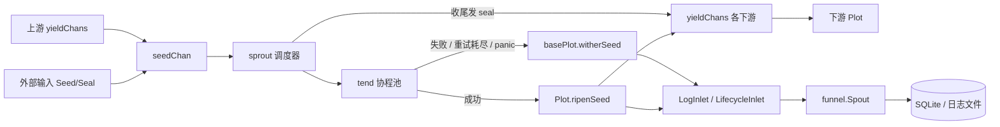

# pkg/plot/plot.go

> 📅 最后更新日期: 2026/09/24

`plot.go` 定义 `pkg/plot` 中最常用的节点类型 `Plot[S, F]`：把「接收 seed → 并发执行 cultivator → 产出 fruit → 转发下游」封装为可连接、可观察、可重试的泛型节点。

`Plot` 本身非常薄——它只负责最朴素的成功语义（**一颗 seed 培育出一颗 fruit，并把该 fruit 原样转发给每一个已连接下游**），其余通用能力（状态机、并发调度、重试、seal 传播、日志/生命周期装配、standalone 跑批）全部由内嵌的 `basePlot` 提供，详见 `plot_base.md`。

## 作用

- 暴露泛型并发节点 `Plot[S, F]`（`S` 为种子类型，`F` 为果实类型）。
- 通过内嵌 `*basePlot[S, F, F]` 复用共享骨架，从而使 `Plot` 满足 `PlotNode` 接口，可被 `pkg/farm` 注册、连边、调度。
- 注入成功钩子 `ripenSeed`：更新计数、写日志与生命周期记录、向所有下游各转发一颗 yield。

## 核心对象

### `Plot[S, F]` 结构

```go
type Plot[S any, F any] struct {
	*basePlot[S, F, F]
}
```

`Plot` 没有自己的字段，全部状态与能力都来自 `*basePlot[S, F, F]`。

| 泛型参数 | 语义 |
|---------|------|
| `S` | 种子（seed）输入类型，即 `cultivator` 的入参类型 |
| `F` | 果实（fruit）输出类型，即 `cultivator` 的返回类型 |

`basePlot` 的第三个泛型参数（下游 yield 类型 `Y`）在本类型中被实例化为 `F`，即**本节点的果实类型与向下游输出的类型一致**。三种节点对比如下：

| 节点 | 底层 `basePlot` | 结果类型（fruit） | 下游 yield 类型 `Y` |
|------|----------------|------------------|--------------------|
| `Plot[S, F]` | `basePlot[S, F, F]` | `F` | `F` |
| `SplitPlot[S, F]` | `basePlot[S, []F, F]` | `[]F` | `F` |
| `RoutePlot[S, Y]` | `basePlot[S, map[string]Y, Y]` | `map[string]Y` | `Y` |

> `ConnectTo` 会用类型断言校验「上游的 `Y`」与「下游的 `S`」是否一致。因此 `Plot[S, F]` 只能连到 `S == F` 的下游节点，否则连接时立即返回类型不兼容错误。

## 公开函数

### `NewPlot[S, F](name string, cultivator func(S) (F, error), opts ...Option) *Plot[S, F]`

创建一个 `Plot` 实例。

| 参数 | 含义 |
|------|------|
| `name` | plot 名称，在 `Farm` 中需唯一 |
| `cultivator` | 单颗种子的培育函数，返回果实或错误 |
| `opts` | 可选配置（见 `option.md`），在 `defaultOptions()` 之后依次应用 |

实现要点：

1. 先声明 `var p *Plot[S, F]`，再用 `newBasePlot[S, F, F]` 构造共享骨架，最后把 `base` 赋值给 `p`；
2. 传给 `newBasePlot` 的 `ripenSeed` 钩子是一个闭包，内部调用 `p.ripenSeed(...)`。它捕获了尚未赋值的 `p`，但该闭包只在 `StartAsync` 之后的 `sprout` / `tend` 路径上被调用，彼时 `p` 一定已完成赋值；
3. channel 分配、默认 `EventClient`、`context` 与 `Counter` 初始化都在 `newBasePlot` 内完成（见 `plot_base.md`）。

### `ripenSeed(seedPayload runtime.Payload[S], fruit F, startTime time.Time)`（未导出）

`Plot` 的成功路径实现，作为钩子写入 `basePlot.ripenSeed` 字段，由 `basePlot.tend` 在 `cultivator` 返回 `nil` 错误时调用。步骤：

1. `AddFruitNum(1)` 并调用 `reportProgress()`，触发所有 `Observer.OnProgress`；
2. 取 `seedPayload.EventID` 作为 `seedID`，通过 `eventClient.Emit("fruit", []int{seedID})` 分配 `fruitID`；
3. 写日志 `logInlet.SeedRipen(...)` 与生命周期 `lifecycleInlet.SeedRipen(...)`（父事件为 `seedID`，果实为 `fruit`；日志中 seed 截断到 50 rune、fruit 截断到 25 rune）；
4. 遍历 `p.yieldChans`（`下游 plot 名 → 该下游的 seed 通道`），对**每一个**已连接下游：
   - `AddDownstreamYieldNum(nextPlot, 1)`：本节点向该下游贡献 1 颗 yield；
   - `eventClient.Emit("seed", []int{fruitID})` 分配下游 seed 事件 ID（父事件为 `fruitID`）；
   - 写 `logInlet.SeedInput` 与 `lifecycleInlet.SeedInput`（父事件为 `fruitID`）；
   - 向该下游通道发送 `runtime.Payload[F]{Value: fruit, EventID: downstreamSeedID}`。

> 语义要点：`Plot` 的成功路径是「**一颗 fruit 转发为一颗下游 yield**」，并且**向所有已连接下游都转发一次**（广播）。需要「按目标定向转发」请用 `RoutePlot`（见 `plot_route.md`），需要「一颗 seed 拆成多颗下游 yield」请用 `SplitPlot`（见 `plot_split.md`）。

## 关键流程

### 数据流



### 从 seed 到下游 yield

`basePlot.tend` 调用 `cultivator(seed)` 后按结果分流：

- **成功**（`err == nil`）：调用注入的 `ripenSeed`，即本文件的实现；
- **失败**（重试耗尽、`retryIf` 拒绝、或 `panic` 被 `recover` 捕获）：走 `basePlot.witherSeed`，**不向任何下游转发**。

重试循环、seal 传播、并发模型等通用逻辑见 `plot_base.md`。

## 使用示例

### Standalone 模式

```go
package main

import (
	"fmt"

	"github.com/Mr-xiaotian/CelestialGrow/pkg/plot"
)

func main() {
	p := plot.NewPlot("double",
		func(seed int) (int, error) { return seed * 2, nil },
		plot.WithTenders(4),
	)

	p.Run([]int{1, 2, 3, 4, 5})

	records, err := p.Harvest()
	if err != nil {
		panic(err)
	}
	for _, r := range records {
		fmt.Println(r.SeedJSON, r.Status, r.FruitJSON)
	}
}
```

### 带重试与日志级别

```go
package main

import (
	"errors"
	"time"

	"github.com/Mr-xiaotian/CelestialGrow/pkg/plot"
)

var errPermanent = errors.New("permanent")

func main() {
	p := plot.NewPlot("flaky",
		func(seed int) (int, error) {
			if seed == 0 {
				return 0, errPermanent
			}
			return seed * 2, nil
		},
		plot.WithTenders(2),
		plot.WithMaxRetries(3),
		plot.WithRetryDelay(func(attempt int) time.Duration {
			return time.Duration(attempt) * 100 * time.Millisecond
		}),
		plot.WithRetryIf(func(err error) bool {
			return !errors.Is(err, errPermanent)
		}),
		plot.WithLogLevel("DEBUG"),
	)

	p.Run([]int{0, 1, 2})
}
```

> 进度观察者通过 `p.AddObserver(myObserver{})` 注册（`myObserver` 需实现 `observer.Observer` 的 `OnStart` / `OnProgress` / `OnFinish`），详见 `plot_base.md` 的「观察者钩子」。

### Farm 模式

Farm 模式不直接调用 `Run` / `Seed` / `Seal`，而是把 `Plot` 作为 `plot.PlotNode` 交给 `pkg/farm`：

```go
package main

import (
	"fmt"

	"github.com/Mr-xiaotian/CelestialGrow/pkg/farm"
	"github.com/Mr-xiaotian/CelestialGrow/pkg/plot"
)

func main() {
	double := plot.NewPlot("double", func(seed int) (int, error) {
		return seed * 2, nil
	}, plot.WithTenders(2))

	addOne := plot.NewPlot("addOne", func(seed int) (int, error) {
		return seed + 1, nil
	}, plot.WithTenders(2))

	f := farm.NewFarm("demo", "INFO")
	if err := f.AddPlot(double, addOne); err != nil {
		panic(err)
	}
	if err := f.Connect([]plot.PlotNode{double}, []plot.PlotNode{addOne}); err != nil {
		panic(err)
	}
	if err := f.Run(map[string][]any{"double": {1, 2, 3}}); err != nil {
		panic(err)
	}

	fmt.Println("done")
}
```

此时 `BindInlet` 由 `Farm.Run` 统一调用，`StartSpouts` / `StopSpouts` 不会被执行（Farm 自己持有全局 spout）。

## 测试重点

`plot.go` 的行为由 `plot_harvest_test.go`（结果快照）与 `plot_retry_test.go`（重试语义）覆盖，逐用例说明见 `plot_harvest_test.md` 与 `plot_retry_test.md`。

## 注意事项

- `NewPlot` 默认使用 `runtime.NumCPU()` 作为并发数与 channel 缓冲；I/O 密集型业务可结合 `WithTenders` / `WithChanSize` 调整。
- `Run` 是**阻塞**调用，直到所有种子处理完成才返回。
- 上游 `F` 与下游 `S` 类型不匹配时，`ConnectTo` 会立即返回错误而不会 panic；建议在 `Farm.AddPlot` / `Farm.Connect` 后检查错误。
- `Plot` 不提供路由与拆分能力，其转发是「全下游广播」，不要当作定向投递使用。
