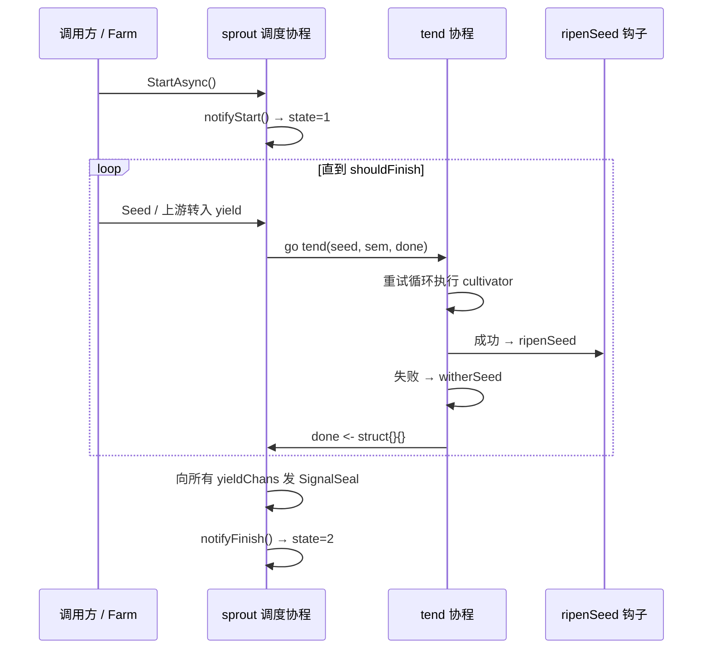

# pkg/plot/plot_base.go

> 📅 最后更新日期: 2026/09/24

`plot_base.go` 是 `pkg/plot` 的**共享运行骨架**。它定义两样东西：

1. `PlotNode` 接口——抹除泛型后供 `pkg/farm` 统一持有不同 seed/fruit 类型的节点；
2. `basePlot[S, F, Y]` 泛型结构——所有具体节点（`Plot`、`SplitPlot`、`RoutePlot`）共同内嵌的基类。

`basePlot` 承担几乎全部通用职责：状态机、并发调度（`sprout` + `tend`）、重试、seal 传播、上下游连接、日志与生命周期装配、standalone 跑批与结果导出。节点之间的唯一差异通过构造时注入的 `ripenSeed` 钩子表达，因此三种节点各自只需实现一个 `ripenSeed` 方法。

## 作用

- 定义 `PlotNode` 接口，作为 `Farm` 与 plot 之间的契约。
- 提供 `basePlot` 共享骨架，避免 `Plot` / `SplitPlot` / `RoutePlot` 重复实现调度、重试与持久化装配。
- 通过三个泛型参数把「种子类型」「结果类型」「下游 yield 类型」解耦，使同一套骨架能支撑广播（`Plot`）、拆分（`SplitPlot`）与路由（`RoutePlot`）三种成功语义。

## 核心对象

### `PlotNode` 接口

```go
type PlotNode interface {
	GetName() string
	GetState() int32
	GetSeedChanAny() any

	ConnectTo(next PlotNode) error
	SetUpstreamYieldCounter(name string, yieldCounter *atomic.Int64)
	BindInlet(logChan chan<- persist.LogRecord, lifecycleChan chan<- persist.LifecycleRecord)
	SetEventClient(eventClient runtime.EventClient)

	StartAsync()
	WaitAsync()
	SeedAny(seed any) error
	Seal()
}
```

| 方法 | 用途 |
|------|------|
| `GetName()` | 返回 plot 名称（`Farm` 中需唯一） |
| `GetState()` | 返回状态：`0=idle`、`1=running`、`2=done` |
| `GetSeedChanAny()` | 以 `any` 暴露 `seedChan`，供 `ConnectTo` 做类型断言 |
| `ConnectTo(next)` | 建立「本节点 yield → 下游 seed」的连接并校验类型 |
| `SetUpstreamYieldCounter(name, counter)` | 由**上游**在连线时调用，把该边共享的 yield 计数器登记到本节点 |
| `BindInlet(logChan, lifecycleChan)` | 绑定日志与生命周期记录通道 |
| `SetEventClient(eventClient)` | 注入事件 ID 分配器（`Farm` 会统一注入同一个 client） |
| `StartAsync()` / `WaitAsync()` | 异步启动调度器 / 阻塞等待后台协程退出 |
| `SeedAny(seed)` | 以 `any` 播入单颗种子，`Farm` 注入初始任务用 |
| `Seal()` | 发送外部终止信号 |

> 产出计数器不在接口上暴露：`ConnectTo` 内部会同时调用 `SetDownstreamYieldCounter`（上游侧）与 `SetUpstreamYieldCounter`（下游侧），并为**每条边**分配一个独立计数器。

### `basePlot[S, F, Y]` 结构

```go
type basePlot[S any, F any, Y any] struct {
	name       string
	cultivator func(S) (F, error)
	ripenSeed  func(seedPayload runtime.Payload[S], fruit F, startTime time.Time)
	plotOptions

	seedChan   chan runtime.Payload[S]
	yieldChans map[string]chan runtime.Payload[Y]

	eventClient runtime.EventClient
	observers   []observer.Observer

	logSpout       *funnel.Spout[persist.LogRecord]
	lifecycleSpout *funnel.Spout[persist.LifecycleRecord]
	logInlet       *persist.LogInlet
	lifecycleInlet *persist.LifecycleInlet

	ctx    context.Context
	cancel context.CancelFunc
	wg     sync.WaitGroup
	state  atomic.Int32 // 0=idle, 1=running, 2=done
	*Counter
}
```

| 泛型参数 | 语义 |
|---------|------|
| `S` | 种子（seed）输入类型，即 `cultivator` 的入参类型 |
| `F` | 本节点的**结果**类型，即 `cultivator` 的返回类型（`Plot`/`SplitPlot`/`RoutePlot` 各不相同） |
| `Y` | 向下游输出的 yield 类型，必须与下游节点的 `S` 一致 |

| 字段 | 含义 |
|------|------|
| `name` | plot 名称 |
| `cultivator` | 培育函数，返回本节点的结果类型 `F` |
| `ripenSeed` | 成功钩子，由具体节点注入；签名固定为 `(seedPayload, fruit F, startTime)` |
| `plotOptions` | 内嵌的可选配置（并发数、缓冲、重试策略、日志级别），见 `option.md` |
| `seedChan` | seed 输入通道，容量 = `WithChanSize`；数据与控制信号（`SignalSeal`）共用 |
| `yieldChans` | `下游 plot 名 → 该下游的 seed 通道`，由 `ConnectTo` 填充 |
| `eventClient` | 进程内事件 ID 分配器，默认 `runtime.NewLocalEventClient()` |
| `observers` | 进度观察者列表，由 `AddObserver` 追加 |
| `logSpout` / `lifecycleSpout` | standalone 模式的本地日志/生命周期消费者，仅 `Run` 会创建 |
| `logInlet` / `lifecycleInlet` | 异步写入日志与生命周期事件的发送端，由 `BindInlet` 创建 |
| `ctx` / `cancel` | 由 `context.WithCancel(context.Background())` 派生，用于内部强终止 |
| `wg` | 汇聚 `StartAsync` 启动的后台协程 |
| `state` | 状态原子变量（0/1/2） |
| `*Counter` | 种子/果实/杂草计数与上下游 yield 计数（见 `counter.md`） |

## 公开方法

### 构造（未导出）

#### `newBasePlot[S, F, Y](name, cultivator, ripenSeed, opts...) *basePlot[S, F, Y]`

仅由同包的 `NewPlot` / `NewSplitPlot` / `NewRoutePlot` 调用。流程：

1. 取 `defaultOptions()`，依次应用 `opts`；
2. `context.WithCancel(context.Background())` 派生 `ctx / cancel`；
3. 分配 `seedChan`（容量 `chanSize`）与空 `yieldChans`；
4. 初始化 `eventClient = runtime.NewLocalEventClient()`；
5. 初始化 `Counter = NewCounter()`。

### 观察者

#### `AddObserver(observer observer.Observer)`

追加一个进度观察者。在 `notifyStart` / `reportProgress` / `notifyFinish` 时分别回调 `OnStart` / `OnProgress` / `OnFinish`（接口契约见 `pkg/observer`）。

### 初始化（standalone / Farm 共用）

| 方法 | 用途 | 何时调用 |
|------|------|----------|
| `BindInlet(logChan, lifecycleChan)` | 用 `persist.NewLogInlet(logChan, time.Second, logLevel)` 与 `persist.NewLifecycleInlet(lifecycleChan, time.Second)` 创建两个 inlet | `StartAsync` 之前；standalone 由 `Run` 调用，Farm 由 `Farm.Run` 统一调用 |
| `StartSpouts()` | 启动本地 `logSpout` / `lifecycleSpout` | 仅 standalone 模式 |
| `StopSpouts()` | 停止本地 spout 并刷盘 | 仅 standalone 模式 |
| `SetEventClient(eventClient)` | 替换事件 ID 分配器 | 可选（默认本地 client） |

> `StartSpouts` / `StopSpouts` 直接解引用 `p.logSpout` / `p.lifecycleSpout`，因此**必须先经过 `Run` 创建 spout**，否则会 panic。

### 图连接

#### `ConnectTo(next PlotNode) error`

把本节点的 yield 通道接到下游的 seed 通道：

1. 断言 `next.GetSeedChanAny().(chan runtime.Payload[Y])`，失败即返回 `plot %q yield type is incompatible with plot %q seed type`；
2. `p.yieldChans[next.GetName()] = seedChan`；
3. 新建一个 `*atomic.Int64` 作为**这条边专属**的 yield 计数器：
   - `p.SetDownstreamYieldCounter(next.GetName(), downstreamYield)`（上游侧，用于 `AddDownstreamYieldNum`）；
   - `next.SetUpstreamYieldCounter(p.GetName(), downstreamYield)`（下游侧，用于 `GetSeedNum` 汇总）。

> **按边跟踪**的意义：同一对上下游之间共享同一个计数器，且不同边的计数器互不干扰。上游每转发一颗 yield 就 `AddDownstreamYieldNum` 自增一次，下游 `GetSeedNum` 把各上游计数器累加，从而得到「本地播入种子 + 各上游实际转入种子」的真实总量。
>
> 若下游未通过 `ConnectTo` 登记该边（例如 `RoutePlot` 里路由到了未连接的目标），则上游不会写入计数器——`ConnectTo` 保证注册与自增成对出现，不存在空指针写入。

### 状态查询

| 方法 | 用途 |
|------|------|
| `GetName() string` | 返回 plot 名称 |
| `GetState() int32` | 返回状态码（0=idle / 1=running / 2=done） |
| `GetSeedChanAny() any` | 暴露 `seedChan`，供 `ConnectTo` 做类型断言 |

### 输入与异步执行

| 方法 | 用途 |
|------|------|
| `SeedAny(seed any) error` | 类型断言为 `S`，失败返回 `plot %q seed type mismatch: got %T`；成功则转发到 `Seed` |
| `Seed(seed S)` | 播入单颗外部种子：分配 seed 事件 ID（无父事件）、写 `SeedInput` 日志与生命周期、向 `seedChan` 投递 `Payload[S]{Value: seed, EventID: seedID}`，最后 `AddSeedNum(1)` |
| `Seal()` | 分配 seal 事件 ID，向 `seedChan` 投递 `Payload[S]{Signal: SignalSeal, Source: sourceInput, EventID: sealID}`，触发**强终止**语义 |
| `StartAsync()` | 通过 `p.wg.Go` 启动 1 个后台协程：先 `logInlet.PlotStart`，再 `notifyStart`（state=1）、`sprout` 主循环、`notifyFinish`（state=2），最后 `logInlet.PlotEnd` |
| `WaitAsync()` | `p.wg.Wait()`，阻塞等待后台协程退出 |

> `Seed` / `Seal` 都是**同步写 channel**：若 `seedChan` 缓冲已满且没有 tender 消费，调用方会阻塞。
> `Seed` 把 `parentIDs` 记为 `nil`（日志侧不区分来源，生命周期侧也无父事件），因此外部注入与上游转入的种子在生命周期表中可通过是否有父事件区分。

### Standalone 执行

#### `Run(seeds []S)`

standalone 模式的一站式入口（阻塞）：

1. 创建本地 `logSpout`（`&persist.LogRecordHandler{}`，批量 100、刷盘 1s）与 `lifecycleSpout`（`&persist.LifecycleRecordHandler{}`，同样批量 100、刷盘 1s）；
2. `BindInlet(logSpout.GetQueue(), lifecycleSpout.GetQueue())`；
3. `StartSpouts()`，并以 `defer StopSpouts()` 保证退出时刷盘；
4. `StartAsync()`；
5. 依次 `Seed(seed)` 注入 `seeds`；
6. `Seal()` 声明不再有外部输入；
7. `WaitAsync()` 阻塞到全部结束。

### 结果导出

#### `Harvest() ([]persist.LifecycleStatusRecord, error)`

读取当前 plot 已持久化的任务状态快照：

- `lifecycleSpout == nil` → 返回 `plot %q lifecycle spout is nil`（即未经过 `Run`，或 Farm 模式下应由 Farm 侧查询）；
- `lifecycleSpout.Handler()` 断言实现 `LoadStatuses(plotName string) ([]persist.LifecycleStatusRecord, error)`；不支持则返回 `plot %q lifecycle handler does not support status queries`；
- 否则调用 `LoadStatuses(p.name)` 并透传结果与错误。

> 返回的 `LifecycleStatusRecord` 关键字段：`Status`（`ripen` / `wither`）、`SeedJSON`、`FruitJSON`、`WitherType`、`WitherMessage`。

## 关键流程

### 内部管道与并发模型



- `StartAsync` 只启动 1 个协程（`sprout`），协程退出由 `wg` 收敛；
- `sprout` 用容量为 `numTenders` 的 `sem` 信号量限制并发：`sem <- struct{}{}` 满则阻塞，从而在调度侧形成背压；
- 每个 seed 派生一个 `tend` 协程，`inFlight` 计数增减靠 `done` 通道；
- `tend` 返回前必定 `<-sem`（释放令牌）并 `done <- struct{}{}`。

### `sprout` 主循环

```go
sem := make(chan struct{}, p.numTenders)
done := make(chan struct{}, p.numTenders)
sealedFrom := make(map[string]int, len(p.upstreamYields))

ctxCancel := false
inputClosed := false
inFlight := 0
shouldFinish := func() bool {
	return ctxCancel || (inputClosed && inFlight == 0)
}
```

`select` 三个分支：

| 分支 | 行为 |
|------|------|
| `seed := <-p.seedChan` | 若 `Signal == SignalSeal` → `inputClosed = p.markSealed(seed.Source, seed.EventID, sealedFrom)`；否则占用信号量、`inFlight++`、`go p.tend(...)` |
| `<-done` | `inFlight--` |
| `<-p.ctx.Done()` | `ctxCancel = true`（内部取消，强制收尾） |

`shouldFinish()` 为真时进入收尾：把 `sealedFrom` 中记录的各上游 seal 事件 ID 收集为 `patents`，`eventClient.Emit("seal", patents)` 分配 `sealID`，然后向**所有** `yieldChans` 发送 `Payload[Y]{Signal: SignalSeal, Source: p.name, EventID: sealID}`，最后返回。

### 输入关闭与 seal 传播

`markSealed(source string, sealID int, sealedFrom map[string]int) bool` 的判定顺序：

| 条件 | 结果 |
|------|------|
| `source == sourceInput`（外部 `Seal()`） | 记入 `sealedFrom` 并**直接返回 `true`**——强终止，不再等待其他上游 |
| `source == ""` | 返回 `false`，忽略 |
| `source` 不在 `p.upstreamYields` 中（未登记上游） | 返回 `false`，忽略 |
| 其他已登记上游 | 记入 `sealedFrom`，返回 `len(sealedFrom) == len(p.upstreamYields)` |

即：来自**所有**已登记上游的 seal 到齐，输入才视为关闭；而外部 `Seal()` 一票即可关闭。

### 失败路径 `witherSeed`

```go
func (p *basePlot[S, F, Y]) witherSeed(seedPayload runtime.Payload[S], err error, startTime time.Time)
```

1. `AddWeedNum(1)`、`reportProgress()`；
2. `eventClient.Emit("weed", []int{seedID})` 分配 `weedID`；
3. 写 `logInlet.SeedWither(...)` 与 `lifecycleInlet.SeedWither(...)`（父事件为 `seedID`）；
4. **不**向任何下游转发。

### 重试循环 `tend`

```go
for attempt := 1; attempt <= p.maxRetries+1; attempt++ {
	fruit, err = p.cultivator(seed)
	if err == nil {
		break
	}
	if !p.retryIf(err) {
		break
	}
	if attempt <= p.maxRetries {
		p.logInlet.SeedReplant(p.name, seedRepr, attempt, err, seedID)
	}
	time.Sleep(p.retryDelay(attempt))
}
```

| 场景 | 行为 |
|------|------|
| `cultivator` 返回 `nil` | 立即 break，进入 `ripenSeed` |
| 返回 err 且 `retryIf(err) == false` | 立即 break，进入 `witherSeed`（不再重试） |
| `attempt <= maxRetries` | 写 `SeedReplant` 日志（含 attempt 序号），再 `Sleep(retryDelay(attempt))` |
| `attempt == maxRetries+1` 仍失败 | 不写 `SeedReplant`（最后一次没有「重试」语义），进入 `witherSeed` |
| `cultivator` panic | `defer recover` 捕获，转为 `cultivator panic: %v` 错误走 `witherSeed`（panic 发生在循环内时不再重试，`recover` 在 `defer` 中位于循环外） |

### 成功路径由 `ripenSeed` 钩子注入

`basePlot` 自身不关心成功结果如何转化与转发，它只调用注入的钩子：

```go
ripenSeed func(seedPayload runtime.Payload[S], fruit F, startTime time.Time)
```

| 节点 | 注入的 `ripenSeed` 行为 |
|------|------------------------|
| `Plot[S, F]` | 一颗 fruit → 每个下游一颗 yield（广播） |
| `SplitPlot[S, F]` | `[]F` 中每个元素 → 每个下游各一颗 yield |
| `RoutePlot[S, Y]` | `map[string]Y` → 按 key 定向投递，未连接目标跳过 |

### 观察者钩子

| 方法 | 时机 | 回调 |
|------|------|------|
| `notifyStart` | `sprout` 启动前 | `state=1`，`OnStart(GetSeedNum())` |
| `reportProgress` | 每次 `ripenSeed` / `witherSeed` 内 | `OnProgress(GetCompleted(), GetSeedNum())` |
| `notifyFinish` | `sprout` 返回后 | `state=2`，`OnFinish(GetCompleted(), GetSeedNum())` |

## 使用示例

`basePlot` 不直接对外暴露，通常通过具体节点使用：

```go
package main

import (
	"errors"

	"github.com/Mr-xiaotian/CelestialGrow/pkg/plot"
)

func main() {
	// Plot / SplitPlot / RoutePlot 都内嵌 basePlot，因此共享 Run / Harvest / AddObserver 等方法。
	upstream := plot.NewPlot("double", func(seed int) (int, error) {
		return seed * 2, nil
	}, plot.WithTenders(2))

	downstream := plot.NewPlot("addOne", func(seed int) (int, error) {
		if seed < 0 {
			return 0, errors.New("negative seed")
		}
		return seed + 1, nil
	}, plot.WithTenders(2))

	if err := upstream.ConnectTo(downstream); err != nil { // 上游 int → 下游 int，类型匹配
		panic(err)
	}

	upstream.Run([]int{1, 2, 3})
	downstream.Run(nil) // 仅收上游 seal，处理上游转入的 yield
}
```

## 注意事项

- `basePlot` 的 `Y` 必须与下游节点的 `S` 完全一致，否则 `ConnectTo` 报错；`any` 与具体类型之间不做隐式兼容。
- `Run` 会创建本地 spout，因此同一个 plot 重复 `Run` 会覆盖 `logSpout` / `lifecycleSpout` 引用（旧 spout 不会被 Stop，属于误用）。
- `GetSeedNum()` 是「本地 `AddSeedNum` 累计 + 各上游 yield 计数器当前值」的瞬时求和，`IsFinish()` 依赖它的稳定性；跨边计数在并发下不是同一快照（见 `counter.md`）。
- 外部 `Seal()` 具有**强终止**语义：一旦到达，即使还有上游未发 seal 也会立即收尾。
- `ctx` / `cancel` 目前仅在 `newBasePlot` 中创建并被 `sprout` 监听，`cancel` 没有对外暴露的调用点，属于预留的内部终止通道。
- seal 收尾阶段向 `yieldChans` 发送是**阻塞**的：下游若已停止消费，上游会卡在 `sprout` 收尾处。
